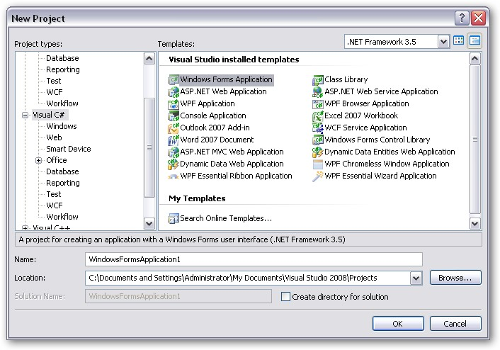
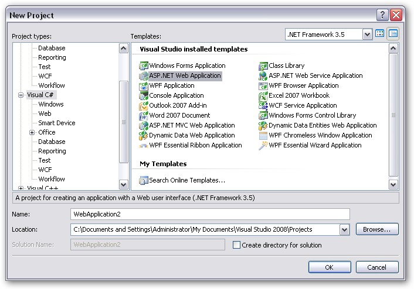
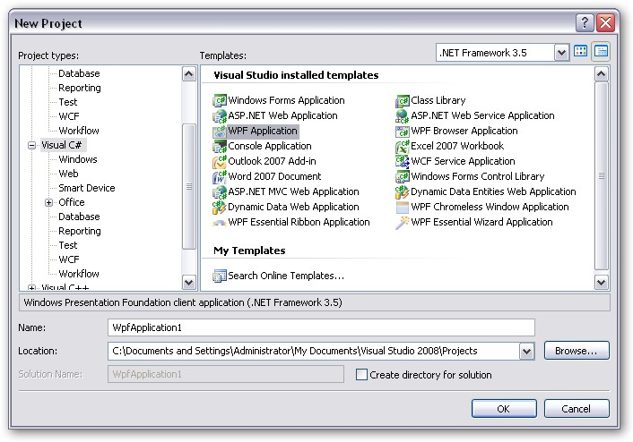
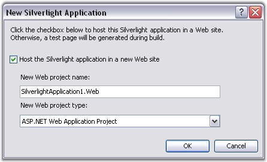

::: {style="DISPLAY: none"}
{#d2h_url_template}{#d2h_package_url style="WIDTH: 0px; DISPLAY: none; HEIGHT: 0px"}
:::

::::: {#nsbanner .d2h_main_nsbanner style="BORDER-BOTTOM: #999999 1px solid; POSITION: relative; PADDING-BOTTOM: 0px; BACKGROUND-COLOR: transparent; PADDING-LEFT: 0px; PADDING-RIGHT: 0px; DISPLAY: none; BORDER-TOP: #999999 1px solid; PADDING-TOP: 0px; LEFT: 0px"}
:::: {#TitleRow .d2h_main_titlerow style="PADDING-BOTTOM: 4px; BACKGROUND-COLOR: transparent; PADDING-LEFT: 22px; WIDTH: 100%; PADDING-RIGHT: 10px; DISPLAY: none; PADDING-TOP: 4px"}
::: {#ienav .d2h_main_ienav style="DISPLAY: none"}
{#D2HPrevious .D2HPreviousEnabled}  {#D2HNext .D2HNextEnabled}
:::
::::
:::::

:::: {#nstext .d2h_main_nstext style="PADDING-BOTTOM: 10px; BACKGROUND-COLOR: transparent; PADDING-LEFT: 22px; PADDING-RIGHT: 10px; HEIGHT: 100%; OVERFLOW: auto; PADDING-TOP: 5px" hasuserbackground="true" valign="bottom"}
::: {#d2h_breadcrumbs .d2h_breadcrumbs}
[Essential Studio User Guide Documentation](ms-xhelp:///?Id=12457748-09e3-4d74-a240-8e049cedf030){.d2h_breadcrumbsNormal}[ \> ]{.d2h_breadcrumbsLinkSeparator}[Reporting Edition](ms-xhelp:///?Id=027aa5b6-6676-4f93-ad23-c20e8c45792e){.d2h_breadcrumbsNormal}[ \> ]{.d2h_breadcrumbsLinkSeparator}[Essential XlsIO](ms-xhelp:///?Id=b01a1b50-1d7d-40c0-bc83-af67e57c9005){.d2h_breadcrumbsNormal}[ \> ]{.d2h_breadcrumbsLinkSeparator}[Getting Started](ms-xhelp:///?Id=ad99231a-9920-49c5-b9a3-8c0224163396){.d2h_breadcrumbsNormal}
:::

## Creating a Platform Application {#creating-a-platform-application style="tab-stops: 0pt"}

 

This section illustrates the step-by-step procedure to create the following platform applications.

 

[·      ]{style="FONT-FAMILY: Symbol"}Windows

[·      ]{style="FONT-FAMILY: Symbol"}Web

[·      ]{style="FONT-FAMILY: Symbol"}WPF

[·      ]{style="FONT-FAMILY: Symbol"}Silverlight

[·      ]{style="FONT-FAMILY: Symbol"}ASP.NET MVC

 

Windows Application

 

1.   Open Microsoft Visual Studio. Go to **File** menu and click **New Project**. In the **New Project** dialog box, select **Windows Forms Application** template, name the project and click **OK**.

[]{style="FONT-FAMILY: 'Trebuchet MS','sans-serif'; COLOR: #15428b; FONT-SIZE: 9pt"} 

{border="0"}

Figure 14: New Project dialog box - Windows Forms Application[]{style="FONT-FAMILY: 'Trebuchet MS','sans-serif'; COLOR: #15428b"}

[]{style="FONT-FAMILY: 'Trebuchet MS','sans-serif'; COLOR: #15428b"} 

[]{style="FONT-FAMILY: 'Trebuchet MS','sans-serif'; COLOR: #15428b; FONT-SIZE: 9pt"} 

A windows application is created.

[]{style="FONT-FAMILY: 'Trebuchet MS','sans-serif'; COLOR: #15428b; FONT-SIZE: 9pt"} 

1.   Open the main form of the application in the designer.

[]{style="FONT-FAMILY: 'Trebuchet MS','sans-serif'; COLOR: #15428b; FONT-SIZE: 9pt"} 

2.   Add the Syncfusion controls to your VS.NET toolbox if you haven\'t done so already \[This is done automatically when you install Essential Studio\].

[]{style="FONT-FAMILY: 'Trebuchet MS','sans-serif'; COLOR: #15428b; FONT-SIZE: 9pt"} 

3.   Refer [[Deploying Essential XlsIO]{.UGHyperlink}](ms-xhelp:///?Id=12c8a00d-964d-4225-99ec-94a82d3c847c)[ ]{.UGHyperlink}topic to know how to add XlsIO to the created application.

 

Web Application

 

1.   Open Microsoft Visual Studio. Go to **File** menu and click **New Project**. In the **New Project** dialog box, select **ASP.NET Web Application** template, name the web application and click **OK**.

[]{style="FONT-FAMILY: 'Trebuchet MS','sans-serif'; COLOR: #15428b; FONT-SIZE: 9pt"} 

{border="0"}

Figure 15: New Project dialog box - ASP.NET Application[]{style="FONT-FAMILY: 'Trebuchet MS','sans-serif'; COLOR: #15428b"}

[]{style="FONT-FAMILY: 'Trebuchet MS','sans-serif'; COLOR: #15428b; FONT-SIZE: 9pt"} 

 

A Web application is created. 

 

2.   Now you need to deploy Essential XlsIO into this ASP.NET application. Refer [[Deploying Essential XlsIO]{.UGHyperlink}](ms-xhelp:///?Id=12c8a00d-964d-4225-99ec-94a82d3c847c)[ ]{.UGHyperlink}topic for detailed info.

 

WPF Application

 

1.   Open Microsoft Visual Studio. Go to **File** menu and click **New Project**. In the **New Project** dialog box, select **WPF Application** template, name the project and click **OK**.

[]{style="FONT-FAMILY: 'Trebuchet MS','sans-serif'; COLOR: #15428b; FONT-SIZE: 9pt"} 

{border="0"}

Figure 16: New Project dialog box-WPF Application

[]{style="FONT-FAMILY: 'Trebuchet MS','sans-serif'; COLOR: #15428b; FONT-SIZE: 9pt"} 

[]{style="FONT-FAMILY: 'Trebuchet MS','sans-serif'; COLOR: #15428b; FONT-SIZE: 9pt"} 

A new WPF application is created.

[]{style="FONT-FAMILY: 'Trebuchet MS','sans-serif'; COLOR: #15428b; FONT-SIZE: 9pt"} 

2.   Open the main form of the application in the designer.

 

3.   Add the Syncfusion controls to your VS.NET toolbox if you haven\'t done so already \[This is done automatically when you install Essential Studio\].

 

4.   Refer [[Deploying Essential XlsIO]{.UGHyperlink}](ms-xhelp:///?Id=12c8a00d-964d-4225-99ec-94a82d3c847c) topic to know how to add XlsIO to the created application.

 

Silverlight Application

[]{style="FONT-SIZE: 9pt"} 

1.   Open Microsoft Visual Studio. Go to **File** menu and click **New Project**. In the **New Project** dialog box, select **Silverlight Application** template, name the project and click **OK**.

**[]{style="FONT-FAMILY: 'Trebuchet MS','sans-serif'; COLOR: #15428b; FONT-SIZE: 9pt"}** 

{border="0"}

Figure 17: New Project dialog box-Silverlight Application

***[]{style="FONT-FAMILY: 'Trebuchet MS','sans-serif'; COLOR: #15428b; FONT-SIZE: 9pt"}*** 

A **New Silverlight Application** dialog box appears as follows.

[]{style="FONT-FAMILY: 'Trebuchet MS','sans-serif'; COLOR: #15428b; FONT-SIZE: 9pt"} 

{border="0"}

Figure 18: New Silverlight Application dialog box

***[]{style="FONT-FAMILY: 'Trebuchet MS','sans-serif'; COLOR: #15428b; FONT-SIZE: 9pt"}*** 

**[]{style="FONT-FAMILY: 'Trebuchet MS','sans-serif'; COLOR: #15428b; FONT-SIZE: 9pt"}** 

2.   Click OK to host the Silverlight application in a new website.

[]{style="FONT-FAMILY: 'Trebuchet MS','sans-serif'; COLOR: #15428b; FONT-SIZE: 9pt"} 

A new Silverlight application is created.

 

3.   Open the main form of the application in the designer.

 

4.   Add reference to the following assemblies:

[]{style="FONT-FAMILY: 'Trebuchet MS','sans-serif'; COLOR: #15428b; FONT-SIZE: 9pt"} 

[·      ]{style="FONT-FAMILY: Symbol"}Syncfusion.XlsIO.Silverlight.dll

[·      ]{style="FONT-FAMILY: Symbol"}Syncfusion.Compression.Silverlight.dll

 

Refer [[Deploying Essential XlsIO]{.UGHyperlink}](ms-xhelp:///?Id=12c8a00d-964d-4225-99ec-94a82d3c847c) topic to know how to add XlsIO to the created application.

 

ASP.NET MVC Application

 

Refer to **Grid MVC** -\> **Getting Started** -\> **Creating an MVC application** topic to know how to create an MVC application.

 

To know how to add XlsIO to this application, refer Adding Essential XlsIO to an MVC Application topic under Getting Started section.

 

 

[]{#related-topics}
::::
