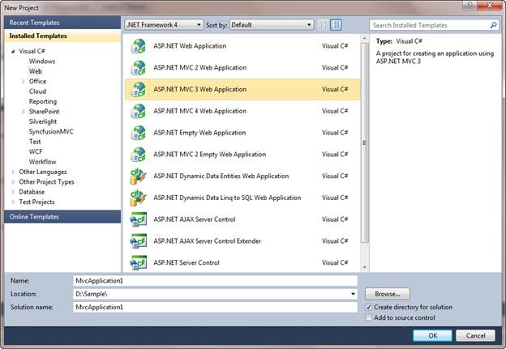
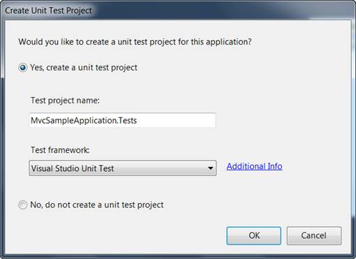
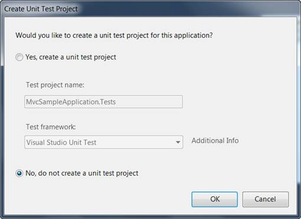

::: {style="DISPLAY: none"}
{#d2h_url_template} {#d2h_package_url style="WIDTH: 0px; DISPLAY: none; HEIGHT: 0px"}
:::

::::: {#nsbanner .d2h_main_nsbanner style="BORDER-BOTTOM: #999999 1px solid; POSITION: relative; PADDING-BOTTOM: 0px; BACKGROUND-COLOR: transparent; PADDING-LEFT: 0px; PADDING-RIGHT: 0px; DISPLAY: none; BORDER-TOP: #999999 1px solid; PADDING-TOP: 0px; LEFT: 0px"}
:::: {#TitleRow .d2h_main_titlerow style="PADDING-BOTTOM: 4px; BACKGROUND-COLOR: transparent; PADDING-LEFT: 22px; WIDTH: 100%; PADDING-RIGHT: 10px; DISPLAY: none; PADDING-TOP: 4px"}
::: {#ienav .d2h_main_ienav style="DISPLAY: none"}
{#D2HPrevious .D2HPreviousEnabled}  {#D2HNext .D2HNextEnabled}
:::
::::
:::::

::::: {#nstext .d2h_main_nstext style="PADDING-BOTTOM: 10px; BACKGROUND-COLOR: transparent; PADDING-LEFT: 22px; PADDING-RIGHT: 10px; HEIGHT: 100%; OVERFLOW: auto; PADDING-TOP: 5px" hasuserbackground="true" valign="bottom"}
::: {#d2h_breadcrumbs .d2h_breadcrumbs}
[Essential Studio User Guide Documentation](ms-xhelp:///?Id=12457748-09e3-4d74-a240-8e049cedf030){.d2h_breadcrumbsNormal} [ \> ]{.d2h_breadcrumbsLinkSeparator} [User Interface Edition](ms-xhelp:///?Id=c29296b7-531c-413b-a0ec-488ca1f7f669){.d2h_breadcrumbsNormal} [ \> ]{.d2h_breadcrumbsLinkSeparator} [Essential ASP.NET MVC](ms-xhelp:///?Id=4b14e7d1-65c4-4f67-b1aa-2c37709905a5){.d2h_breadcrumbsNormal} [ \> ]{.d2h_breadcrumbsLinkSeparator} [Essential Chart in HTML 5]{.d2h_breadcrumbsContentsOnly} [ \> ]{.d2h_breadcrumbsLinkSeparator} [Getting Started in ASP.NET MVC](ms-xhelp:///?Id=7be0cc3e-239f-44db-9c07-5f5ed873d123){.d2h_breadcrumbsNormal}
:::

## Creating a Platform Application {#creating-a-platform-application style="tab-stops: 0pt"}

To begin, you will create a new ASP.NET MVC project.[]{style="FONT-FAMILY: 'Calibri','sans-serif'"}

The steps to create a new MVC project are as follows:

1.   On the File menu, select **New Project**. The New Project dialog box is displayed.

[]{style="FONT-FAMILY: 'Times New Roman','serif'; FONT-SIZE: 12pt"} 

{border="0"}

Figure 30: New Project dialog box

**[]{style="FONT-SIZE: 14pt"}**  

2.   On the upper-right corner, ensure that **.NET Framework 4.0** is selected.

3.   In the Installed Templates pane, expand either **Visual Basic** or **Visual C#**, and then click **Web**.

4.   In the Visual Studio Installed Templates pane, select **ASP.NET MVC 2 Web Application**.

5.   In the Name box, enter **MvcSampleApplication**.

6.   In the Location box, enter a name for the project folder.

7.   If you want the name of the solution to differ from the project name, then enter a name in the Solution name box.

8.   Select the **Create directory for solution** checkbox.

9.   Click **OK**.

 

The Create Unit Test Project dialog box is displayed.

{border="0"}

Figure 31: Create Unit Test Project dialog box**[]{style="FONT-SIZE: 14pt"}**

10.  Select No, do not create a unit test project, and click OK.

By default, the name of the test project is the application project name with \"Tests\" added. However, you can change the name of the test project. By default, the test project will use the Visual Studio Unit Test framework.

::: {style="BORDER-BOTTOM: windowtext 1pt solid; BORDER-LEFT: medium none; PADDING-BOTTOM: 1pt; MARGIN-TOP: 9pt; PADDING-LEFT: 0pt; PADDING-RIGHT: 0pt; MARGIN-BOTTOM: 9pt; BORDER-TOP: windowtext 1pt solid; BORDER-RIGHT: medium none; PADDING-TOP: 1pt"}
{border="0"}Note: The other option becomes unavailable for selection, as shown in the image displayed below.

 
:::

[]{style="FONT-FAMILY: 'Times New Roman','serif'; FONT-SIZE: 12pt"} 

{border="0"}

Figure 32: Selecting an option

[]{style="FONT-FAMILY: 'Calibri','sans-serif'"} 

11.  Click **OK**.

The new MVC application project and a test project are generated. Note that if you are using the Standard or Express editions of Visual Studio, the test project is not created.

More:

[ ]{#related-topics}

[{border="0" align="absMiddle"}Examining the MVC Project](ms-xhelp:///?Id=7222bc8a-6222-46ca-8c01-2437f83844e2){style="TEXT-DECORATION: none"}
:::::
