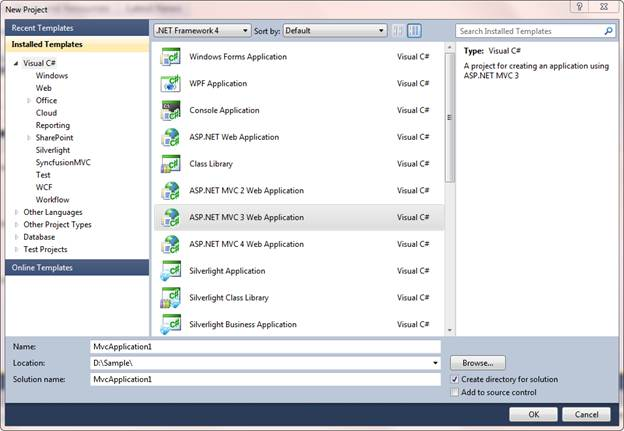
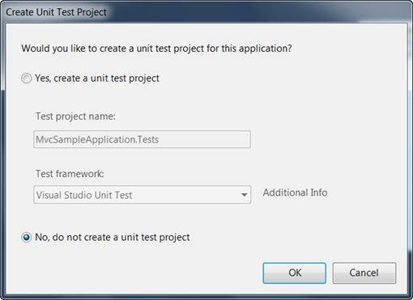

::: {style="DISPLAY: none"}
{#d2h_url_template} {#d2h_package_url style="WIDTH: 0px; DISPLAY: none; HEIGHT: 0px"}
:::

::::: {#nsbanner .d2h_main_nsbanner style="BORDER-BOTTOM: #999999 1px solid; POSITION: relative; PADDING-BOTTOM: 0px; BACKGROUND-COLOR: transparent; PADDING-LEFT: 0px; PADDING-RIGHT: 0px; DISPLAY: none; BORDER-TOP: #999999 1px solid; PADDING-TOP: 0px; LEFT: 0px"}
:::: {#TitleRow .d2h_main_titlerow style="PADDING-BOTTOM: 4px; BACKGROUND-COLOR: transparent; PADDING-LEFT: 22px; WIDTH: 100%; PADDING-RIGHT: 10px; DISPLAY: none; PADDING-TOP: 4px"}
::: {#ienav .d2h_main_ienav style="DISPLAY: none"}
{#D2HPrevious .D2HPreviousEnabled}  {#D2HNext .D2HNextEnabled}
:::
::::
:::::

::::: {#nstext .d2h_main_nstext style="PADDING-BOTTOM: 10px; BACKGROUND-COLOR: transparent; PADDING-LEFT: 22px; PADDING-RIGHT: 10px; HEIGHT: 100%; OVERFLOW: auto; PADDING-TOP: 5px" hasuserbackground="true" valign="bottom"}
::: {#d2h_breadcrumbs .d2h_breadcrumbs}
[Essential Studio User Guide Documentation](ms-xhelp:///?Id=12457748-09e3-4d74-a240-8e049cedf030){.d2h_breadcrumbsNormal} [ \> ]{.d2h_breadcrumbsLinkSeparator} [User Interface Edition](ms-xhelp:///?Id=c29296b7-531c-413b-a0ec-488ca1f7f669){.d2h_breadcrumbsNormal} [ \> ]{.d2h_breadcrumbsLinkSeparator} [Essential ASP.NET MVC](ms-xhelp:///?Id=4b14e7d1-65c4-4f67-b1aa-2c37709905a5){.d2h_breadcrumbsNormal} [ \> ]{.d2h_breadcrumbsLinkSeparator} [Essential Chart in HTML 5]{.d2h_breadcrumbsContentsOnly} [ \> ]{.d2h_breadcrumbsLinkSeparator} [Getting Started in ASP.NET MVC](ms-xhelp:///?Id=7be0cc3e-239f-44db-9c07-5f5ed873d123){.d2h_breadcrumbsNormal}
:::

## Creating a Platform Application {#creating-a-platform-application style="TEXT-INDENT: -28.8pt; MARGIN-LEFT: 28.8pt; tab-stops: 28.8pt"}

To create a platform application:

1.   Create a new **ASP.NET MVC** project.

2.   On the **File** menu, select **New Project**.

 

The **New Project** dialog box is displayed.

{border="0"}

Figure 9: New Project Dialog Box

3.   On the upper-right corner, select **.NET Framework 4.0**.

4.   In **Project** types, expand either Visual Basic or Visual C#, and then click *Web*.

5.   In **Visual Studio** installed templates, select ASP.NET MVC 2 Web Application.

6.   In the **Name** field, enter the MvcSampleApplication.

7.   In the **Location** field, enter a name for the project folder.

8.   If you want the name of the solution to differ from the project name, enter a name in the **Solution Name** field.

9.   Select **Create directory** for solution.

10.  Click **OK**.

The **Create Unit Test Project** dialog box is displayed[.]{style="FONT-FAMILY: 'Times New Roman','serif'; FONT-SIZE: 12pt"}

{border="0"}

Figure 10: Create Unit Test Project Dialog Box

 

11.  Select ***No*** and do not create a unit test project.

12.  Click ***OK***.

 

By default, the name of the test project is the application project name with \"Tests\" added. However, you can change the name of the test project. By default, the test project will use the Visual Studio Unit Test framework.

 

 

::: {style="BORDER-BOTTOM: windowtext 1pt solid; BORDER-LEFT: medium none; PADDING-BOTTOM: 1pt; MARGIN-TOP: 9pt; PADDING-LEFT: 0pt; PADDING-RIGHT: 0pt; MARGIN-BOTTOM: 9pt; BORDER-TOP: windowtext 1pt solid; BORDER-RIGHT: medium none; PADDING-TOP: 1pt"}
 

{border="0"}Note:[]{style="FONT-SIZE: 12pt"}The other option becomes unavailable for the selection as shown in the following image.
:::

{border="0"}

Figure 11: Selecting an option

13.  Click **OK**.

 

The new MVC application project and a test project are generated. (If you are using the Standard or Express editions of Visual Studio, the test project is not created.)

[]{#related-topics}
:::::
