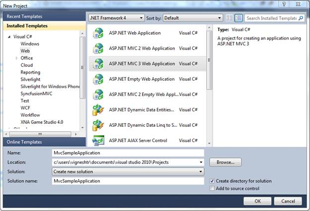
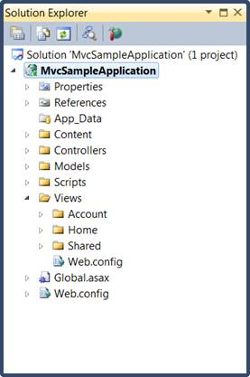
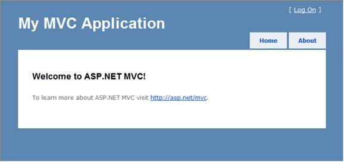

::: {style="DISPLAY: none"}
{#d2h_url_template}{#d2h_package_url style="WIDTH: 0px; DISPLAY: none; HEIGHT: 0px"}
:::

::::: {#nsbanner .d2h_main_nsbanner style="BORDER-BOTTOM: #999999 1px solid; POSITION: relative; PADDING-BOTTOM: 0px; BACKGROUND-COLOR: transparent; PADDING-LEFT: 0px; PADDING-RIGHT: 0px; DISPLAY: none; BORDER-TOP: #999999 1px solid; PADDING-TOP: 0px; LEFT: 0px"}
:::: {#TitleRow .d2h_main_titlerow style="PADDING-BOTTOM: 4px; BACKGROUND-COLOR: transparent; PADDING-LEFT: 22px; WIDTH: 100%; PADDING-RIGHT: 10px; DISPLAY: none; PADDING-TOP: 4px"}
::: {#ienav .d2h_main_ienav style="DISPLAY: none"}
{#D2HPrevious .D2HPreviousEnabled}  {#D2HNext .D2HNextEnabled}
:::
::::
:::::

:::: {#nstext .d2h_main_nstext style="PADDING-BOTTOM: 10px; BACKGROUND-COLOR: transparent; PADDING-LEFT: 22px; PADDING-RIGHT: 10px; HEIGHT: 100%; OVERFLOW: auto; PADDING-TOP: 5px" hasuserbackground="true" valign="bottom"}
::: {#d2h_breadcrumbs .d2h_breadcrumbs}
[Essential Studio User Guide Documentation](ms-xhelp:///?Id=12457748-09e3-4d74-a240-8e049cedf030){.d2h_breadcrumbsNormal}[ \> ]{.d2h_breadcrumbsLinkSeparator}[User Interface Edition](ms-xhelp:///?Id=c29296b7-531c-413b-a0ec-488ca1f7f669){.d2h_breadcrumbsNormal}[ \> ]{.d2h_breadcrumbsLinkSeparator}[Essential Mobile MVC](ms-xhelp:///?Id=74df42e3-5434-4590-9be6-3ae2f911cbbc){.d2h_breadcrumbsNormal}[ \> ]{.d2h_breadcrumbsLinkSeparator}[Essential Grid]{.d2h_breadcrumbsContentsOnly}[ \> ]{.d2h_breadcrumbsLinkSeparator}[Getting Started](ms-xhelp:///?Id=397f4d98-2e34-4dc5-8b77-1d56a317b150){.d2h_breadcrumbsNormal}
:::

## Creating a Platform MVC3 ASPX Application {#creating-a-platform-mvc3-aspx-application style="tab-stops: 0pt"}

[To create a platform application:]{style="FONT-FAMILY: 'Arial','sans-serif'; FONT-SIZE: 10pt"}

[1.   Create a new **ASP.NET MVC** project.]{style="FONT-FAMILY: 'Arial','sans-serif'; FONT-SIZE: 10pt"}

[2.   On the **File** menu, select **New Project**. The **New Project** dialog box is displayed:]{style="FONT-FAMILY: 'Arial','sans-serif'; FONT-SIZE: 10pt"}

{border="0"}

 Figure 8: New Project Dialog Box

[3.   On the upper-right corner, select **.NET Framework 4.0**.]{style="FONT-FAMILY: 'Arial','sans-serif'; FONT-SIZE: 10pt"}

[4.   In **Project** types, expand either **Visual Basic** or **Visual C#**, and then click **Web**.]{style="FONT-FAMILY: 'Arial','sans-serif'; FONT-SIZE: 10pt"}

[5.   In **Visual Studio** **Installed Templates**, select **ASP.NET MVC 3 Web Application**.]{style="FONT-FAMILY: 'Arial','sans-serif'; FONT-SIZE: 10pt"}

[6.   In the **Name** field, enter **MvcSampleApplication**.]{style="FONT-FAMILY: 'Arial','sans-serif'; FONT-SIZE: 10pt"}

[7.   In the **Location** field, enter a name for the project folder.]{style="FONT-FAMILY: 'Arial','sans-serif'; FONT-SIZE: 10pt"}

[8.   If you want the name of the solution to differ from the project name, enter a name in the **Solution Name** field.]{style="FONT-FAMILY: 'Arial','sans-serif'; FONT-SIZE: 10pt"}

[9.   Select **Create directory** **for solution**.]{style="FONT-FAMILY: 'Arial','sans-serif'; FONT-SIZE: 10pt"}

[10.  Click **OK**.]{style="FONT-FAMILY: 'Arial','sans-serif'; FONT-SIZE: 10pt"}

The **New ASP.NET MVC 3 Project** dialog box is displayed.

{border="0"}

 Figure 9: New ASP.NET MVC3  Dialog Box

 

[11.  Select **Internet Application** and then select **ASPX** from the **View engine** drop-down. ]{style="FONT-FAMILY: 'Arial','sans-serif'; FONT-SIZE: 10pt"}

[12.  Click **OK**.]{style="FONT-FAMILY: 'Arial','sans-serif'; FONT-SIZE: 10pt"}

[The new MVC3 application project is generated.]{style="FONT-FAMILY: 'Arial','sans-serif'; FONT-SIZE: 10pt"}

The following illustration shows the folder structure of a newly created MVC solution.

 

{border="0"}

Figure 10: Solution Explorer

The folder structure of an MVC project differs from that of an ASP.NET Web site project. The MVC project contains the following folders:

[•   ]{style="FONT-FAMILY: 'Verdana','sans-serif'; FONT-SIZE: 10pt"}**[Content]{style="FONT-FAMILY: 'Arial','sans-serif'; FONT-SIZE: 10pt"}**[---It is for content support files. This folder contains the cascading style sheet (.css file) for the application.]{style="FONT-FAMILY: 'Arial','sans-serif'; FONT-SIZE: 10pt"}

[•   ]{style="FONT-FAMILY: 'Verdana','sans-serif'; FONT-SIZE: 10pt"}**[Controllers]{style="FONT-FAMILY: 'Arial','sans-serif'; FONT-SIZE: 10pt"}**[---It is for controller files. This folder contains the application\'s sample controllers, which are named **AccountController** and **HomeController**. The **AccountController** class contains login logic for the application. The **HomeController** class contains logic that is called by default when the application starts.]{style="FONT-FAMILY: 'Arial','sans-serif'; FONT-SIZE: 10pt"}

[•   ]{style="FONT-FAMILY: 'Verdana','sans-serif'; FONT-SIZE: 10pt"}**[Models]{style="FONT-FAMILY: 'Arial','sans-serif'; FONT-SIZE: 10pt"}**[---It is for data model files such as LINQ-to-SQL, .dbml files, or data entity files.]{style="FONT-FAMILY: 'Arial','sans-serif'; FONT-SIZE: 10pt"}

[•   ]{style="FONT-FAMILY: 'Verdana','sans-serif'; FONT-SIZE: 10pt"}**[Scripts]{style="FONT-FAMILY: 'Arial','sans-serif'; FONT-SIZE: 10pt"}**[---It is for script files, such as those that support ASP.NET AJAX and jQuery.]{style="FONT-FAMILY: 'Arial','sans-serif'; FONT-SIZE: 10pt"}

[•   ]{style="FONT-FAMILY: 'Verdana','sans-serif'; FONT-SIZE: 10pt"}**[Views]{style="FONT-FAMILY: 'Arial','sans-serif'; FONT-SIZE: 10pt"}**[---It is for view page files. This folder contains three subfolders, namely **Account**, **Home**, and **Shared**. The **Account** folder contains views that are used as UI for logging in and changing passwords. The **Home** folder contains an **Index** view (the default starting page for the application) and an **About page** view. The **Shared** folder contains the master-page view for the application.]{style="FONT-FAMILY: 'Arial','sans-serif'; FONT-SIZE: 10pt"}

The newly generated MVC project is a complete application that you can compile and run without any change. The following illustration shows what the application looks like when it runs in a browser.

{border="0"}

Figure 11: MVC Application Output

[]{#related-topics}
::::
