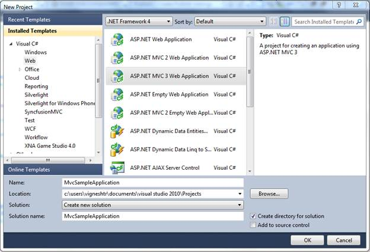
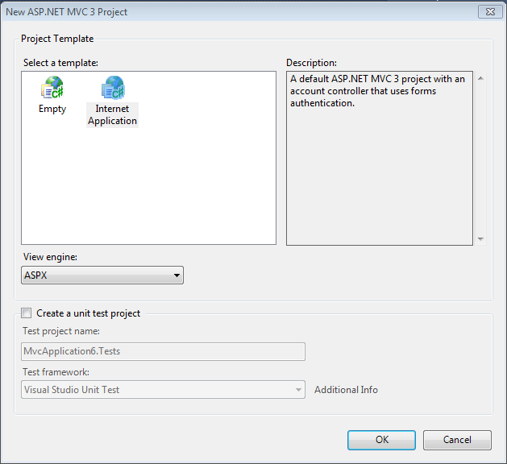
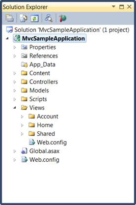
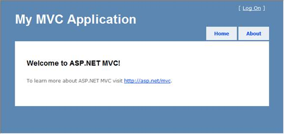

::: {style="DISPLAY: none"}
{#d2h_url_template} {#d2h_package_url style="WIDTH: 0px; DISPLAY: none; HEIGHT: 0px"}
:::

::::: {#nsbanner .d2h_main_nsbanner style="BORDER-BOTTOM: #999999 1px solid; POSITION: relative; PADDING-BOTTOM: 0px; BACKGROUND-COLOR: transparent; PADDING-LEFT: 0px; PADDING-RIGHT: 0px; DISPLAY: none; BORDER-TOP: #999999 1px solid; PADDING-TOP: 0px; LEFT: 0px"}
:::: {#TitleRow .d2h_main_titlerow style="PADDING-BOTTOM: 4px; BACKGROUND-COLOR: transparent; PADDING-LEFT: 22px; WIDTH: 100%; PADDING-RIGHT: 10px; DISPLAY: none; PADDING-TOP: 4px"}
::: {#ienav .d2h_main_ienav style="DISPLAY: none"}
{#D2HPrevious .D2HPreviousEnabled}  {#D2HNext .D2HNextEnabled}
:::
::::
:::::

:::: {#nstext .d2h_main_nstext style="PADDING-BOTTOM: 10px; BACKGROUND-COLOR: transparent; PADDING-LEFT: 22px; PADDING-RIGHT: 10px; HEIGHT: 100%; OVERFLOW: auto; PADDING-TOP: 5px" hasuserbackground="true" valign="bottom"}
::: {#d2h_breadcrumbs .d2h_breadcrumbs}
[Essential Studio User Guide Documentation](ms-xhelp:///?Id=12457748-09e3-4d74-a240-8e049cedf030){.d2h_breadcrumbsNormal} [ \> ]{.d2h_breadcrumbsLinkSeparator} [User Interface Edition](ms-xhelp:///?Id=c29296b7-531c-413b-a0ec-488ca1f7f669){.d2h_breadcrumbsNormal} [ \> ]{.d2h_breadcrumbsLinkSeparator} [Essential Mobile MVC](ms-xhelp:///?Id=74df42e3-5434-4590-9be6-3ae2f911cbbc){.d2h_breadcrumbsNormal} [ \> ]{.d2h_breadcrumbsLinkSeparator} [Essential Tools]{.d2h_breadcrumbsContentsOnly} [ \> ]{.d2h_breadcrumbsLinkSeparator} [Getting Started](ms-xhelp:///?Id=07dff027-c96d-450f-9a9b-6037f838f4da){.d2h_breadcrumbsNormal}
:::

## Creating a Platform MVC3 ASPX Application {#creating-a-platform-mvc3-aspx-application style="tab-stops: 0pt"}

To create a platform application:

1.   Create a new **ASP.NET MVC** project.

2.   On the **File** menu, select **New Project**.

 

The **New Project** dialog box is displayed:

{border="0"}

 

Figure 7: New Project Dialog Box

3.   On the upper-right corner, select **.NET Framework 4.0**.

4.   In **Project** types, expand either Visual Basic or Visual C#, and then click *Web*.

5.   In **Visual Studio** installed templates, select ASP.NET MVC 3 Web Application.

6.   In the **Name** field, enter the MvcSampleApplication.

7.   In the **Location** field, enter a name for the project folder.

8.   If you want the name of the solution to differ from the project name, enter a name in the **Solution Name** field.

9.   Select **Create directory** for solution.

10.  Click **OK**.

The **New ASP.NET MVC3** dialog box is displayed[.]{style="FONT-FAMILY: 'Times New Roman','serif'; FONT-SIZE: 12pt"}

[ {border="0"} ]{style="LINE-HEIGHT: 115%; FONT-FAMILY: 'Calibri','sans-serif'; FONT-SIZE: 11pt"} []{style="LINE-HEIGHT: 115%; FONT-FAMILY: 'Calibri','sans-serif'; FONT-SIZE: 11pt"}

 

Figure 8: New ASP.NET MVC3  Dialog Box

 

11.  Select Internet application and then select View engine as ASPX..

12.  Click ***OK***.

 

 

The new MVC3 application project is generated.

The following illustration shows the folder structure of a newly created MVC solution.

 

{border="0"}

Figure 9: Solution Explorer

The folder structure of an MVC project differs from that of an ASP.NET Web site project. The MVC project contains the following folders:

[·      ]{style="FONT-FAMILY: Symbol"}Content - It is for content support files. This folder contains the cascading style sheet (.css file) for the application.\
\

[·      ]{style="FONT-FAMILY: Symbol"}Controllers -It is for controller files. This folder contains the application\'s sample controllers, which are named **AccountController** and **HomeController**. The AccountController class contains login logic for the application. The HomeController class contains logic that is called by default when the application starts.\
\

[·      ]{style="FONT-FAMILY: Symbol"}Models - It is for data-model files such as LINQ-to-SQL .dbml files or data-entity files.\
\

[·      ]{style="FONT-FAMILY: Symbol"}Javascripts - It is for script files, such as those that support ASP.NET AJAX and jQuery.\
\

[·      ]{style="FONT-FAMILY: Symbol"}Views - It is for view page files. This folder contains three subfolders namely Account, Home, and Shared. The Account folder contains views that are used as UI for logging in and changing passwords. The **Home** folder contains an**Index** view (the default starting page for the application) and an **About page**view. The Shared folder contains the master-page view for the application.

The newly generated MVC project is a complete application that you can compile and run without any change. The following illustration shows what the application looks like when it runs in a browser.

{border="0"}

Figure 10: MVC application output

***[]{style="FONT-FAMILY: 'Calibri','sans-serif'"}***  

[]{#related-topics}
::::
