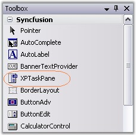
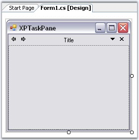
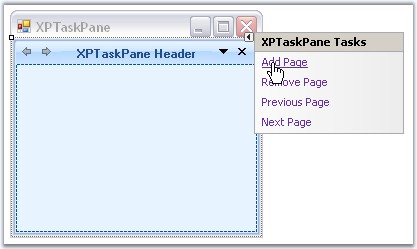
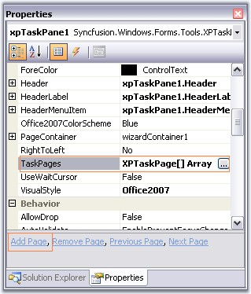
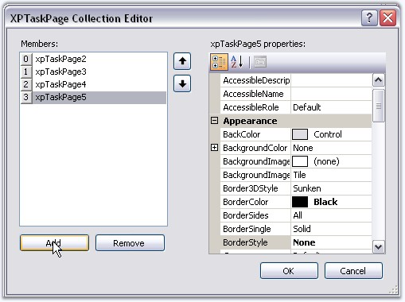
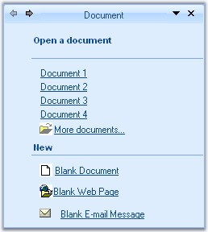

::: {style="DISPLAY: none"}
{#d2h_url_template}{#d2h_package_url style="WIDTH: 0px; DISPLAY: none; HEIGHT: 0px"}
:::

::: {.d2h_secondary_topic style="PADDING-BOTTOM: 10pt; MARGIN: 0pt; PADDING-LEFT: 0pt; PADDING-RIGHT: 0pt; PADDING-TOP: 0pt"}
#### Creating a Simple XPTaskPane {#creating-a-simple-xptaskpane style="MARGIN-LEFT: 18pt; tab-stops: 18.0pt"}

[]{style="COLOR: #15428b"} 

This section demonstrates how to create a simple XPTaskPane.

[]{style="COLOR: #15428b"} 

{border="0"}

[]{style="COLOR: #15428b"} 

Figure 1243: XPTaskPane in Toolbox

[]{style="COLOR: #15428b"} 

[·      ]{style="FONT-FAMILY: Symbol"}Add the XPTaskPane control to your empty form in the designer and set its Dock property to right.

[]{style="COLOR: #15428b"} 

{border="0"}

**[]{style="COLOR: #15428b"}** 

Figure 1244: XPTaskPane Added to the Form and Docked to Fill

[]{style="COLOR: #15428b"} 

[·      ]{style="FONT-FAMILY: Symbol"}Add pages to the TaskPane using: \"Add Page\" option in the smart tag.

**[]{style="COLOR: black; FONT-SIZE: 8pt"}** 

{border="0"}

 

Figure 1245: Adding Page Through Smart Tag of XPTaskPane

**[]{style="COLOR: black; FONT-SIZE: 8pt"}** 

[·      ]{style="FONT-FAMILY: Symbol"}Add Page option in context menu of the Header.

[]{style="COLOR: #15428b"} 

{border="0"}

**[]{style="LINE-HEIGHT: 150%; COLOR: #15428b"}** 

Figure 1246: Through Context Menu of Header

**[]{style="COLOR: #15428b"}** 

[·      ]{style="FONT-FAMILY: Symbol"}\"Add Page\" command in Property grid.

[·      ]{style="FONT-FAMILY: Symbol"}**XPTaskPage Collection Editor** which can be opened by accessing **TaskPages** property of the control. You can use Remove page option to remove a page.

[]{style="COLOR: #15428b"} 

{border="0"}

 

Figure 1247: Accessing AddPage Command and TaskPage property to Add Page

**[]{style="COLOR: #15428b"}** 

{border="0"}

**[]{style="COLOR: #15428b"}** 

Figure 1248: Adding Pages Through XPTaskPage Collection Editor

**[]{style="COLOR: #15428b"}** 

[·      ]{style="FONT-FAMILY: Symbol"}The pages can be added programmatically as follows.

[]{style="COLOR: #15428b"} 

+------------------------------------------------------------------------------------------------------------------------------------------------------------------------------------------------------------------------------------------------------------------------------------------------------------------------------------------------------------------+
| **[\[C#\]]{style="FONT-FAMILY: 'Courier New'; COLOR: black"}**                                                                                                                                                                                                                                                                                                   |
|                                                                                                                                                                                                                                                                                                                                                                  |
| []{style="COLOR: #15428b"}                                                                                                                                                                                                                                                                                                                                       |
|                                                                                                                                                                                                                                                                                                                                                                  |
| [this]{style="FONT-FAMILY: 'Courier New'; COLOR: blue"}[.xpTaskPane1.TaskPages = [new]{style="COLOR: blue"} Syncfusion.Windows.Forms.Tools.XPTaskPage\[\] {[this]{style="COLOR: blue"}.xpTaskPage1,[this]{style="COLOR: blue"}.xpTaskPage2, [this]{style="COLOR: blue"}.xpTaskPage3};]{style="FONT-FAMILY: 'Courier New'"}[]{style="FONT-FAMILY: 'Courier New'"} |
+------------------------------------------------------------------------------------------------------------------------------------------------------------------------------------------------------------------------------------------------------------------------------------------------------------------------------------------------------------------+

**[]{style="COLOR: #4a5c8c"}** 

+-------------------------------------------------------------------------------------------------------------------------------------------------------------------------------------------------------------------------------------------------------------------------------------------------------------------------------------------------------+
| **[\[VB.NET\]]{style="FONT-FAMILY: 'Courier New'; COLOR: black"}**                                                                                                                                                                                                                                                                                    |
|                                                                                                                                                                                                                                                                                                                                                       |
| []{style="FONT-FAMILY: 'Courier New'"}                                                                                                                                                                                                                                                                                                                |
|                                                                                                                                                                                                                                                                                                                                                       |
| [Me]{style="FONT-FAMILY: 'Courier New'; COLOR: blue"}[.xpTaskPane1.TaskPages = [New]{style="COLOR: blue"} Syncfusion.Windows.Forms.Tools.XPTaskPage() {[Me]{style="COLOR: blue"}.xpTaskPage1,[Me]{style="COLOR: blue"}.xpTaskPage2, [Me]{style="COLOR: blue"}.xpTaskPage3}]{style="FONT-FAMILY: 'Courier New'"}[]{style="FONT-FAMILY: 'Courier New'"} |
+-------------------------------------------------------------------------------------------------------------------------------------------------------------------------------------------------------------------------------------------------------------------------------------------------------------------------------------------------------+

[]{style="COLOR: #15428b"} 

[·      ]{style="FONT-FAMILY: Symbol"}XPTaskPane control has properties which controls the appearance and behavior of the Task pane sections. You can set Header text for individual pages using XPTaskPage1.Title property of the task page.

[]{style="COLOR: #15428b"} 

+------------------------------------------------------------------------------------------------------------------------------------------------------------------------------------------------+
| **[\[C#\]]{style="FONT-FAMILY: 'Courier New'; COLOR: black"}**                                                                                                                                 |
|                                                                                                                                                                                                |
| []{style="COLOR: #15428b"}                                                                                                                                                                     |
|                                                                                                                                                                                                |
| [this]{style="FONT-FAMILY: 'Courier New'; COLOR: blue"}[.xpTaskPage1.Title = [\"Document\"]{style="COLOR: maroon"};]{style="FONT-FAMILY: 'Courier New'"}[]{style="FONT-FAMILY: 'Courier New'"} |
+------------------------------------------------------------------------------------------------------------------------------------------------------------------------------------------------+

[]{#p1070}**[]{style="COLOR: #4a5c8c"}** 

+------------------------------------------------------------------------------------------------------------------------------------------------------------------------------------------------------------+
| **[\[VB.NET\]]{style="FONT-FAMILY: 'Courier New'; COLOR: black"}**                                                                                                                                         |
|                                                                                                                                                                                                            |
| []{style="FONT-FAMILY: 'Courier New'"}                                                                                                                                                                     |
|                                                                                                                                                                                                            |
| [Me]{style="FONT-FAMILY: 'Courier New'; COLOR: blue"}[.xpTaskPage1.Title = [\"Document\"]{style="COLOR: maroon"}]{style="FONT-FAMILY: 'Courier New'"}[]{style="FONT-FAMILY: 'Courier New'; COLOR: maroon"} |
+------------------------------------------------------------------------------------------------------------------------------------------------------------------------------------------------------------+

[]{style="COLOR: #15428b"} 

[·      ]{style="FONT-FAMILY: Symbol"}Change the **LayoutName** property of a task page to a custom name. This name can be used in the **SelectedPage** property of the task pane to refer to a particular page. See XPTaskPage topic.

[]{style="COLOR: #15428b"} 

[·      ]{style="FONT-FAMILY: Symbol; COLOR: black; FONT-SIZE: 8pt"}Add one or more controls to the task page.[ ]{style="FONT-FAMILY: 'Verdana','sans-serif'; COLOR: black; FONT-SIZE: 8pt"}

[]{style="COLOR: black; FONT-SIZE: 8pt"} 

{border="0"}

**[]{style="COLOR: #15428b"}** 

Figure 1249: XPTaskPage with Controls added to Task Page

[]{style="COLOR: #15428b"} 

[·      ]{style="FONT-FAMILY: Symbol"}Invoke the Add Page verb again in the task pane to add more pages. Repeat the steps above to customize the newly added tab page.

[]{style="COLOR: #15428b"} 

See Also

[]{style="COLOR: #15428b"} 

[[Concepts and Features]{.UGHyperlink}](../../../../../../../../Documents%20and%20Settings/sylviap/Desktop/Tools%20-%20Part%202.docx#_Concepts_and_Features_2)[]{.UGHyperlink}

 

 

 

 

[]{#related-topics}
:::
