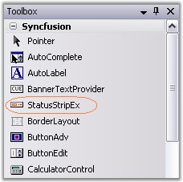
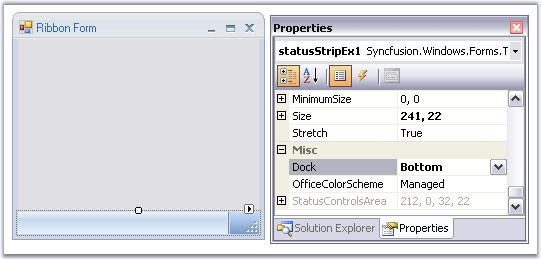
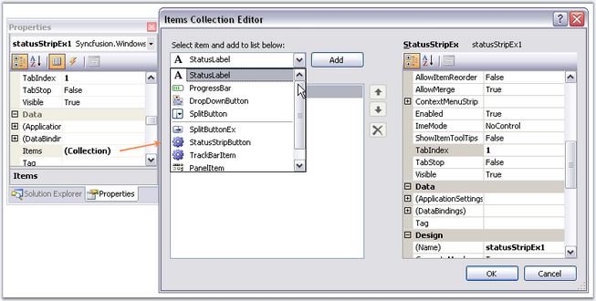

::: {style="DISPLAY: none"}
{#d2h_url_template}{#d2h_package_url style="WIDTH: 0px; DISPLAY: none; HEIGHT: 0px"}
:::

:::: {.d2h_secondary_topic style="PADDING-BOTTOM: 10pt; MARGIN: 0pt; PADDING-LEFT: 0pt; PADDING-RIGHT: 0pt; PADDING-TOP: 0pt"}
##### Creating a StatusStripEx {#creating-a-statusstripex style="tab-stops: 0pt"}

[]{style="COLOR: #15428b"} 

Through Designer

 

The StatusStripEx can be added to the form by dragging a StatusStripEx control from the Toolbox. It can be docked to the bottom of the RibbonControlAdv.

[]{style="COLOR: #15428b"} 

{border="0"}

[]{style="COLOR: #15428b"} 

***[]{style="COLOR: #15428b"}*** 

Figure 1403: StatusStripEx in the Toolbox

**[]{style="COLOR: #15428b"}** 

Dock the StatusStripEx control to the bottom using **Dock** property.

[]{style="COLOR: #15428b"} 

{border="0"}

[]{style="COLOR: #15428b"} 

Figure 1404: Docking StatusStripEx to Bottom

**[]{style="COLOR: #15428b"}** 

Adding Items to the StatusStripEx

 

Access the Items property of the control, to open the Items Collection Editor. Use this editor to add customized StatusControl items. The Editor will let you modify the look and feel of the items using the properties provided on it right side.

[]{style="COLOR: #15428b"} 

{border="0"}

[]{style="COLOR: #15428b"} 

***[]{style="COLOR: #15428b"}*** 

Figure 1405: Adding Items through Items Collection Editor

**[]{style="COLOR: #15428b"}** 

::: {style="BORDER-BOTTOM: windowtext 1pt solid; BORDER-LEFT: medium none; PADDING-BOTTOM: 1pt; MARGIN: 9pt 0pt 9pt 18pt; PADDING-LEFT: 0pt; PADDING-RIGHT: 0pt; BORDER-TOP: windowtext 1pt solid; BORDER-RIGHT: medium none; PADDING-TOP: 1pt"}
{border="0"} Note[: ]{style="COLOR: black; FONT-SIZE: 8pt"}A shortcut to add the ToolStripStatus Items is through Tasks Window. See [Smart Tag options]{style="COLOR: black"} to know more.
:::

 

**Through Code**

 

StatusStripEx can be created programmatically using the code below. This code snippet adds a ToolStripStatus Label to the StatusStripEx control.[]{#p1176}

[]{style="COLOR: #15428b"} 

+-------------------------------------------------------------------------------------------------------------------------------------------------------------------------------------------------------------------------------------+
| **[\[C#\]]{style="FONT-FAMILY: 'Courier New'; COLOR: black"}**                                                                                                                                                                      |
|                                                                                                                                                                                                                                     |
| []{style="FONT-FAMILY: 'Courier New'; COLOR: blue"}                                                                                                                                                                                 |
|                                                                                                                                                                                                                                     |
| [using]{style="FONT-FAMILY: 'Courier New'; COLOR: blue"}[ Syncfusion.Windows.Forms.Tools;]{style="FONT-FAMILY: 'Courier New'"}                                                                                                      |
|                                                                                                                                                                                                                                     |
| []{style="FONT-FAMILY: 'Courier New'"}                                                                                                                                                                                              |
|                                                                                                                                                                                                                                     |
| [//Declaring the StatusStripEx and ToolStripStatusLabel]{style="FONT-FAMILY: 'Courier New'; COLOR: green"}                                                                                                                          |
|                                                                                                                                                                                                                                     |
| [private]{style="FONT-FAMILY: 'Courier New'; COLOR: blue"}[ Syncfusion.Windows.Forms.Tools.[StatusStripEx]{style="COLOR: teal"} statusStripEx1;]{style="FONT-FAMILY: 'Courier New'"}                                                |
|                                                                                                                                                                                                                                     |
| [private]{style="FONT-FAMILY: 'Courier New'; COLOR: blue"}[ System.Windows.Forms.[ToolStripStatusLabel]{style="COLOR: teal"} toolStripStatusLabel1;]{style="FONT-FAMILY: 'Courier New'"}                                            |
|                                                                                                                                                                                                                                     |
| []{style="FONT-FAMILY: 'Courier New'; COLOR: blue"}                                                                                                                                                                                 |
|                                                                                                                                                                                                                                     |
| [//Initializing the StatusStripEx and ToolStripStatusLabel]{style="FONT-FAMILY: 'Courier New'; COLOR: green"}                                                                                                                       |
|                                                                                                                                                                                                                                     |
| [this]{style="FONT-FAMILY: 'Courier New'; COLOR: blue"}[.statusStripEx1 = [new]{style="COLOR: blue"} Syncfusion.Windows.Forms.Tools.[StatusStripEx]{style="COLOR: teal"}();]{style="FONT-FAMILY: 'Courier New'"}                    |
|                                                                                                                                                                                                                                     |
| [this]{style="FONT-FAMILY: 'Courier New'; COLOR: blue"}[.toolStripStatusLabel1 = [new]{style="COLOR: blue"} System.Windows.Forms.[ToolStripStatusLabel]{style="COLOR: teal"}();]{style="FONT-FAMILY: 'Courier New'"}                |
|                                                                                                                                                                                                                                     |
| []{style="FONT-FAMILY: 'Courier New'; COLOR: blue"}                                                                                                                                                                                 |
|                                                                                                                                                                                                                                     |
| [//Adding ToolStripStatusLabel to StatusStripEx]{style="FONT-FAMILY: 'Courier New'; COLOR: green"}                                                                                                                                  |
|                                                                                                                                                                                                                                     |
| [this]{style="FONT-FAMILY: 'Courier New'; COLOR: blue"}[.statusStripEx1.Items.AddRange([new]{style="COLOR: blue"} System.Windows.Forms.[ToolStripItem]{style="COLOR: teal"}\[\] {]{style="FONT-FAMILY: 'Courier New'"}              |
|                                                                                                                                                                                                                                     |
| [this]{style="FONT-FAMILY: 'Courier New'; COLOR: blue"}[.toolStripStatusLabel1});]{style="FONT-FAMILY: 'Courier New'"}                                                                                                              |
|                                                                                                                                                                                                                                     |
| [this]{style="FONT-FAMILY: 'Courier New'; COLOR: blue"}[.Controls.Add([this]{style="COLOR: blue"}.statusStripEx1);]{style="FONT-FAMILY: 'Courier New'"}                                                                             |
|                                                                                                                                                                                                                                     |
| []{style="FONT-FAMILY: 'Courier New'"}                                                                                                                                                                                              |
|                                                                                                                                                                                                                                     |
| [//Docking the StatusStripEx to Bottom]{style="FONT-FAMILY: 'Courier New'; COLOR: green"}                                                                                                                                           |
|                                                                                                                                                                                                                                     |
| [this]{style="FONT-FAMILY: 'Courier New'; COLOR: blue"}[.statusStripEx1.Dock = Syncfusion.Windows.Forms.Tools.[DockStyleEx]{style="COLOR: teal"}.Bottom;]{style="FONT-FAMILY: 'Courier New'"}[]{style="FONT-FAMILY: 'Courier New'"} |
+-------------------------------------------------------------------------------------------------------------------------------------------------------------------------------------------------------------------------------------+

[]{style="COLOR: #15428b"} 

+-----------------------------------------------------------------------------------------------------------------------------------------------------------------------------------------------------------------------------------------------+
| **[\[VB.NET\]]{style="FONT-FAMILY: 'Courier New'; COLOR: black"}**                                                                                                                                                                            |
|                                                                                                                                                                                                                                               |
| []{style="FONT-FAMILY: 'Courier New'; COLOR: black"}                                                                                                                                                                                          |
|                                                                                                                                                                                                                                               |
| [Imports]{style="FONT-FAMILY: 'Courier New'; COLOR: blue"}[ Syncfusion.Windows.Forms.Tools]{style="FONT-FAMILY: 'Courier New'"}                                                                                                               |
|                                                                                                                                                                                                                                               |
| []{style="FONT-FAMILY: 'Courier New'"}                                                                                                                                                                                                        |
|                                                                                                                                                                                                                                               |
| [\'Declaring]{style="FONT-FAMILY: 'Courier New'; COLOR: green"}[ the ]{style="FONT-FAMILY: 'Courier New'; COLOR: green"}[StatusStripEx and ToolStripStatusLabel ]{style="FONT-FAMILY: 'Courier New'; COLOR: green"}                           |
|                                                                                                                                                                                                                                               |
| [Private]{style="FONT-FAMILY: 'Courier New'; COLOR: blue"}[ statusStripEx1 [As]{style="COLOR: blue"} Syncfusion.Windows.Forms.Tools.StatusStripEx]{style="FONT-FAMILY: 'Courier New'"}                                                        |
|                                                                                                                                                                                                                                               |
| [Private]{style="FONT-FAMILY: 'Courier New'; COLOR: blue"}[ toolStripStatusLabel1 [As]{style="COLOR: blue"} System.Windows.Forms.ToolStripStatusLabel]{style="FONT-FAMILY: 'Courier New'"}                                                    |
|                                                                                                                                                                                                                                               |
| []{style="FONT-FAMILY: 'Courier New'"}                                                                                                                                                                                                        |
|                                                                                                                                                                                                                                               |
| [\'Initializing]{style="FONT-FAMILY: 'Courier New'; COLOR: green"}[ the ]{style="FONT-FAMILY: 'Courier New'; COLOR: green"}[StatusStripEx and ToolStripStatusLabel ]{style="FONT-FAMILY: 'Courier New'; COLOR: green"}                        |
|                                                                                                                                                                                                                                               |
| [Me]{style="FONT-FAMILY: 'Courier New'; COLOR: blue"}[.statusStripEx1 = [New]{style="COLOR: blue"} Syncfusion.Windows.Forms.Tools.StatusStripEx() ]{style="FONT-FAMILY: 'Courier New'"}                                                       |
|                                                                                                                                                                                                                                               |
| [Me]{style="FONT-FAMILY: 'Courier New'; COLOR: blue"}[.toolStripStatusLabel1 = [New]{style="COLOR: blue"} System.Windows.Forms.ToolStripStatusLabel() ]{style="FONT-FAMILY: 'Courier New'"}                                                   |
|                                                                                                                                                                                                                                               |
| []{style="FONT-FAMILY: 'Courier New'"}                                                                                                                                                                                                        |
|                                                                                                                                                                                                                                               |
| [\'Adding ToolStripStatusLabel to StatusStripEx ]{style="FONT-FAMILY: 'Courier New'; COLOR: green"}                                                                                                                                           |
|                                                                                                                                                                                                                                               |
| [Me]{style="FONT-FAMILY: 'Courier New'; COLOR: blue"}[.statusStripEx1.Items.AddRange([New]{style="COLOR: blue"} System.Windows.Forms.ToolStripItem() {[Me]{style="COLOR: blue"}.toolStripStatusLabel1}) ]{style="FONT-FAMILY: 'Courier New'"} |
|                                                                                                                                                                                                                                               |
| [Me]{style="FONT-FAMILY: 'Courier New'; COLOR: blue"}[.Controls.Add([Me]{style="COLOR: blue"}.statusStripEx1)]{style="FONT-FAMILY: 'Courier New'"}                                                                                            |
|                                                                                                                                                                                                                                               |
| []{style="FONT-FAMILY: 'Courier New'"}                                                                                                                                                                                                        |
|                                                                                                                                                                                                                                               |
| [Docking the StatusStripEx to Bottom\']{style="FONT-FAMILY: 'Courier New'; COLOR: green"}                                                                                                                                                     |
|                                                                                                                                                                                                                                               |
| [Me]{style="FONT-FAMILY: 'Courier New'; COLOR: blue"}[.statusStripEx1.Dock = Syncfusion.Windows.Forms.Tools.[DockStyleEx]{style="COLOR: black"}.Bottom]{style="FONT-FAMILY: 'Courier New'"}[]{style="FONT-FAMILY: 'Courier New'"}             |
+-----------------------------------------------------------------------------------------------------------------------------------------------------------------------------------------------------------------------------------------------+

[]{style="COLOR: #15428b"} 

A sample which demonstrates the creation of StatusStripEx control and adding ToolStripStatus Items are available in the below sample installation location.

**** 

***..\\My Documents\\Syncfusion\\EssentialStudio\\Version Number\\Windows\\Tools.Windows\\Samples\\2.0\\Office2007 Controls\\Office2007Controls***

 

 

[]{#related-topics}
::::
