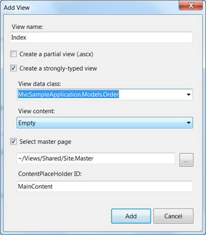
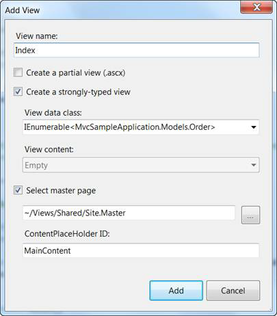

::: {style="DISPLAY: none"}
{#d2h_url_template}{#d2h_package_url style="WIDTH: 0px; DISPLAY: none; HEIGHT: 0px"}
:::

::::: {#nsbanner .d2h_main_nsbanner style="BORDER-BOTTOM: #999999 1px solid; POSITION: relative; PADDING-BOTTOM: 0px; BACKGROUND-COLOR: transparent; PADDING-LEFT: 0px; PADDING-RIGHT: 0px; DISPLAY: none; BORDER-TOP: #999999 1px solid; PADDING-TOP: 0px; LEFT: 0px"}
:::: {#TitleRow .d2h_main_titlerow style="PADDING-BOTTOM: 4px; BACKGROUND-COLOR: transparent; PADDING-LEFT: 22px; WIDTH: 100%; PADDING-RIGHT: 10px; DISPLAY: none; PADDING-TOP: 4px"}
::: {#ienav .d2h_main_ienav style="DISPLAY: none"}
{#D2HPrevious .D2HPreviousEnabled}  {#D2HNext .D2HNextEnabled}
:::
::::
:::::

:::: {#nstext .d2h_main_nstext style="PADDING-BOTTOM: 10px; BACKGROUND-COLOR: transparent; PADDING-LEFT: 22px; PADDING-RIGHT: 10px; HEIGHT: 100%; OVERFLOW: auto; PADDING-TOP: 5px" hasuserbackground="true" valign="bottom"}
::: {#d2h_breadcrumbs .d2h_breadcrumbs}
[Essential Studio User Guide Documentation](ms-xhelp:///?Id=12457748-09e3-4d74-a240-8e049cedf030){.d2h_breadcrumbsNormal}[ \> ]{.d2h_breadcrumbsLinkSeparator}[User Interface Edition](ms-xhelp:///?Id=c29296b7-531c-413b-a0ec-488ca1f7f669){.d2h_breadcrumbsNormal}[ \> ]{.d2h_breadcrumbsLinkSeparator}[Essential Mobile MVC](ms-xhelp:///?Id=74df42e3-5434-4590-9be6-3ae2f911cbbc){.d2h_breadcrumbsNormal}[ \> ]{.d2h_breadcrumbsLinkSeparator}[Essential Grid]{.d2h_breadcrumbsContentsOnly}[ \> ]{.d2h_breadcrumbsLinkSeparator}[How to](ms-xhelp:///?Id=5ab2c434-c3c6-440a-a0e5-672301983379){.d2h_breadcrumbsNormal}
:::

## Creating a Strongly Typed View {#creating-a-strongly-typed-view style="tab-stops: 0pt"}

To create a strongly typed view, six steps are involved.

1.  Right-click on the **View/Home** folder.

2.  Delete the existing **Index.aspx** file, making it remain as a default action.

3.  Click **Add**, then select **View**.

4.  Name the view **Index**.

5.  Select **Create a strongly-typed view**, and in the drop-down menu select your model. In this case it is **MvcSampleApplication[.]{style="FONT-FAMILY: 'Calibri','sans-serif'"}Models.Order**.

 

 

{border="0"}

Figure 63: Creating a Strongly Typed View

{border="0"}[Note: The **View data class** drop-down list will be empty until you successfully build your application. It is a good idea to select the menu option **Build** to build a solution before opening the **Add New** dialog.]{style="FONT-FAMILY: 'Arial','sans-serif'; FONT-SIZE: 10pt"}

6.  In the **View data class** drop-down, make the model an **IEnumerable** collection.

 

 

{border="0"}

Figure 64: Making the Model an IEnumerable Collection

 

 

 

[]{#related-topics}
::::
