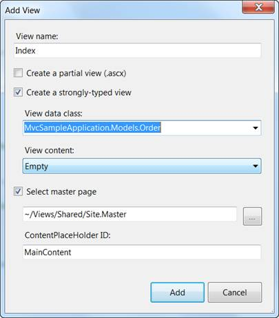
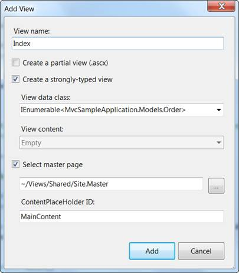

::: {style="DISPLAY: none"}
{#d2h_url_template} {#d2h_package_url style="WIDTH: 0px; DISPLAY: none; HEIGHT: 0px"}
:::

:::: {.d2h_secondary_topic style="PADDING-BOTTOM: 10pt; MARGIN: 0pt; PADDING-LEFT: 0pt; PADDING-RIGHT: 0pt; PADDING-TOP: 0pt"}
#### Creating a Strongly Typed View {#creating-a-strongly-typed-view style="TEXT-INDENT: -43.2pt; MARGIN-LEFT: 43.2pt; tab-stops: 43.2pt"}

The following steps describe how to create a strongly typed view.

1.   Right-click on the **View/Home** folder

2.   Delete the existing **Index.aspx**  (to make it remain as a default action)

3.   Click **Add**, then select **View**

4.   Name the view "**Index.**"

5.   Select **Create a strongly-typed view**

6.   On the drop-down menu, select your model (in this case it is "MvcSampleApplication.Models.Order")

{border="0"}

Figure 68: Adding a Strongly Typed View

::: {style="BORDER-BOTTOM: windowtext 1pt solid; BORDER-LEFT: medium none; PADDING-BOTTOM: 1pt; MARGIN-TOP: 9pt; PADDING-LEFT: 0pt; PADDING-RIGHT: 0pt; MARGIN-BOTTOM: 9pt; BORDER-TOP: windowtext 1pt solid; BORDER-RIGHT: medium none; PADDING-TOP: 1pt"}
 

{border="0"}Note: The View Data class drop-down list will be empty until you successfully build your application. It is a good idea to select from the menu option build, build solution before opening the Add New dialog.

 
:::

7.   In **View data class**, make the model an IEnumerable collection.

[]{style="FONT-FAMILY: 'Calibri','sans-serif'"} 

{border="0"}

Figure 69: View Data Classes as an IEumerable Collection

 

[]{#related-topics}
::::
