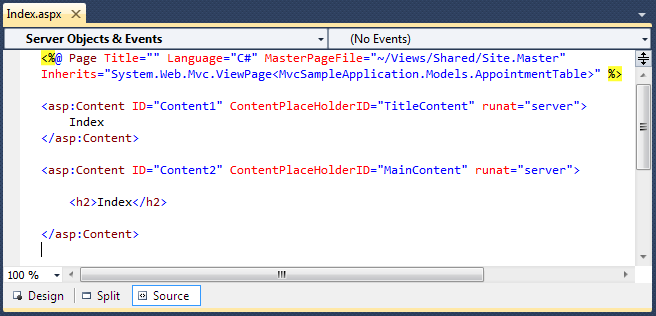

::: {style="DISPLAY: none"}
{#d2h_url_template}{#d2h_package_url style="WIDTH: 0px; DISPLAY: none; HEIGHT: 0px"}
:::

::::: {#nsbanner .d2h_main_nsbanner style="BORDER-BOTTOM: #999999 1px solid; POSITION: relative; PADDING-BOTTOM: 0px; BACKGROUND-COLOR: transparent; PADDING-LEFT: 0px; PADDING-RIGHT: 0px; DISPLAY: none; BORDER-TOP: #999999 1px solid; PADDING-TOP: 0px; LEFT: 0px"}
:::: {#TitleRow .d2h_main_titlerow style="PADDING-BOTTOM: 4px; BACKGROUND-COLOR: transparent; PADDING-LEFT: 22px; WIDTH: 100%; PADDING-RIGHT: 10px; DISPLAY: none; PADDING-TOP: 4px"}
::: {#ienav .d2h_main_ienav style="DISPLAY: none"}
{#D2HPrevious .D2HPreviousEnabled}  {#D2HNext .D2HNextEnabled}
:::
::::
:::::

:::: {#nstext .d2h_main_nstext style="PADDING-BOTTOM: 10px; BACKGROUND-COLOR: transparent; PADDING-LEFT: 22px; PADDING-RIGHT: 10px; HEIGHT: 100%; OVERFLOW: auto; PADDING-TOP: 5px" hasuserbackground="true" valign="bottom"}
::: {#d2h_breadcrumbs .d2h_breadcrumbs}
[Essential Studio User Guide Documentation](ms-xhelp:///?Id=12457748-09e3-4d74-a240-8e049cedf030){.d2h_breadcrumbsNormal}[ \> ]{.d2h_breadcrumbsLinkSeparator}[User Interface Edition](ms-xhelp:///?Id=c29296b7-531c-413b-a0ec-488ca1f7f669){.d2h_breadcrumbsNormal}[ \> ]{.d2h_breadcrumbsLinkSeparator}[Essential ASP.NET MVC](ms-xhelp:///?Id=4b14e7d1-65c4-4f67-b1aa-2c37709905a5){.d2h_breadcrumbsNormal}[ \> ]{.d2h_breadcrumbsLinkSeparator}[Essential Schedule]{.d2h_breadcrumbsContentsOnly}[ \> ]{.d2h_breadcrumbsLinkSeparator}[How To](ms-xhelp:///?Id=84ce0346-a231-4679-a834-37b06c85ce69){.d2h_breadcrumbsNormal}[ \> ]{.d2h_breadcrumbsLinkSeparator}[Strongly Typed View](ms-xhelp:///?Id=41e0aac3-3b96-4c7d-a2ee-fa1f7903642d){.d2h_breadcrumbsNormal}
:::

### Creating a Strongly-Typed View Manually {#creating-a-strongly-typed-view-manually style="tab-stops: 0pt"}

If you create a view and later need to convert it to a strongly-typed view, the process is quite simple. Change the \"Inherits\" statement in view declaration from

 [System.Web.Mvc.ViewPage]{style="FONT-FAMILY: 'Calibri','sans-serif'; FONT-SIZE: 11pt"} to [System.Web.Mvc.ViewPage\<YourNamespace.YourClass\>]{style="FONT-FAMILY: 'Calibri','sans-serif'; FONT-SIZE: 11pt"}.

Here our model is "MvcSampleApplication.Models.AppointmentTable". Therefore  update the index page as given below.

[]{style="FONT-FAMILY: 'Calibri','sans-serif'"} 

+--------------------------------------------------------------------------------------------------------------------------------------------------------------------------------------------------------------------------------------------------------------------------------------------------------------------------------------------------------------------------------------------------------------------------------------------------------------------------------------------------------------------------------------------------------------------------------------------------------------------------------------------------------------------------------------------------------------------------------------------------------------------------------------------------+
| **[View\[aspx\]]{style="FONT-FAMILY: 'Calibri','sans-serif'"}**[[]{style="FONT-FAMILY: 'Calibri','sans-serif'; FONT-WEIGHT: normal"}]{.MsoIntenseEmphasis}                                                                                                                                                                                                                                                                                                                                                                                                                                                                                                                                                                                                                                       |
|                                                                                                                                                                                                                                                                                                                                                                                                                                                                                                                                                                                                                                                                                                                                                                                                  |
| [\<%]{style="FONT-FAMILY: 'Calibri','sans-serif'; BACKGROUND: yellow"}[@]{style="FONT-FAMILY: 'Calibri','sans-serif'; COLOR: blue"}[ [Page]{style="COLOR: maroon"} [Language]{style="COLOR: red"}[=\"C#\"]{style="COLOR: blue"} [MasterPageFile]{style="COLOR: red"}[=\"\~/Views/Shared/Site.Master\"]{style="COLOR: blue"} [Inherits]{style="COLOR: red"}[=\"System.Web.Mvc.ViewPage]{style="COLOR: blue"}]{style="FONT-FAMILY: 'Calibri','sans-serif'"}[ \<IEnumerable\<MvcSampleApplication.Models.AppointmentTable\>\>]{style="FONT-FAMILY: 'Calibri','sans-serif'; COLOR: blue"}[\"]{style="FONT-FAMILY: 'Calibri','sans-serif'; COLOR: blue"}[ [%\>]{style="BACKGROUND: yellow"}]{style="FONT-FAMILY: 'Calibri','sans-serif'"}[]{style="FONT-FAMILY: 'Calibri','sans-serif'; COLOR: blue"} |
|                                                                                                                                                                                                                                                                                                                                                                                                                                                                                                                                                                                                                                                                                                                                                                                                  |
| []{style="FONT-FAMILY: 'Calibri','sans-serif'"}                                                                                                                                                                                                                                                                                                                                                                                                                                                                                                                                                                                                                                                                                                                                                  |
+--------------------------------------------------------------------------------------------------------------------------------------------------------------------------------------------------------------------------------------------------------------------------------------------------------------------------------------------------------------------------------------------------------------------------------------------------------------------------------------------------------------------------------------------------------------------------------------------------------------------------------------------------------------------------------------------------------------------------------------------------------------------------------------------------+

[]{style="FONT-FAMILY: 'Calibri','sans-serif'"} 

[]{style="FONT-FAMILY: 'Calibri','sans-serif'"} 

+-----------------------------------------------------------------------------------------------------------------------------------------------------------------------------------------------------------------------------------------------------------------------------------+
| **[View\[cshtml\]]{style="FONT-FAMILY: 'Calibri','sans-serif'"}**[[]{style="FONT-FAMILY: 'Calibri','sans-serif'; FONT-WEIGHT: normal"}]{.MsoIntenseEmphasis}                                                                                                                      |
|                                                                                                                                                                                                                                                                                   |
| [\@model ]{style="FONT-FAMILY: Consolas; BACKGROUND: yellow; FONT-SIZE: 9.5pt"}[IEnumerable]{style="FONT-FAMILY: Consolas; COLOR: #2b91af; FONT-SIZE: 9.5pt"}[\<ScheduleMVC.Models.[AppointmentTable]{style="COLOR: #2b91af"}\>]{style="FONT-FAMILY: Consolas; FONT-SIZE: 9.5pt"} |
|                                                                                                                                                                                                                                                                                   |
| []{style="FONT-FAMILY: 'Calibri','sans-serif'"}                                                                                                                                                                                                                                   |
+-----------------------------------------------------------------------------------------------------------------------------------------------------------------------------------------------------------------------------------------------------------------------------------+

[]{style="FONT-FAMILY: 'Calibri','sans-serif'"} 

[]{style="FONT-FAMILY: 'Calibri','sans-serif'; FONT-SIZE: 11pt"} 

{border="0"}

Figure 153[: Default Index View]{style="FONT-STYLE: normal"}

[                                ]{style="FONT-FAMILY: 'Calibri','sans-serif'"}

{border="0"}

Figure 154[: Strongly typed Index view]{style="FONT-STYLE: normal"}

[]{style="FONT-FAMILY: 'Calibri','sans-serif'"} 

[]{#related-topics}
::::
