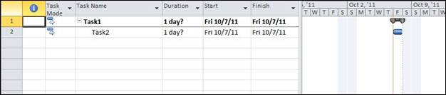

::: {style="DISPLAY: none"}
{#d2h_url_template}{#d2h_package_url style="WIDTH: 0px; DISPLAY: none; HEIGHT: 0px"}
:::

::::: {#nsbanner .d2h_main_nsbanner style="BORDER-BOTTOM: #999999 1px solid; POSITION: relative; PADDING-BOTTOM: 0px; BACKGROUND-COLOR: transparent; PADDING-LEFT: 0px; PADDING-RIGHT: 0px; DISPLAY: none; BORDER-TOP: #999999 1px solid; PADDING-TOP: 0px; LEFT: 0px"}
:::: {#TitleRow .d2h_main_titlerow style="PADDING-BOTTOM: 4px; BACKGROUND-COLOR: transparent; PADDING-LEFT: 22px; WIDTH: 100%; PADDING-RIGHT: 10px; DISPLAY: none; PADDING-TOP: 4px"}
::: {#ienav .d2h_main_ienav style="DISPLAY: none"}
{#D2HPrevious .D2HPreviousEnabled}  {#D2HNext .D2HNextEnabled}
:::
::::
:::::

:::: {#nstext .d2h_main_nstext style="PADDING-BOTTOM: 10px; BACKGROUND-COLOR: transparent; PADDING-LEFT: 22px; PADDING-RIGHT: 10px; HEIGHT: 100%; OVERFLOW: auto; PADDING-TOP: 5px" hasuserbackground="true" valign="bottom"}
::: {#d2h_breadcrumbs .d2h_breadcrumbs}
[Essential Studio User Guide Documentation](ms-xhelp:///?Id=12457748-09e3-4d74-a240-8e049cedf030){.d2h_breadcrumbsNormal}[ \> ]{.d2h_breadcrumbsLinkSeparator}[Reporting Edition](ms-xhelp:///?Id=027aa5b6-6676-4f93-ad23-c20e8c45792e){.d2h_breadcrumbsNormal}[ \> ]{.d2h_breadcrumbsLinkSeparator}[Essential ProjIO](ms-xhelp:///?Id=b95f675f-3e97-4b4b-93b9-e4daba965feb){.d2h_breadcrumbsNormal}[ \> ]{.d2h_breadcrumbsLinkSeparator}[Concepts and Features](ms-xhelp:///?Id=00cd1b25-14ca-4e2b-a23d-b4c6df7344ee){.d2h_breadcrumbsNormal}[ \> ]{.d2h_breadcrumbsLinkSeparator}[Task](ms-xhelp:///?Id=1f030cf8-1f9a-4d18-a0a1-87afe233884d){.d2h_breadcrumbsNormal}
:::

### Creating a summary task {#creating-a-summary-task style="tab-stops: 0pt"}

To make a task as the summary task, you need to make use of the **IsSummary** property of the **Task** class.

The following example illustrates making a task as Summary task.

 

+--------------------------------------------------------------------------------------------------------------------------------------------------------------------------------------------------------------+
| **[\[C#\]]{style="FONT-FAMILY: 'Courier New'"}**                                                                                                                                                             |
|                                                                                                                                                                                                              |
| [Task]{style="FONT-FAMILY: 'Courier New'; COLOR: #2b91af"}[ task1 = [new]{style="COLOR: blue"} [Task]{style="COLOR: #2b91af"}([\"Main Task\"]{style="COLOR: #a31515"});]{style="FONT-FAMILY: 'Courier New'"} |
|                                                                                                                                                                                                              |
| [task1.Start = [DateTime]{style="COLOR: #2b91af"}.Now;]{style="FONT-FAMILY: 'Courier New'"}                                                                                                                  |
|                                                                                                                                                                                                              |
| [task1.Finish = [DateTime]{style="COLOR: #2b91af"}.Now;]{style="FONT-FAMILY: 'Courier New'"}                                                                                                                 |
|                                                                                                                                                                                                              |
| [task1.IsSummary = [true]{style="COLOR: blue"};]{style="FONT-FAMILY: 'Courier New'"}                                                                                                                         |
+--------------------------------------------------------------------------------------------------------------------------------------------------------------------------------------------------------------+

 

+--------------------------------------------------------------------------------------------------------------------------------------------------------------------------------------------------------------+
| **[\[VB\]]{style="FONT-FAMILY: 'Courier New'"}**                                                                                                                                                             |
|                                                                                                                                                                                                              |
|                                                                                                                                                                                                              |
|                                                                                                                                                                                                              |
| [Dim]{style="FONT-FAMILY: 'Courier New'; COLOR: blue"}[ task1 [As]{style="COLOR: blue"} Task = [New]{style="COLOR: blue"} Task([\"Main Task\"]{style="COLOR: #a31515"})]{style="FONT-FAMILY: 'Courier New'"} |
|                                                                                                                                                                                                              |
| [task1.Start = DateTime.Now]{style="FONT-FAMILY: 'Courier New'"}                                                                                                                                             |
|                                                                                                                                                                                                              |
| [task1.Finish = DateTime.Now]{style="FONT-FAMILY: 'Courier New'"}                                                                                                                                            |
|                                                                                                                                                                                                              |
| [task1.IsSummary = True]{style="FONT-FAMILY: 'Courier New'"}                                                                                                                                                 |
+--------------------------------------------------------------------------------------------------------------------------------------------------------------------------------------------------------------+

 

The summary task created using the above code will look like as shown below when viewed in Microsoft Project.

{border="0"}

Figure 8: Summary Task Created

 

[]{#related-topics}
::::
