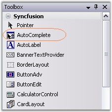
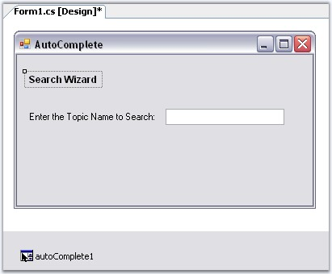
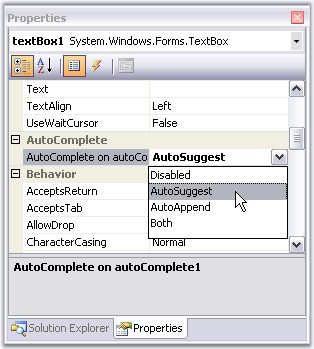
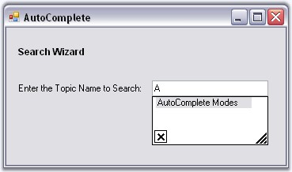
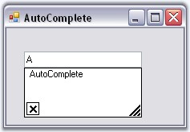

::: {style="DISPLAY: none"}
{#d2h_url_template}{#d2h_package_url style="WIDTH: 0px; DISPLAY: none; HEIGHT: 0px"}
:::

::::: {.d2h_secondary_topic style="PADDING-BOTTOM: 10pt; MARGIN: 0pt; PADDING-LEFT: 0pt; PADDING-RIGHT: 0pt; PADDING-TOP: 0pt"}
##### Creating AutoComplete Control {#creating-autocomplete-control style="tab-stops: 0pt"}

 

[]{#p163}This section will guide you to implement a simple AutoComplete control with a TextBox via designer and programmatically.

[]{style="COLOR: #15428b"} 

###### []{#_Through_Designer_1}3.3.1.1.2.1 Through Designer {#through-designer style="tab-stops: 0pt"}

[]{style="COLOR: #15428b"} 

This tutorial illustrates the usage of the AutoComplete control for TextBox, without any external data source.

[]{style="COLOR: #15428b"} 

1.   Create a new Windows Forms application and open the main form for the application in the designer. Add the Syncfusion controls to the **VS .NET** toolbox, if you have not done so already. Drag-and-drop an AutoComplete control onto the form.

[]{style="COLOR: #15428b"} 

{border="0"}

[]{style="COLOR: #15428b"} 

Figure 112: AutoComplete control in Toolbox

**[]{style="COLOR: #15428b"}** 

2.   The AutoComplete control will appear as a component in the component tray of the design environment. Similarly add a Text box, two labels and a button to make the form interactive.

[]{style="COLOR: #15428b"} 

{border="0"}

[]{style="COLOR: #15428b"} 

Figure 113: AutoComplete control in the Designer

[]{style="COLOR: #15428b"} 

3.   When the AutoComplete control is added to the form, the **AutoComplete on autocomplete** property is added to the text box control properties. This property specifies the type of autocompletion to be provided by the autoComplete1 control for the comboBox1 control. The default value for AutoComplete on autoComplete1 will be set to **AutoCompleteModes.Disabled**. Use the drop-down box provided in the property grid to change it to the mode of autocompletion to AutoSuggest. The different modes of autocompletion are detailed in AutoComplete Modes topic.

[]{style="COLOR: #15428b"} 

{border="0"}

[]{style="COLOR: #15428b"} 

Figure 114: Setting AutoCompleteMode = \"AutoSuggest\"

**[]{style="COLOR: #15428b"}** 

4.   Set **AutoComplete.AutoAddItem** property to true. Run the application, type any text in the textbox and hit Enter to save the entry. Select the text, delete it and then retype the first letter of the text you saved. You should see autocompletion of the letter, as shown below.

[]{style="COLOR: #15428b"} 

::: {style="BORDER-BOTTOM: windowtext 1pt solid; BORDER-LEFT: medium none; PADDING-BOTTOM: 1pt; MARGIN-TOP: 9pt; PADDING-LEFT: 0pt; PADDING-RIGHT: 0pt; MARGIN-BOTTOM: 9pt; BORDER-TOP: windowtext 1pt solid; BORDER-RIGHT: medium none; PADDING-TOP: 1pt"}
{border="0"} Note:[ ]{style="COLOR: black; FONT-SIZE: 8pt"}The text entered can be saved only when AutoAddItem property is set to True.
:::

[]{style="COLOR: #15428b"} 

{border="0"}

[]{style="COLOR: #15428b"} 

Figure 115: AutoCompletion of text in the TextBox

[]{style="COLOR: #15428b"} 

::: {style="BORDER-BOTTOM: windowtext 1pt solid; BORDER-LEFT: medium none; PADDING-BOTTOM: 1pt; MARGIN-TOP: 9pt; PADDING-LEFT: 0pt; PADDING-RIGHT: 0pt; MARGIN-BOTTOM: 9pt; BORDER-TOP: windowtext 1pt solid; BORDER-RIGHT: medium none; PADDING-TOP: 1pt"}
{border="0"} Note: We can also add a list of autocomplete items through designer, which can used as a source for AutoComplete control. SeeSee [Source for AutoComplete Control]{style="COLOR: windowtext; TEXT-DECORATION: none; text-underline: none"} topic for details.
:::

[]{style="COLOR: #15428b"} 

See also

[]{style="COLOR: #15428b"} 

[Concepts and Features]{.UGHyperlink}[]{.UGHyperlink}

###### []{#p164}[]{#_Through_Code_1}[3.3.1.1.2.2      ]{style="FONT-SIZE: 9pt"}Through Code[]{style="FONT-SIZE: 9pt"} {#through-code style="tab-stops: 0pt"}

[]{style="COLOR: #15428b"} 

This section will guide you, to programmatically add, and associate an AutoComplete control to a textbox.

[]{style="COLOR: #15428b"} 

1.   Include the required namespace.

[]{style="COLOR: #15428b"} 

+--------------------------------------------------------------------------------------------------------------------------------+
| **[\[C#\]]{style="FONT-FAMILY: 'Courier New'; COLOR: black"}**                                                                 |
|                                                                                                                                |
| []{style="COLOR: #15428b"}                                                                                                     |
|                                                                                                                                |
| [using]{style="FONT-FAMILY: 'Courier New'; COLOR: blue"}[ Syncfusion.Windows.Forms.Tools;]{style="FONT-FAMILY: 'Courier New'"} |
+--------------------------------------------------------------------------------------------------------------------------------+

[]{style="COLOR: #15428b"} 

+---------------------------------------------------------------------------------------------------------------------------------+
| **[\[VB.NET\]]{style="FONT-FAMILY: 'Courier New'; COLOR: black"}**                                                              |
|                                                                                                                                 |
| []{style="COLOR: #15428b"}                                                                                                      |
|                                                                                                                                 |
| [Imports]{style="FONT-FAMILY: 'Courier New'; COLOR: blue"}[ Syncfusion.Windows.Forms.Tools]{style="FONT-FAMILY: 'Courier New'"} |
+---------------------------------------------------------------------------------------------------------------------------------+

[]{style="COLOR: #15428b"} 

2.   Create an instances of AutoComplete and TextBox controls.

[]{style="COLOR: #15428b"} 

+-------------------------------------------------------------------------------------------------------------------------------------------------------------+
| **[\[C#\]]{style="FONT-FAMILY: 'Courier New'; COLOR: black"}**                                                                                              |
|                                                                                                                                                             |
| []{style="COLOR: #15428b"}                                                                                                                                  |
|                                                                                                                                                             |
| [private]{style="FONT-FAMILY: 'Courier New'; COLOR: blue"}[ Syncfusion.Windows.Forms.Tools.AutoComplete autoComplete1;]{style="FONT-FAMILY: 'Courier New'"} |
|                                                                                                                                                             |
| [private]{style="FONT-FAMILY: 'Courier New'; COLOR: blue"}[ System.Windows.Forms.TextBox textBox1;]{style="FONT-FAMILY: 'Courier New'"}                     |
|                                                                                                                                                             |
| []{style="FONT-FAMILY: 'Courier New'"}                                                                                                                      |
|                                                                                                                                                             |
| [this]{style="FONT-FAMILY: 'Courier New'; COLOR: blue"}[.textBox1=[new]{style="COLOR: blue"} TextBox();]{style="FONT-FAMILY: 'Courier New'"}                |
|                                                                                                                                                             |
| [this]{style="FONT-FAMILY: 'Courier New'; COLOR: blue"}[.autoComplete1=[new]{style="COLOR: blue"} AutoComplete();]{style="FONT-FAMILY: 'Courier New'"}      |
+-------------------------------------------------------------------------------------------------------------------------------------------------------------+

[]{style="COLOR: #15428b"} 

+--------------------------------------------------------------------------------------------------------------------------------------------------------------------------------------+
| **[\[VB.NET\]]{style="FONT-FAMILY: 'Courier New'; COLOR: black"}**                                                                                                                   |
|                                                                                                                                                                                      |
| []{style="COLOR: #15428b"}                                                                                                                                                           |
|                                                                                                                                                                                      |
| [Private]{style="FONT-FAMILY: 'Courier New'; COLOR: blue"}[ autoComplete1 [As]{style="COLOR: blue"} Syncfusion.Windows.Forms.Tools.AutoComplete]{style="FONT-FAMILY: 'Courier New'"} |
|                                                                                                                                                                                      |
| [Private]{style="FONT-FAMILY: 'Courier New'; COLOR: blue"}[ textBox1 [As]{style="COLOR: blue"} System.Windows.Forms.TextBox]{style="FONT-FAMILY: 'Courier New'"}                     |
|                                                                                                                                                                                      |
| []{style="FONT-FAMILY: 'Courier New'"}                                                                                                                                               |
|                                                                                                                                                                                      |
| [Me]{style="FONT-FAMILY: 'Courier New'; COLOR: blue"}[.textBox1 = [New]{style="COLOR: blue"} TextBox()]{style="FONT-FAMILY: 'Courier New'"}                                          |
|                                                                                                                                                                                      |
| [Me]{style="FONT-FAMILY: 'Courier New'; COLOR: blue"}[.autoComplete1 = [New]{style="COLOR: blue"} AutoComplete()]{style="FONT-FAMILY: 'Courier New'"}                                |
+--------------------------------------------------------------------------------------------------------------------------------------------------------------------------------------+

[]{style="COLOR: #15428b"} 

3.   Associate AutoComplete with TextBox using **SetAutoComplete()** method.

[]{style="COLOR: #15428b"} 

+---------------------------------------------------------------------------------------------------------------------------------------------------------------------------------------------------------------------------------+
| **[\[C#\]]{style="FONT-FAMILY: 'Courier New'; COLOR: black"}**                                                                                                                                                                  |
|                                                                                                                                                                                                                                 |
| []{style="COLOR: #15428b"}                                                                                                                                                                                                      |
|                                                                                                                                                                                                                                 |
| [this]{style="FONT-FAMILY: 'Courier New'; COLOR: blue"}[.autoComplete1.SetAutoComplete([this]{style="COLOR: blue"}.textBox1,Syncfusion.Windows.Forms.Tools.AutoCompleteModes.AutoSuggest);]{style="FONT-FAMILY: 'Courier New'"} |
+---------------------------------------------------------------------------------------------------------------------------------------------------------------------------------------------------------------------------------+

[]{style="COLOR: #15428b"} 

+----------------------------------------------------------------------------------------------------------------------------------------------------------------------------------------------------------------------------+
| **[\[VB.NET\]]{style="FONT-FAMILY: 'Courier New'; COLOR: black"}**                                                                                                                                                         |
|                                                                                                                                                                                                                            |
| []{style="COLOR: #15428b"}                                                                                                                                                                                                 |
|                                                                                                                                                                                                                            |
| [Me]{style="FONT-FAMILY: 'Courier New'; COLOR: blue"}[.autoComplete1.SetAutoComplete([Me]{style="COLOR: blue"}.textBox1,Syncfusion.Windows.Forms.Tools.AutoCompleteModes.AutoSuggest)]{style="FONT-FAMILY: 'Courier New'"} |
+----------------------------------------------------------------------------------------------------------------------------------------------------------------------------------------------------------------------------+

[]{style="COLOR: #15428b"} 

4.   Specify its properties.

[]{style="COLOR: #15428b"} 

+--------------------------------------------------------------------------------------------------------------------------------------------------------+
| **[\[C#\]]{style="FONT-FAMILY: 'Courier New'; COLOR: black"}**                                                                                         |
|                                                                                                                                                        |
| []{style="COLOR: #15428b"}                                                                                                                             |
|                                                                                                                                                        |
| [this]{style="FONT-FAMILY: 'Courier New'; COLOR: blue"}[.autoComplete1.AutoAddItem=[true]{style="COLOR: blue"};]{style="FONT-FAMILY: 'Courier New'"}   |
|                                                                                                                                                        |
| [this]{style="FONT-FAMILY: 'Courier New'; COLOR: blue"}[.autoComplete1.AutoSerialize=[true]{style="COLOR: blue"};]{style="FONT-FAMILY: 'Courier New'"} |
+--------------------------------------------------------------------------------------------------------------------------------------------------------+

[]{style="COLOR: #15428b"} 

+-----------------------------------------------------------------------------------------------------------------------------------------------------+
| **[\[VB.NET\]]{style="FONT-FAMILY: 'Courier New'; COLOR: black"}**                                                                                  |
|                                                                                                                                                     |
| []{style="COLOR: #15428b"}                                                                                                                          |
|                                                                                                                                                     |
| [Me]{style="FONT-FAMILY: 'Courier New'; COLOR: blue"}[.autoComplete1.AutoAddItem=[True]{style="COLOR: blue"}]{style="FONT-FAMILY: 'Courier New'"}   |
|                                                                                                                                                     |
| [Me]{style="FONT-FAMILY: 'Courier New'; COLOR: blue"}[.autoComplete1.AutoSerialize=[True]{style="COLOR: blue"}]{style="FONT-FAMILY: 'Courier New'"} |
+-----------------------------------------------------------------------------------------------------------------------------------------------------+

[]{style="COLOR: #15428b"} 

5.   Finally add textBox to the Form.

[]{style="COLOR: #15428b"} 

+---------------------------------------------------------------------------------------------------------------------------------------------------+
| **[\[C#\]]{style="FONT-FAMILY: 'Courier New'; COLOR: black"}**                                                                                    |
|                                                                                                                                                   |
| []{style="COLOR: #15428b"}                                                                                                                        |
|                                                                                                                                                   |
| [this]{style="FONT-FAMILY: 'Courier New'; COLOR: blue"}[.Controls.Add([this]{style="COLOR: blue"}.textBox1);]{style="FONT-FAMILY: 'Courier New'"} |
+---------------------------------------------------------------------------------------------------------------------------------------------------+

[]{style="COLOR: #15428b"} 

+----------------------------------------------------------------------------------------------------------------------------------------------+
| **[\[VB.NET\]]{style="FONT-FAMILY: 'Courier New'; COLOR: black"}**                                                                           |
|                                                                                                                                              |
| []{style="COLOR: #15428b"}                                                                                                                   |
|                                                                                                                                              |
| [Me]{style="FONT-FAMILY: 'Courier New'; COLOR: blue"}[.Controls.Add([Me]{style="COLOR: blue"}.textBox1)]{style="FONT-FAMILY: 'Courier New'"} |
+----------------------------------------------------------------------------------------------------------------------------------------------+

[]{style="COLOR: #15428b"} 

{border="0"}

[]{style="COLOR: #15428b"} 

Figure 116: AutoCompletion of a TextBox Text

[]{style="COLOR: #15428b"} 

See also

[]{style="COLOR: #15428b"} 

[[Through Designer]{.UGHyperlink}]()[, ]{.UGHyperlink}[Concepts and Features]{.UGHyperlink}[]{.UGHyperlink}

[]{#related-topics}
:::::
