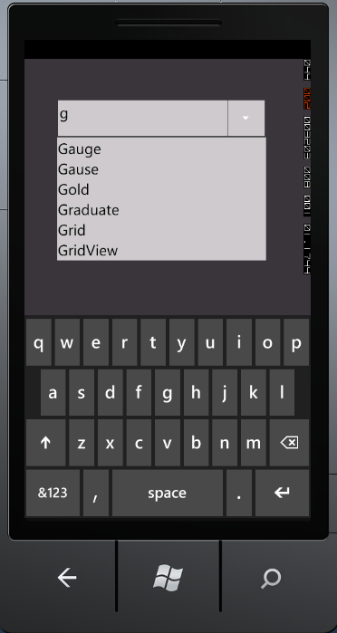

::: {style="DISPLAY: none"}
{#d2h_url_template}{#d2h_package_url style="WIDTH: 0px; DISPLAY: none; HEIGHT: 0px"}
:::

::: {.d2h_secondary_topic style="PADDING-BOTTOM: 10pt; MARGIN: 0pt; PADDING-LEFT: 0pt; PADDING-RIGHT: 0pt; PADDING-TOP: 0pt"}
#### Creating AutoComplete TextBox {#creating-autocomplete-textbox style="tab-stops: 0pt"}

To [[create a Windows Phone application and deploy Essential Tools]{.UGHyperlink}](ms-xhelp:///?Id=b19f910c-29e3-4e73-86a2-575122081468) for Windows Phone, refer to section [[3 Getting Started]{.UGHyperlink}](ms-xhelp:///?Id=09734a55-89d7-4174-884a-f6b1811a0889). This section covers how to add AutoComplete control to this application.

 

The *AutoComplete* control can be added to the application by using either XAML or procedural code. The following code snippet can be used to add the AutoComplete control to the application.

 

 

+------------------------------------------------------------------------------------------------------------------------------------------------------------------------------------------------------------------------------------------------------+
| **[\[C#\]]{style="FONT-FAMILY: 'Courier New'"}**                                                                                                                                                                                                     |
|                                                                                                                                                                                                                                                      |
| **[]{style="FONT-FAMILY: 'Courier New'"}**                                                                                                                                                                                                           |
|                                                                                                                                                                                                                                                      |
| [AutoComplete]{style="FONT-FAMILY: 'Courier New'; COLOR: #2b91af"}[ AutoComplete1 = [new]{style="COLOR: blue"} [AutoComplete]{style="COLOR: #2b91af"}();]{style="FONT-FAMILY: 'Courier New'"}                                                        |
|                                                                                                                                                                                                                                                      |
| [List]{style="FONT-FAMILY: 'Courier New'; COLOR: #2b91af"}[\<[String]{style="COLOR: #2b91af"}\> customSource = [new]{style="COLOR: blue"} [List]{style="COLOR: #2b91af"}\<[String]{style="COLOR: #2b91af"}\>();]{style="FONT-FAMILY: 'Courier New'"} |
|                                                                                                                                                                                                                                                      |
| [customSource.Add([\"WF\"]{style="COLOR: #a31515"});]{style="FONT-FAMILY: 'Courier New'"}                                                                                                                                                            |
|                                                                                                                                                                                                                                                      |
| [customSource.Add([\"WPF\"]{style="COLOR: #a31515"});]{style="FONT-FAMILY: 'Courier New'"}                                                                                                                                                           |
|                                                                                                                                                                                                                                                      |
| [customSource.Add([\"Silverlight\"]{style="COLOR: #a31515"});]{style="FONT-FAMILY: 'Courier New'"}                                                                                                                                                   |
|                                                                                                                                                                                                                                                      |
| [customSource.Add([\"Asp.Net\"]{style="COLOR: #a31515"});]{style="FONT-FAMILY: 'Courier New'"}                                                                                                                                                       |
|                                                                                                                                                                                                                                                      |
| [customSource.Add([\"Mvc\"]{style="COLOR: #a31515"});]{style="FONT-FAMILY: 'Courier New'"}                                                                                                                                                           |
|                                                                                                                                                                                                                                                      |
| [customSource.Add([\"Tools\"]{style="COLOR: #a31515"});]{style="FONT-FAMILY: 'Courier New'"}                                                                                                                                                         |
|                                                                                                                                                                                                                                                      |
| [customSource.Add([\"Diagram\"]{style="COLOR: #a31515"});]{style="FONT-FAMILY: 'Courier New'"}                                                                                                                                                       |
|                                                                                                                                                                                                                                                      |
| [customSource.Add([\"Gauge\"]{style="COLOR: #a31515"});]{style="FONT-FAMILY: 'Courier New'"}                                                                                                                                                         |
|                                                                                                                                                                                                                                                      |
| [customSource.Add([\"Gause\"]{style="COLOR: #a31515"});]{style="FONT-FAMILY: 'Courier New'"}                                                                                                                                                         |
|                                                                                                                                                                                                                                                      |
| [customSource.Add([\"GridView\"]{style="COLOR: #a31515"});]{style="FONT-FAMILY: 'Courier New'"}                                                                                                                                                      |
|                                                                                                                                                                                                                                                      |
| [customSource.Add([\"Graduate\"]{style="COLOR: #a31515"});]{style="FONT-FAMILY: 'Courier New'"}                                                                                                                                                      |
|                                                                                                                                                                                                                                                      |
| [customSource.Add([\"Gold\"]{style="COLOR: #a31515"});]{style="FONT-FAMILY: 'Courier New'"}                                                                                                                                                          |
|                                                                                                                                                                                                                                                      |
| [customSource.Add([\"Chart\"]{style="COLOR: #a31515"});]{style="FONT-FAMILY: 'Courier New'"}                                                                                                                                                         |
|                                                                                                                                                                                                                                                      |
| [customSource.Add([\"Business Intelligence\"]{style="COLOR: #a31515"});]{style="FONT-FAMILY: 'Courier New'"}                                                                                                                                         |
|                                                                                                                                                                                                                                                      |
| [customSource.Add([\"Schedule\"]{style="COLOR: #a31515"});]{style="FONT-FAMILY: 'Courier New'"}                                                                                                                                                      |
|                                                                                                                                                                                                                                                      |
| [customSource.Add([\"Grid\"]{style="COLOR: #a31515"});]{style="FONT-FAMILY: 'Courier New'"}                                                                                                                                                          |
|                                                                                                                                                                                                                                                      |
| [customSource.Add([\"DocIo\"]{style="COLOR: #a31515"});]{style="FONT-FAMILY: 'Courier New'"}                                                                                                                                                         |
|                                                                                                                                                                                                                                                      |
| [customSource.Add([\"XlsIo\"]{style="COLOR: #a31515"});]{style="FONT-FAMILY: 'Courier New'"}                                                                                                                                                         |
|                                                                                                                                                                                                                                                      |
| [customSource.Add([\"Pdf\"]{style="COLOR: #a31515"});]{style="FONT-FAMILY: 'Courier New'"}                                                                                                                                                           |
|                                                                                                                                                                                                                                                      |
| [this]{style="FONT-FAMILY: 'Courier New'; COLOR: blue"}[.autoComplete.CustomSource = customSource;]{style="FONT-FAMILY: 'Courier New'"}                                                                                                              |
|                                                                                                                                                                                                                                                      |
| []{style="FONT-FAMILY: 'Courier New'"}                                                                                                                                                                                                               |
+------------------------------------------------------------------------------------------------------------------------------------------------------------------------------------------------------------------------------------------------------+

 

 

{border="0"}

Figure 13: AutoComplete Control

 

 

 

 

 

 

[]{#related-topics}
:::
