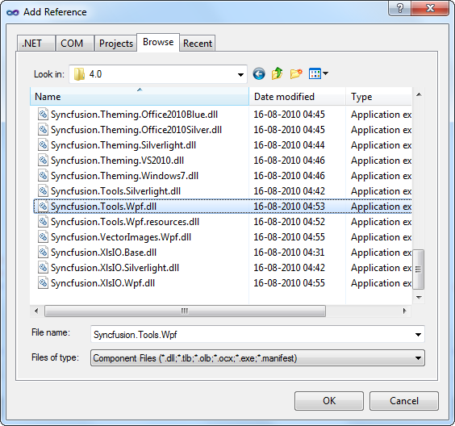
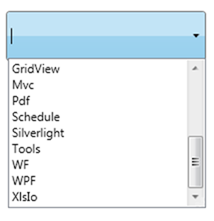

::: {style="DISPLAY: none"}
{#d2h_url_template}{#d2h_package_url style="WIDTH: 0px; DISPLAY: none; HEIGHT: 0px"}
:::

::: {.d2h_secondary_topic style="PADDING-BOTTOM: 10pt; MARGIN: 0pt; PADDING-LEFT: 0pt; PADDING-RIGHT: 0pt; PADDING-TOP: 0pt"}
#### Creating AutoComplete using C# {#creating-autocomplete-using-c style="tab-stops: 0pt"}

1.   Open Visual Studio, On the **File** menu click New -\> Project. This opens the New Project Dialog box.

 

{border="0"}

Figure 9: Creating New Project

[]{style="FONT-FAMILY: 'Calibri','sans-serif'"} 

2.   In the Project Dialog window, select WPF application and, in the Name field type the name of the project. Click OK.

[]{style="FONT-FAMILY: 'Calibri','sans-serif'"} 

{border="0"}

Figure 10: Creating New WPF Application

[]{style="FONT-FAMILY: 'Calibri','sans-serif'"} 

3.   Go to Solution Explorer. Right-click **References** folder and click Add Reference. Add the **Syncfusion.Tools.WPF.dll** assembly to the project References folder.

 

[]{style="FONT-FAMILY: 'Trebuchet MS','sans-serif'; COLOR: #15428b; FONT-SIZE: 9pt"} 

{border="0"}

Figure 11: Adding Reference

**[]{style="FONT-FAMILY: 'Myriad Pro','sans-serif'"}** 

+---------------------------------------------------------------------------------------------------------------------------------------------------------------------------------------------------------------------------------------------+
| **[\[XAML\]]{style="FONT-FAMILY: 'Courier New'"}**                                                                                                                                                                                          |
|                                                                                                                                                                                                                                             |
| [xmlns]{style="FONT-FAMILY: 'Courier New'; COLOR: red"}[:]{style="FONT-FAMILY: 'Courier New'; COLOR: blue"}[syncfusion]{style="FONT-FAMILY: 'Courier New'; COLOR: red"}[=\"clr-namespace:]{style="FONT-FAMILY: 'Courier New'; COLOR: blue"} |
|                                                                                                                                                                                                                                             |
| [Syncfusion.Windows.Tools.Controls;assembly=Syncfusion.Tools.Wpf\"]{style="FONT-FAMILY: 'Courier New'; COLOR: blue"}                                                                                                                        |
+---------------------------------------------------------------------------------------------------------------------------------------------------------------------------------------------------------------------------------------------+

[]{style="FONT-FAMILY: 'Trebuchet MS','sans-serif'; COLOR: #15428b; FONT-SIZE: 9pt"} 

4.   Add Syncfusion.Tools.WPF reference in XAML and C# code as follows.

 

+-----------------------------------------------------------------------------------------------------------------------------------+
| **[\[C#\]]{style="FONT-FAMILY: 'Courier New'"}**                                                                                  |
|                                                                                                                                   |
| [using]{style="FONT-FAMILY: 'Courier New'; COLOR: blue"}[ Syncfusion.Windows.Tools.Controls;]{style="FONT-FAMILY: 'Courier New'"} |
+-----------------------------------------------------------------------------------------------------------------------------------+

 

5.   Click and open the C# file. Add AutoComplete to the application.

[]{style="FONT-FAMILY: 'Trebuchet MS','sans-serif'; COLOR: #15428b; FONT-SIZE: 9pt"} 

+-------------------------------------------------------------------------------------------------------------------------------------------------------------------------------------------------------------------------------------------------------+
| **[\[C#\]]{style="FONT-FAMILY: 'Courier New'"}**                                                                                                                                                                                                      |
|                                                                                                                                                                                                                                                       |
| [AutoComplete]{style="FONT-FAMILY: 'Courier New'; COLOR: #2b91af"}[ AutoComplete1 = [new]{style="COLOR: blue"} [AutoComplete]{style="COLOR: #2b91af"}();]{style="FONT-FAMILY: 'Courier New'"}                                                         |
|                                                                                                                                                                                                                                                       |
| [List]{style="FONT-FAMILY: 'Courier New'; COLOR: #2b91af"}[\<[String]{style="COLOR: #2b91af"}\> ProductSource = [new]{style="COLOR: blue"} [List]{style="COLOR: #2b91af"}\<[String]{style="COLOR: #2b91af"}\>();]{style="FONT-FAMILY: 'Courier New'"} |
|                                                                                                                                                                                                                                                       |
| [customSource.Add([\"WPF\"]{style="COLOR: #a31515"});]{style="FONT-FAMILY: 'Courier New'"}                                                                                                                                                            |
|                                                                                                                                                                                                                                                       |
| [customSource.Add([\"Chart\"]{style="COLOR: #a31515"});]{style="FONT-FAMILY: 'Courier New'"}                                                                                                                                                          |
|                                                                                                                                                                                                                                                       |
| [customSource.Add([\"GridView\"]{style="COLOR: #a31515"});]{style="FONT-FAMILY: 'Courier New'"}                                                                                                                                                       |
|                                                                                                                                                                                                                                                       |
| [customSource.Add([\"WF\"]{style="COLOR: #a31515"});]{style="FONT-FAMILY: 'Courier New'"}                                                                                                                                                             |
|                                                                                                                                                                                                                                                       |
| [customSource.Add([\"Xlsio\"]{style="COLOR: #a31515"});]{style="FONT-FAMILY: 'Courier New'"}                                                                                                                                                          |
|                                                                                                                                                                                                                                                       |
| [customSource.Add([\"Business Intelligence\"]{style="COLOR: #a31515"});]{style="FONT-FAMILY: 'Courier New'"}                                                                                                                                          |
|                                                                                                                                                                                                                                                       |
| [customSource.Add([\"Tools\"]{style="COLOR: #a31515"});]{style="FONT-FAMILY: 'Courier New'"}                                                                                                                                                          |
|                                                                                                                                                                                                                                                       |
| [customSource.Add([\"Silverlight\"]{style="COLOR: #a31515"});]{style="FONT-FAMILY: 'Courier New'"}                                                                                                                                                    |
|                                                                                                                                                                                                                                                       |
| [customSource.Add([\"Schedule\"]{style="COLOR: #a31515"});]{style="FONT-FAMILY: 'Courier New'"}                                                                                                                                                       |
|                                                                                                                                                                                                                                                       |
| [customSource.Add([\"Mvc\"]{style="COLOR: #a31515"});]{style="FONT-FAMILY: 'Courier New'"}                                                                                                                                                            |
|                                                                                                                                                                                                                                                       |
| [customSource.Add([\"Pdf\"]{style="COLOR: #a31515"});]{style="FONT-FAMILY: 'Courier New'"}                                                                                                                                                            |
|                                                                                                                                                                                                                                                       |
| [this]{style="FONT-FAMILY: 'Courier New'; COLOR: blue"}[.AutoComplete1.CustomSource = ProductSource;]{style="FONT-FAMILY: 'Courier New'"}                                                                                                             |
+-------------------------------------------------------------------------------------------------------------------------------------------------------------------------------------------------------------------------------------------------------+

 

{border="0"}

Figure 12: AutoComplete Created Using C#

**[]{style="FONT-FAMILY: 'Myriad Pro','sans-serif'"}** 

[]{#related-topics}
:::
