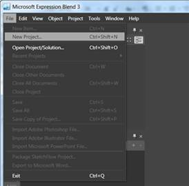
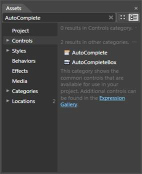
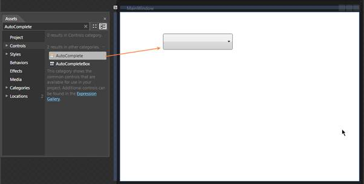
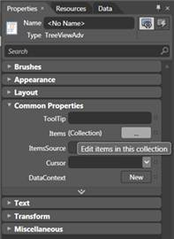
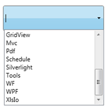

::: {style="DISPLAY: none"}
{#d2h_url_template}{#d2h_package_url style="WIDTH: 0px; DISPLAY: none; HEIGHT: 0px"}
:::

::: {.d2h_secondary_topic style="PADDING-BOTTOM: 10pt; MARGIN: 0pt; PADDING-LEFT: 0pt; PADDING-RIGHT: 0pt; PADDING-TOP: 0pt"}
#### Creating AutoComplete using Expression Blend {#creating-autocomplete-using-expression-blend style="tab-stops: 0pt"}

The AutoComplete control provides full Blend support. Here are the step-by-step instructions to create a WPF application in Blend.

1.   Open Blend, On the **File** Menu click New Project. This opens the New Project dialog box.

[]{style="FONT-FAMILY: 'Trebuchet MS','sans-serif'; COLOR: #15428b; FONT-SIZE: 9pt"} 

{border="0"}

Figure 16: Create New project in Expression Blend

**[]{style="FONT-FAMILY: 'Myriad Pro','sans-serif'"}** 

2.   In the Project type's panel, select WPF application and then click OK.

{border="0"}

Figure 17: Create New WPF Application in Expression Blend

 

3.   Add the following Reference with the sample project.

[·      ]{style="FONT-FAMILY: Symbol"}Syncfusion.Tools.WPF.dll

[]{style="FONT-FAMILY: 'Trebuchet MS','sans-serif'; COLOR: #15428b; FONT-SIZE: 9pt"} 

4.   On the Window menu, select Assets. This opens the Assets Library dialog box. In the Search box, type AutoComplete. This displays the search results as shown below-.

 

{border="0"}

Figure 18: AutoComplete Displayed in Assets window

 

5.   Drag the AutoComplete control to the Design View.

 

{border="0"}

Figure 19: AutoComplete Drag & Drop from Asset window

 

6.   You can now customize the properties of the AutoComplete in the Properties Window.

 

{border="0"}

Figure 20: Properties Window

 

+--------------------------------------------------------------------------------------------------------------------------------------------------------------------------------------------------------------------------------------------------------------------------------------------------------------------------------------------------------------------------------------------------------------------------------------------------------------------------------------------------------------------------------------------------------------------------------------------------------------------------------------------------------------------------------+
| **[\[XAML\]]{style="FONT-FAMILY: 'Courier New'"}**                                                                                                                                                                                                                                                                                                                                                                                                                                                                                                                                                                                                                             |
|                                                                                                                                                                                                                                                                                                                                                                                                                                                                                                                                                                                                                                                                                |
| [\<]{style="FONT-FAMILY: 'Courier New'; COLOR: blue"}[local]{style="FONT-FAMILY: 'Courier New'; COLOR: #a31515"}[:]{style="FONT-FAMILY: 'Courier New'; COLOR: blue"}[ProductSource]{style="FONT-FAMILY: 'Courier New'; COLOR: #a31515"}[ [x]{style="COLOR: #a31515"}[:]{style="COLOR: blue"}[Key]{style="COLOR: red"}[=\"Src\"/\>]{style="COLOR: blue"}]{style="FONT-FAMILY: 'Courier New'"}                                                                                                                                                                                                                                                                                   |
|                                                                                                                                                                                                                                                                                                                                                                                                                                                                                                                                                                                                                                                                                |
| [\<]{style="FONT-FAMILY: 'Courier New'; COLOR: blue"}[syncfusion]{style="FONT-FAMILY: 'Courier New'; COLOR: #a31515"}[:]{style="FONT-FAMILY: 'Courier New'; COLOR: blue"}[AutoComplete x]{style="FONT-FAMILY: 'Courier New'; COLOR: #a31515"}[:]{style="FONT-FAMILY: 'Courier New'; COLOR: blue"}[Name]{style="FONT-FAMILY: 'Courier New'; COLOR: red"}[=\"AutoComplete1\" ]{style="FONT-FAMILY: 'Courier New'; COLOR: blue"}[Source]{style="FONT-FAMILY: 'Courier New'; COLOR: red"}[=\"Custom"]{style="FONT-FAMILY: 'Courier New'; COLOR: blue"}[ [CustomSource]{style="COLOR: red"}[=\"{StaticResource Src}\"/\>]{style="COLOR: blue"}]{style="FONT-FAMILY: 'Courier New'"} |
+--------------------------------------------------------------------------------------------------------------------------------------------------------------------------------------------------------------------------------------------------------------------------------------------------------------------------------------------------------------------------------------------------------------------------------------------------------------------------------------------------------------------------------------------------------------------------------------------------------------------------------------------------------------------------------+

 

+-------------------------------------------------------------------------------------------------------------------------------------------------------------------------------------------------------------------------------------------------------+
| **[\[C#\]]{style="FONT-FAMILY: 'Courier New'"}[]{style="FONT-FAMILY: 'Courier New'"}**                                                                                                                                                                |
|                                                                                                                                                                                                                                                       |
| [List]{style="FONT-FAMILY: 'Courier New'; COLOR: #2b91af"}[\<[String]{style="COLOR: #2b91af"}\> ProductSource = [new]{style="COLOR: blue"} [List]{style="COLOR: #2b91af"}\<[String]{style="COLOR: #2b91af"}\>();]{style="FONT-FAMILY: 'Courier New'"} |
|                                                                                                                                                                                                                                                       |
| [customSource.Add([\"Diagram\"]{style="COLOR: #a31515"});]{style="FONT-FAMILY: 'Courier New'"}                                                                                                                                                        |
|                                                                                                                                                                                                                                                       |
| [customSource.Add([\"Gauge\"]{style="COLOR: #a31515"});]{style="FONT-FAMILY: 'Courier New'"}                                                                                                                                                          |
|                                                                                                                                                                                                                                                       |
| [customSource.Add([\"GridView\"]{style="COLOR: #a31515"});]{style="FONT-FAMILY: 'Courier New'"}                                                                                                                                                       |
|                                                                                                                                                                                                                                                       |
| [customSource.Add([\"Chart\"]{style="COLOR: #a31515"});]{style="FONT-FAMILY: 'Courier New'"}                                                                                                                                                          |
|                                                                                                                                                                                                                                                       |
| [customSource.Add([\"Business Intelligence\"]{style="COLOR: #a31515"});]{style="FONT-FAMILY: 'Courier New'"}                                                                                                                                          |
|                                                                                                                                                                                                                                                       |
| [customSource.Add([\"Schedule\"]{style="COLOR: #a31515"});]{style="FONT-FAMILY: 'Courier New'"}                                                                                                                                                       |
|                                                                                                                                                                                                                                                       |
| [customSource.Add([\"Grid\"]{style="COLOR: #a31515"});]{style="FONT-FAMILY: 'Courier New'"}                                                                                                                                                           |
|                                                                                                                                                                                                                                                       |
| [customSource.Add([\"DocIo\"]{style="COLOR: #a31515"});]{style="FONT-FAMILY: 'Courier New'"}                                                                                                                                                          |
|                                                                                                                                                                                                                                                       |
| [customSource.Add([\"XlsIo\"]{style="COLOR: #a31515"});]{style="FONT-FAMILY: 'Courier New'"}                                                                                                                                                          |
|                                                                                                                                                                                                                                                       |
| [customSource.Add([\"Pdf\"]{style="COLOR: #a31515"});]{style="FONT-FAMILY: 'Courier New'"}                                                                                                                                                            |
+-------------------------------------------------------------------------------------------------------------------------------------------------------------------------------------------------------------------------------------------------------+

 

{border="0"}

Figure 21: AutoComplete Created Using Blend

**[]{style="FONT-FAMILY: 'Myriad Pro','sans-serif'"}** 

[]{#related-topics}
:::
