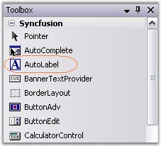
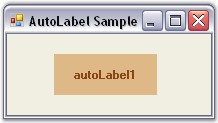

::: {style="DISPLAY: none"}
{#d2h_url_template}{#d2h_package_url style="WIDTH: 0px; DISPLAY: none; HEIGHT: 0px"}
:::

::: {.d2h_secondary_topic style="PADDING-BOTTOM: 10pt; MARGIN: 0pt; PADDING-LEFT: 0pt; PADDING-RIGHT: 0pt; PADDING-TOP: 0pt"}
##### Creating AutoLabel {#creating-autolabel style="tab-stops: 0pt"}

[]{#p743} 

The AutoLabel control can be created in the following ways.

[]{style="COLOR: #15428b"} 

###### 3.3.10.1.2.1        Through Designer {#through-designer style="tab-stops: 0pt"}

[]{#p744} 

The following steps illustrate how to create an AutoLabel control through designer.

[]{style="COLOR: #15428b"} 

[·      ]{style="FONT-FAMILY: Symbol"}Create or open a Windows Forms project.

[·      ]{style="FONT-FAMILY: Symbol"}Add an AutoLabel Control from the toolbox onto the form by dragging and dropping it on the form or double clicking the control.

[]{style="COLOR: #15428b"} 

{border="0"}

[]{style="COLOR: #15428b"} 

Figure 592: AutoLabel in Toolbox

[]{style="COLOR: #15428b"} 

[·      ]{style="FONT-FAMILY: Symbol"}Set the desired properties for the control through the Property grid.

[·      ]{style="FONT-FAMILY: Symbol"}Run the application.

[]{style="COLOR: #15428b"} 

{border="0"}

[]{style="COLOR: #15428b"} 

Figure 593: AutoLabel created Through Designer

[]{style="COLOR: #15428b"} 

See Also

[]{style="COLOR: #15428b"} 

[Through Code]{.UGHyperlink}[]{.UGHyperlink}

###### []{#_Through_Code_5}3.3.10.1.2.2        Through Code {#through-code style="tab-stops: 0pt"}

[]{#p745}[]{style="COLOR: #15428b"} 

The following steps illustrate how to create an AutoLabel control programmatically.

[]{style="COLOR: #15428b"} 

[·      ]{style="FONT-FAMILY: Symbol"}Create a C# or VB.NET application though Visual Studio.

[·      ]{style="FONT-FAMILY: Symbol"}Add the required assembly references.

[·      ]{style="FONT-FAMILY: Symbol"}Include the required namespace.

 

+--------------------------------------------------------------------------------------------------------------------------------+
| **[\[C#\]]{style="FONT-FAMILY: 'Courier New'; COLOR: black"}**                                                                 |
|                                                                                                                                |
| []{style="FONT-FAMILY: 'Courier New'; COLOR: black"}                                                                           |
|                                                                                                                                |
| [using ]{style="FONT-FAMILY: 'Courier New'; COLOR: blue"}[Syncfusion.Windows.Forms.Tools;]{style="FONT-FAMILY: 'Courier New'"} |
+--------------------------------------------------------------------------------------------------------------------------------+

[]{style="COLOR: #15428b"} 

+---------------------------------------------------------------------------------------------------------------------------------+
| **[\[VB.NET\]]{style="FONT-FAMILY: 'Courier New'; COLOR: black"}**                                                              |
|                                                                                                                                 |
| []{style="FONT-FAMILY: 'Courier New'; COLOR: black"}                                                                            |
|                                                                                                                                 |
| [Imports]{style="FONT-FAMILY: 'Courier New'; COLOR: blue"}[ Syncfusion.Windows.Forms.Tools]{style="FONT-FAMILY: 'Courier New'"} |
+---------------------------------------------------------------------------------------------------------------------------------+

[]{style="COLOR: #15428b"} 

[·      ]{style="FONT-FAMILY: Symbol"}Declare the AutoLabel control.

[]{style="COLOR: #15428b"} 

+---------------------------------------------------------------------------------------------------------------------------------------------------------------------------------+
| **[\[C#\]]{style="FONT-FAMILY: 'Courier New'; COLOR: black"}**                                                                                                                  |
|                                                                                                                                                                                 |
| []{style="FONT-FAMILY: 'Courier New'; COLOR: black"}                                                                                                                            |
|                                                                                                                                                                                 |
| [private]{style="FONT-FAMILY: 'Courier New'; COLOR: blue"}[ Syncfusion.Windows.Forms.Tools.[AutoLabel]{style="COLOR: #2b91af"} autoLabel1;]{style="FONT-FAMILY: 'Courier New'"} |
+---------------------------------------------------------------------------------------------------------------------------------------------------------------------------------+

[]{style="COLOR: #15428b"} 

+--------------------------------------------------------------------------------------------------------------------------------------------------------------------------------+
| **[\[VB.NET\]]{style="FONT-FAMILY: 'Courier New'; COLOR: black"}**                                                                                                             |
|                                                                                                                                                                                |
| []{style="FONT-FAMILY: 'Courier New'; COLOR: black"}                                                                                                                           |
|                                                                                                                                                                                |
| [Private]{style="FONT-FAMILY: 'Courier New'; COLOR: blue"}[ autoLabel1 [As]{style="COLOR: blue"} Syncfusion.Windows.Forms.Tools.AutoLabel]{style="FONT-FAMILY: 'Courier New'"} |
+--------------------------------------------------------------------------------------------------------------------------------------------------------------------------------+

[]{style="COLOR: #15428b"} 

[·      ]{style="FONT-FAMILY: Symbol"}Initialize the control.

[]{style="COLOR: #15428b"} 

+-------------------------------------------------------------------------------------------------------------------------------------------------------------------------------------------------------------+
| **[\[C#\]]{style="FONT-FAMILY: 'Courier New'; COLOR: black"}**                                                                                                                                              |
|                                                                                                                                                                                                             |
| []{style="FONT-FAMILY: 'Courier New'; COLOR: black"}                                                                                                                                                        |
|                                                                                                                                                                                                             |
| [this]{style="FONT-FAMILY: 'Courier New'; COLOR: blue"}[.autoLabel1 = [new]{style="COLOR: blue"} Syncfusion.Windows.Forms.Tools.[AutoLabel]{style="COLOR: #2b91af"}();]{style="FONT-FAMILY: 'Courier New'"} |
+-------------------------------------------------------------------------------------------------------------------------------------------------------------------------------------------------------------+

[]{style="COLOR: #15428b"} 

+--------------------------------------------------------------------------------------------------------------------------------------------------------------------------------+
| **[\[VB.NET\]]{style="FONT-FAMILY: 'Courier New'; COLOR: black"}**                                                                                                             |
|                                                                                                                                                                                |
| []{style="FONT-FAMILY: 'Courier New'; COLOR: black"}                                                                                                                           |
|                                                                                                                                                                                |
| [Me]{style="FONT-FAMILY: 'Courier New'; COLOR: blue"}[.autoLabel1 = [New]{style="COLOR: blue"} Syncfusion.Windows.Forms.Tools.AutoLabel()]{style="FONT-FAMILY: 'Courier New'"} |
+--------------------------------------------------------------------------------------------------------------------------------------------------------------------------------+

[]{style="COLOR: #15428b"} 

[·      ]{style="FONT-FAMILY: Symbol"}Set the properties for the AutoLabel control and add it to your form.

[]{style="COLOR: #15428b"} 

+----------------------------------------------------------------------------------------------------------------------------------------------------------------------------------------------------------------------------------------------------------------------------------------------------------------------------------------------------------------------------------------------------------------+
| **[\[C#\]]{style="FONT-FAMILY: 'Courier New'; COLOR: black"}**                                                                                                                                                                                                                                                                                                                                                 |
|                                                                                                                                                                                                                                                                                                                                                                                                                |
| []{style="FONT-FAMILY: 'Courier New'; COLOR: black"}                                                                                                                                                                                                                                                                                                                                                           |
|                                                                                                                                                                                                                                                                                                                                                                                                                |
| [this]{style="FONT-FAMILY: 'Courier New'; COLOR: blue"}[.autoLabel1.Text = [\"autoLabel1\"]{style="COLOR: #a31515"};]{style="FONT-FAMILY: 'Courier New'"}                                                                                                                                                                                                                                                      |
|                                                                                                                                                                                                                                                                                                                                                                                                                |
| [this]{style="FONT-FAMILY: 'Courier New'; COLOR: blue"}[.autoLabel1.BackColor = System.Drawing.[Color]{style="COLOR: #2b91af"}.BurlyWood;]{style="FONT-FAMILY: 'Courier New'"}                                                                                                                                                                                                                                 |
|                                                                                                                                                                                                                                                                                                                                                                                                                |
| [this]{style="FONT-FAMILY: 'Courier New'; COLOR: blue"}[.autoLabel1.ForeColor = System.Drawing.[Color]{style="COLOR: #2b91af"}.SaddleBrown;]{style="FONT-FAMILY: 'Courier New'"}                                                                                                                                                                                                                               |
|                                                                                                                                                                                                                                                                                                                                                                                                                |
| [this]{style="FONT-FAMILY: 'Courier New'; COLOR: blue"}[.autoLabel1.Font = [new]{style="COLOR: blue"} System.Drawing.[Font]{style="COLOR: #2b91af"}([\"Microsoft Sans Serif\"]{style="COLOR: #a31515"}, 8.25F, System.Drawing.[FontStyle]{style="COLOR: #2b91af"}.Bold, System.Drawing.[GraphicsUnit]{style="COLOR: #2b91af"}.Point, (([byte]{style="COLOR: blue"})(0)));]{style="FONT-FAMILY: 'Courier New'"} |
|                                                                                                                                                                                                                                                                                                                                                                                                                |
| [this]{style="FONT-FAMILY: 'Courier New'; COLOR: blue"}[.autoLabel1.TextAlign = System.Drawing.[ContentAlignment]{style="COLOR: #2b91af"}.MiddleCenter;]{style="FONT-FAMILY: 'Courier New'"}                                                                                                                                                                                                                   |
|                                                                                                                                                                                                                                                                                                                                                                                                                |
| []{style="FONT-FAMILY: 'Courier New'"}                                                                                                                                                                                                                                                                                                                                                                         |
|                                                                                                                                                                                                                                                                                                                                                                                                                |
| [// Add the AutoLabel control to the Form.]{style="FONT-FAMILY: 'Courier New'; COLOR: green"}                                                                                                                                                                                                                                                                                                                  |
|                                                                                                                                                                                                                                                                                                                                                                                                                |
| [this]{style="FONT-FAMILY: 'Courier New'; COLOR: blue"}[.Controls.Add([this]{style="COLOR: blue"}.autoLabel1);]{style="FONT-FAMILY: 'Courier New'"}                                                                                                                                                                                                                                                            |
+----------------------------------------------------------------------------------------------------------------------------------------------------------------------------------------------------------------------------------------------------------------------------------------------------------------------------------------------------------------------------------------------------------------+

[]{style="COLOR: #15428b"} 

+------------------------------------------------------------------------------------------------------------------------------------------------------------------------------------------------------------------------------------------------------------------------------------------------------------------------------+
| **[\[VB.NET\]]{style="FONT-FAMILY: 'Courier New'; COLOR: black"}**                                                                                                                                                                                                                                                           |
|                                                                                                                                                                                                                                                                                                                              |
| []{style="FONT-FAMILY: 'Courier New'; COLOR: black"}                                                                                                                                                                                                                                                                         |
|                                                                                                                                                                                                                                                                                                                              |
| [Me]{style="FONT-FAMILY: 'Courier New'; COLOR: blue"}[.autoLabel1.Text = [\"autoLabel1\"]{style="COLOR: #a31515"}]{style="FONT-FAMILY: 'Courier New'"}                                                                                                                                                                       |
|                                                                                                                                                                                                                                                                                                                              |
| [Me]{style="FONT-FAMILY: 'Courier New'; COLOR: blue"}[.autoLabel1.BackColor = System.Drawing.Color.BurlyWood]{style="FONT-FAMILY: 'Courier New'"}                                                                                                                                                                            |
|                                                                                                                                                                                                                                                                                                                              |
| [Me]{style="FONT-FAMILY: 'Courier New'; COLOR: blue"}[.autoLabel1.ForeColor = System.Drawing.Color.SaddleBrown]{style="FONT-FAMILY: 'Courier New'"}                                                                                                                                                                          |
|                                                                                                                                                                                                                                                                                                                              |
| [Me]{style="FONT-FAMILY: 'Courier New'; COLOR: blue"}[.autoLabel1.Font = [New]{style="COLOR: blue"} System.Drawing.Font([\"Microsoft Sans Serif\"]{style="COLOR: #a31515"}, 8.25F, System.Drawing.FontStyle.Bold, System.Drawing.GraphicsUnit.Point, [CByte]{style="COLOR: blue"}((0)))]{style="FONT-FAMILY: 'Courier New'"} |
|                                                                                                                                                                                                                                                                                                                              |
| [Me]{style="FONT-FAMILY: 'Courier New'; COLOR: blue"}[.autoLabel1.TextAlign = System.Drawing.ContentAlignment.MiddleCenter]{style="FONT-FAMILY: 'Courier New'"}                                                                                                                                                              |
|                                                                                                                                                                                                                                                                                                                              |
| []{style="FONT-FAMILY: 'Courier New'"}                                                                                                                                                                                                                                                                                       |
|                                                                                                                                                                                                                                                                                                                              |
| [\' Add the AutoLabel control to the Form.]{style="FONT-FAMILY: 'Courier New'; COLOR: green"}                                                                                                                                                                                                                                |
|                                                                                                                                                                                                                                                                                                                              |
| [Me]{style="FONT-FAMILY: 'Courier New'; COLOR: blue"}[.Controls.Add([Me]{style="COLOR: blue"}.autoLabel1)]{style="FONT-FAMILY: 'Courier New'"}                                                                                                                                                                               |
+------------------------------------------------------------------------------------------------------------------------------------------------------------------------------------------------------------------------------------------------------------------------------------------------------------------------------+

[]{style="COLOR: #15428b"} 

[·      ]{style="FONT-FAMILY: Symbol"}Run the application.

[]{style="COLOR: #15428b"} 

{border="0"}

Figure 594: AutoLabel created Through Code

[]{#related-topics}
:::
