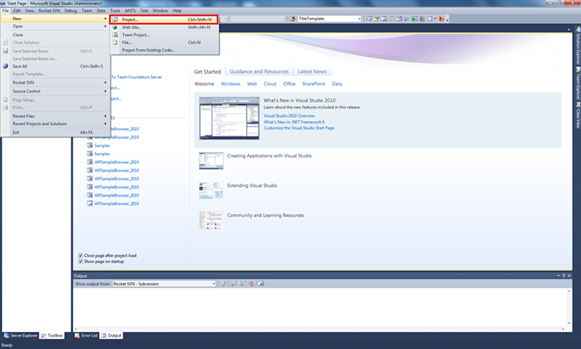
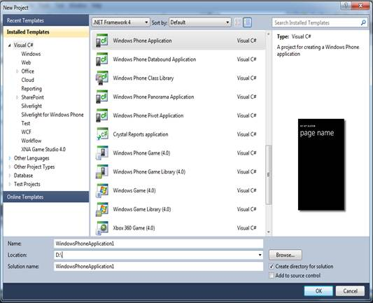
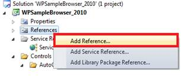
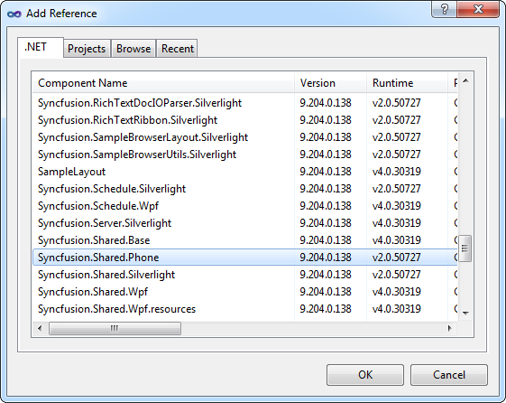

::: {style="DISPLAY: none"}
{#d2h_url_template}{#d2h_package_url style="WIDTH: 0px; DISPLAY: none; HEIGHT: 0px"}
:::

::::: {#nsbanner .d2h_main_nsbanner style="BORDER-BOTTOM: #999999 1px solid; POSITION: relative; PADDING-BOTTOM: 0px; BACKGROUND-COLOR: transparent; PADDING-LEFT: 0px; PADDING-RIGHT: 0px; DISPLAY: none; BORDER-TOP: #999999 1px solid; PADDING-TOP: 0px; LEFT: 0px"}
:::: {#TitleRow .d2h_main_titlerow style="PADDING-BOTTOM: 4px; BACKGROUND-COLOR: transparent; PADDING-LEFT: 22px; WIDTH: 100%; PADDING-RIGHT: 10px; DISPLAY: none; PADDING-TOP: 4px"}
::: {#ienav .d2h_main_ienav style="DISPLAY: none"}
{#D2HPrevious .D2HPreviousEnabled}  {#D2HNext .D2HNextEnabled}
:::
::::
:::::

:::: {#nstext .d2h_main_nstext style="PADDING-BOTTOM: 10px; BACKGROUND-COLOR: transparent; PADDING-LEFT: 22px; PADDING-RIGHT: 10px; HEIGHT: 100%; OVERFLOW: auto; PADDING-TOP: 5px" hasuserbackground="true" valign="bottom"}
::: {#d2h_breadcrumbs .d2h_breadcrumbs}
[Essential Studio User Guide Documentation](ms-xhelp:///?Id=12457748-09e3-4d74-a240-8e049cedf030){.d2h_breadcrumbsNormal}[ \> ]{.d2h_breadcrumbsLinkSeparator}[User Interface Edition](ms-xhelp:///?Id=c29296b7-531c-413b-a0ec-488ca1f7f669){.d2h_breadcrumbsNormal}[ \> ]{.d2h_breadcrumbsLinkSeparator}[Essential Windows Phone](ms-xhelp:///?Id=5ea1999c-4eff-4775-b84e-407dc825f555){.d2h_breadcrumbsNormal}[ \> ]{.d2h_breadcrumbsLinkSeparator}[Essential Tools]{.d2h_breadcrumbsContentsOnly}[ \> ]{.d2h_breadcrumbsLinkSeparator}[Getting Started](ms-xhelp:///?Id=c855430d-6081-4f35-b1b3-460fac618a35){.d2h_breadcrumbsNormal}
:::

## Creating a Windows Phone Application and Deploying Essential Tools {#creating-a-windows-phone-application-and-deploying-essential-tools style="tab-stops: 0pt"}

[]{#p11} 

This section provides step-by-step instructions for creating a Windows Phone application and deploying Tools controls in the application.

 

This procedure is elaborated in the following sections:

 

9.   Creating a Windows Phone Application

10.  Deploying Essential Tools to the Application

 

Creating a Windows Phone Application

 

1.   Open Microsoft Visual Studio. Go to **File** menu and click **New \> Project**.

 

{border="0"}

Figure 8: Creating a Windows Phone Application

 

 

 

 

2.   In the **New Project** dialog, select **Windows Phone Application** template, name the project and click **OK**.

 

[{border="0"}]{style="COLOR: #15428b"}

Figure 9: new project dialog

 

3.   A new Windows Phone application is created.

 

Deploying Essential Tools to the Application

 

1.   Go to Solution Explorer. Right-click **References** folder. Context menu opens.

2.   Click **Add Reference**.

 

[{border="0"}]{style="COLOR: #15428b"}

Figure 10: Solution Explorer window

 

3.   Add the following assemblies to the project References folder.

 

[·      ]{style="FONT-FAMILY: Symbol"}Syncfusion.Shared.Phone.dll

 

{border="0"}

Figure 11: Add Reference

 

4.   Add Syncfusion.Shared.Phone reference in XAML or C# code as follows.

[]{style="FONT-FAMILY: 'Segoe UI','sans-serif'; COLOR: red"} 

[]{style="FONT-FAMILY: 'Courier New'"} 

+-------------------------------------------------------------------------------------------------------------------------------------------------------------------------------------------------------------------------------------------------------------------------------------------------------------------------------------------------------------+
| **[\[XAML\]]{style="FONT-FAMILY: 'Courier New'; COLOR: black"}**                                                                                                                                                                                                                                                                                            |
|                                                                                                                                                                                                                                                                                                                                                             |
| [ ]{style="FONT-FAMILY: 'Courier New'; COLOR: red"}[xmlns]{style="FONT-FAMILY: 'Courier New'; COLOR: red"}[:]{style="FONT-FAMILY: 'Courier New'; COLOR: blue"}[tools]{style="FONT-FAMILY: 'Courier New'; COLOR: red"}[=\"clr-namespace:Syncfusion.Phone.Tools.Controls;assembly=Syncfusion.Shared.Phone\"]{style="FONT-FAMILY: 'Courier New'; COLOR: blue"} |
|                                                                                                                                                                                                                                                                                                                                                             |
| []{style="FONT-FAMILY: 'Courier New'; COLOR: blue"}                                                                                                                                                                                                                                                                                                         |
+-------------------------------------------------------------------------------------------------------------------------------------------------------------------------------------------------------------------------------------------------------------------------------------------------------------------------------------------------------------+

[]{style="FONT-FAMILY: 'Courier New'"} 

+------------------------------------------------------------------------------------------------------------------------+
| **[\[C#\]]{style="FONT-FAMILY: 'Courier New'; COLOR: black"}**                                                         |
|                                                                                                                        |
| []{style="FONT-FAMILY: 'Courier New'; COLOR: blue"}                                                                    |
|                                                                                                                        |
| [using]{style="FONT-FAMILY: 'Courier New'; COLOR: blue"}[ Syncfusion.Phone.Tools;]{style="FONT-FAMILY: 'Courier New'"} |
+------------------------------------------------------------------------------------------------------------------------+

 

 

 

 

Essential Tools controls are deployed in your application.

 

Refer to the getting started sections of all the controls in this user guide to know how to add the individual control to this application.

 

[]{#related-topics}
::::
