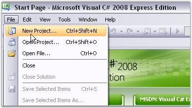
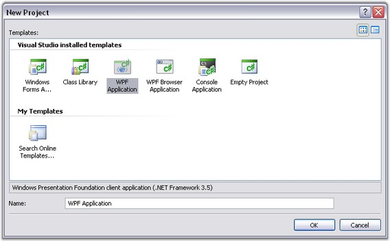

::: {style="DISPLAY: none"}
{#d2h_url_template}{#d2h_package_url style="WIDTH: 0px; DISPLAY: none; HEIGHT: 0px"}
:::

::::: {#nsbanner .d2h_main_nsbanner style="BORDER-BOTTOM: #999999 1px solid; POSITION: relative; PADDING-BOTTOM: 0px; BACKGROUND-COLOR: transparent; PADDING-LEFT: 0px; PADDING-RIGHT: 0px; DISPLAY: none; BORDER-TOP: #999999 1px solid; PADDING-TOP: 0px; LEFT: 0px"}
:::: {#TitleRow .d2h_main_titlerow style="PADDING-BOTTOM: 4px; BACKGROUND-COLOR: transparent; PADDING-LEFT: 22px; WIDTH: 100%; PADDING-RIGHT: 10px; DISPLAY: none; PADDING-TOP: 4px"}
::: {#ienav .d2h_main_ienav style="DISPLAY: none"}
{#D2HPrevious .D2HPreviousEnabled}  {#D2HNext .D2HNextEnabled}
:::
::::
:::::

::::: {#nstext .d2h_main_nstext style="PADDING-BOTTOM: 10px; BACKGROUND-COLOR: transparent; PADDING-LEFT: 22px; PADDING-RIGHT: 10px; HEIGHT: 100%; OVERFLOW: auto; PADDING-TOP: 5px" hasuserbackground="true" valign="bottom"}
::: {#d2h_breadcrumbs .d2h_breadcrumbs}
[Essential Studio User Guide Documentation](ms-xhelp:///?Id=12457748-09e3-4d74-a240-8e049cedf030){.d2h_breadcrumbsNormal}[ \> ]{.d2h_breadcrumbsLinkSeparator}[User Interface Edition](ms-xhelp:///?Id=c29296b7-531c-413b-a0ec-488ca1f7f669){.d2h_breadcrumbsNormal}[ \> ]{.d2h_breadcrumbsLinkSeparator}[Essential WPF](ms-xhelp:///?Id=7f4f82c5-151c-4262-94d0-75c4626c77bc){.d2h_breadcrumbsNormal}[ \> ]{.d2h_breadcrumbsLinkSeparator}[Essential Grid]{.d2h_breadcrumbsContentsOnly}[ \> ]{.d2h_breadcrumbsLinkSeparator}[Getting Started](ms-xhelp:///?Id=99894a49-7527-4c40-8048-00676aa25151){.d2h_breadcrumbsNormal}
:::

## Creating a WPF Application[]{#p8}[]{#p9} {#creating-a-wpf-application style="tab-stops: 0pt"}

To create a new WPF application in Visual Studio 2008, follow the below steps:**[]{style="COLOR: black"}**

1.   Open Visual Studio 2008. Go to File menu and click New Project.

[]{style="COLOR: #15428b"} 

{border="0"}

Figure 4:  File menu

 

2.   In the New Project dialog, Select WPF Application and give the project name as WPF Application.

 

{border="0"}

Figure 5:  New Project dialog - WPF Application

 

3.   A new WPF application is now created.

 

Adding Grid Controls

The first step before adding a Grid control to the WPF application, is to add a Scroll Viewer control, which presents a scrollable area that can host any visible control. Essential Grid can be easily hosted inside this control. The visibility of the horizontal and vertical scrollbars of the Scroll Viewer can be set using HorizontalScrollBarVisibility and VerticalScrollBarVisibility properties respectively. The Grid integrates with the Scroll Viewer supporting both the CanContentScroll modes.

**[]{style="COLOR: #15428b"}** 

CanContentScroll Property

This property of the Scroll Viewer indicates whether or not the contents hosted inside the control are allowed to scroll. This can be set to true or false.

**[]{style="COLOR: #15428b"}** 

[·      ]{style="FONT-FAMILY: Symbol"}If CanContentScroll is set to *True*, the grid will be nested inside the Scroll Viewer and its MeasureOverride method (http://msdn.microsoft.com/en-us/library/system.windows.frameworkelement.measureoverride.aspx) will have no effect. The grid will be responsible for scrolling the rows and columns in the given viewable area and will synchronize as required with the scrollbars of the Scroll Viewer. The Grid will be in a virtual mode and the data will be loaded on demand.

[·      ]{style="FONT-FAMILY: Symbol"}If CanContentScroll is set to *False*, the grid will return the total height of all rows and total width of all columns in its MeasureOverride method. The parent control will handle the scrolling. Rows and column cells will not be virtualized as they will be fixed.

**[]{style="COLOR: #15428b"}** 

::: {style="BORDER-BOTTOM: windowtext 1pt solid; BORDER-LEFT: medium none; PADDING-BOTTOM: 1pt; MARGIN-TOP: 9pt; PADDING-LEFT: 0pt; PADDING-RIGHT: 0pt; MARGIN-BOTTOM: 9pt; BORDER-TOP: windowtext 1pt solid; BORDER-RIGHT: medium none; PADDING-TOP: 1pt"}
 

{border="0"}Note: When If CanContentScroll is set to False, freezing rows or columns is not possible.
:::

**[]{style="COLOR: #15428b"}** 

A WPF application with basic preparations is ready now. Next step is to add the Grid controls to the application. The following sections elaborates on adding different Grid controls and loading them with data, programmatically.

[]{style="COLOR: #15428b"} 

[[·      ]{style="FONT-FAMILY: Symbol; COLOR: windowtext; TEXT-DECORATION: none; text-underline: none"}]{.UGHyperlink}[[Creating Grid control]{.UGHyperlink}](ms-xhelp:///?Id=d1d4235c-f400-498b-bee1-6d7cd2835a59)[]{.UGHyperlink}

[[·      ]{style="FONT-FAMILY: Symbol; COLOR: windowtext; TEXT-DECORATION: none; text-underline: none"}]{.UGHyperlink}[[Creating GridData control]{.UGHyperlink}](ms-xhelp:///?Id=5fb20bc3-29d9-454a-9e15-3d3cf3e6f8e0)[]{.UGHyperlink}

[[·      ]{style="FONT-FAMILY: Symbol; COLOR: windowtext; TEXT-DECORATION: none; text-underline: none"}]{.UGHyperlink}[[Creating GridTree control]{.UGHyperlink}](ms-xhelp:///?Id=fc1fdcb2-b7ba-4e8b-8d11-9876bb8f2b10)[]{.UGHyperlink}

 

[]{#related-topics}
:::::
