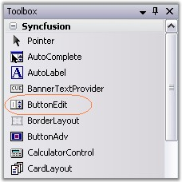
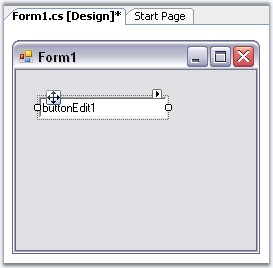
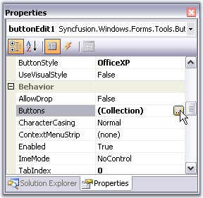
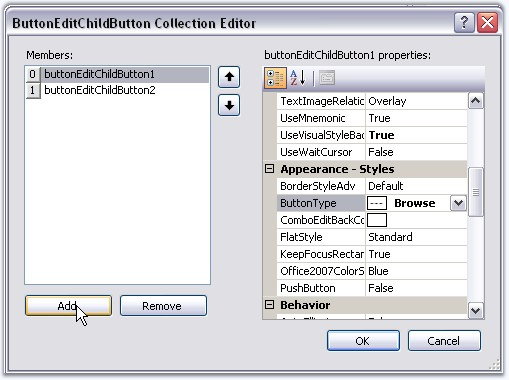
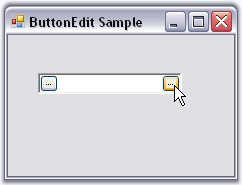
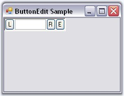

::: {style="DISPLAY: none"}
{#d2h_url_template}{#d2h_package_url style="WIDTH: 0px; DISPLAY: none; HEIGHT: 0px"}
:::

:::: {.d2h_secondary_topic style="PADDING-BOTTOM: 10pt; MARGIN: 0pt; PADDING-LEFT: 0pt; PADDING-RIGHT: 0pt; PADDING-TOP: 0pt"}
##### Creating ButtonEdit {#creating-buttonedit style="tab-stops: 0pt"}

[]{style="COLOR: #15428b"} 

This section will help you to get started with the ButtonEdit control. The below topics will guide you to create ButtonEdit control through designer and programmatically.

[]{style="COLOR: #15428b"} 

###### []{#_Through_Designer_4}3.3.2.2.2.1 Through Designer {#through-designer style="tab-stops: 0pt"}

[]{#p224}[]{style="COLOR: #15428b"} 

The ButtonEdit control can be used in situations where a set of buttons are needed alongside an edit control, such as in a browser for files dialog. This tutorial shows how to use the ButtonEdit control, set the Button properties and handle the events.

**[]{style="COLOR: #15428b"}** 

1.   Create a new Windows Forms application and open the main form in the designer. Drag and drop ButtonEdit control from the toolbox to the form. 

[]{style="COLOR: #15428b"} 

{border="0"}

[]{style="COLOR: #15428b"} 

Figure 163: ButtonEdit Control in Toolbox

[]{style="COLOR: #15428b"} 

2.   When the control is initially added to the form, it appears like an edit control with no buttons.

[]{style="COLOR: #15428b"} 

{border="0"}

**[]{style="COLOR: black"}** 

Figure 164: ButtonEdit Control in the Designer Form

[]{style="COLOR: #15428b"} 

3.   We can add buttons to the control using ButtonEditChildButton Collection Editor which is invoked by **ButtonEdit.Buttons** property. Editor can also be accessed using Smart Tag option.

[]{style="COLOR: #15428b"} 

{border="0"}

[]{style="COLOR: #15428b"} 

Figure 165: Opening ButtonEditChildButton Collection Editor using \"Button\" Property

[]{style="COLOR: #15428b"} 

4.   Set properties for buttons using the Editor. You can specify the attributes for any of the child buttons through the collection editor or by clicking any button and then selecting the properties in the**[ ]{style="COLOR: black"}**property grid, that display the properties for the selected button.

[]{style="COLOR: #15428b"} 

{border="0"}

[]{style="COLOR: #15428b"} 

Figure 166: Adding Buttons using ButtonEditChildButton Collection Editor

**[]{style="COLOR: #15428b"}** 

::: {style="BORDER-BOTTOM: windowtext 1pt solid; BORDER-LEFT: medium none; PADDING-BOTTOM: 1pt; MARGIN-TOP: 9pt; PADDING-LEFT: 0pt; PADDING-RIGHT: 0pt; MARGIN-BOTTOM: 9pt; BORDER-TOP: windowtext 1pt solid; BORDER-RIGHT: medium none; PADDING-TOP: 1pt"}
{border="0"} Note: You can also add or remove buttons to the ButtonEdit.Buttons collection through the Add Button and Remove Button verbs provided.
:::

[]{style="COLOR: #15428b"} 

5.   Run the application. You can specify handlers for these child buttons also.

[]{style="COLOR: #15428b"} 

{border="0"}

[]{style="COLOR: #15428b"} 

Figure 167: ButtonEdit Control with Child Buttons at Run Time

**[]{style="COLOR: #15428b"}** 

 See Also

[]{style="COLOR: #15428b"} 

[Concepts and Features]{.UGHyperlink}[]{.UGHyperlink}

###### []{#_Through_Code_2}3.3.2.2.2.2 Through Code {#through-code style="tab-stops: 0pt"}

[]{#p225}          []{style="COLOR: #15428b"}

To create a ButtonEdit control programmatically, follow the below steps.

[]{style="COLOR: #15428b"} 

1.   Include the required namespace.

[]{style="COLOR: #15428b"} 

+--------------------------------------------------------------------------------------------------------------------------------+
| **[\[C#\]]{style="FONT-FAMILY: 'Courier New'; COLOR: black"}**                                                                 |
|                                                                                                                                |
| []{style="COLOR: #15428b"}                                                                                                     |
|                                                                                                                                |
| [using ]{style="FONT-FAMILY: 'Courier New'; COLOR: blue"}[Syncfusion.Windows.Forms.Tools;]{style="FONT-FAMILY: 'Courier New'"} |
+--------------------------------------------------------------------------------------------------------------------------------+

[]{style="COLOR: #15428b"} 

+---------------------------------------------------------------------------------------------------------------------------------+
| **[\[VB.NET\]]{style="FONT-FAMILY: 'Courier New'; COLOR: black"}**                                                              |
|                                                                                                                                 |
| []{style="COLOR: #15428b"}                                                                                                      |
|                                                                                                                                 |
| [Imports]{style="FONT-FAMILY: 'Courier New'; COLOR: blue"}[ Syncfusion.Windows.Forms.Tools]{style="FONT-FAMILY: 'Courier New'"} |
+---------------------------------------------------------------------------------------------------------------------------------+

[]{style="COLOR: #15428b"} 

2.   Create an instances of ButtonEdit, TextBox and three ButtonEditChildButtons.

[]{style="COLOR: #15428b"} 

+---------------------------------------------------------------------------------------------------------------------------------------------------------------------------------------------------------+
| **[\[C#\]]{style="FONT-FAMILY: 'Courier New'; COLOR: black"}**                                                                                                                                          |
|                                                                                                                                                                                                         |
| []{style="COLOR: #15428b"}                                                                                                                                                                              |
|                                                                                                                                                                                                         |
| [private]{style="FONT-FAMILY: 'Courier New'; COLOR: blue"}[ Syncfusion.Windows.Forms.Tools.ButtonEdit buttonEdit1;]{style="FONT-FAMILY: 'Courier New'"}                                                 |
|                                                                                                                                                                                                         |
| [private]{style="FONT-FAMILY: 'Courier New'; COLOR: blue"}[ System.Windows.Forms.TextBox textBox1;]{style="FONT-FAMILY: 'Courier New'"}                                                                 |
|                                                                                                                                                                                                         |
| [private]{style="FONT-FAMILY: 'Courier New'; COLOR: blue"}[ Syncfusion.Windows.Forms.Tools.ButtonEditChildButton buttonEditChildButton1;]{style="FONT-FAMILY: 'Courier New'"}                           |
|                                                                                                                                                                                                         |
| [private]{style="FONT-FAMILY: 'Courier New'; COLOR: blue"}[ Syncfusion.Windows.Forms.Tools.ButtonEditChildButton buttonEditChildButton2;]{style="FONT-FAMILY: 'Courier New'"}                           |
|                                                                                                                                                                                                         |
| [private]{style="FONT-FAMILY: 'Courier New'; COLOR: blue"}[ Syncfusion.Windows.Forms.Tools.ButtonEditChildButton buttonEditChildButton3;]{style="FONT-FAMILY: 'Courier New'"}                           |
|                                                                                                                                                                                                         |
| []{style="FONT-FAMILY: 'Courier New'"}                                                                                                                                                                  |
|                                                                                                                                                                                                         |
| [this]{style="FONT-FAMILY: 'Courier New'; COLOR: blue"}[.buttonEdit1=[new]{style="COLOR: blue"} Syncfusion.Windows.Forms.Tools.ButtonEdit();]{style="FONT-FAMILY: 'Courier New'"}                       |
|                                                                                                                                                                                                         |
| [this]{style="FONT-FAMILY: 'Courier New'; COLOR: blue"}[.textBox1=[new]{style="COLOR: blue"} TextBox();]{style="FONT-FAMILY: 'Courier New'"}                                                            |
|                                                                                                                                                                                                         |
| [this]{style="FONT-FAMILY: 'Courier New'; COLOR: blue"}[.buttonEditChildButton1=[new]{style="COLOR: blue"} Syncfusion.Windows.Forms.Tools.ButtonEditChildButton();]{style="FONT-FAMILY: 'Courier New'"} |
|                                                                                                                                                                                                         |
| [this]{style="FONT-FAMILY: 'Courier New'; COLOR: blue"}[.buttonEditChildButton2=[new]{style="COLOR: blue"} Syncfusion.Windows.Forms.Tools.ButtonEditChildButton();]{style="FONT-FAMILY: 'Courier New'"} |
|                                                                                                                                                                                                         |
| [this]{style="FONT-FAMILY: 'Courier New'; COLOR: blue"}[.buttonEditChildButton3=[new]{style="COLOR: blue"} Syncfusion.Windows.Forms.Tools.ButtonEditChildButton();]{style="FONT-FAMILY: 'Courier New'"} |
+---------------------------------------------------------------------------------------------------------------------------------------------------------------------------------------------------------+

[]{style="COLOR: #15428b"} 

+--------------------------------------------------------------------------------------------------------------------------------------------------------------------------------------------------------+
| **[\[VB.NET\]]{style="FONT-FAMILY: 'Courier New'; COLOR: black"}**                                                                                                                                     |
|                                                                                                                                                                                                        |
| []{style="COLOR: #15428b"}                                                                                                                                                                             |
|                                                                                                                                                                                                        |
| [Private]{style="FONT-FAMILY: 'Courier New'; COLOR: blue"}[ buttonEdit1 [As]{style="COLOR: blue"} Syncfusion.Windows.Forms.Tools.ButtonEdit]{style="FONT-FAMILY: 'Courier New'"}                       |
|                                                                                                                                                                                                        |
| [Private]{style="FONT-FAMILY: 'Courier New'; COLOR: blue"}[ textBox1 [As]{style="COLOR: blue"} System.Windows.Forms.TextBox]{style="FONT-FAMILY: 'Courier New'"}                                       |
|                                                                                                                                                                                                        |
| [Private]{style="FONT-FAMILY: 'Courier New'; COLOR: blue"}[ buttonEditChildButton1 [As]{style="COLOR: blue"} Syncfusion.Windows.Forms.Tools.ButtonEditChildButton]{style="FONT-FAMILY: 'Courier New'"} |
|                                                                                                                                                                                                        |
| [Private]{style="FONT-FAMILY: 'Courier New'; COLOR: blue"}[ buttonEditChildButton2 [As]{style="COLOR: blue"} Syncfusion.Windows.Forms.Tools.ButtonEditChildButton]{style="FONT-FAMILY: 'Courier New'"} |
|                                                                                                                                                                                                        |
| [Private]{style="FONT-FAMILY: 'Courier New'; COLOR: blue"}[ buttonEditChildButton3 [As]{style="COLOR: blue"} Syncfusion.Windows.Forms.Tools.ButtonEditChildButton]{style="FONT-FAMILY: 'Courier New'"} |
|                                                                                                                                                                                                        |
| []{style="FONT-FAMILY: 'Courier New'"}                                                                                                                                                                 |
|                                                                                                                                                                                                        |
| [Me]{style="FONT-FAMILY: 'Courier New'; COLOR: blue"}[.buttonEdit1 = [New]{style="COLOR: blue"} Syncfusion.Windows.Forms.Tools.ButtonEdit()]{style="FONT-FAMILY: 'Courier New'"}                       |
|                                                                                                                                                                                                        |
| [Me]{style="FONT-FAMILY: 'Courier New'; COLOR: blue"}[.textBox1 = [New]{style="COLOR: blue"} TextBox()]{style="FONT-FAMILY: 'Courier New'"}                                                            |
|                                                                                                                                                                                                        |
| [Me]{style="FONT-FAMILY: 'Courier New'; COLOR: blue"}[.buttonEditChildButton1 = [New]{style="COLOR: blue"} Syncfusion.Windows.Forms.Tools.ButtonEditChildButton()]{style="FONT-FAMILY: 'Courier New'"} |
|                                                                                                                                                                                                        |
| [Me]{style="FONT-FAMILY: 'Courier New'; COLOR: blue"}[.buttonEditChildButton2 = [New]{style="COLOR: blue"} Syncfusion.Windows.Forms.Tools.ButtonEditChildButton()]{style="FONT-FAMILY: 'Courier New'"} |
|                                                                                                                                                                                                        |
| [Me]{style="FONT-FAMILY: 'Courier New'; COLOR: blue"}[.buttonEditChildButton3 = [New]{style="COLOR: blue"} Syncfusion.Windows.Forms.Tools.ButtonEditChildButton()]{style="FONT-FAMILY: 'Courier New'"} |
+--------------------------------------------------------------------------------------------------------------------------------------------------------------------------------------------------------+

[]{style="COLOR: #15428b"} 

3.   Embed the TextBox1 to the textBox of ButtonEdit.

[]{style="COLOR: #15428b"} 

+---------------------------------------------------------------------------------------------------------------------------------------------------------+
| **[\[C#\]]{style="FONT-FAMILY: 'Courier New'; COLOR: black"}**                                                                                          |
|                                                                                                                                                         |
| []{style="COLOR: #15428b"}                                                                                                                              |
|                                                                                                                                                         |
| [//Associating the TextBoxExt control.]{style="FONT-FAMILY: 'Courier New'; COLOR: green"}                                                               |
|                                                                                                                                                         |
| [this]{style="FONT-FAMILY: 'Courier New'; COLOR: blue"}[.buttonEdit1.TextBox=[this]{style="COLOR: blue"}.textBox1;]{style="FONT-FAMILY: 'Courier New'"} |
+---------------------------------------------------------------------------------------------------------------------------------------------------------+

[]{style="COLOR: #15428b"} 

+----------------------------------------------------------------------------------------------------------------------------------------------------+
| **[\[VB.NET\]]{style="FONT-FAMILY: 'Courier New'; COLOR: black"}**                                                                                 |
|                                                                                                                                                    |
| []{style="COLOR: #15428b"}                                                                                                                         |
|                                                                                                                                                    |
| [\'Associating the TextBoxExt control.]{style="FONT-FAMILY: 'Courier New'; COLOR: green"}                                                          |
|                                                                                                                                                    |
| [Me]{style="FONT-FAMILY: 'Courier New'; COLOR: blue"}[.buttonEdit1.TextBox=[Me]{style="COLOR: blue"}.textBox1]{style="FONT-FAMILY: 'Courier New'"} |
+----------------------------------------------------------------------------------------------------------------------------------------------------+

[]{style="COLOR: #15428b"} 

4.   Set the alignment and text for the buttons.

[]{style="COLOR: #15428b"} 

+---------------------------------------------------------------------------------------------------------------------------------------------------------------------------------+
| **[\[C#\]]{style="FONT-FAMILY: 'Courier New'; COLOR: black"}**                                                                                                                  |
|                                                                                                                                                                                 |
| []{style="COLOR: #15428b"}                                                                                                                                                      |
|                                                                                                                                                                                 |
| [//Setting Button alignment for Child Button 1]{style="FONT-FAMILY: 'Courier New'; COLOR: green"}                                                                               |
|                                                                                                                                                                                 |
| [//By default the alignment for other buttons will be right]{style="FONT-FAMILY: 'Courier New'; COLOR: green"}                                                                  |
|                                                                                                                                                                                 |
| [this]{style="FONT-FAMILY: 'Courier New'; COLOR: blue"}[.buttonEditChildButton1.ButtonAlign = [ButtonAlignment]{style="COLOR: teal"}.Left;]{style="FONT-FAMILY: 'Courier New'"} |
|                                                                                                                                                                                 |
| [//Setting text for child Buttons.]{style="FONT-FAMILY: 'Courier New'; COLOR: green"}                                                                                           |
|                                                                                                                                                                                 |
| [this]{style="FONT-FAMILY: 'Courier New'; COLOR: blue"}[.buttonEditChildButton1.Text = [\"L\"]{style="COLOR: maroon"};]{style="FONT-FAMILY: 'Courier New'"}                     |
|                                                                                                                                                                                 |
| [this]{style="FONT-FAMILY: 'Courier New'; COLOR: blue"}[.buttonEditChildButton2.Text = [\"R\"]{style="COLOR: maroon"};]{style="FONT-FAMILY: 'Courier New'"}                     |
|                                                                                                                                                                                 |
| [this]{style="FONT-FAMILY: 'Courier New'; COLOR: blue"}[.buttonEditChildButton3.Text = [\"E\"]{style="COLOR: maroon"};]{style="FONT-FAMILY: 'Courier New'"}                     |
+---------------------------------------------------------------------------------------------------------------------------------------------------------------------------------+

[]{style="COLOR: #15428b"} 

+-------------------------------------------------------------------------------------------------------------------------------------------------------------------------------+
| **[\[VB.NET\]]{style="FONT-FAMILY: 'Courier New'; COLOR: black"}**                                                                                                            |
|                                                                                                                                                                               |
| []{style="COLOR: #15428b"}                                                                                                                                                    |
|                                                                                                                                                                               |
| [\'Setting Button alignment for Child Button 1. ]{style="FONT-FAMILY: 'Courier New'; COLOR: green"}                                                                           |
|                                                                                                                                                                               |
| [\'By default the alignment for other buttons will be right]{style="FONT-FAMILY: 'Courier New'; COLOR: green"}                                                                |
|                                                                                                                                                                               |
| [Me]{style="FONT-FAMILY: 'Courier New'; COLOR: blue"}[.buttonEditChildButton1.ButtonAlign = [ButtonAlignment]{style="COLOR: black"}.Left]{style="FONT-FAMILY: 'Courier New'"} |
|                                                                                                                                                                               |
| [\'Setting text for child Buttons]{style="FONT-FAMILY: 'Courier New'; COLOR: green"}                                                                                          |
|                                                                                                                                                                               |
| [Me]{style="FONT-FAMILY: 'Courier New'; COLOR: blue"}[.buttonEditChildButton1.Text = [\"L\"]{style="COLOR: maroon"}]{style="FONT-FAMILY: 'Courier New'"}                      |
|                                                                                                                                                                               |
| [Me]{style="FONT-FAMILY: 'Courier New'; COLOR: blue"}[.buttonEditChildButton2.Text = [\"R\"]{style="COLOR: maroon"}]{style="FONT-FAMILY: 'Courier New'"}                      |
|                                                                                                                                                                               |
| [Me]{style="FONT-FAMILY: 'Courier New'; COLOR: blue"}[.buttonEditChildButton3.Text = [\"E\"]{style="COLOR: maroon"}]{style="FONT-FAMILY: 'Courier New'"}                      |
+-------------------------------------------------------------------------------------------------------------------------------------------------------------------------------+

[]{style="COLOR: #15428b"} 

5.   Add ButtonEditChildButtons to the ButtonEdit which then add it to the form.

[]{style="COLOR: #15428b"} 

+----------------------------------------------------------------------------------------------------------------------------------------------------------------------------+
| **[\[C#\]]{style="FONT-FAMILY: 'Courier New'; COLOR: black"}**                                                                                                             |
|                                                                                                                                                                            |
| []{style="COLOR: #15428b"}                                                                                                                                                 |
|                                                                                                                                                                            |
| [this]{style="FONT-FAMILY: 'Courier New'; COLOR: blue"}[.buttonEdit1.Buttons.Add([this]{style="COLOR: blue"}.buttonEditChildButton1);]{style="FONT-FAMILY: 'Courier New'"} |
|                                                                                                                                                                            |
| [this]{style="FONT-FAMILY: 'Courier New'; COLOR: blue"}[.buttonEdit1.Buttons.Add([this]{style="COLOR: blue"}.buttonEditChildButton2);]{style="FONT-FAMILY: 'Courier New'"} |
|                                                                                                                                                                            |
| [this]{style="FONT-FAMILY: 'Courier New'; COLOR: blue"}[.buttonEdit1.Buttons.Add([this]{style="COLOR: blue"}.buttonEditChildButton3);]{style="FONT-FAMILY: 'Courier New'"} |
|                                                                                                                                                                            |
| []{style="FONT-FAMILY: 'Courier New'"}                                                                                                                                     |
|                                                                                                                                                                            |
| [this]{style="FONT-FAMILY: 'Courier New'; COLOR: blue"}[.Controls.Add([this]{style="COLOR: blue"}.buttonEdit1);]{style="FONT-FAMILY: 'Courier New'"}                       |
+----------------------------------------------------------------------------------------------------------------------------------------------------------------------------+

[]{style="COLOR: #15428b"} 

+-----------------------------------------------------------------------------------------------------------------------------------------------------------------------+
| **[\[VB.NET\]]{style="FONT-FAMILY: 'Courier New'; COLOR: black"}**                                                                                                    |
|                                                                                                                                                                       |
| []{style="COLOR: #15428b"}                                                                                                                                            |
|                                                                                                                                                                       |
| [Me]{style="FONT-FAMILY: 'Courier New'; COLOR: blue"}[.buttonEdit1.Buttons.Add([Me]{style="COLOR: blue"}.buttonEditChildButton1)]{style="FONT-FAMILY: 'Courier New'"} |
|                                                                                                                                                                       |
| [Me]{style="FONT-FAMILY: 'Courier New'; COLOR: blue"}[.buttonEdit1.Buttons.Add([Me]{style="COLOR: blue"}.buttonEditChildButton2)]{style="FONT-FAMILY: 'Courier New'"} |
|                                                                                                                                                                       |
| [Me]{style="FONT-FAMILY: 'Courier New'; COLOR: blue"}[.buttonEdit1.Buttons.Add([Me]{style="COLOR: blue"}.buttonEditChildButton3)]{style="FONT-FAMILY: 'Courier New'"} |
|                                                                                                                                                                       |
| []{style="FONT-FAMILY: 'Courier New'"}                                                                                                                                |
|                                                                                                                                                                       |
| [Me]{style="FONT-FAMILY: 'Courier New'; COLOR: blue"}[.Controls.Add([Me]{style="COLOR: blue"}.buttonEdit1)]{style="FONT-FAMILY: 'Courier New'"}                       |
+-----------------------------------------------------------------------------------------------------------------------------------------------------------------------+

[]{style="COLOR: #15428b"} 

6.   Run the application. The output will be like below.

[]{style="COLOR: #15428b"} 

{border="0"}

[]{style="COLOR: #15428b"} 

Figure 168: ButtonEdit control created Programmatically

**[]{style="COLOR: #15428b"}** 

See Also

[]{style="COLOR: #15428b"} 

[Concepts and Features]{.UGHyperlink}[]{.UGHyperlink}

[]{#related-topics}
::::
