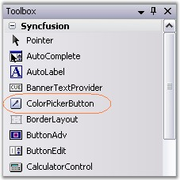
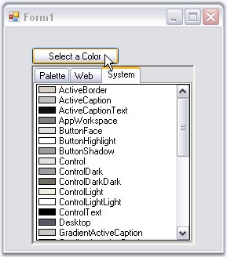

::: {style="DISPLAY: none"}
{#d2h_url_template}{#d2h_package_url style="WIDTH: 0px; DISPLAY: none; HEIGHT: 0px"}
:::

::: {.d2h_secondary_topic style="PADDING-BOTTOM: 10pt; MARGIN: 0pt; PADDING-LEFT: 0pt; PADDING-RIGHT: 0pt; PADDING-TOP: 0pt"}
##### Creating ColorPickerButton[]{#p350} {#creating-colorpickerbutton style="tab-stops: 0pt"}

[]{style="COLOR: #15428b"} 

ColorPickerButton is available to the designer by just dragging-and-dropping the ColorPickerButton from the toolbox onto the form.

[]{style="COLOR: #15428b"} 

{border="0"}

**[]{style="COLOR: #15428b"}** 

Figure 304: ColorPickerButton in Toolbox

**[]{style="COLOR: #15428b"}** 

It can be created programmatically as discussed below.

[]{style="COLOR: #15428b"} 

1.   Include the required namespace.

[]{style="COLOR: #15428b"} 

+--------------------------------------------------------------------------------------------------------------------------------+
| **[\[C#\]]{style="FONT-FAMILY: 'Courier New'; COLOR: black"}**                                                                 |
|                                                                                                                                |
| []{style="COLOR: #15428b"}                                                                                                     |
|                                                                                                                                |
| [using ]{style="FONT-FAMILY: 'Courier New'; COLOR: blue"}[Syncfusion.Windows.Forms.Tools;]{style="FONT-FAMILY: 'Courier New'"} |
+--------------------------------------------------------------------------------------------------------------------------------+

[]{style="COLOR: #15428b"} 

+---------------------------------------------------------------------------------------------------------------------------------+
| **[\[VB.NET\]]{style="FONT-FAMILY: 'Courier New'; COLOR: black"}**                                                              |
|                                                                                                                                 |
| []{style="COLOR: #15428b"}                                                                                                      |
|                                                                                                                                 |
| [Imports]{style="FONT-FAMILY: 'Courier New'; COLOR: blue"}[ Syncfusion.Windows.Forms.Tools]{style="FONT-FAMILY: 'Courier New'"} |
+---------------------------------------------------------------------------------------------------------------------------------+

[]{style="COLOR: #15428b"} 

2.   Create an instance of the ColorPickerButton control class and add it to the form.

[]{style="COLOR: #15428b"} 

+---------------------------------------------------------------------------------------------------------------------------------------------------------------------------------------------+
| **[\[C#\]]{style="FONT-FAMILY: 'Courier New'; COLOR: black"}**                                                                                                                              |
|                                                                                                                                                                                             |
| **[]{style="FONT-FAMILY: 'Courier New'; COLOR: black"}**                                                                                                                                    |
|                                                                                                                                                                                             |
| [private]{style="FONT-FAMILY: 'Courier New'; COLOR: blue"}[ Syncfusion.Windows.Forms.ColorPickerButton colorPickerButton1;]{style="FONT-FAMILY: 'Courier New'"}                             |
|                                                                                                                                                                                             |
| [this]{style="FONT-FAMILY: 'Courier New'; COLOR: blue"}[.colorPickerButton2 = [new]{style="COLOR: blue"} Syncfusion.Windows.Forms.ColorPickerButton();]{style="FONT-FAMILY: 'Courier New'"} |
|                                                                                                                                                                                             |
| [this]{style="FONT-FAMILY: 'Courier New'; COLOR: blue"}[.colorPickerButton1.Text = [\"Select a Color\"]{style="COLOR: maroon"};]{style="FONT-FAMILY: 'Courier New'"}                        |
|                                                                                                                                                                                             |
| [this]{style="FONT-FAMILY: 'Courier New'; COLOR: blue"}[.Controls.Add([this]{style="COLOR: blue"}.colorPickerButton1);]{style="FONT-FAMILY: 'Courier New'"}                                 |
+---------------------------------------------------------------------------------------------------------------------------------------------------------------------------------------------+

[]{style="COLOR: #15428b"} 

+------------------------------------------------------------------------------------------------------------------------------------------------------------------------------------------+
| **[\[VB.NET\]]{style="FONT-FAMILY: 'Courier New'; COLOR: black"}**                                                                                                                       |
|                                                                                                                                                                                          |
| **[]{style="FONT-FAMILY: 'Courier New'; COLOR: black"}**                                                                                                                                 |
|                                                                                                                                                                                          |
| [Private]{style="FONT-FAMILY: 'Courier New'; COLOR: blue"}[ colorPickerButton1 [As]{style="COLOR: blue"} Syncfusion.Windows.Forms.ColorPickerButton]{style="FONT-FAMILY: 'Courier New'"} |
|                                                                                                                                                                                          |
| [Me]{style="FONT-FAMILY: 'Courier New'; COLOR: blue"}[.colorPickerButton2 = [New]{style="COLOR: blue"} Syncfusion.Windows.Forms.ColorPickerButton()]{style="FONT-FAMILY: 'Courier New'"} |
|                                                                                                                                                                                          |
| [Me]{style="FONT-FAMILY: 'Courier New'; COLOR: blue"}[.colorPickerButton1.Text = [\"Select a Color\"]{style="COLOR: maroon"}]{style="FONT-FAMILY: 'Courier New'"}                        |
|                                                                                                                                                                                          |
| [Me]{style="FONT-FAMILY: 'Courier New'; COLOR: blue"}[.Controls.Add([Me]{style="COLOR: blue"}.colorPickerButton1)]{style="FONT-FAMILY: 'Courier New'"}                                   |
+------------------------------------------------------------------------------------------------------------------------------------------------------------------------------------------+

[]{style="COLOR: #15428b"} 

3.   Clicking this button at runtime will display the ColorUIControl.

[]{style="COLOR: #15428b"} 

{border="0"}

[]{style="COLOR: #15428b"} 

Figure 305: ColorPickerButton Displaying ColorUIControl at Run Time

[]{style="COLOR: #15428b"} 

See Also

**[]{style="COLOR: #15428b"}** 

[Appearance and Behavior Settings]{.UGHyperlink}[]{.UGHyperlink}

[]{#related-topics}
:::
