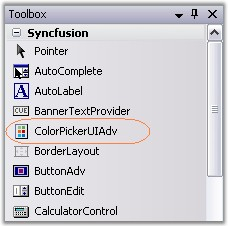
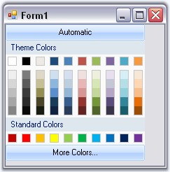

::: {style="DISPLAY: none"}
{#d2h_url_template}{#d2h_package_url style="WIDTH: 0px; DISPLAY: none; HEIGHT: 0px"}
:::

::: {.d2h_secondary_topic style="PADDING-BOTTOM: 10pt; MARGIN: 0pt; PADDING-LEFT: 0pt; PADDING-RIGHT: 0pt; PADDING-TOP: 0pt"}
##### Creating ColorPickerUI Adv {#creating-colorpickerui-adv style="tab-stops: 0pt"}

[]{style="COLOR: #15428b"} 

This section will help you to get started with using the ColorPickerUIAdv control.

 

The ColorPickerUIAdv can be easily created in the designer, by dragging-and-dropping from the toolbox on to the windows application form.

[]{style="COLOR: #15428b"} 

{border="0"}

[]{style="COLOR: #15428b"} 

Figure 309: ColorPickerUIAdv Control in Toolbox

[]{style="COLOR: #15428b"} 

It can be added programmatically by performing the following steps.

[]{style="COLOR: #15428b"} 

1.   Include the namespace for the Tools Package.

[]{style="COLOR: #15428b"} 

+--------------------------------------------------------------------------------------------------------------------------------+
| **[\[C#\]]{style="FONT-FAMILY: 'Courier New'; COLOR: black"}**                                                                 |
|                                                                                                                                |
| []{style="COLOR: #15428b"}                                                                                                     |
|                                                                                                                                |
| [using ]{style="FONT-FAMILY: 'Courier New'; COLOR: blue"}[Syncfusion.Windows.Forms.Tools;]{style="FONT-FAMILY: 'Courier New'"} |
+--------------------------------------------------------------------------------------------------------------------------------+

[]{style="COLOR: #15428b"} 

+---------------------------------------------------------------------------------------------------------------------------------+
| **[\[VB.NET\]]{style="FONT-FAMILY: 'Courier New'; COLOR: black"}**                                                              |
|                                                                                                                                 |
| []{style="COLOR: #15428b"}                                                                                                      |
|                                                                                                                                 |
| [Imports]{style="FONT-FAMILY: 'Courier New'; COLOR: blue"}[ Syncfusion.Windows.Forms.Tools]{style="FONT-FAMILY: 'Courier New'"} |
+---------------------------------------------------------------------------------------------------------------------------------+

[]{style="COLOR: #15428b"} 

2.   Create an instance of ColorPickerUIAdv and add it to the Windows Form.

[]{style="COLOR: #15428b"} 

+--------------------------------------------------------------------------------------------------------------------------------------------------------------------------------------------+
| **[\[C#\]]{style="FONT-FAMILY: 'Courier New'; COLOR: black"}**                                                                                                                             |
|                                                                                                                                                                                            |
| []{style="COLOR: #15428b"}                                                                                                                                                                 |
|                                                                                                                                                                                            |
| [private]{style="FONT-FAMILY: 'Courier New'; COLOR: blue"}[ Syncfusion.Windows.Forms.Tools.[ColorPickerUIAdv]{style="COLOR: teal"} colorPickerUIAdv1;]{style="FONT-FAMILY: 'Courier New'"} |
|                                                                                                                                                                                            |
| [ColorPickerUIAdv]{style="FONT-FAMILY: 'Courier New'; COLOR: teal"}[ cpa = [new]{style="COLOR: blue"} [ColorPickerUIAdv]{style="COLOR: teal"}();]{style="FONT-FAMILY: 'Courier New'"}      |
|                                                                                                                                                                                            |
| [cpa.Size = [new]{style="COLOR: blue"} [Size]{style="COLOR: teal"}(200, 180);]{style="FONT-FAMILY: 'Courier New'"}                                                                         |
|                                                                                                                                                                                            |
| [this]{style="FONT-FAMILY: 'Courier New'; COLOR: blue"}[.Controls.Add(cpa);]{style="FONT-FAMILY: 'Courier New'"}                                                                           |
+--------------------------------------------------------------------------------------------------------------------------------------------------------------------------------------------+

[]{style="COLOR: #15428b"} 

+-------------------------------------------------------------------------------------------------------------------------------------------------------------------------------------------------+
| **[\[VB.NET\]]{style="FONT-FAMILY: 'Courier New'; COLOR: black"}**                                                                                                                              |
|                                                                                                                                                                                                 |
| **[]{style="FONT-FAMILY: 'Courier New'; COLOR: black"}**                                                                                                                                        |
|                                                                                                                                                                                                 |
| [Private]{style="FONT-FAMILY: 'Courier New'; COLOR: blue"}[ colorPickerUIAdv1 [As]{style="COLOR: blue"} Syncfusion.Windows.Forms.Tools.ColorPickerUIAdv ]{style="FONT-FAMILY: 'Courier New'"}   |
|                                                                                                                                                                                                 |
| [Private]{style="FONT-FAMILY: 'Courier New'; COLOR: blue"}[ cpa [As]{style="COLOR: blue"} ColorPickerUIadv = [New]{style="COLOR: blue"} ColorPickerUIadv()]{style="FONT-FAMILY: 'Courier New'"} |
|                                                                                                                                                                                                 |
| [Private]{style="FONT-FAMILY: 'Courier New'; COLOR: blue"}[ cpa.Size = [New]{style="COLOR: blue"} Size(200, 180)]{style="FONT-FAMILY: 'Courier New'"}                                           |
|                                                                                                                                                                                                 |
| [Me]{style="FONT-FAMILY: 'Courier New'; COLOR: blue"}[.Controls.Add(cpa)]{style="FONT-FAMILY: 'Courier New'"}                                                                                   |
+-------------------------------------------------------------------------------------------------------------------------------------------------------------------------------------------------+

[]{style="COLOR: #15428b"} 

{border="0"}

Figure 310: ColorPickerUIAdv

 

 

[]{#related-topics}
:::
