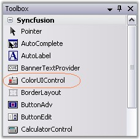
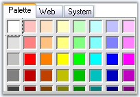

::: {style="DISPLAY: none"}
{#d2h_url_template}{#d2h_package_url style="WIDTH: 0px; DISPLAY: none; HEIGHT: 0px"}
:::

::: {.d2h_secondary_topic style="PADDING-BOTTOM: 10pt; MARGIN: 0pt; PADDING-LEFT: 0pt; PADDING-RIGHT: 0pt; PADDING-TOP: 0pt"}
##### Creating ColorUIControl {#creating-coloruicontrol style="tab-stops: 0pt"}

[]{#p337}[]{style="COLOR: #15428b"} 

ColorUIControl can be added through designer by just dragging-and-dropping it from the toolbox onto the Windows Form Designer.

[]{style="COLOR: #15428b"} 

{border="0"}

[]{style="COLOR: #15428b"} 

Figure 289: ColorUIControl in Designer

[]{style="COLOR: #15428b"} 

It can also be created programmatically as discussed below.

[]{style="COLOR: #15428b"} 

1.   Include the required namespace.

[]{style="COLOR: #15428b"} 

+--------------------------------------------------------------------------------------------------------------------------------+
| **[\[C#\]]{style="FONT-FAMILY: 'Courier New'; COLOR: black"}**                                                                 |
|                                                                                                                                |
| []{style="COLOR: #15428b"}                                                                                                     |
|                                                                                                                                |
| [using ]{style="FONT-FAMILY: 'Courier New'; COLOR: blue"}[Syncfusion.Windows.Forms.Tools;]{style="FONT-FAMILY: 'Courier New'"} |
+--------------------------------------------------------------------------------------------------------------------------------+

[]{style="COLOR: #15428b"} 

+---------------------------------------------------------------------------------------------------------------------------------+
| **[\[VB.NET\]]{style="FONT-FAMILY: 'Courier New'; COLOR: black"}**                                                              |
|                                                                                                                                 |
| []{style="COLOR: #15428b"}                                                                                                      |
|                                                                                                                                 |
| [Imports]{style="FONT-FAMILY: 'Courier New'; COLOR: blue"}[ Syncfusion.Windows.Forms.Tools]{style="FONT-FAMILY: 'Courier New'"} |
+---------------------------------------------------------------------------------------------------------------------------------+

[]{style="COLOR: #15428b"} 

2.   Create an instance of the ColorUIControl control class. Specify its size and add it to the form.

[]{style="COLOR: #15428b"} 

+-------------------------------------------------------------------------------------------------------------------------------------------------------------------------------------+
| **[\[C#\]]{style="FONT-FAMILY: 'Courier New'; COLOR: black"}**                                                                                                                      |
|                                                                                                                                                                                     |
| []{style="COLOR: #15428b"}                                                                                                                                                          |
|                                                                                                                                                                                     |
| [// Declaring and Initializing the control]{style="FONT-FAMILY: 'Courier New'; COLOR: green"}                                                                                       |
|                                                                                                                                                                                     |
| [private]{style="FONT-FAMILY: 'Courier New'; COLOR: blue"}[ Syncfusion.Windows.Forms.ColorUIControl colorUIControl1;]{style="FONT-FAMILY: 'Courier New'"}                           |
|                                                                                                                                                                                     |
| [this]{style="FONT-FAMILY: 'Courier New'; COLOR: blue"}[.colorUIControl1=[new]{style="COLOR: blue"} Syncfusion.Windows.Forms.ColorUIControl();]{style="FONT-FAMILY: 'Courier New'"} |
|                                                                                                                                                                                     |
| [//Specify the size for the control]{style="FONT-FAMILY: 'Courier New'; COLOR: green"}                                                                                              |
|                                                                                                                                                                                     |
| [this]{style="FONT-FAMILY: 'Courier New'; COLOR: blue"}[.colorUIControl1.Size = [new]{style="COLOR: blue"} System.Drawing.Size(200, 136);]{style="FONT-FAMILY: 'Courier New'"}      |
|                                                                                                                                                                                     |
| []{style="FONT-FAMILY: 'Courier New'"}                                                                                                                                              |
|                                                                                                                                                                                     |
| [Adding ColorUIControl to the form]{style="FONT-FAMILY: 'Courier New'; COLOR: green"}                                                                                               |
|                                                                                                                                                                                     |
| [this]{style="FONT-FAMILY: 'Courier New'; COLOR: blue"}[.Controls.Add([this]{style="COLOR: blue"}.colorUIControl1);]{style="FONT-FAMILY: 'Courier New'"}                            |
+-------------------------------------------------------------------------------------------------------------------------------------------------------------------------------------+

[]{style="COLOR: #15428b"} 

+------------------------------------------------------------------------------------------------------------------------------------------------------------------------------------+
| **[\[VB.NET\]]{style="FONT-FAMILY: 'Courier New'; COLOR: black"}**                                                                                                                 |
|                                                                                                                                                                                    |
| **[]{style="FONT-FAMILY: 'Courier New'; COLOR: black"}**                                                                                                                           |
|                                                                                                                                                                                    |
| [\' Declaring and Initializing the control]{style="FONT-FAMILY: 'Courier New'; COLOR: green"}                                                                                      |
|                                                                                                                                                                                    |
| [Private]{style="FONT-FAMILY: 'Courier New'; COLOR: blue"}[ colorUIControl1 [As]{style="COLOR: blue"} Syncfusion.Windows.Forms.ColorUIControl]{style="FONT-FAMILY: 'Courier New'"} |
|                                                                                                                                                                                    |
| [Me]{style="FONT-FAMILY: 'Courier New'; COLOR: blue"}[.colorUIControl1 = [New]{style="COLOR: blue"} Syncfusion.Windows.Forms.ColorUIControl()]{style="FONT-FAMILY: 'Courier New'"} |
|                                                                                                                                                                                    |
| []{style="FONT-FAMILY: 'Courier New'"}                                                                                                                                             |
|                                                                                                                                                                                    |
| [\'Specify the size for the control]{style="FONT-FAMILY: 'Courier New'; COLOR: green"}                                                                                             |
|                                                                                                                                                                                    |
| [Me]{style="FONT-FAMILY: 'Courier New'; COLOR: blue"}[.colorUIControl1.Size = [New]{style="COLOR: blue"} System.Drawing.Size(200, 136)]{style="FONT-FAMILY: 'Courier New'"}        |
|                                                                                                                                                                                    |
| []{style="FONT-FAMILY: 'Courier New'; COLOR: blue"}                                                                                                                                |
|                                                                                                                                                                                    |
| [\' Adding ColorUIControl to the form]{style="FONT-FAMILY: 'Courier New'; COLOR: green"}                                                                                           |
|                                                                                                                                                                                    |
| [Me]{style="FONT-FAMILY: 'Courier New'; COLOR: blue"}[.Controls.Add([Me]{style="COLOR: blue"}.colorUIControl1)]{style="FONT-FAMILY: 'Courier New'"}                                |
+------------------------------------------------------------------------------------------------------------------------------------------------------------------------------------+

[]{style="COLOR: #15428b"} 

{border="0"}

[]{style="COLOR: #15428b"} 

Figure 290: ColorPickerUI Created Programmatically

[]{style="COLOR: #15428b"} 

See also

**[]{style="COLOR: #15428b"}** 

[Concepts and Features]{.UGHyperlink}[]{.UGHyperlink}

[]{#related-topics}
:::
