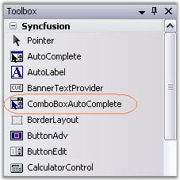
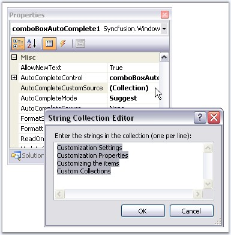
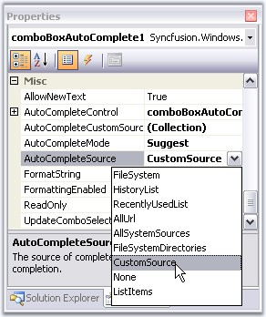
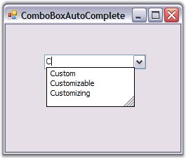

::: {style="DISPLAY: none"}
{#d2h_url_template}{#d2h_package_url style="WIDTH: 0px; DISPLAY: none; HEIGHT: 0px"}
:::

:::: {.d2h_secondary_topic style="PADDING-BOTTOM: 10pt; MARGIN: 0pt; PADDING-LEFT: 0pt; PADDING-RIGHT: 0pt; PADDING-TOP: 0pt"}
##### Creating ComboBoxAutoComplete {#creating-comboboxautocomplete style="tab-stops: 0pt"}

[]{#p194}[]{style="COLOR: #15428b"} 

Implementing a simple ComboBoxAutoComplete can be done in the following ways.

[]{style="COLOR: #15428b"} 

###### []{#_Through_Designer_3}3.3.1.2.2.1 Through Designer        {#through-designer style="tab-stops: 0pt"}

[]{#p195} 

This tutorial illustrates the usage of the ComboBoxAutoComplete control without any external datasource.

[]{style="COLOR: #15428b"} 

::: {style="BORDER-BOTTOM: windowtext 1pt solid; BORDER-LEFT: medium none; PADDING-BOTTOM: 1pt; MARGIN-TOP: 9pt; PADDING-LEFT: 0pt; PADDING-RIGHT: 0pt; MARGIN-BOTTOM: 9pt; BORDER-TOP: windowtext 1pt solid; BORDER-RIGHT: medium none; PADDING-TOP: 1pt"}
{border="0"} Note : This is applicable only for VS2005.
:::

[]{style="COLOR: #15428b"} 

1.   Drag-and-drop a ComboBoxAutoComplete control from the toolbox onto the form.

[]{style="COLOR: #15428b"} 

{border="0"}

Figure 131: ComboBoxAutoComplete control in Toolbox

[]{style="COLOR: #15428b"} 

2.   Add items to ComboBoxAutoComplete using **AutoCompleteCustomSource** collection editor as shown below.

[]{style="COLOR: #15428b"} 

{border="0"} 

Figure 132: Adding CustomSource to ComboBox

**[]{style="COLOR: #15428b"}** 

3.   Specify the text completion behavior of the control using **ComboBoxAutoComplete.AutoCompleteMode.** The value of AutoCompleteMode should not be none in this case. SeeSee Source for AutoComplete Control to know the different AutoCompleteModes.

 

4.   Set **AutoCompleteSource** to CustomSource as shown below. SeeSee Source for AutoComplete Control to know the different AutoComplete sources.

[]{style="COLOR: #15428b"} 

{border="0"}

Figure 133: Setting CustomSource

**[]{style="COLOR: #15428b"}** 

Output

**[]{style="COLOR: #15428b"}** 

At runtime, type \'C\' in the display area of ComboBoxAutoComplete, you will see the autocompletion behavior as shown below.

**[]{style="COLOR: #15428b"}** 

{border="0"}

Figure 134: ComboBoxAutoComplete with CustomSource

 

 

###### []{#p196}3.3.1.2.2.2 Through Code {#through-code style="tab-stops: 0pt"}

[]{style="COLOR: #15428b"} 

The embedded AutoComplete control in a ComboBoxAutoComplete control is exposed through the **AutoCompleteControl** property. The **Datasource** property of the AutoCompleteControl specifies the data that will be used for the auto completion of the combo box. It can be created programmatically as follows.

[]{style="COLOR: #15428b"} 

1.   Include the required namespace.

[]{style="COLOR: #15428b"} 

+--------------------------------------------------------------------------------------------------------------------------------+
| **[\[C#\]]{style="FONT-FAMILY: 'Courier New'; COLOR: black"}**                                                                 |
|                                                                                                                                |
| []{style="COLOR: #15428b"}                                                                                                     |
|                                                                                                                                |
| [using ]{style="FONT-FAMILY: 'Courier New'; COLOR: blue"}[Syncfusion.Windows.Forms.Tools;]{style="FONT-FAMILY: 'Courier New'"} |
+--------------------------------------------------------------------------------------------------------------------------------+

[]{style="COLOR: #15428b"} 

+---------------------------------------------------------------------------------------------------------------------------------+
| **[\[VB.NET\]]{style="FONT-FAMILY: 'Courier New'; COLOR: black"}**                                                              |
|                                                                                                                                 |
| []{style="COLOR: #15428b"}                                                                                                      |
|                                                                                                                                 |
| [Imports]{style="FONT-FAMILY: 'Courier New'; COLOR: blue"}[ Syncfusion.Windows.Forms.Tools]{style="FONT-FAMILY: 'Courier New'"} |
+---------------------------------------------------------------------------------------------------------------------------------+

[]{style="COLOR: #15428b"} 

2.   Create an instance of the ComboBoxAutoComplete control class.

[]{style="COLOR: #15428b"} 

+-------------------------------------------------------------------------------------------------------------------------------------------------------------------------------------------------------+
| **[\[C#\]]{style="FONT-FAMILY: 'Courier New'; COLOR: black"}**                                                                                                                                        |
|                                                                                                                                                                                                       |
| **[]{style="FONT-FAMILY: 'Courier New'; COLOR: black"}**                                                                                                                                              |
|                                                                                                                                                                                                       |
| [private]{style="FONT-FAMILY: 'Courier New'; COLOR: blue"}[ Syncfusion.Windows.Forms.Tools.ComboBoxAutoComplete comboBoxAutoComplete1;]{style="FONT-FAMILY: 'Courier New'"}                           |
|                                                                                                                                                                                                       |
| [this]{style="FONT-FAMILY: 'Courier New'; COLOR: blue"}[.comboBoxAutoComplete1=[new]{style="COLOR: blue"} Syncfusion.Windows.Forms.Tools.ComboBoxAutoComplete();]{style="FONT-FAMILY: 'Courier New'"} |
+-------------------------------------------------------------------------------------------------------------------------------------------------------------------------------------------------------+

[]{style="COLOR: #15428b"} 

+------------------------------------------------------------------------------------------------------------------------------------------------------------------------------------------------------+
| **[\[VB.NET\]]{style="FONT-FAMILY: 'Courier New'; COLOR: black"}**                                                                                                                                   |
|                                                                                                                                                                                                      |
| **[]{style="FONT-FAMILY: 'Courier New'; COLOR: black"}**                                                                                                                                             |
|                                                                                                                                                                                                      |
| [Private]{style="FONT-FAMILY: 'Courier New'; COLOR: blue"}[ comboBoxAutoComplete1 [As]{style="COLOR: blue"} Syncfusion.Windows.Forms.Tools.ComboBoxAutoComplete]{style="FONT-FAMILY: 'Courier New'"} |
|                                                                                                                                                                                                      |
| [Me]{style="FONT-FAMILY: 'Courier New'; COLOR: blue"}[.comboBoxAutoComplete1 = [New]{style="COLOR: blue"} Syncfusion.Windows.Forms.Tools.ComboBoxAutoComplete()]{style="FONT-FAMILY: 'Courier New'"} |
+------------------------------------------------------------------------------------------------------------------------------------------------------------------------------------------------------+

[]{style="COLOR: #15428b"} 

3.   Set data source and add the control to the form.

[]{style="COLOR: #15428b"} 

+--------------------------------------------------------------------------------------------------------------------------------------------------------------------------------------------------------------------------------------------------------------------------------------------------------------------------------------------------+
| **[\[C#\]]{style="FONT-FAMILY: 'Courier New'; COLOR: black"}**                                                                                                                                                                                                                                                                                   |
|                                                                                                                                                                                                                                                                                                                                                  |
| []{style="COLOR: #15428b"}                                                                                                                                                                                                                                                                                                                       |
|                                                                                                                                                                                                                                                                                                                                                  |
| [this]{style="FONT-FAMILY: 'Courier New'; COLOR: blue"}[.comboBoxAutoComplete1.AutoCompleteCustomSource.AddRange([new]{style="COLOR: blue"} [string]{style="COLOR: blue"}\[\] { [\"Custom\"]{style="COLOR: maroon"}, [\"Customizing\"]{style="COLOR: maroon"}, [\"Customizable\"]{style="COLOR: maroon"}});]{style="FONT-FAMILY: 'Courier New'"} |
|                                                                                                                                                                                                                                                                                                                                                  |
| [this]{style="FONT-FAMILY: 'Courier New'; COLOR: blue"}[.comboBoxAutoComplete1.AutoCompleteMode = System.Windows.Forms.[AutoCompleteMode]{style="COLOR: teal"}.SuggestAppend;]{style="FONT-FAMILY: 'Courier New'"}                                                                                                                               |
|                                                                                                                                                                                                                                                                                                                                                  |
| [this]{style="FONT-FAMILY: 'Courier New'; COLOR: blue"}[.comboBoxAutoComplete1.AutoCompleteSource = System.Windows.Forms.[AutoCompleteSource]{style="COLOR: teal"}.CustomSource;]{style="FONT-FAMILY: 'Courier New'"}                                                                                                                            |
|                                                                                                                                                                                                                                                                                                                                                  |
| []{style="FONT-FAMILY: 'Courier New'"}                                                                                                                                                                                                                                                                                                           |
|                                                                                                                                                                                                                                                                                                                                                  |
| [this]{style="FONT-FAMILY: 'Courier New'; COLOR: blue"}[.Controls.Add([this]{style="COLOR: blue"}.comboBoxAutoComplete1);]{style="FONT-FAMILY: 'Courier New'"}                                                                                                                                                                                   |
+--------------------------------------------------------------------------------------------------------------------------------------------------------------------------------------------------------------------------------------------------------------------------------------------------------------------------------------------------+

[]{style="COLOR: #15428b"} 

+---------------------------------------------------------------------------------------------------------------------------------------------------------------------------------------------------------------------------------------------------------------------------------------------------------------------------------------------+
| **[\[VB.NET\]]{style="FONT-FAMILY: 'Courier New'; COLOR: black"}**                                                                                                                                                                                                                                                                          |
|                                                                                                                                                                                                                                                                                                                                             |
| []{style="COLOR: black"}                                                                                                                                                                                                                                                                                                                    |
|                                                                                                                                                                                                                                                                                                                                             |
| [Me]{style="FONT-FAMILY: 'Courier New'; COLOR: blue"}[.comboBoxAutoComplete1.AutoCompleteCustomSource.AddRange([New]{style="COLOR: blue"} [String]{style="COLOR: blue"}() {[\"Custom\"]{style="COLOR: maroon"}, [\"Customizing\"]{style="COLOR: maroon"}, [\"Customizable\"]{style="COLOR: maroon"}}) ]{style="FONT-FAMILY: 'Courier New'"} |
|                                                                                                                                                                                                                                                                                                                                             |
| [Me]{style="FONT-FAMILY: 'Courier New'; COLOR: blue"}[.comboBoxAutoComplete1.AutoCompleteMode = System.Windows.Forms.AutoCompleteMode.SuggestAppend ]{style="FONT-FAMILY: 'Courier New'"}                                                                                                                                                   |
|                                                                                                                                                                                                                                                                                                                                             |
| [Me]{style="FONT-FAMILY: 'Courier New'; COLOR: blue"}[.comboBoxAutoComplete1.AutoCompleteSource = System.Windows.Forms.AutoCompleteSource.CustomSource ]{style="FONT-FAMILY: 'Courier New'"}                                                                                                                                                |
|                                                                                                                                                                                                                                                                                                                                             |
| []{style="FONT-FAMILY: 'Courier New'"}                                                                                                                                                                                                                                                                                                      |
|                                                                                                                                                                                                                                                                                                                                             |
| [Me]{style="FONT-FAMILY: 'Courier New'; COLOR: blue"}[.Controls.Add([Me]{style="COLOR: blue"}.comboBoxAutoComplete1)]{style="FONT-FAMILY: 'Courier New'"}                                                                                                                                                                                   |
+---------------------------------------------------------------------------------------------------------------------------------------------------------------------------------------------------------------------------------------------------------------------------------------------------------------------------------------------+

[]{style="COLOR: #15428b"} 

4.   Run the application.

[]{style="COLOR: #15428b"} 

{border="0"}

Figure 135: ComboBoxAutoComplete with CustomSource

[]{style="COLOR: #15428b"} 

See Also

[]{style="COLOR: black"} 

[Concepts and Features]{.UGHyperlink}[]{.UGHyperlink}

[]{#related-topics}
::::
