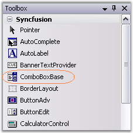
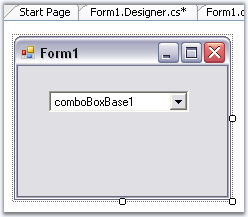
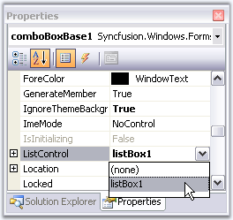
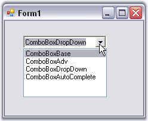
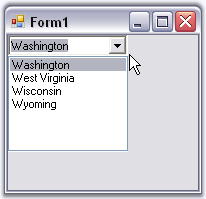

::: {style="DISPLAY: none"}
{#d2h_url_template}{#d2h_package_url style="WIDTH: 0px; DISPLAY: none; HEIGHT: 0px"}
:::

::: {.d2h_secondary_topic style="PADDING-BOTTOM: 10pt; MARGIN: 0pt; PADDING-LEFT: 0pt; PADDING-RIGHT: 0pt; PADDING-TOP: 0pt"}
##### Creating ComboBoxBase {#creating-comboboxbase style="tab-stops: 0pt"}

 

[]{#p410}ComboBoxBase can be created easily through designer, by just dragging and dropping the ComboBoxBase control from the Toolbox.

 

{border="0"}

***[]{style="COLOR: #15428b"}*** 

Figure 360: ComboBoxBase in Toolbox

[]{style="COLOR: #15428b"} 

[]{style="COLOR: #15428b"} 

{border="0"}

 

Figure 361**[: ComboBoxBase in Designer]{style="FONT-STYLE: normal"}**

**[]{style="COLOR: #15428b"}** 

To add data for the popup, add a listbox control to the form and select it in **ListControl** property.

[]{style="COLOR: #15428b"} 

{border="0"}

 

Figure 362: ListControl Property of ComboBoxBase

 

{border="0"}

***[]{style="COLOR: #15428b"}*** 

Figure 363: ComboBoxBase at Run Time

 

It can be created through code by following the below steps.

[]{style="COLOR: #15428b"} 

1.   Added Shared.Base to the reference folder through solution explorer and include the below namespace in the code.

[]{style="COLOR: #15428b"} 

+--------------------------------------------------------------------------------------------------------------------------------+
| **[\[C#\]]{style="FONT-FAMILY: 'Courier New'; COLOR: black"}**                                                                 |
|                                                                                                                                |
| []{style="COLOR: #15428b"}                                                                                                     |
|                                                                                                                                |
| [using ]{style="FONT-FAMILY: 'Courier New'; COLOR: blue"}[Syncfusion.Windows.Forms.Tools;]{style="FONT-FAMILY: 'Courier New'"} |
+--------------------------------------------------------------------------------------------------------------------------------+

[]{style="COLOR: #15428b"} 

+---------------------------------------------------------------------------------------------------------------------------------+
| **[\[VB.NET\]]{style="FONT-FAMILY: 'Courier New'; COLOR: black"}**                                                              |
|                                                                                                                                 |
| []{style="COLOR: #15428b"}                                                                                                      |
|                                                                                                                                 |
| [Imports]{style="FONT-FAMILY: 'Courier New'; COLOR: blue"}[ Syncfusion.Windows.Forms.Tools]{style="FONT-FAMILY: 'Courier New'"} |
+---------------------------------------------------------------------------------------------------------------------------------+

[]{style="COLOR: #15428b"} 

2.   Create an instance of the ComboBoxBase control and ListBox.

[]{style="COLOR: #15428b"} 

+---------------------------------------------------------------------------------------------------------------------------------------------------------------------------------------+
| **[\[C#\]]{style="FONT-FAMILY: 'Courier New'; COLOR: black"}**                                                                                                                        |
|                                                                                                                                                                                       |
| []{style="COLOR: #15428b"}                                                                                                                                                            |
|                                                                                                                                                                                       |
| [private]{style="FONT-FAMILY: 'Courier New'; COLOR: blue"}[ Syncfusion.Windows.Forms.Tools.ComboBoxBase comboBoxBase1;]{style="FONT-FAMILY: 'Courier New'"}                           |
|                                                                                                                                                                                       |
| [private]{style="FONT-FAMILY: 'Courier New'; COLOR: blue"}[ System.Windows.Forms.ListBox listBox1;]{style="FONT-FAMILY: 'Courier New'"}                                               |
|                                                                                                                                                                                       |
| []{style="FONT-FAMILY: 'Courier New'"}                                                                                                                                                |
|                                                                                                                                                                                       |
| [this]{style="FONT-FAMILY: 'Courier New'; COLOR: blue"}[.comboBoxBase1=[new]{style="COLOR: blue"} Syncfusion.Windows.Forms.Tools.ComboBoxBase();]{style="FONT-FAMILY: 'Courier New'"} |
|                                                                                                                                                                                       |
| [this]{style="FONT-FAMILY: 'Courier New'; COLOR: blue"}[.listBox1=[new]{style="COLOR: blue"} ListBox();]{style="FONT-FAMILY: 'Courier New'"}                                          |
+---------------------------------------------------------------------------------------------------------------------------------------------------------------------------------------+

[]{style="COLOR: #15428b"} 

+--------------------------------------------------------------------------------------------------------------------------------------------------------------------------------------+
| **[\[VB.NET\]]{style="FONT-FAMILY: 'Courier New'; COLOR: black"}**                                                                                                                   |
|                                                                                                                                                                                      |
| []{style="COLOR: #15428b"}                                                                                                                                                           |
|                                                                                                                                                                                      |
| [Private]{style="FONT-FAMILY: 'Courier New'; COLOR: blue"}[ comboBoxBase1 [As]{style="COLOR: blue"} Syncfusion.Windows.Forms.Tools.ComboBoxBase]{style="FONT-FAMILY: 'Courier New'"} |
|                                                                                                                                                                                      |
| [Private]{style="FONT-FAMILY: 'Courier New'; COLOR: blue"}[ listBox1 [As]{style="COLOR: blue"} System.Windows.Forms.ListBox]{style="FONT-FAMILY: 'Courier New'"}                     |
|                                                                                                                                                                                      |
| []{style="FONT-FAMILY: 'Courier New'"}                                                                                                                                               |
|                                                                                                                                                                                      |
| [Me]{style="FONT-FAMILY: 'Courier New'; COLOR: blue"}[.comboBoxBase1 = [New]{style="COLOR: blue"} Syncfusion.Windows.Forms.Tools.ComboBoxBase()]{style="FONT-FAMILY: 'Courier New'"} |
|                                                                                                                                                                                      |
| [Me]{style="FONT-FAMILY: 'Courier New'; COLOR: blue"}[.listBox1 = [New]{style="COLOR: blue"} ListBox()]{style="FONT-FAMILY: 'Courier New'"}                                          |
+--------------------------------------------------------------------------------------------------------------------------------------------------------------------------------------+

[]{style="COLOR: #15428b"} 

3.   Set the ListControl that will be used in the dropdown portion of ComboBoxBase and specify the size of ComboBoxBase.

[]{style="COLOR: #15428b"} 

+---------------------------------------------------------------------------------------------------------------------------------------------------------------+
| **[\[C#\]]{style="FONT-FAMILY: 'Courier New'; COLOR: black"}**                                                                                                |
|                                                                                                                                                               |
| []{style="COLOR: #15428b"}                                                                                                                                    |
|                                                                                                                                                               |
| [this]{style="FONT-FAMILY: 'Courier New'; COLOR: blue"}[.comboBoxBase1.ListControl=[this]{style="COLOR: blue"}.listBox1;]{style="FONT-FAMILY: 'Courier New'"} |
|                                                                                                                                                               |
| [this]{style="FONT-FAMILY: 'Courier New'; COLOR: blue"}[.comboBoxBase1.Size=[new]{style="COLOR: blue"} Size(120,20);]{style="FONT-FAMILY: 'Courier New'"}     |
+---------------------------------------------------------------------------------------------------------------------------------------------------------------+

[]{style="COLOR: #15428b"} 

+----------------------------------------------------------------------------------------------------------------------------------------------------------+
| **[\[VB.NET\]]{style="FONT-FAMILY: 'Courier New'; COLOR: black"}**                                                                                       |
|                                                                                                                                                          |
| []{style="COLOR: #15428b"}                                                                                                                               |
|                                                                                                                                                          |
| [Me]{style="FONT-FAMILY: 'Courier New'; COLOR: blue"}[.comboBoxBase1.ListControl=[Me]{style="COLOR: blue"}.listBox1]{style="FONT-FAMILY: 'Courier New'"} |
|                                                                                                                                                          |
| [Me]{style="FONT-FAMILY: 'Courier New'; COLOR: blue"}[.comboBoxBase1.Size = [New]{style="COLOR: blue"} Size(120,20)]{style="FONT-FAMILY: 'Courier New'"} |
+----------------------------------------------------------------------------------------------------------------------------------------------------------+

[]{style="COLOR: #15428b"} 

4.   Specify the datasource.

[]{style="COLOR: #15428b"} 

+------------------------------------------------------------------------------------------------------------------------------------------------------------------------------------------------------------+
| **[\[C#\]]{style="FONT-FAMILY: 'Courier New'; COLOR: black"}**                                                                                                                                             |
|                                                                                                                                                                                                            |
| **[]{style="FONT-FAMILY: 'Courier New'; COLOR: black"}**                                                                                                                                                   |
|                                                                                                                                                                                                            |
| [// Sets the datasource.]{style="FONT-FAMILY: 'Courier New'; COLOR: green"}                                                                                                                                |
|                                                                                                                                                                                                            |
| [ArrayList USStates = ]{style="FONT-FAMILY: 'Courier New'; COLOR: black"}[new]{style="FONT-FAMILY: 'Courier New'; COLOR: blue"}[ ArrayList(); ]{style="FONT-FAMILY: 'Courier New'; COLOR: black"}          |
|                                                                                                                                                                                                            |
| [\                                                                                                                                                                                                         |
| USStates.Add(]{style="FONT-FAMILY: 'Courier New'; COLOR: black"}[new]{style="FONT-FAMILY: 'Courier New'; COLOR: blue"}[ USState(\"Washington\", \"WA\"));\                                                 |
| USStates.Add(]{style="FONT-FAMILY: 'Courier New'; COLOR: black"}[new]{style="FONT-FAMILY: 'Courier New'; COLOR: blue"}[ USState(\"West Virginia\", \"WV\"));\                                              |
| USStates.Add(]{style="FONT-FAMILY: 'Courier New'; COLOR: black"}[new]{style="FONT-FAMILY: 'Courier New'; COLOR: blue"}[ USState(\"Wisconsin\", \"WI\"));\                                                  |
| USStates.Add(]{style="FONT-FAMILY: 'Courier New'; COLOR: black"}[new]{style="FONT-FAMILY: 'Courier New'; COLOR: blue"}[ USState(\"Wyoming\", \"WY\")); ]{style="FONT-FAMILY: 'Courier New'; COLOR: black"} |
|                                                                                                                                                                                                            |
| [\                                                                                                                                                                                                         |
| ListBox1.DataSource = USStates; ]{style="FONT-FAMILY: 'Courier New'; COLOR: black"}                                                                                                                        |
+------------------------------------------------------------------------------------------------------------------------------------------------------------------------------------------------------------+

[]{style="COLOR: #15428b"} 

+------------------------------------------------------------------------------------------------------------------------------------------------------------------------------------------------------------------------------------------------------------------------------------------------------------------------------------------------------------------+
| **[\[VB.NET\]]{style="FONT-FAMILY: 'Courier New'; COLOR: black"}**                                                                                                                                                                                                                                                                                               |
|                                                                                                                                                                                                                                                                                                                                                                  |
| **[]{style="FONT-FAMILY: 'Courier New'; COLOR: black"}**                                                                                                                                                                                                                                                                                                         |
|                                                                                                                                                                                                                                                                                                                                                                  |
| [\' Sets the datasource.]{style="FONT-FAMILY: 'Courier New'; COLOR: green"}                                                                                                                                                                                                                                                                                      |
|                                                                                                                                                                                                                                                                                                                                                                  |
| [Dim]{style="FONT-FAMILY: 'Courier New'; COLOR: blue"}[ USStates ]{style="FONT-FAMILY: 'Courier New'; COLOR: black"}[As]{style="FONT-FAMILY: 'Courier New'; COLOR: blue"}[ ArrayList = ]{style="FONT-FAMILY: 'Courier New'; COLOR: black"}[New]{style="FONT-FAMILY: 'Courier New'; COLOR: blue"}[ ArrayList()]{style="FONT-FAMILY: 'Courier New'; COLOR: black"} |
|                                                                                                                                                                                                                                                                                                                                                                  |
| []{style="FONT-FAMILY: 'Courier New'; COLOR: black"}                                                                                                                                                                                                                                                                                                             |
|                                                                                                                                                                                                                                                                                                                                                                  |
| [USStates.Add(]{style="FONT-FAMILY: 'Courier New'; COLOR: black"}[New]{style="FONT-FAMILY: 'Courier New'; COLOR: blue"}[ USState(\"Washington\", \"WA\"))]{style="FONT-FAMILY: 'Courier New'; COLOR: black"}                                                                                                                                                     |
|                                                                                                                                                                                                                                                                                                                                                                  |
| [USStates.Add(]{style="FONT-FAMILY: 'Courier New'; COLOR: black"}[New]{style="FONT-FAMILY: 'Courier New'; COLOR: blue"}[ USState(\"West Virginia\", \"WV\"))]{style="FONT-FAMILY: 'Courier New'; COLOR: black"}                                                                                                                                                  |
|                                                                                                                                                                                                                                                                                                                                                                  |
| [USStates.Add(]{style="FONT-FAMILY: 'Courier New'; COLOR: black"}[New]{style="FONT-FAMILY: 'Courier New'; COLOR: blue"}[ USState(\"Wisconsin\", \"WI\"))]{style="FONT-FAMILY: 'Courier New'; COLOR: black"}                                                                                                                                                      |
|                                                                                                                                                                                                                                                                                                                                                                  |
| [USStates.Add(]{style="FONT-FAMILY: 'Courier New'; COLOR: black"}[New]{style="FONT-FAMILY: 'Courier New'; COLOR: blue"}[ USState(\"Wyoming\", \"WY\"))]{style="FONT-FAMILY: 'Courier New'; COLOR: black"}                                                                                                                                                        |
|                                                                                                                                                                                                                                                                                                                                                                  |
| []{style="FONT-FAMILY: 'Courier New'; COLOR: black"}                                                                                                                                                                                                                                                                                                             |
|                                                                                                                                                                                                                                                                                                                                                                  |
| [ListBox1.DataSource = USStates]{style="FONT-FAMILY: 'Courier New'; COLOR: black"}                                                                                                                                                                                                                                                                               |
+------------------------------------------------------------------------------------------------------------------------------------------------------------------------------------------------------------------------------------------------------------------------------------------------------------------------------------------------------------------+

[]{style="COLOR: #15428b"} 

5.   Finally add ComboBoxBase and Listbox to the Form.

[]{style="COLOR: #15428b"} 

+--------------------------------------------------------------------------------------------------------------------------------------------------------+
| **[\[C#\]]{style="FONT-FAMILY: 'Courier New'; COLOR: black"}**                                                                                         |
|                                                                                                                                                        |
| []{style="COLOR: #15428b"}                                                                                                                             |
|                                                                                                                                                        |
| [this]{style="FONT-FAMILY: 'Courier New'; COLOR: blue"}[.Controls.Add([this]{style="COLOR: blue"}.listBox1);]{style="FONT-FAMILY: 'Courier New'"}      |
|                                                                                                                                                        |
| [this]{style="FONT-FAMILY: 'Courier New'; COLOR: blue"}[.Controls.Add([this]{style="COLOR: blue"}.comboBoxBase1);]{style="FONT-FAMILY: 'Courier New'"} |
+--------------------------------------------------------------------------------------------------------------------------------------------------------+

[]{style="COLOR: #15428b"} 

+---------------------------------------------------------------------------------------------------------------------------------------------------+
| **[\[VB.NET\]]{style="FONT-FAMILY: 'Courier New'; COLOR: black"}**                                                                                |
|                                                                                                                                                   |
| []{style="COLOR: #15428b"}                                                                                                                        |
|                                                                                                                                                   |
| [Me]{style="FONT-FAMILY: 'Courier New'; COLOR: blue"}[.Controls.Add([Me]{style="COLOR: blue"}.listBox1)]{style="FONT-FAMILY: 'Courier New'"}      |
|                                                                                                                                                   |
| [Me]{style="FONT-FAMILY: 'Courier New'; COLOR: blue"}[.Controls.Add([Me]{style="COLOR: blue"}.comboBoxBase1)]{style="FONT-FAMILY: 'Courier New'"} |
+---------------------------------------------------------------------------------------------------------------------------------------------------+

 

{border="0"}

***[]{style="COLOR: #15428b"}*** 

Figure 364: ComboBoxBase with External DataSource

**[]{style="COLOR: #15428b"}** 

**[]{style="COLOR: #15428b"}** 

Refer [Creating ListControl-Derived Controls]{style="COLOR: blue"} about ListControl-Derived controls in detail.

[]{#related-topics}
:::
