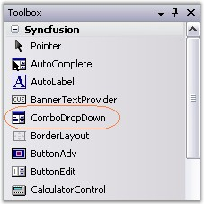
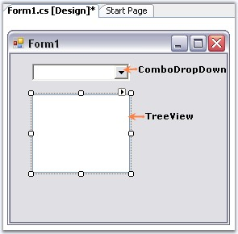
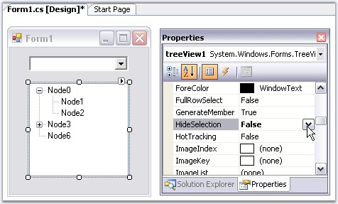
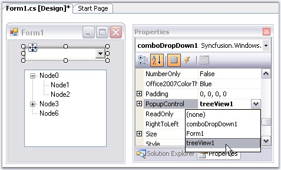

::: {style="DISPLAY: none"}
{#d2h_url_template}{#d2h_package_url style="WIDTH: 0px; DISPLAY: none; HEIGHT: 0px"}
:::

::::: {.d2h_secondary_topic style="PADDING-BOTTOM: 10pt; MARGIN: 0pt; PADDING-LEFT: 0pt; PADDING-RIGHT: 0pt; PADDING-TOP: 0pt"}
##### Creating ComboDropDown[]{#p372} {#creating-combodropdown style="tab-stops: 0pt"}

[]{style="COLOR: #15428b"} 

In this section, ComboDropDown is used to host TreeView control and this can be achieved in the following ways.

[]{style="COLOR: #15428b"} 

###### []{#p373}3.3.5.1.2.1 Through Designer {#through-designer style="tab-stops: 0pt"}

[]{style="COLOR: #15428b"} 

This section will guide you to create a ComboDropDown control through designer and associate a TreeView control as its popup.

 

The below steps will guide you with this.

[]{style="COLOR: #15428b"} 

1.   Create a new Visual C# application or VB.NET application in Visual Studio .NET.

[]{style="COLOR: #15428b"} 

{border="0"}

[]{style="COLOR: #15428b"} 

Figure 330: ComboDropDown in Toolbox

[]{style="COLOR: #15428b"} 

2.   Drag and drop a ComboDropDown control, TreeView control from the toolbox onto the form.

[]{style="COLOR: #15428b"} 

{border="0"}

[]{style="COLOR: #15428b"} 

Figure 331: ComboDropDown and TreeView Control in the Windows Form

[]{style="COLOR: #15428b"} 

3.   Add nodes to the TreeView control and set HideSelection property to false. The HideSelection property specifies whether the selected tree node remains highlighted even when the tree view has lost the focus.

[]{style="COLOR: #15428b"} 

{border="0"}

[]{style="COLOR: #15428b"} 

Figure 332: Setting TreeView Control HideSelection Property

[]{style="COLOR: #15428b"} 

4.   Now set the ComboDropDown\'s **PopupControl** property to be the above TreeView instance.

[]{style="COLOR: #15428b"} 

{border="0"}

[]{style="COLOR: #15428b"} 

Figure 333: Associating TreeView control as Popup of ComboDropDown Control

**[]{style="COLOR: #15428b"}** 

::: {style="BORDER-BOTTOM: windowtext 1pt solid; BORDER-LEFT: medium none; PADDING-BOTTOM: 1pt; MARGIN-TOP: 9pt; PADDING-LEFT: 0pt; PADDING-RIGHT: 0pt; MARGIN-BOTTOM: 9pt; BORDER-TOP: windowtext 1pt solid; BORDER-RIGHT: medium none; PADDING-TOP: 1pt"}
{border="0"} Note: We can also include code to set up the interaction between the combo and the treeview control. Refer Setting Interaction between ComboDropDown and TreeView.[]{style="COLOR: black"}
:::

[]{style="COLOR: #15428b"} 

See also[ ]{style="COLOR: black; FONT-SIZE: 8pt"}

[]{style="COLOR: blue"} 

[Concepts and Features]{.UGHyperlink}[]{.UGHyperlink}

 

###### []{#p374}3.3.5.1.2.2 Through Code {#through-code style="tab-stops: 0pt"}

[]{style="COLOR: #15428b"} 

Drag and drop the TreeView control which will be used in the drop-down portion of ComboDropDown control.

[]{style="COLOR: #15428b"} 

1.   Include the required namespace.

[]{style="COLOR: #15428b"} 

+--------------------------------------------------------------------------------------------------------------------------------+
| **[\[C#\]]{style="FONT-FAMILY: 'Courier New'; COLOR: black"}**                                                                 |
|                                                                                                                                |
| []{style="COLOR: #15428b"}                                                                                                     |
|                                                                                                                                |
| [using ]{style="FONT-FAMILY: 'Courier New'; COLOR: blue"}[Syncfusion.Windows.Forms.Tools;]{style="FONT-FAMILY: 'Courier New'"} |
+--------------------------------------------------------------------------------------------------------------------------------+

[]{style="COLOR: #15428b"} 

+---------------------------------------------------------------------------------------------------------------------------------+
| **[\[VB.NET\]]{style="FONT-FAMILY: 'Courier New'; COLOR: black"}**                                                              |
|                                                                                                                                 |
| []{style="COLOR: #15428b"}                                                                                                      |
|                                                                                                                                 |
| [Imports]{style="FONT-FAMILY: 'Courier New'; COLOR: blue"}[ Syncfusion.Windows.Forms.Tools]{style="FONT-FAMILY: 'Courier New'"} |
+---------------------------------------------------------------------------------------------------------------------------------+

[]{style="COLOR: #15428b"} 

2.   Create an instance of the ComboDropDown control class.

[]{style="COLOR: #15428b"} 

+-----------------------------------------------------------------------------------------------------------------------------------------------------------------------------------------+
| **[\[C#\]]{style="FONT-FAMILY: 'Courier New'; COLOR: black"}**                                                                                                                          |
|                                                                                                                                                                                         |
| []{style="COLOR: #15428b"}                                                                                                                                                              |
|                                                                                                                                                                                         |
| [private]{style="FONT-FAMILY: 'Courier New'; COLOR: blue"}[ Syncfusion.Windows.Forms.Tools.ComboDropDown comboDropDown1;]{style="FONT-FAMILY: 'Courier New'"}                           |
|                                                                                                                                                                                         |
| [this]{style="FONT-FAMILY: 'Courier New'; COLOR: blue"}[.comboDropDown1=[new]{style="COLOR: blue"} Syncfusion.Windows.Forms.Tools.ComboDropDown();]{style="FONT-FAMILY: 'Courier New'"} |
+-----------------------------------------------------------------------------------------------------------------------------------------------------------------------------------------+

[]{style="COLOR: #15428b"} 

+----------------------------------------------------------------------------------------------------------------------------------------------------------------------------------------+
| **[\[VB.NET\]]{style="FONT-FAMILY: 'Courier New'; COLOR: black"}**                                                                                                                     |
|                                                                                                                                                                                        |
| []{style="COLOR: #15428b"}                                                                                                                                                             |
|                                                                                                                                                                                        |
| [Private]{style="FONT-FAMILY: 'Courier New'; COLOR: blue"}[ comboDropDown1 [As]{style="COLOR: blue"} Syncfusion.Windows.Forms.Tools.ComboDropDown]{style="FONT-FAMILY: 'Courier New'"} |
|                                                                                                                                                                                        |
| [Me]{style="FONT-FAMILY: 'Courier New'; COLOR: blue"}[.comboDropDown1 = [New]{style="COLOR: blue"} Syncfusion.Windows.Forms.Tools.ComboDropDown()]{style="FONT-FAMILY: 'Courier New'"} |
+----------------------------------------------------------------------------------------------------------------------------------------------------------------------------------------+

[]{style="COLOR: #15428b"} 

3.   Add TreeView in the drop-down portion of ComboDropDown. Finally add ComboDropDown to the Form.

[]{style="COLOR: #15428b"} 

+------------------------------------------------------------------------------------------------------------------------------------------------------------------+
| **[\[C#\]]{style="FONT-FAMILY: 'Courier New'; COLOR: black"}**                                                                                                   |
|                                                                                                                                                                  |
| []{style="COLOR: #15428b"}                                                                                                                                       |
|                                                                                                                                                                  |
| [this]{style="FONT-FAMILY: 'Courier New'; COLOR: blue"}[.comboDropDown1.PopupControl=[this]{style="COLOR: blue"}.treeView1;]{style="FONT-FAMILY: 'Courier New'"} |
|                                                                                                                                                                  |
| [this]{style="FONT-FAMILY: 'Courier New'; COLOR: blue"}[.Controls.Add([this]{style="COLOR: blue"}.comboDropDown1);]{style="FONT-FAMILY: 'Courier New'"}          |
+------------------------------------------------------------------------------------------------------------------------------------------------------------------+

[]{style="COLOR: #15428b"} 

+-------------------------------------------------------------------------------------------------------------------------------------------------------------+
| **[\[VB.NET\]]{style="FONT-FAMILY: 'Courier New'; COLOR: black"}**                                                                                          |
|                                                                                                                                                             |
| []{style="COLOR: #15428b"}                                                                                                                                  |
|                                                                                                                                                             |
| [Me]{style="FONT-FAMILY: 'Courier New'; COLOR: blue"}[.comboDropDown1.PopupControl=[Me]{style="COLOR: blue"}.treeView1]{style="FONT-FAMILY: 'Courier New'"} |
|                                                                                                                                                             |
| [Me]{style="FONT-FAMILY: 'Courier New'; COLOR: blue"}[.Controls.Add([Me]{style="COLOR: blue"}.comboDropDown1)]{style="FONT-FAMILY: 'Courier New'"}          |
+-------------------------------------------------------------------------------------------------------------------------------------------------------------+

[]{style="COLOR: #15428b"} 

::: {style="BORDER-BOTTOM: windowtext 1pt solid; BORDER-LEFT: medium none; PADDING-BOTTOM: 1pt; MARGIN-TOP: 9pt; PADDING-LEFT: 0pt; PADDING-RIGHT: 0pt; MARGIN-BOTTOM: 9pt; BORDER-TOP: windowtext 1pt solid; BORDER-RIGHT: medium none; PADDING-TOP: 1pt"}
{border="0"} Note:[ ]{style="COLOR: black; FONT-SIZE: 8pt"}Refer Setting Interaction between ComboDropDown and TreeView[ ]{style="COLOR: black"}to set the interaction between the ComboDropDown and Treeview.
:::

[]{style="COLOR: #15428b"} 

See also

[]{style="COLOR: blue"} 

[Concepts and Features]{.UGHyperlink}[]{.UGHyperlink}

[]{#related-topics}
:::::
