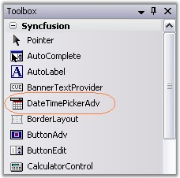
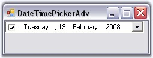

::: {style="DISPLAY: none"}
{#d2h_url_template}{#d2h_package_url style="WIDTH: 0px; DISPLAY: none; HEIGHT: 0px"}
:::

::: {.d2h_secondary_topic style="PADDING-BOTTOM: 10pt; MARGIN: 0pt; PADDING-LEFT: 0pt; PADDING-RIGHT: 0pt; PADDING-TOP: 0pt"}
##### Creating DateTimePickerAdv {#creating-datetimepickeradv style="tab-stops: 0pt"}

**[]{style="COLOR: #15428b"}** 

DateTimePickerAdv control provides full support for the Windows Forms designer. To use a DateTimePickerAdv control in your application, all you need to do is drag and drop a DateTimePickerAdv control from the controls toolbox onto your form. You can then set any of its properties through the property grid.

[]{style="COLOR: #15428b"} 

{border="0"}

[]{style="COLOR: #15428b"} 

Figure 249: DateTimePicker in Toolbox

[]{style="COLOR: #15428b"} 

The DateTimePickerAdv can be created programmatically through code as detailed below.

[]{style="COLOR: #15428b"} 

1.   Include the required namespace.

[]{style="COLOR: #15428b"} 

+--------------------------------------------------------------------------------------------------------------------------------+
| **[\[C#\]]{style="FONT-FAMILY: 'Courier New'; COLOR: black"}**                                                                 |
|                                                                                                                                |
| []{style="COLOR: #15428b"}                                                                                                     |
|                                                                                                                                |
| [using ]{style="FONT-FAMILY: 'Courier New'; COLOR: blue"}[Syncfusion.Windows.Forms.Tools;]{style="FONT-FAMILY: 'Courier New'"} |
+--------------------------------------------------------------------------------------------------------------------------------+

[]{style="COLOR: #15428b"} 

+---------------------------------------------------------------------------------------------------------------------------------+
| **[\[VB.NET\]]{style="FONT-FAMILY: 'Courier New'; COLOR: black"}**                                                              |
|                                                                                                                                 |
| []{style="COLOR: #15428b"}                                                                                                      |
|                                                                                                                                 |
| [Imports]{style="FONT-FAMILY: 'Courier New'; COLOR: blue"}[ Syncfusion.Windows.Forms.Tools]{style="FONT-FAMILY: 'Courier New'"} |
+---------------------------------------------------------------------------------------------------------------------------------+

[]{style="COLOR: #15428b"} 

2.   Create an instance of DateTimePickerAdv. Add that instance to the Form.

[]{style="COLOR: #15428b"} 

+-------------------------------------------------------------------------------------------------------------------------------------------------------------------------------------------------+
| **[\[C#\]]{style="FONT-FAMILY: 'Courier New'; COLOR: black"}**                                                                                                                                  |
|                                                                                                                                                                                                 |
| []{style="COLOR: #15428b"}                                                                                                                                                                      |
|                                                                                                                                                                                                 |
| [private]{style="FONT-FAMILY: 'Courier New'; COLOR: blue"}[ Syncfusion.Windows.Forms.Tools.[DateTimePickerAdv]{style="COLOR: teal"} dateTimePickerAdv1;]{style="FONT-FAMILY: 'Courier New'"}    |
|                                                                                                                                                                                                 |
| [this]{style="FONT-FAMILY: 'Courier New'; COLOR: blue"}[.dateTimePickerAdv1=[new]{style="COLOR: blue"} Syncfusion.Windows.Forms.Tools.DateTimePickerAdv();]{style="FONT-FAMILY: 'Courier New'"} |
|                                                                                                                                                                                                 |
| [this]{style="FONT-FAMILY: 'Courier New'; COLOR: blue"}[.Controls.Add([this]{style="COLOR: blue"}.dateTimePickerAdv1);]{style="FONT-FAMILY: 'Courier New'"}                                     |
+-------------------------------------------------------------------------------------------------------------------------------------------------------------------------------------------------+

[]{style="COLOR: #15428b"} 

+------------------------------------------------------------------------------------------------------------------------------------------------------------------------------------------------+
| **[\[VB.NET\]]{style="FONT-FAMILY: 'Courier New'; COLOR: black"}**                                                                                                                             |
|                                                                                                                                                                                                |
| []{style="COLOR: #15428b"}                                                                                                                                                                     |
|                                                                                                                                                                                                |
| [Private]{style="FONT-FAMILY: 'Courier New'; COLOR: blue"}[ dateTimePickerAdv1 [As]{style="COLOR: blue"} Syncfusion.Windows.Forms.Tools.DateTimePickerAdv]{style="FONT-FAMILY: 'Courier New'"} |
|                                                                                                                                                                                                |
| [Me]{style="FONT-FAMILY: 'Courier New'; COLOR: blue"}[.dateTimePickerAdv1 = [New]{style="COLOR: blue"} Syncfusion.Windows.Forms.Tools.DateTimePickerAdv()]{style="FONT-FAMILY: 'Courier New'"} |
|                                                                                                                                                                                                |
| [Me]{style="FONT-FAMILY: 'Courier New'; COLOR: blue"}[.Controls.Add([Me]{style="COLOR: blue"}.dateTimePickerAdv1)]{style="FONT-FAMILY: 'Courier New'"}                                         |
+------------------------------------------------------------------------------------------------------------------------------------------------------------------------------------------------+

[]{style="COLOR: #15428b"} 

{border="0"}

[]{style="COLOR: #15428b"} 

Figure 250: DateTimePickerAdv Created Programmatically

[]{style="COLOR: #15428b"} 

See Also

[]{style="COLOR: #15428b"} 

[Concepts and Features]{.UGHyperlink}[]{.UGHyperlink}

[]{#related-topics}
:::
