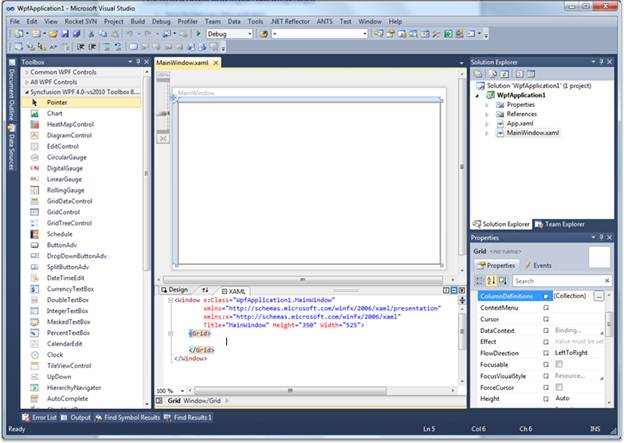
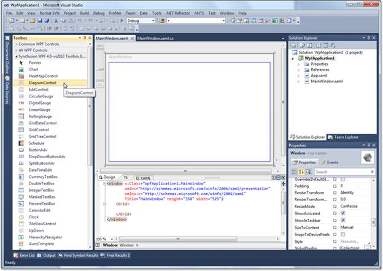
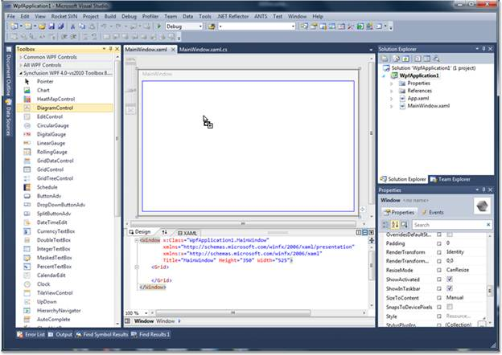
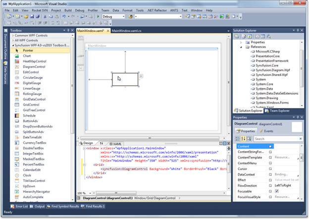

::: {style="DISPLAY: none"}
{#d2h_url_template}{#d2h_package_url style="WIDTH: 0px; DISPLAY: none; HEIGHT: 0px"}
:::

::::: {#nsbanner .d2h_main_nsbanner style="BORDER-BOTTOM: #999999 1px solid; POSITION: relative; PADDING-BOTTOM: 0px; BACKGROUND-COLOR: transparent; PADDING-LEFT: 0px; PADDING-RIGHT: 0px; DISPLAY: none; BORDER-TOP: #999999 1px solid; PADDING-TOP: 0px; LEFT: 0px"}
:::: {#TitleRow .d2h_main_titlerow style="PADDING-BOTTOM: 4px; BACKGROUND-COLOR: transparent; PADDING-LEFT: 22px; WIDTH: 100%; PADDING-RIGHT: 10px; DISPLAY: none; PADDING-TOP: 4px"}
::: {#ienav .d2h_main_ienav style="DISPLAY: none"}
{#D2HPrevious .D2HPreviousEnabled}  {#D2HNext .D2HNextEnabled}
:::
::::
:::::

:::: {#nstext .d2h_main_nstext style="PADDING-BOTTOM: 10px; BACKGROUND-COLOR: transparent; PADDING-LEFT: 22px; PADDING-RIGHT: 10px; HEIGHT: 100%; OVERFLOW: auto; PADDING-TOP: 5px" hasuserbackground="true" valign="bottom"}
::: {#d2h_breadcrumbs .d2h_breadcrumbs}
[Essential Studio User Guide Documentation](ms-xhelp:///?Id=12457748-09e3-4d74-a240-8e049cedf030){.d2h_breadcrumbsNormal}[ \> ]{.d2h_breadcrumbsLinkSeparator}[User Interface Edition](ms-xhelp:///?Id=c29296b7-531c-413b-a0ec-488ca1f7f669){.d2h_breadcrumbsNormal}[ \> ]{.d2h_breadcrumbsLinkSeparator}[Essential WPF](ms-xhelp:///?Id=7f4f82c5-151c-4262-94d0-75c4626c77bc){.d2h_breadcrumbsNormal}[ \> ]{.d2h_breadcrumbsLinkSeparator}[Essential Diagram]{.d2h_breadcrumbsContentsOnly}[ \> ]{.d2h_breadcrumbsLinkSeparator}[Getting Started](ms-xhelp:///?Id=c37538af-02be-40ac-bc8d-eef94f6fd0ed){.d2h_breadcrumbsNormal}[ \> ]{.d2h_breadcrumbsLinkSeparator}[Creating a Diagram](ms-xhelp:///?Id=e0b230dc-c754-4d57-8e86-d18830e36ce4){.d2h_breadcrumbsNormal}
:::

### Creating Diagram control through Designer {#creating-diagram-control-through-designer style="tab-stops: 0pt"}

The Diagram Control can be added to the application using designer.

Following are the steps to create Diagram Control through Designer.

1.   Open the XAML page of the application

[]{style="FONT-FAMILY: 'Trebuchet MS','sans-serif'; COLOR: #15428b; FONT-SIZE: 9pt"} 

{border="0"}

Figure 15: XAML page of the application

[]{style="FONT-FAMILY: 'Trebuchet MS','sans-serif'; COLOR: #15428b; FONT-SIZE: 9pt"} 

2.   Select Diagram Control from ToolBox.\
\

{border="0"}

Figure 16: Diagram Control in ToolBox

 

3.   Drag the Diagram Control onto the Designer.\
\

{border="0"}

Figure 17: Draging Diagram Control onto the designer

 

4.   DiagramControl is added to the Page and also the assembly reference is added to the **Project** file.\
\

{border="0"}

Figure 18: DiagramControl added to the page

 

Kindly refer to [[Add Diagram Model to the Diagram Control]{.UGHyperlink}](ms-xhelp:///?Id=019e5eae-0a82-4383-bd86-6caa393bb7c8) and [[Add Diagram View to the Diagram Control]{.UGHyperlink}](ms-xhelp:///?Id=4dc43809-1baa-4563-9d49-0e870cf6fdc6) to add the model and view to the control.

[]{#related-topics}
::::
