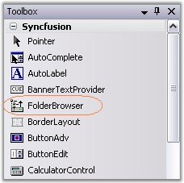
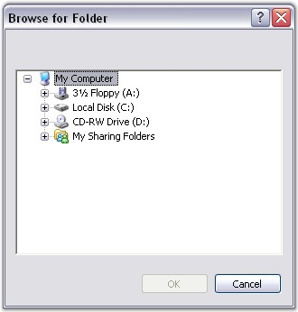

::: {style="DISPLAY: none"}
{#d2h_url_template}{#d2h_package_url style="WIDTH: 0px; DISPLAY: none; HEIGHT: 0px"}
:::

::: {.d2h_secondary_topic style="PADDING-BOTTOM: 10pt; MARGIN: 0pt; PADDING-LEFT: 0pt; PADDING-RIGHT: 0pt; PADDING-TOP: 0pt"}
##### Creating FolderBrowser {#creating-folderbrowser style="tab-stops: 0pt"}

[]{style="COLOR: #15428b"} 

FolderBrowser control can be created in the following ways.

[]{style="COLOR: #15428b"} 

###### []{#_Through_Designer_6}3.3.7.1.2.1 Through Designer []{#p493} {#through-designer style="tab-stops: 0pt"}

[]{style="COLOR: #15428b"} 

The designer based approach for creating and initializing the FolderBrowser component is shown below.

[]{style="COLOR: #15428b"} 

1.   Select the **FolderBrowser** control from the Visual Studio .NET toolbox window and drop it onto the design form. An instance of the FolderBrowser component will be added to the design form\'s component tray.

[]{style="COLOR: #15428b"} 

{border="0"}

Figure 429: FolderBrowser in Toolbox

[]{style="COLOR: #15428b"} 

2.   Select a suitable value for the **FolderBrowser.StartLocation** property from the enumerator list provided by the property grid. This specifies the location at which browsing should be started in the folder hierarchy. This property is the functional equivalent of the **Win32 PIDL**\'**s.**

 

3.   Specify an appropriate value for the **FolderBrowser.Style** property. The **FolderBrowserStyles** enumeration specifies various options for the FolderBrowser Dialog.

 

4.   To display the FolderBrowser window, simply invoke the **FolderBrowser.ShowDialog()** method from within your application\'s code.

[]{style="COLOR: #15428b"} 

This method is a modal function and if the return code indicates success, the **FolderBrowser.DirectoryPath** property may be used to access the selected folder.

[]{style="COLOR: #15428b"} 

+----------------------------------------------------------------------------------------------------------------------------+
| **[\[C#\]]{style="FONT-FAMILY: 'Courier New'; COLOR: black"}**                                                             |
|                                                                                                                            |
| []{style="FONT-FAMILY: 'Courier New'; COLOR: black"}                                                                       |
|                                                                                                                            |
| [this]{style="FONT-FAMILY: 'Courier New'; COLOR: blue"}[.folderBrowser1.ShowDialog();]{style="FONT-FAMILY: 'Courier New'"} |
+----------------------------------------------------------------------------------------------------------------------------+

[]{style="COLOR: #15428b"} 

+-------------------------------------------------------------------------------------------------------------------------+
| **[\[VB.NET\]]{style="FONT-FAMILY: 'Courier New'; COLOR: black"}**                                                      |
|                                                                                                                         |
| []{style="FONT-FAMILY: 'Courier New'; COLOR: black"}                                                                    |
|                                                                                                                         |
| [Me]{style="FONT-FAMILY: 'Courier New'; COLOR: blue"}[.folderBrowser1.ShowDialog()]{style="FONT-FAMILY: 'Courier New'"} |
+-------------------------------------------------------------------------------------------------------------------------+

[]{style="COLOR: #15428b"} 

{border="0"}

Figure 430: FolderBrowser created Through Designer

[]{style="COLOR: #15428b"} 

See Also

[]{style="COLOR: #15428b"} 

[Through Code]{.UGHyperlink}[]{.UGHyperlink}

###### []{#p494}3.3.7.1.2.2 Through Code {#through-code style="tab-stops: 0pt"}

[]{style="COLOR: #15428b"} 

The programmatic approach for using the FolderBrowser component is shown below.

[]{style="COLOR: #15428b"} 

1.   Create an instance of the FolderBrowser component.

[]{style="COLOR: #15428b"} 

+-----------------------------------------------------------------------------------------------------------------------------------------------------------------------------------------------------------------------------------------------------+
| **[\[C#\]]{style="FONT-FAMILY: 'Courier New'; COLOR: black"}**                                                                                                                                                                                      |
|                                                                                                                                                                                                                                                     |
| []{style="FONT-FAMILY: 'Courier New'; COLOR: black"}                                                                                                                                                                                                |
|                                                                                                                                                                                                                                                     |
| [// Declare the FolderBrowser component.]{style="FONT-FAMILY: 'Courier New'; COLOR: green"}                                                                                                                                                         |
|                                                                                                                                                                                                                                                     |
| [private]{style="FONT-FAMILY: 'Courier New'; COLOR: blue"}[ Syncfusion.Windows.Forms.[FolderBrowser]{style="COLOR: #2b91af"} folderBrowser1;]{style="FONT-FAMILY: 'Courier New'"}                                                                   |
|                                                                                                                                                                                                                                                     |
| []{style="FONT-FAMILY: 'Courier New'; COLOR: black"}                                                                                                                                                                                                |
|                                                                                                                                                                                                                                                     |
| [// Create an instance of the FolderBrowser component.]{style="FONT-FAMILY: 'Courier New'; COLOR: green"}                                                                                                                                           |
|                                                                                                                                                                                                                                                     |
| [this]{style="FONT-FAMILY: 'Courier New'; COLOR: blue"}[.folderBrowser1 = [new]{style="COLOR: blue"} Syncfusion.Windows.Forms.[FolderBrowser]{style="COLOR: #2b91af"}([this]{style="COLOR: blue"}.components);]{style="FONT-FAMILY: 'Courier New'"} |
+-----------------------------------------------------------------------------------------------------------------------------------------------------------------------------------------------------------------------------------------------------+

[]{style="COLOR: #15428b"} 

+----------------------------------------------------------------------------------------------------------------------------------------------------------------------------------------------------------------------------------------------------------------------------------------------------------------------------------------------------------------------------------------------------+
| **[\[VB.NET\]]{style="FONT-FAMILY: 'Courier New'; COLOR: black"}**                                                                                                                                                                                                                                                                                                                                 |
|                                                                                                                                                                                                                                                                                                                                                                                                    |
| []{style="FONT-FAMILY: 'Courier New'; COLOR: black"}                                                                                                                                                                                                                                                                                                                                               |
|                                                                                                                                                                                                                                                                                                                                                                                                    |
| [\' Declare the FolderBrowser component.]{style="FONT-FAMILY: 'Courier New'; COLOR: green"}                                                                                                                                                                                                                                                                                                        |
|                                                                                                                                                                                                                                                                                                                                                                                                    |
| [Private]{style="FONT-FAMILY: 'Courier New'; COLOR: blue"}[ folderBrowser1 [As]{style="COLOR: blue"} Syncfusion.Windows.Forms.FolderBrowser]{style="FONT-FAMILY: 'Courier New'"}                                                                                                                                                                                                                   |
|                                                                                                                                                                                                                                                                                                                                                                                                    |
| []{style="FONT-FAMILY: 'Courier New'; COLOR: black"}                                                                                                                                                                                                                                                                                                                                               |
|                                                                                                                                                                                                                                                                                                                                                                                                    |
| [\' Create an instance of the FolderBrowser component.]{style="FONT-FAMILY: 'Courier New'; COLOR: green"}                                                                                                                                                                                                                                                                                          |
|                                                                                                                                                                                                                                                                                                                                                                                                    |
| [Me]{style="FONT-FAMILY: 'Courier New'; COLOR: blue"}[.folderBrowser1 = ]{style="FONT-FAMILY: 'Courier New'; COLOR: black"}[New]{style="FONT-FAMILY: 'Courier New'; COLOR: blue"}[ Syncfusion.Windows.Forms.FolderBrowser(]{style="FONT-FAMILY: 'Courier New'; COLOR: black"}[Me]{style="FONT-FAMILY: 'Courier New'; COLOR: blue"}[.components)]{style="FONT-FAMILY: 'Courier New'; COLOR: black"} |
+----------------------------------------------------------------------------------------------------------------------------------------------------------------------------------------------------------------------------------------------------------------------------------------------------------------------------------------------------------------------------------------------------+

[]{style="COLOR: #15428b"} 

2.   Set the FolderBrowser.StartLocation and FolderBrowser.Style property values.

[]{style="COLOR: #15428b"} 

+-----------------------------------------------------------------------------------------------------------------------------------------------------------------------------------------------------------------------------------------------------------------------------------------------------------------+
| **[\[C#\]]{style="FONT-FAMILY: 'Courier New'; COLOR: black"}**                                                                                                                                                                                                                                                  |
|                                                                                                                                                                                                                                                                                                                 |
| []{style="FONT-FAMILY: 'Courier New'; COLOR: black"}                                                                                                                                                                                                                                                            |
|                                                                                                                                                                                                                                                                                                                 |
| [// Specify the Start location.]{style="FONT-FAMILY: 'Courier New'; COLOR: green"}                                                                                                                                                                                                                              |
|                                                                                                                                                                                                                                                                                                                 |
| [this]{style="FONT-FAMILY: 'Courier New'; COLOR: blue"}[.folderBrowser1.StartLocation = Syncfusion.Windows.Forms.[FolderBrowserFolder]{style="COLOR: #2b91af"}.MyComputer;]{style="FONT-FAMILY: 'Courier New'"}                                                                                                 |
|                                                                                                                                                                                                                                                                                                                 |
| []{style="FONT-FAMILY: 'Courier New'; COLOR: black"}                                                                                                                                                                                                                                                            |
|                                                                                                                                                                                                                                                                                                                 |
| [// Specify the styles for the FolderBrowser Dialog.]{style="FONT-FAMILY: 'Courier New'; COLOR: green"}                                                                                                                                                                                                         |
|                                                                                                                                                                                                                                                                                                                 |
| [this]{style="FONT-FAMILY: 'Courier New'; COLOR: blue"}[.folderBrowser1.Style = (Syncfusion.Windows.Forms.[FolderBrowserStyles]{style="COLOR: #2b91af"}.RestrictToFilesystem \| Syncfusion.Windows.Forms.[FolderBrowserStyles]{style="COLOR: #2b91af"}.BrowseForComputer);]{style="FONT-FAMILY: 'Courier New'"} |
+-----------------------------------------------------------------------------------------------------------------------------------------------------------------------------------------------------------------------------------------------------------------------------------------------------------------+

[]{style="COLOR: #15428b"} 

+-----------------------------------------------------------------------------------------------------------------------------------------------------------------------------------------------------------------------------------------------------------------------------------------------------------------------------------------------------------------------------+
| **[\[VB.NET\]]{style="FONT-FAMILY: 'Courier New'; COLOR: black"}**                                                                                                                                                                                                                                                                                                          |
|                                                                                                                                                                                                                                                                                                                                                                             |
| []{style="FONT-FAMILY: 'Courier New'; COLOR: black"}                                                                                                                                                                                                                                                                                                                        |
|                                                                                                                                                                                                                                                                                                                                                                             |
| [\' Specify the Start location.]{style="FONT-FAMILY: 'Courier New'; COLOR: green"}                                                                                                                                                                                                                                                                                          |
|                                                                                                                                                                                                                                                                                                                                                                             |
| [Me]{style="FONT-FAMILY: 'Courier New'; COLOR: blue"}[.folderBrowser1.StartLocation = Syncfusion.Windows.Forms.FolderBrowserFolder.MyComputer]{style="FONT-FAMILY: 'Courier New'; COLOR: black"}                                                                                                                                                                            |
|                                                                                                                                                                                                                                                                                                                                                                             |
| []{style="FONT-FAMILY: 'Courier New'; COLOR: black"}                                                                                                                                                                                                                                                                                                                        |
|                                                                                                                                                                                                                                                                                                                                                                             |
| [\' Specify the styles for the FolderBrowser Dialog.]{style="FONT-FAMILY: 'Courier New'; COLOR: green"}                                                                                                                                                                                                                                                                     |
|                                                                                                                                                                                                                                                                                                                                                                             |
| [Me]{style="FONT-FAMILY: 'Courier New'; COLOR: blue"}[.folderBrowser1.Style = Syncfusion.Windows.Forms.FolderBrowserStyles.RestrictToFilesystem ]{style="FONT-FAMILY: 'Courier New'; COLOR: black"}[Or]{style="FONT-FAMILY: 'Courier New'; COLOR: blue"}[ Syncfusion.Windows.Forms.FolderBrowserStyles.BrowseForComputer]{style="FONT-FAMILY: 'Courier New'; COLOR: black"} |
+-----------------------------------------------------------------------------------------------------------------------------------------------------------------------------------------------------------------------------------------------------------------------------------------------------------------------------------------------------------------------------+

[]{style="COLOR: #15428b"} 

3.   Invoke the **FolderBrowser.ShowDialog()** method to display the FolderBrowser Dialog.

[]{style="COLOR: #15428b"} 

+----------------------------------------------------------------------------------------------------------------------------+
| **[\[C#\]]{style="FONT-FAMILY: 'Courier New'; COLOR: black"}**                                                             |
|                                                                                                                            |
| []{style="FONT-FAMILY: 'Courier New'; COLOR: black"}                                                                       |
|                                                                                                                            |
| [this]{style="FONT-FAMILY: 'Courier New'; COLOR: blue"}[.folderBrowser1.ShowDialog();]{style="FONT-FAMILY: 'Courier New'"} |
+----------------------------------------------------------------------------------------------------------------------------+

[]{style="COLOR: #15428b"} 

+-------------------------------------------------------------------------------------------------------------------------+
| **[\[VB.NET\]]{style="FONT-FAMILY: 'Courier New'; COLOR: black"}**                                                      |
|                                                                                                                         |
| []{style="FONT-FAMILY: 'Courier New'; COLOR: black"}                                                                    |
|                                                                                                                         |
| [Me]{style="FONT-FAMILY: 'Courier New'; COLOR: blue"}[.folderBrowser1.ShowDialog()]{style="FONT-FAMILY: 'Courier New'"} |
+-------------------------------------------------------------------------------------------------------------------------+

[]{style="COLOR: #15428b"} 

{border="0"}

Figure 431: FolderBrowser created Through Code

[]{style="COLOR: #15428b"} 

See Also

[]{style="COLOR: #15428b"} 

[[Through Designer]{.UGHyperlink}]()[]{.UGHyperlink}

[]{#related-topics}
:::
