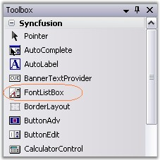
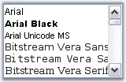

::: {style="DISPLAY: none"}
{#d2h_url_template}{#d2h_package_url style="WIDTH: 0px; DISPLAY: none; HEIGHT: 0px"}
:::

::: {.d2h_secondary_topic style="PADDING-BOTTOM: 10pt; MARGIN: 0pt; PADDING-LEFT: 0pt; PADDING-RIGHT: 0pt; PADDING-TOP: 0pt"}
##### Creating FontListBox {#creating-fontlistbox style="tab-stops: 0pt"}

[]{#p722} 

To use a FontListBox control in your application, all you need to do is drag and drop the FontListBox control from the toolbox onto your form.

[]{style="COLOR: #15428b"} 

{border="0"}

[]{style="COLOR: #15428b"} 

Figure 580: FontListBox in Toolbox

[]{style="COLOR: #15428b"} 

It can be created programmatically as follows.

[]{style="COLOR: #15428b"} 

5.   Include the required namespace.

[]{style="COLOR: #15428b"} 

+--------------------------------------------------------------------------------------------------------------------------------+
| **[\[C#\]]{style="FONT-FAMILY: 'Courier New'; COLOR: black"}**                                                                 |
|                                                                                                                                |
| []{style="COLOR: #15428b"}                                                                                                     |
|                                                                                                                                |
| [using ]{style="FONT-FAMILY: 'Courier New'; COLOR: blue"}[Syncfusion.Windows.Forms.Tools;]{style="FONT-FAMILY: 'Courier New'"} |
+--------------------------------------------------------------------------------------------------------------------------------+

[]{style="COLOR: #15428b"} 

+---------------------------------------------------------------------------------------------------------------------------------+
| **[\[VB.NET\]]{style="FONT-FAMILY: 'Courier New'; COLOR: black"}**                                                              |
|                                                                                                                                 |
| []{style="COLOR: #15428b"}                                                                                                      |
|                                                                                                                                 |
| [Imports]{style="FONT-FAMILY: 'Courier New'; COLOR: blue"}[ Syncfusion.Windows.Forms.Tools]{style="FONT-FAMILY: 'Courier New'"} |
+---------------------------------------------------------------------------------------------------------------------------------+

[]{style="COLOR: #15428b"} 

6.   Create an instances of FontListBox control. Specify its size and finally add that instance to that Form.

[]{style="COLOR: #15428b"} 

+-------------------------------------------------------------------------------------------------------------------------------------------------------------------------------------+
| **[\[C#\]]{style="FONT-FAMILY: 'Courier New'; COLOR: black"}**                                                                                                                      |
|                                                                                                                                                                                     |
| []{style="COLOR: #15428b"}                                                                                                                                                          |
|                                                                                                                                                                                     |
| [private]{style="FONT-FAMILY: 'Courier New'; COLOR: blue"}[ Syncfusion.Windows.Forms.Tools.FontListBox fontListBox1;]{style="FONT-FAMILY: 'Courier New'"}                           |
|                                                                                                                                                                                     |
| [this]{style="FONT-FAMILY: 'Courier New'; COLOR: blue"}[.fontListBox1=[new]{style="COLOR: blue"} Syncfusion.Windows.Forms.Tools.FontListBox();]{style="FONT-FAMILY: 'Courier New'"} |
|                                                                                                                                                                                     |
| [this]{style="FONT-FAMILY: 'Courier New'; COLOR: blue"}[.fontListBox1.Size = [new]{style="COLOR: blue"} System.Drawing.Size(152, 94);]{style="FONT-FAMILY: 'Courier New'"}          |
|                                                                                                                                                                                     |
| []{style="FONT-FAMILY: 'Courier New'"}                                                                                                                                              |
|                                                                                                                                                                                     |
| [this]{style="FONT-FAMILY: 'Courier New'; COLOR: blue"}[.Controls.Add([this]{style="COLOR: blue"}.fontListBox1);]{style="FONT-FAMILY: 'Courier New'"}                               |
+-------------------------------------------------------------------------------------------------------------------------------------------------------------------------------------+

[]{style="COLOR: #15428b"} 

+------------------------------------------------------------------------------------------------------------------------------------------------------------------------------------+
| **[\[VB.NET\]]{style="FONT-FAMILY: 'Courier New'; COLOR: black"}**                                                                                                                 |
|                                                                                                                                                                                    |
| []{style="COLOR: #15428b"}                                                                                                                                                         |
|                                                                                                                                                                                    |
| [Private]{style="FONT-FAMILY: 'Courier New'; COLOR: blue"}[ fontListBox1 [As]{style="COLOR: blue"} Syncfusion.Windows.Forms.Tools.FontListBox]{style="FONT-FAMILY: 'Courier New'"} |
|                                                                                                                                                                                    |
| [Me]{style="FONT-FAMILY: 'Courier New'; COLOR: blue"}[.fontListBox1 = [New]{style="COLOR: blue"} Syncfusion.Windows.Forms.Tools.FontListBox()]{style="FONT-FAMILY: 'Courier New'"} |
|                                                                                                                                                                                    |
| [Me]{style="FONT-FAMILY: 'Courier New'; COLOR: blue"}[.fontListBox1.Size = [New]{style="COLOR: blue"} System.Drawing.Size(152, 21)]{style="FONT-FAMILY: 'Courier New'"}            |
|                                                                                                                                                                                    |
| []{style="FONT-FAMILY: 'Courier New'"}                                                                                                                                             |
|                                                                                                                                                                                    |
| [Me]{style="FONT-FAMILY: 'Courier New'; COLOR: blue"}[.Controls.Add([Me]{style="COLOR: blue"}.fontListBox1)]{style="FONT-FAMILY: 'Courier New'"}                                   |
+------------------------------------------------------------------------------------------------------------------------------------------------------------------------------------+

[]{style="COLOR: #15428b"} 

{border="0"}

[]{style="COLOR: #15428b"} 

Figure 581: FontListBox Control

 

[]{#p723} 

 

[]{#related-topics}
:::
