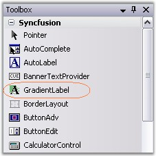
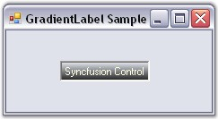

::: {style="DISPLAY: none"}
{#d2h_url_template}{#d2h_package_url style="WIDTH: 0px; DISPLAY: none; HEIGHT: 0px"}
:::

::: {.d2h_secondary_topic style="PADDING-BOTTOM: 10pt; MARGIN: 0pt; PADDING-LEFT: 0pt; PADDING-RIGHT: 0pt; PADDING-TOP: 0pt"}
##### Creating GradientLabel {#creating-gradientlabel style="tab-stops: 0pt"}

[]{style="COLOR: #15428b"} 

The GradientLabel control can be created in the following ways.

[]{style="COLOR: #15428b"} 

###### []{#p756}3.3.10.2.2.1        Through Designer {#through-designer style="tab-stops: 0pt"}

[]{style="COLOR: #15428b"} 

To create a GradientLabel control through designer,

[]{style="COLOR: #15428b"} 

[·      ]{style="FONT-FAMILY: Symbol"}Create or open a Windows Forms project.

[·      ]{style="FONT-FAMILY: Symbol"}Add a GradientLabel Control from the toolbox onto the form by dragging and dropping it on the form or double clicking the control.

[]{style="COLOR: #15428b"} 

{border="0"}

[]{style="COLOR: #15428b"} 

Figure 601: GradientLabel in Toolbox

[]{style="COLOR: #15428b"} 

[·      ]{style="FONT-FAMILY: Symbol"}Set the desired properties for the control through the Property grid.

[·      ]{style="FONT-FAMILY: Symbol"}Run the application.

[]{style="COLOR: #15428b"} 

{border="0"}

[]{style="COLOR: #15428b"} 

Figure 602: GradientLabel created Through Designer

[]{style="COLOR: #15428b"} 

See Also

[]{style="COLOR: #15428b"} 

Through Code

###### []{#p757}3.3.10.2.2.2        Through Code {#through-code style="tab-stops: 0pt"}

[]{style="COLOR: #15428b"} 

GradientLabel can be created programmatically as detailed below.

[]{style="COLOR: #15428b"} 

[·      ]{style="FONT-FAMILY: Symbol"}Create a C# or VB.NET application though Visual Studio.

[·      ]{style="FONT-FAMILY: Symbol"}Add the required assembly references.

[·      ]{style="FONT-FAMILY: Symbol"}Include the required namespace.

[]{style="COLOR: #15428b"} 

+--------------------------------------------------------------------------------------------------------------------------------+
| **[\[C#\]]{style="FONT-FAMILY: 'Courier New'; COLOR: black"}**                                                                 |
|                                                                                                                                |
| []{style="FONT-FAMILY: 'Courier New'; COLOR: black"}                                                                           |
|                                                                                                                                |
| [using ]{style="FONT-FAMILY: 'Courier New'; COLOR: blue"}[Syncfusion.Windows.Forms.Tools;]{style="FONT-FAMILY: 'Courier New'"} |
+--------------------------------------------------------------------------------------------------------------------------------+

[]{style="COLOR: #15428b"} 

+---------------------------------------------------------------------------------------------------------------------------------+
| **[\[VB.NET\]]{style="FONT-FAMILY: 'Courier New'; COLOR: black"}**                                                              |
|                                                                                                                                 |
| []{style="FONT-FAMILY: 'Courier New'; COLOR: black"}                                                                            |
|                                                                                                                                 |
| [Imports]{style="FONT-FAMILY: 'Courier New'; COLOR: blue"}[ Syncfusion.Windows.Forms.Tools]{style="FONT-FAMILY: 'Courier New'"} |
+---------------------------------------------------------------------------------------------------------------------------------+

[]{style="COLOR: #15428b"} 

[·      ]{style="FONT-FAMILY: Symbol"}Declare the GradientLabel control.

[]{style="COLOR: #15428b"} 

+-----------------------------------------------------------------------------------------------------------------------------------------------------------------------------------------+
| **[\[C#\]]{style="FONT-FAMILY: 'Courier New'; COLOR: black"}**                                                                                                                          |
|                                                                                                                                                                                         |
| []{style="FONT-FAMILY: 'Courier New'; COLOR: black"}                                                                                                                                    |
|                                                                                                                                                                                         |
| [private]{style="FONT-FAMILY: 'Courier New'; COLOR: blue"}[ Syncfusion.Windows.Forms.Tools.[GradientLabel]{style="COLOR: #2b91af"} gradientLabel1;]{style="FONT-FAMILY: 'Courier New'"} |
+-----------------------------------------------------------------------------------------------------------------------------------------------------------------------------------------+

[]{style="COLOR: #15428b"} 

+----------------------------------------------------------------------------------------------------------------------------------------------------------------------------------------+
| **[\[VB.NET\]]{style="FONT-FAMILY: 'Courier New'; COLOR: black"}**                                                                                                                     |
|                                                                                                                                                                                        |
| []{style="FONT-FAMILY: 'Courier New'; COLOR: black"}                                                                                                                                   |
|                                                                                                                                                                                        |
| [Private]{style="FONT-FAMILY: 'Courier New'; COLOR: blue"}[ gradientLabel1 [As]{style="COLOR: blue"} Syncfusion.Windows.Forms.Tools.GradientLabel]{style="FONT-FAMILY: 'Courier New'"} |
+----------------------------------------------------------------------------------------------------------------------------------------------------------------------------------------+

[]{style="COLOR: #15428b"} 

[·      ]{style="FONT-FAMILY: Symbol"}Initialize the control.

[]{style="COLOR: #15428b"} 

+---------------------------------------------------------------------------------------------------------------------------------------------------------------------------------------------------------------------+
| **[\[C#\]]{style="FONT-FAMILY: 'Courier New'; COLOR: black"}**                                                                                                                                                      |
|                                                                                                                                                                                                                     |
| []{style="FONT-FAMILY: 'Courier New'; COLOR: black"}                                                                                                                                                                |
|                                                                                                                                                                                                                     |
| [this]{style="FONT-FAMILY: 'Courier New'; COLOR: blue"}[.gradientLabel1 = [new]{style="COLOR: blue"} Syncfusion.Windows.Forms.Tools.[GradientLabel]{style="COLOR: #2b91af"}();]{style="FONT-FAMILY: 'Courier New'"} |
+---------------------------------------------------------------------------------------------------------------------------------------------------------------------------------------------------------------------+

[]{style="COLOR: #15428b"} 

+----------------------------------------------------------------------------------------------------------------------------------------------------------------------------------------+
| **[\[VB.NET\]]{style="FONT-FAMILY: 'Courier New'; COLOR: black"}**                                                                                                                     |
|                                                                                                                                                                                        |
| []{style="FONT-FAMILY: 'Courier New'; COLOR: black"}                                                                                                                                   |
|                                                                                                                                                                                        |
| [Me]{style="FONT-FAMILY: 'Courier New'; COLOR: blue"}[.gradientLabel1 = [New]{style="COLOR: blue"} Syncfusion.Windows.Forms.Tools.GradientLabel()]{style="FONT-FAMILY: 'Courier New'"} |
+----------------------------------------------------------------------------------------------------------------------------------------------------------------------------------------+

[]{style="COLOR: #15428b"} 

[·      ]{style="FONT-FAMILY: Symbol"}Set the properties for the GradientLabel control and add it to your form.

[]{style="COLOR: #15428b"} 

+-------------------------------------------------------------------------------------------------------------------------------------------------------------------------------------------------+
| **[\[C#\]]{style="FONT-FAMILY: 'Courier New'; COLOR: black"}**                                                                                                                                  |
|                                                                                                                                                                                                 |
| []{style="FONT-FAMILY: 'Courier New'; COLOR: black"}                                                                                                                                            |
|                                                                                                                                                                                                 |
| [this]{style="FONT-FAMILY: 'Courier New'; COLOR: blue"}[.gradientLabel1.BorderStyle = System.Windows.Forms.[Border3DStyle]{style="COLOR: #2b91af"}.Sunken;]{style="FONT-FAMILY: 'Courier New'"} |
|                                                                                                                                                                                                 |
| [this]{style="FONT-FAMILY: 'Courier New'; COLOR: blue"}[.gradientLabel1.ForeColor = System.Drawing.[SystemColors]{style="COLOR: #2b91af"}.Info;]{style="FONT-FAMILY: 'Courier New'"}            |
|                                                                                                                                                                                                 |
| [this]{style="FONT-FAMILY: 'Courier New'; COLOR: blue"}[.gradientLabel1.Text = [\"Syncfusion Control\"]{style="COLOR: #a31515"};]{style="FONT-FAMILY: 'Courier New'"}                           |
|                                                                                                                                                                                                 |
| []{style="FONT-FAMILY: 'Courier New'; COLOR: blue"}                                                                                                                                             |
|                                                                                                                                                                                                 |
| [// Add the GradientLabel control to the Form.]{style="FONT-FAMILY: 'Courier New'; COLOR: green"}                                                                                               |
|                                                                                                                                                                                                 |
| [this]{style="FONT-FAMILY: 'Courier New'; COLOR: blue"}[.Controls.Add([this]{style="COLOR: blue"}.gradientLabel1);]{style="FONT-FAMILY: 'Courier New'"}                                         |
+-------------------------------------------------------------------------------------------------------------------------------------------------------------------------------------------------+

[]{style="COLOR: #15428b"} 

+--------------------------------------------------------------------------------------------------------------------------------------------------------------------+
| **[\[VB.NET\]]{style="FONT-FAMILY: 'Courier New'; COLOR: black"}**                                                                                                 |
|                                                                                                                                                                    |
| []{style="FONT-FAMILY: 'Courier New'; COLOR: black"}                                                                                                               |
|                                                                                                                                                                    |
| [Me]{style="FONT-FAMILY: 'Courier New'; COLOR: blue"}[.gradientLabel1.BorderStyle = System.Windows.Forms.Border3DStyle.Sunken]{style="FONT-FAMILY: 'Courier New'"} |
|                                                                                                                                                                    |
| [Me]{style="FONT-FAMILY: 'Courier New'; COLOR: blue"}[.gradientLabel1.ForeColor = System.Drawing.SystemColors.Info]{style="FONT-FAMILY: 'Courier New'"}            |
|                                                                                                                                                                    |
| [Me]{style="FONT-FAMILY: 'Courier New'; COLOR: blue"}[.gradientLabel1.Text = [\"Syncfusion Control\"]{style="COLOR: #a31515"}]{style="FONT-FAMILY: 'Courier New'"} |
|                                                                                                                                                                    |
| []{style="FONT-FAMILY: 'Courier New'; COLOR: blue"}                                                                                                                |
|                                                                                                                                                                    |
| [\' Add the GradientLabel control to the Form.]{style="FONT-FAMILY: 'Courier New'; COLOR: green"}                                                                  |
|                                                                                                                                                                    |
| [Me]{style="FONT-FAMILY: 'Courier New'; COLOR: blue"}[.Controls.Add([Me]{style="COLOR: blue"}.gradientLabel1)]{style="FONT-FAMILY: 'Courier New'"}                 |
+--------------------------------------------------------------------------------------------------------------------------------------------------------------------+

[]{style="COLOR: #15428b"} 

[·      ]{style="FONT-FAMILY: Symbol"}Run the application.

[]{style="COLOR: #15428b"} 

{border="0"}

[]{style="COLOR: #15428b"} 

Figure 603: GradientLabel created Through Code

[]{#related-topics}
:::
