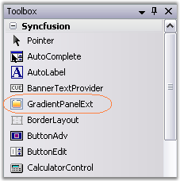
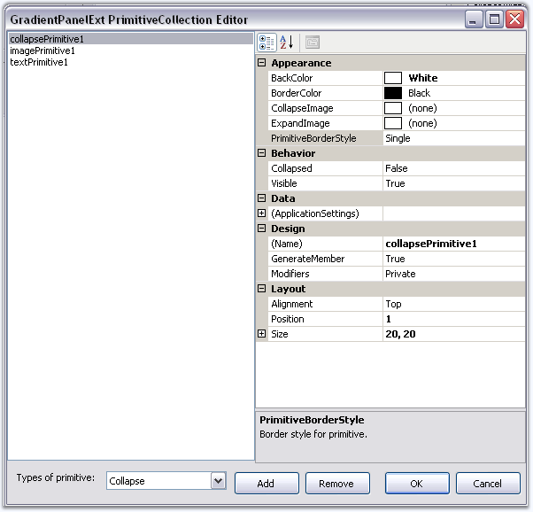
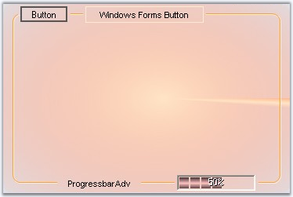

::: {style="DISPLAY: none"}
{#d2h_url_template}{#d2h_package_url style="WIDTH: 0px; DISPLAY: none; HEIGHT: 0px"}
:::

:::: {.d2h_secondary_topic style="PADDING-BOTTOM: 10pt; MARGIN: 0pt; PADDING-LEFT: 0pt; PADDING-RIGHT: 0pt; PADDING-TOP: 0pt"}
##### Creating GradientPanelExt {#creating-gradientpanelext style="tab-stops: 0pt"}

[]{style="COLOR: #15428b"} 

This section will guide you to create a GradientPanelExt through designer and also through programmatical approach.

[]{style="COLOR: #15428b"} 

###### []{#p464}3.3.6.3.2.1 Through Designer {#through-designer style="tab-stops: 0pt"}

The following steps are involved in creating the GradientPanelExt through the designer.

[]{style="COLOR: #15428b"} 

1.   Create a new Windows Application.

2.   Drag the GradientPanelExt from the toolbox on to the windows application form.

[]{style="COLOR: #15428b"} 

{border="0"}

Figure 398: GradientPanelExt in the Toolbox

 

3.   Gradient colors for the panel can be set by defining the gradient styles and colors, using the Color Collection Editor.

4.   Primitives can be added to GradientPanelExt \'s border using the GradientPanelExt PrimitiveCollection Editor, that can be accessed using the **Primitives** property.

 

{border="0"}

Figure 399[]{#p465}: GradientPanelExt Primitive Collection Editor

[]{style="COLOR: #15428b"} 

5.   The primitive alignment and position can be defined here.

[]{style="COLOR: #15428b"} 

::: {style="BORDER-BOTTOM: windowtext 1pt solid; BORDER-LEFT: medium none; PADDING-BOTTOM: 1pt; MARGIN-TOP: 9pt; PADDING-LEFT: 0pt; PADDING-RIGHT: 0pt; MARGIN-BOTTOM: 9pt; BORDER-TOP: windowtext 1pt solid; BORDER-RIGHT: medium none; PADDING-TOP: 1pt"}
{border="0"} Note:[ ]{style="COLOR: black; FONT-SIZE: 8pt"}The properties for the primitives can be set individually using the property grid as well.
:::

[]{style="COLOR: #15428b"} 

6.   Build and run the application.

[]{style="COLOR: #15428b"} 

[]{style="COLOR: #15428b"} 

[]{style="COLOR: #15428b"} 

{border="0"}

Figure 400: GradientPanelExt with Host Primitives

###### []{#_Through_Code_4}3.3.6.3.2.2 Through Code {#through-code style="tab-stops: 0pt"}

 

[]{#p466}The following steps will guide you to create a GradientPanelExt through code.

[]{style="COLOR: #15428b"} 

1.   Create a C# or VB.NET application through Visual Studio and switch to the code view.

2.   Add the Syncfusion.Shared.Base, Syncfusion.Shared.Windows, Syncfusion.Tools.Base and Syncfusion.Tools.Windows assembly references.

3.   Include the namespace for the Tools Package.

[]{style="COLOR: #15428b"} 

+--------------------------------------------------------------------------------------------------------------------------------+
| **[\[C#\]]{style="FONT-FAMILY: 'Courier New'; COLOR: black"}**                                                                 |
|                                                                                                                                |
| []{style="COLOR: black"}                                                                                                       |
|                                                                                                                                |
| [using ]{style="FONT-FAMILY: 'Courier New'; COLOR: blue"}[Syncfusion.Windows.Forms.Tools;]{style="FONT-FAMILY: 'Courier New'"} |
+--------------------------------------------------------------------------------------------------------------------------------+

[]{style="COLOR: #15428b"} 

+---------------------------------------------------------------------------------------------------------------------------------+
| **[\[VB.NET\]]{style="FONT-FAMILY: 'Courier New'; COLOR: black"}**                                                              |
|                                                                                                                                 |
| []{style="COLOR: black"}                                                                                                        |
|                                                                                                                                 |
| [Imports ]{style="FONT-FAMILY: 'Courier New'; COLOR: blue"}[Syncfusion.Windows.Forms.Tools]{style="FONT-FAMILY: 'Courier New'"} |
+---------------------------------------------------------------------------------------------------------------------------------+

[]{style="COLOR: #15428b"} 

4.   Create an instance GradientPanelExt and add it to the Windows Form, defining its various properties and primitives.

[]{style="COLOR: #15428b"} 

+----------------------------------------------------------------------------------------------------------------------------------------------------------------------------------------------------------------------------------------------------------------------------------------------+
| **[\[C#\]]{style="FONT-FAMILY: 'Courier New'; COLOR: black"}**                                                                                                                                                                                                                               |
|                                                                                                                                                                                                                                                                                              |
| []{style="FONT-FAMILY: 'Courier New'; COLOR: teal"}                                                                                                                                                                                                                                          |
|                                                                                                                                                                                                                                                                                              |
| [//Adding the GradientPanelExt]{style="FONT-FAMILY: 'Courier New'; COLOR: green"}                                                                                                                                                                                                            |
|                                                                                                                                                                                                                                                                                              |
| [GradientPanelExt]{style="FONT-FAMILY: 'Courier New'; COLOR: teal"}[ gpe = [new]{style="COLOR: blue"} [GradientPanelExt]{style="COLOR: teal"}();]{style="FONT-FAMILY: 'Courier New'"}                                                                                                        |
|                                                                                                                                                                                                                                                                                              |
| [gpe.Dock = [DockStyle]{style="COLOR: teal"}.Fill;]{style="FONT-FAMILY: 'Courier New'"}                                                                                                                                                                                                      |
|                                                                                                                                                                                                                                                                                              |
| [gradientPanelExt1.CornerRadius = 10;]{style="FONT-FAMILY: 'Courier New'"}                                                                                                                                                                                                                   |
|                                                                                                                                                                                                                                                                                              |
| [this]{style="FONT-FAMILY: 'Courier New'; COLOR: blue"}[.Controls.Add(gpe);]{style="FONT-FAMILY: 'Courier New'"}                                                                                                                                                                             |
|                                                                                                                                                                                                                                                                                              |
| []{style="FONT-FAMILY: 'Courier New'"}                                                                                                                                                                                                                                                       |
|                                                                                                                                                                                                                                                                                              |
| [//Defining Gradient Colors]{style="FONT-FAMILY: 'Courier New'; COLOR: green"}                                                                                                                                                                                                               |
|                                                                                                                                                                                                                                                                                              |
| [gpe.BackColor = System.Drawing.[Color]{style="COLOR: teal"}.Transparent;]{style="FONT-FAMILY: 'Courier New'"}                                                                                                                                                                               |
|                                                                                                                                                                                                                                                                                              |
| [gpe.BackgroundColor = [new]{style="COLOR: blue"} Syncfusion.Drawing.[BrushInfo]{style="COLOR: teal"}(Syncfusion.Drawing.[GradientStyle]{style="COLOR: teal"}.PathEllipse, [new ]{style="COLOR: blue"}System.Drawing.[Color]{style="COLOR: teal"}\[\] {]{style="FONT-FAMILY: 'Courier New'"} |
|                                                                                                                                                                                                                                                                                              |
| [  System.Drawing.[Color]{style="COLOR: teal"}.Bisque, System.Drawing.[Color]{style="COLOR: teal"}.LightSalmon,System.Drawing.[Color]{style="COLOR: teal"}.LightCoral});]{style="FONT-FAMILY: 'Courier New'"}                                                                                |
|                                                                                                                                                                                                                                                                                              |
| []{style="FONT-FAMILY: 'Courier New'"}                                                                                                                                                                                                                                                       |
|                                                                                                                                                                                                                                                                                              |
| [//button1]{style="FONT-FAMILY: 'Courier New'; COLOR: green"}                                                                                                                                                                                                                                |
|                                                                                                                                                                                                                                                                                              |
| [Button]{style="FONT-FAMILY: 'Courier New'; COLOR: teal"}[ button1 = [new]{style="COLOR: blue"} [Button]{style="COLOR: teal"}();]{style="FONT-FAMILY: 'Courier New'"}                                                                                                                        |
|                                                                                                                                                                                                                                                                                              |
| [button1.FlatStyle = System.Windows.Forms.[FlatStyle]{style="COLOR: teal"}.Popup;]{style="FONT-FAMILY: 'Courier New'"}                                                                                                                                                                       |
|                                                                                                                                                                                                                                                                                              |
| [button1.Text = [\"Button\"]{style="COLOR: maroon"};]{style="FONT-FAMILY: 'Courier New'"}                                                                                                                                                                                                    |
|                                                                                                                                                                                                                                                                                              |
| []{style="FONT-FAMILY: 'Courier New'"}                                                                                                                                                                                                                                                       |
|                                                                                                                                                                                                                                                                                              |
| [//hostPrimitive1]{style="FONT-FAMILY: 'Courier New'; COLOR: green"}                                                                                                                                                                                                                         |
|                                                                                                                                                                                                                                                                                              |
| [HostPrimitive]{style="FONT-FAMILY: 'Courier New'; COLOR: teal"}[ hostPrimitive1 = [new]{style="COLOR: blue"} [HostPrimitive]{style="COLOR: teal"}();]{style="FONT-FAMILY: 'Courier New'"}                                                                                                   |
|                                                                                                                                                                                                                                                                                              |
| [hostPrimitive1.HostControl = button1;]{style="FONT-FAMILY: 'Courier New'"}                                                                                                                                                                                                                  |
|                                                                                                                                                                                                                                                                                              |
| []{style="FONT-FAMILY: 'Courier New'"}                                                                                                                                                                                                                                                       |
|                                                                                                                                                                                                                                                                                              |
| [//progressBarAdv1]{style="FONT-FAMILY: 'Courier New'; COLOR: green"}                                                                                                                                                                                                                        |
|                                                                                                                                                                                                                                                                                              |
| [ProgressBarAdv]{style="FONT-FAMILY: 'Courier New'; COLOR: teal"}[ progressBarAdv1= [new]{style="COLOR: blue"} [ProgressBarAdv]{style="COLOR: teal"}();]{style="FONT-FAMILY: 'Courier New'"}                                                                                                 |
|                                                                                                                                                                                                                                                                                              |
| [progressBarAdv1.ProgressStyle = Syncfusion.Windows.Forms.Tools.[ProgressBarStyles]{style="COLOR: teal"}.Tube;]{style="FONT-FAMILY: 'Courier New'"}                                                                                                                                          |
|                                                                                                                                                                                                                                                                                              |
| []{style="FONT-FAMILY: 'Courier New'"}                                                                                                                                                                                                                                                       |
|                                                                                                                                                                                                                                                                                              |
| [//textPrimitive1]{style="FONT-FAMILY: 'Courier New'; COLOR: green"}                                                                                                                                                                                                                         |
|                                                                                                                                                                                                                                                                                              |
| [TextPrimitive]{style="FONT-FAMILY: 'Courier New'; COLOR: teal"}[ textPrimitive1= [new]{style="COLOR: blue"} [TextPrimitive]{style="COLOR: teal"}();]{style="FONT-FAMILY: 'Courier New'"}                                                                                                    |
|                                                                                                                                                                                                                                                                                              |
| [textPrimitive1.Alignment = Syncfusion.Windows.Forms.Tools.[Alignment]{style="COLOR: teal"}.Bottom;]{style="FONT-FAMILY: 'Courier New'"}                                                                                                                                                     |
|                                                                                                                                                                                                                                                                                              |
| [textPrimitive1.Text = [\"ProgressbarAdv\"]{style="COLOR: maroon"};]{style="FONT-FAMILY: 'Courier New'"}                                                                                                                                                                                     |
|                                                                                                                                                                                                                                                                                              |
| []{style="FONT-FAMILY: 'Courier New'"}                                                                                                                                                                                                                                                       |
|                                                                                                                                                                                                                                                                                              |
| [//textPrimitive2]{style="FONT-FAMILY: 'Courier New'; COLOR: green"}                                                                                                                                                                                                                         |
|                                                                                                                                                                                                                                                                                              |
| [TextPrimitive]{style="FONT-FAMILY: 'Courier New'; COLOR: teal"}[ textPrimitive2 = [new]{style="COLOR: blue"} [TextPrimitive]{style="COLOR: teal"}();]{style="FONT-FAMILY: 'Courier New'"}                                                                                                   |
|                                                                                                                                                                                                                                                                                              |
| [textPrimitive2.Text = [\"Windows Forms Button\"]{style="COLOR: maroon"};]{style="FONT-FAMILY: 'Courier New'"}                                                                                                                                                                               |
|                                                                                                                                                                                                                                                                                              |
| []{style="FONT-FAMILY: 'Courier New'"}                                                                                                                                                                                                                                                       |
|                                                                                                                                                                                                                                                                                              |
| [//Adding Primitives]{style="FONT-FAMILY: 'Courier New'; COLOR: green"}                                                                                                                                                                                                                      |
|                                                                                                                                                                                                                                                                                              |
| [gpe.Primitives.AddRange([new]{style="COLOR: blue"} Syncfusion.Windows.Forms.Tools.[Primitive]{style="COLOR: teal"}\[\] { hostPrimitive1, textPrimitive1,  textPrimitive2});]{style="FONT-FAMILY: 'Courier New'"}                                                                            |
+----------------------------------------------------------------------------------------------------------------------------------------------------------------------------------------------------------------------------------------------------------------------------------------------+

[]{style="COLOR: #15428b"} 

+-------------------------------------------------------------------------------------------------------------------------------------------------------------------------------------------------------------------------------------------------------------------------------------------------------------------------------------------------------------------------------------------------------------+
| **[\[VB.NET\]]{style="FONT-FAMILY: 'Courier New'; COLOR: black"}**                                                                                                                                                                                                                                                                                                                                          |
|                                                                                                                                                                                                                                                                                                                                                                                                             |
| []{style="FONT-FAMILY: 'Courier New'; COLOR: green"}                                                                                                                                                                                                                                                                                                                                                        |
|                                                                                                                                                                                                                                                                                                                                                                                                             |
| [\'Adding the GradientPanelExt]{style="FONT-FAMILY: 'Courier New'; COLOR: green"}                                                                                                                                                                                                                                                                                                                           |
|                                                                                                                                                                                                                                                                                                                                                                                                             |
| [Private]{style="FONT-FAMILY: 'Courier New'; COLOR: blue"}[ gpe [As]{style="COLOR: blue"} GradientPanelExt = [New]{style="COLOR: blue"} GradientPanelExt()]{style="FONT-FAMILY: 'Courier New'"}                                                                                                                                                                                                             |
|                                                                                                                                                                                                                                                                                                                                                                                                             |
| [Private]{style="FONT-FAMILY: 'Courier New'; COLOR: blue"}[ gpe.Dock = DockStyle.Fill]{style="FONT-FAMILY: 'Courier New'"}                                                                                                                                                                                                                                                                                  |
|                                                                                                                                                                                                                                                                                                                                                                                                             |
| [Private]{style="FONT-FAMILY: 'Courier New'; COLOR: blue"}[ gradientPanelExt1.CornerRadius = 10]{style="FONT-FAMILY: 'Courier New'"}                                                                                                                                                                                                                                                                        |
|                                                                                                                                                                                                                                                                                                                                                                                                             |
| [Me]{style="FONT-FAMILY: 'Courier New'; COLOR: blue"}[.Controls.Add(gpe)]{style="FONT-FAMILY: 'Courier New'"}                                                                                                                                                                                                                                                                                               |
|                                                                                                                                                                                                                                                                                                                                                                                                             |
| []{style="FONT-FAMILY: 'Courier New'"}                                                                                                                                                                                                                                                                                                                                                                      |
|                                                                                                                                                                                                                                                                                                                                                                                                             |
| [\'Defining Gradient Colors]{style="FONT-FAMILY: 'Courier New'; COLOR: green"}                                                                                                                                                                                                                                                                                                                              |
|                                                                                                                                                                                                                                                                                                                                                                                                             |
| [Private]{style="FONT-FAMILY: 'Courier New'; COLOR: blue"}[ gpe.BackColor = System.Drawing.Color.Transparent]{style="FONT-FAMILY: 'Courier New'"}                                                                                                                                                                                                                                                           |
|                                                                                                                                                                                                                                                                                                                                                                                                             |
| [Private]{style="FONT-FAMILY: 'Courier New'; COLOR: blue"}[ gpe.BackgroundColor = [New]{style="COLOR: blue"} Syncfusion.Drawing.BrushInfo(Syncfusion.Drawing.GradientStyle.PathEllipse, [New]{style="COLOR: blue"}                           System.Drawing.Color() { System.Drawing.Color.Bisque, System.Drawing.Color.LightSalmon, System.Drawing.Color.LightCoral})]{style="FONT-FAMILY: 'Courier New'"} |
|                                                                                                                                                                                                                                                                                                                                                                                                             |
| []{style="FONT-FAMILY: 'Courier New'; COLOR: green"}                                                                                                                                                                                                                                                                                                                                                        |
|                                                                                                                                                                                                                                                                                                                                                                                                             |
| [\'button1]{style="FONT-FAMILY: 'Courier New'; COLOR: green"}                                                                                                                                                                                                                                                                                                                                               |
|                                                                                                                                                                                                                                                                                                                                                                                                             |
| [Private]{style="FONT-FAMILY: 'Courier New'; COLOR: blue"}[ button1 [As]{style="COLOR: blue"} Button = [New]{style="COLOR: blue"} Button()]{style="FONT-FAMILY: 'Courier New'"}                                                                                                                                                                                                                             |
|                                                                                                                                                                                                                                                                                                                                                                                                             |
| [Private]{style="FONT-FAMILY: 'Courier New'; COLOR: blue"}[ button1.FlatStyle = System.Windows.Forms.FlatStyle.Popup]{style="FONT-FAMILY: 'Courier New'"}                                                                                                                                                                                                                                                   |
|                                                                                                                                                                                                                                                                                                                                                                                                             |
| [Private]{style="FONT-FAMILY: 'Courier New'; COLOR: blue"}[ button1.Text = [\"Button\"]{style="COLOR: maroon"}]{style="FONT-FAMILY: 'Courier New'"}                                                                                                                                                                                                                                                         |
|                                                                                                                                                                                                                                                                                                                                                                                                             |
| []{style="FONT-FAMILY: 'Courier New'; COLOR: maroon"}                                                                                                                                                                                                                                                                                                                                                       |
|                                                                                                                                                                                                                                                                                                                                                                                                             |
| [\'hostPrimitive1]{style="FONT-FAMILY: 'Courier New'; COLOR: green"}                                                                                                                                                                                                                                                                                                                                        |
|                                                                                                                                                                                                                                                                                                                                                                                                             |
| [Private]{style="FONT-FAMILY: 'Courier New'; COLOR: blue"}[ hostPrimitive1 [As]{style="COLOR: blue"} HostPrimitive = [New]{style="COLOR: blue"} HostPrimitive()]{style="FONT-FAMILY: 'Courier New'"}                                                                                                                                                                                                        |
|                                                                                                                                                                                                                                                                                                                                                                                                             |
| [Private]{style="FONT-FAMILY: 'Courier New'; COLOR: blue"}[ hostPrimitive1.HostControl = button1]{style="FONT-FAMILY: 'Courier New'"}                                                                                                                                                                                                                                                                       |
|                                                                                                                                                                                                                                                                                                                                                                                                             |
| []{style="FONT-FAMILY: 'Courier New'"}                                                                                                                                                                                                                                                                                                                                                                      |
|                                                                                                                                                                                                                                                                                                                                                                                                             |
| [\'progressBarAdv1]{style="FONT-FAMILY: 'Courier New'; COLOR: green"}                                                                                                                                                                                                                                                                                                                                       |
|                                                                                                                                                                                                                                                                                                                                                                                                             |
| [Private]{style="FONT-FAMILY: 'Courier New'; COLOR: blue"}[ progressBarAdv1 [As]{style="COLOR: blue"} ProgressBarAdv = [New]{style="COLOR: blue"} ProgressBarAdv()]{style="FONT-FAMILY: 'Courier New'"}                                                                                                                                                                                                     |
|                                                                                                                                                                                                                                                                                                                                                                                                             |
| [Private]{style="FONT-FAMILY: 'Courier New'; COLOR: blue"}[ progressBarAdv1.ProgressStyle = Syncfusion.Windows.Forms.Tools.ProgressBarStyles.Tube]{style="FONT-FAMILY: 'Courier New'"}                                                                                                                                                                                                                      |
|                                                                                                                                                                                                                                                                                                                                                                                                             |
| []{style="FONT-FAMILY: 'Courier New'"}                                                                                                                                                                                                                                                                                                                                                                      |
|                                                                                                                                                                                                                                                                                                                                                                                                             |
| [\'textPrimitive1]{style="FONT-FAMILY: 'Courier New'; COLOR: green"}                                                                                                                                                                                                                                                                                                                                        |
|                                                                                                                                                                                                                                                                                                                                                                                                             |
| [Private]{style="FONT-FAMILY: 'Courier New'; COLOR: blue"}[ textPrimitive1 [As]{style="COLOR: blue"} TextPrimitive = [New]{style="COLOR: blue"} TextPrimitive()]{style="FONT-FAMILY: 'Courier New'"}                                                                                                                                                                                                        |
|                                                                                                                                                                                                                                                                                                                                                                                                             |
| [Private]{style="FONT-FAMILY: 'Courier New'; COLOR: blue"}[ textPrimitive1.Alignment = Syncfusion.Windows.Forms.Tools.Alignment.Bottom]{style="FONT-FAMILY: 'Courier New'"}                                                                                                                                                                                                                                 |
|                                                                                                                                                                                                                                                                                                                                                                                                             |
| [Private]{style="FONT-FAMILY: 'Courier New'; COLOR: blue"}[ textPrimitive1.Text = [\"ProgressbarAdv\"]{style="COLOR: maroon"}]{style="FONT-FAMILY: 'Courier New'"}                                                                                                                                                                                                                                          |
|                                                                                                                                                                                                                                                                                                                                                                                                             |
| []{style="FONT-FAMILY: 'Courier New'; COLOR: maroon"}                                                                                                                                                                                                                                                                                                                                                       |
|                                                                                                                                                                                                                                                                                                                                                                                                             |
| [\'textPrimitive2]{style="FONT-FAMILY: 'Courier New'; COLOR: green"}                                                                                                                                                                                                                                                                                                                                        |
|                                                                                                                                                                                                                                                                                                                                                                                                             |
| [Private]{style="FONT-FAMILY: 'Courier New'; COLOR: blue"}[ textPrimitive2 [As]{style="COLOR: blue"} TextPrimitive = [New]{style="COLOR: blue"} TextPrimitive()]{style="FONT-FAMILY: 'Courier New'"}                                                                                                                                                                                                        |
|                                                                                                                                                                                                                                                                                                                                                                                                             |
| [Private]{style="FONT-FAMILY: 'Courier New'; COLOR: blue"}[ textPrimitive2.Text = [\"Windows Forms Button\"]{style="COLOR: maroon"}]{style="FONT-FAMILY: 'Courier New'"}                                                                                                                                                                                                                                    |
|                                                                                                                                                                                                                                                                                                                                                                                                             |
| []{style="FONT-FAMILY: 'Courier New'; COLOR: maroon"}                                                                                                                                                                                                                                                                                                                                                       |
|                                                                                                                                                                                                                                                                                                                                                                                                             |
| [\'Adding Primitives]{style="FONT-FAMILY: 'Courier New'; COLOR: green"}                                                                                                                                                                                                                                                                                                                                     |
|                                                                                                                                                                                                                                                                                                                                                                                                             |
| [gpe.Primitives.AddRange([New]{style="COLOR: blue"} Syncfusion.Windows.Forms.Tools.Primitive() {hostPrimitive1, hostPrimitive2, textPrimitive1,                      textPrimitive2})]{style="FONT-FAMILY: 'Courier New'"}                                                                                                                                                                                  |
+-------------------------------------------------------------------------------------------------------------------------------------------------------------------------------------------------------------------------------------------------------------------------------------------------------------------------------------------------------------------------------------------------------------+

[]{style="COLOR: #15428b"} 

5.   Run and build the application to view the output.

[]{#related-topics}
::::
