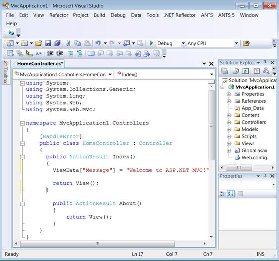

::: {style="DISPLAY: none"}
{#d2h_url_template}{#d2h_package_url style="WIDTH: 0px; DISPLAY: none; HEIGHT: 0px"}
:::

::::: {#nsbanner .d2h_main_nsbanner style="BORDER-BOTTOM: #999999 1px solid; POSITION: relative; PADDING-BOTTOM: 0px; BACKGROUND-COLOR: transparent; PADDING-LEFT: 0px; PADDING-RIGHT: 0px; DISPLAY: none; BORDER-TOP: #999999 1px solid; PADDING-TOP: 0px; LEFT: 0px"}
:::: {#TitleRow .d2h_main_titlerow style="PADDING-BOTTOM: 4px; BACKGROUND-COLOR: transparent; PADDING-LEFT: 22px; WIDTH: 100%; PADDING-RIGHT: 10px; DISPLAY: none; PADDING-TOP: 4px"}
::: {#ienav .d2h_main_ienav style="DISPLAY: none"}
{#D2HPrevious .D2HPreviousEnabled}  {#D2HNext .D2HNextEnabled}
:::
::::
:::::

::::::: {#nstext .d2h_main_nstext style="PADDING-BOTTOM: 10px; BACKGROUND-COLOR: transparent; PADDING-LEFT: 22px; PADDING-RIGHT: 10px; HEIGHT: 100%; OVERFLOW: auto; PADDING-TOP: 5px" hasuserbackground="true" valign="bottom"}
::: {#d2h_breadcrumbs .d2h_breadcrumbs}
[Essential Studio User Guide Documentation](ms-xhelp:///?Id=12457748-09e3-4d74-a240-8e049cedf030){.d2h_breadcrumbsNormal}[ \> ]{.d2h_breadcrumbsLinkSeparator}[User Interface Edition](ms-xhelp:///?Id=c29296b7-531c-413b-a0ec-488ca1f7f669){.d2h_breadcrumbsNormal}[ \> ]{.d2h_breadcrumbsLinkSeparator}[Essential ASP.NET MVC](ms-xhelp:///?Id=4b14e7d1-65c4-4f67-b1aa-2c37709905a5){.d2h_breadcrumbsNormal}[ \> ]{.d2h_breadcrumbsLinkSeparator}[Essential Grid]{.d2h_breadcrumbsContentsOnly}[ \> ]{.d2h_breadcrumbsLinkSeparator}[Getting Started](ms-xhelp:///?Id=c7ed3902-b25b-4170-be58-1d3d0b57748a){.d2h_breadcrumbsNormal}[ \> ]{.d2h_breadcrumbsLinkSeparator}[Adding Essential Grid to the Application Using ASPX](ms-xhelp:///?Id=e943fe98-efff-43f4-8cfb-b599e68064e1){.d2h_breadcrumbsNormal}
:::

### Creating Grid through GridPropertyModel {#creating-grid-through-gridpropertymodel style="tab-stops: 0pt"}

 

1.   Create a model into application ([[Refer to ]{style="COLOR: windowtext; TEXT-DECORATION: none; text-underline: none"}]{.UGHyperlink}[Getting Started\>Adding a Model to the Application]{.UGHyperlink})

2.   Add the following code in the **Index.aspx** file, to create the Grid control in the view:

 

 

+-------------------------------------------------------------------------------------------------------------------------------------------------------------------------------------------------------------------------------------------------------------------------------------------------------------------------------+
| **[\[ASPX\]]{style="FONT-FAMILY: 'Courier New'"}**                                                                                                                                                                                                                                                                            |
|                                                                                                                                                                                                                                                                                                                               |
| **[]{style="FONT-FAMILY: 'Courier New'"}**                                                                                                                                                                                                                                                                                    |
|                                                                                                                                                                                                                                                                                                                               |
| [\<%]{style="FONT-FAMILY: 'Courier New'; BACKGROUND: yellow"}[=]{style="FONT-FAMILY: 'Courier New'; COLOR: blue"}[Html.Syncfusion().Grid\<MvcSampleApplication.Models.[Order]{style="COLOR: #2b91af"}\>([\"FlatGrid\"]{style="COLOR: #a31515"},[\"GridModel\"]{style="COLOR: #a31515"}, ]{style="FONT-FAMILY: 'Courier New'"} |
|                                                                                                                                                                                                                                                                                                                               |
| [       column =\> {    ]{style="FONT-FAMILY: 'Courier New'"}                                                                                                                                                                                                                                                                 |
|                                                                                                                                                                                                                                                                                                                               |
| [                    column.Add(c =\> c.OrderID).HeaderText([\"Order ID\"]{style="COLOR: #a31515"});]{style="FONT-FAMILY: 'Courier New'"}                                                                                                                                                                                     |
|                                                                                                                                                                                                                                                                                                                               |
| [                    column.Add(c =\> c.CustomerID).HeaderText([\"Customer ID\"]{style="COLOR: #a31515"});]{style="FONT-FAMILY: 'Courier New'"}                                                                                                                                                                               |
|                                                                                                                                                                                                                                                                                                                               |
| [                    column.Add(c =\> c.EmployeeID).HeaderText([\"Employee ID\"]{style="COLOR: #a31515"});]{style="FONT-FAMILY: 'Courier New'"}                                                                                                                                                                               |
|                                                                                                                                                                                                                                                                                                                               |
| [                    column.Add(c =\> c.OrderDate).HeaderText([\"Order Date\"]{style="COLOR: #a31515"}).Format([\"{OrderDate:dd/mm/yyyy}\"]{style="COLOR: #a31515"});]{style="FONT-FAMILY: 'Courier New'"}                                                                                                                    |
|                                                                                                                                                                                                                                                                                                                               |
| [                    column.Add(c =\> c.Freight).HeaderText([\"Freight\"]{style="COLOR: #a31515"});  ]{style="FONT-FAMILY: 'Courier New'"}                                                                                                                                                                                    |
|                                                                                                                                                                                                                                                                                                                               |
| [                    })]{style="FONT-FAMILY: 'Courier New'"}                                                                                                                                                                                                                                                                  |
|                                                                                                                                                                                                                                                                                                                               |
| [       [%\>]{style="BACKGROUND: yellow"}]{style="FONT-FAMILY: 'Courier New'"}                                                                                                                                                                                                                                                |
|                                                                                                                                                                                                                                                                                                                               |
| []{style="FONT-FAMILY: 'Courier New'"}                                                                                                                                                                                                                                                                                        |
+-------------------------------------------------------------------------------------------------------------------------------------------------------------------------------------------------------------------------------------------------------------------------------------------------------------------------------+

::: {style="BORDER-BOTTOM: windowtext 1pt solid; BORDER-LEFT: medium none; PADDING-BOTTOM: 1pt; MARGIN-TOP: 9pt; PADDING-LEFT: 0pt; PADDING-RIGHT: 0pt; MARGIN-BOTTOM: 9pt; BORDER-TOP: windowtext 1pt solid; BORDER-RIGHT: medium none; PADDING-TOP: 1pt"}
{border="0"}Note: This is of the type: string HTMLHelper.Grid\<T\>(string control_id, GridPropertiesModel gridModel, Action\<IRootGridColumnBuilder\<T\>\>columns); where T: class.
:::

It is important that the **control_id** used in the **Index.aspx** file and in the **HomeController.cs** file should match to ensure the binding of the properties to the control.

3.   Double-click the **HomeController.cs** from the **Controller/Home** folder.

The HomeController.cs page is displayed in the main window.

 

{border="0"}

Figure 48: HomeController.cs Page

[]{style="FONT-FAMILY: Consolas; FONT-SIZE: 9.5pt"} 

4.   Edit the **Index** method as shown below:

 

 

+----------------------------------------------------------------------------------------------------------------------------------------------------------------------------------------------------------------------------------------------------------+
| **[\[C#\]]{style="FONT-FAMILY: 'Courier New'; COLOR: black"}**                                                                                                                                                                                           |
|                                                                                                                                                                                                                                                          |
| **[]{style="FONT-FAMILY: 'Courier New'; COLOR: black"}**                                                                                                                                                                                                 |
|                                                                                                                                                                                                                                                          |
| [///]{style="FONT-FAMILY: 'Courier New'; COLOR: gray"}[ ]{style="FONT-FAMILY: 'Courier New'; COLOR: green"}[\<summary\>]{style="FONT-FAMILY: 'Courier New'; COLOR: gray"}[]{style="FONT-FAMILY: 'Courier New'"}                                          |
|                                                                                                                                                                                                                                                          |
| [        [///]{style="COLOR: gray"}[ Used to bind the Grid.]{style="COLOR: green"}]{style="FONT-FAMILY: 'Courier New'"}                                                                                                                                  |
|                                                                                                                                                                                                                                                          |
| [        [///]{style="COLOR: gray"}[ ]{style="COLOR: green"}[\</summary\>]{style="COLOR: gray"}]{style="FONT-FAMILY: 'Courier New'"}                                                                                                                     |
|                                                                                                                                                                                                                                                          |
| [        [///]{style="COLOR: gray"}[ ]{style="COLOR: green"}[\<returns\>]{style="COLOR: gray"}[Veiw page, it displays the Grid]{style="COLOR: green"}[\</returns\>]{style="COLOR: gray"}]{style="FONT-FAMILY: 'Courier New'"}                            |
|                                                                                                                                                                                                                                                          |
| [        [public]{style="COLOR: blue"} [ActionResult]{style="COLOR: #2b91af"} Index()]{style="FONT-FAMILY: 'Courier New'"}                                                                                                                               |
|                                                                                                                                                                                                                                                          |
| [        {]{style="FONT-FAMILY: 'Courier New'"}                                                                                                                                                                                                          |
|                                                                                                                                                                                                                                                          |
| [            [GridPropertiesModel]{style="COLOR: #2b91af"}\<[Order]{style="COLOR: #2b91af"}\> model = [new]{style="COLOR: blue"} [GridPropertiesModel]{style="COLOR: #2b91af"}\<[Order]{style="COLOR: #2b91af"}\>()]{style="FONT-FAMILY: 'Courier New'"} |
|                                                                                                                                                                                                                                                          |
| [            {]{style="FONT-FAMILY: 'Courier New'"}                                                                                                                                                                                                      |
|                                                                                                                                                                                                                                                          |
| [                DataSource = [new]{style="COLOR: blue"} [NorthwindDataContext]{style="COLOR: #2b91af"}().Orders.Take(200),]{style="FONT-FAMILY: 'Courier New'"}                                                                                         |
|                                                                                                                                                                                                                                                          |
| [                AllowPaging = [true]{style="COLOR: blue"},]{style="FONT-FAMILY: 'Courier New'"}                                                                                                                                                         |
|                                                                                                                                                                                                                                                          |
| [                AllowSorting = [true]{style="COLOR: blue"}]{style="FONT-FAMILY: 'Courier New'"}                                                                                                                                                         |
|                                                                                                                                                                                                                                                          |
| [            };]{style="FONT-FAMILY: 'Courier New'"}                                                                                                                                                                                                     |
|                                                                                                                                                                                                                                                          |
| [            ViewData\[[\"GridModel\"]{style="COLOR: #a31515"}\] = model;]{style="FONT-FAMILY: 'Courier New'"}                                                                                                                                           |
|                                                                                                                                                                                                                                                          |
| [            [return]{style="COLOR: blue"} View();]{style="FONT-FAMILY: 'Courier New'"}                                                                                                                                                                  |
|                                                                                                                                                                                                                                                          |
| [        }]{style="FONT-FAMILY: 'Courier New'"}                                                                                                                                                                                                          |
+----------------------------------------------------------------------------------------------------------------------------------------------------------------------------------------------------------------------------------------------------------+

[]{style="FONT-FAMILY: Consolas; FONT-SIZE: 9.5pt"} 

[]{style="FONT-FAMILY: Consolas; FONT-SIZE: 9.5pt"} 

Code details:

[]{style="FONT-FAMILY: 'Calibri','sans-serif'"} 

a.  Objects created for **GridPropertiesModel** and the following grid properties are assigned to **model**

[·      ]{style="FONT-FAMILY: Symbol"}**DataSource**---Gets or sets a data source for the Grid[ ]{style="COLOR: gray"}control

[·      ]{style="FONT-FAMILY: Symbol"}**AllowPaging**---Gets or sets a value indicating whether the paging feature is enabled.

[·      ]{style="FONT-FAMILY: Symbol"}**AllowSorting**---Gets or sets a value indicating whether the sorting feature is enabled.

b.  Pass the model to view using **ViewData**. This will pass the grid properties from the controller to the view.

Syntax:

ViewData\[\"model_id\"\] = object_name;

[]{style="FONT-FAMILY: 'Calibri','sans-serif'"} 

5.   In order to work with paging/sorting actions, create a post method for **Index** actions and update the following code in this method.

[       ]{style="FONT-FAMILY: Consolas; FONT-SIZE: 9.5pt"}

+-------------------------------------------------------------------------------------------------------------------------------------------------------------------------------------------------------------------------------------+
| **[\[C#\]]{style="FONT-FAMILY: 'Courier New'; COLOR: black"}**                                                                                                                                                                      |
|                                                                                                                                                                                                                                     |
| []{style="FONT-FAMILY: 'Courier New'; COLOR: gray"}                                                                                                                                                                                 |
|                                                                                                                                                                                                                                     |
| [///]{style="FONT-FAMILY: 'Courier New'; COLOR: gray"}[ ]{style="FONT-FAMILY: 'Courier New'; COLOR: green"}[\<summary\>]{style="FONT-FAMILY: 'Courier New'; COLOR: gray"}[]{style="FONT-FAMILY: 'Courier New'"}                     |
|                                                                                                                                                                                                                                     |
| [        [///]{style="COLOR: gray"}[ Paging/sorting Requests are mapped to this method. This method invokes the HtmlActionResult]{style="COLOR: green"}]{style="FONT-FAMILY: 'Courier New'"}                                        |
|                                                                                                                                                                                                                                     |
| [        [///]{style="COLOR: gray"}[ from the grid. The required response is generated.]{style="COLOR: green"}]{style="FONT-FAMILY: 'Courier New'"}                                                                                 |
|                                                                                                                                                                                                                                     |
| [        [///]{style="COLOR: gray"}[ ]{style="COLOR: green"}[\</summary\>]{style="COLOR: gray"}]{style="FONT-FAMILY: 'Courier New'"}                                                                                                |
|                                                                                                                                                                                                                                     |
| [        [///]{style="COLOR: gray"}[ ]{style="COLOR: green"}[\<param name=\"args\"\>]{style="COLOR: gray"}[Contains paging properties ]{style="COLOR: green"}[\</param\>]{style="COLOR: gray"}]{style="FONT-FAMILY: 'Courier New'"} |
|                                                                                                                                                                                                                                     |
| [        [///]{style="COLOR: gray"}[ ]{style="COLOR: green"}[\<returns\>]{style="COLOR: gray"}]{style="FONT-FAMILY: 'Courier New'"}                                                                                                 |
|                                                                                                                                                                                                                                     |
| [        [///]{style="COLOR: gray"}[ HtmlActionResult returns the data displayed on the grid.]{style="COLOR: green"}]{style="FONT-FAMILY: 'Courier New'"}                                                                           |
|                                                                                                                                                                                                                                     |
| [        [///]{style="COLOR: gray"}[ ]{style="COLOR: green"}[\</returns\>]{style="COLOR: gray"}]{style="FONT-FAMILY: 'Courier New'"}                                                                                                |
|                                                                                                                                                                                                                                     |
| [        \[[AcceptVerbs]{style="COLOR: #2b91af"}([HttpVerbs]{style="COLOR: #2b91af"}.Post)\]]{style="FONT-FAMILY: 'Courier New'"}                                                                                                   |
|                                                                                                                                                                                                                                     |
| [        [public]{style="COLOR: blue"} [ActionResult]{style="COLOR: #2b91af"} Index([PagingParams]{style="COLOR: #2b91af"} args)]{style="FONT-FAMILY: 'Courier New'"}                                                               |
|                                                                                                                                                                                                                                     |
| [        {]{style="FONT-FAMILY: 'Courier New'"}                                                                                                                                                                                     |
|                                                                                                                                                                                                                                     |
| [            [IEnumerable]{style="COLOR: #2b91af"} data = [new]{style="COLOR: blue"} [NorthwindDataContext]{style="COLOR: #2b91af"}().Orders.Take(200);]{style="FONT-FAMILY: 'Courier New'"}                                        |
|                                                                                                                                                                                                                                     |
| [            [return]{style="COLOR: blue"} data.GridActions\<[Order]{style="COLOR: #2b91af"}\>();]{style="FONT-FAMILY: 'Courier New'"}                                                                                              |
|                                                                                                                                                                                                                                     |
| [        }]{style="FONT-FAMILY: 'Courier New'"}                                                                                                                                                                                     |
+-------------------------------------------------------------------------------------------------------------------------------------------------------------------------------------------------------------------------------------+

[]{style="FONT-FAMILY: Consolas; FONT-SIZE: 9.5pt"} 

::: {style="BORDER-BOTTOM: windowtext 1pt solid; BORDER-LEFT: medium none; PADDING-BOTTOM: 1pt; MARGIN-TOP: 9pt; PADDING-LEFT: 0pt; PADDING-RIGHT: 0pt; MARGIN-BOTTOM: 9pt; BORDER-TOP: windowtext 1pt solid; BORDER-RIGHT: medium none; PADDING-TOP: 1pt"}
{border="0"}Note: Essential Grid is fully AJAX enabled. For paging/sorting/filtering/editing actions the entire page will not be refreshed. The grid contents alone refresh using AJAX calls. The methods above are necessary to achieve the grid actions.
:::

[]{style="FONT-FAMILY: 'Calibri','sans-serif'"} 

Code details:

a.  Get the data source and store it in an **IEnumeable** collection.

b.  Call the **GridAction** helper with the **Type** of **Model**, which invokes the custom action result. This will process the data source and return the required response while calling paging and sorting actions.

[]{style="FONT-FAMILY: 'Calibri','sans-serif'"} 

6.   Run the application.

 

{border="0"}

Figure 49**:** Grid Control Added to the Application

 

A sample which demonstrates a basic Grid control can be downloaded from the following link.

[[http://help.syncfusion.com/Support/grid_mvc/v8.3.0.20/UG/MvcGridSample.zip]{.UGHyperlink}](http://help.syncfusion.com/Support/grid_mvc/v8.3.0.20/UG/MvcGridSample.zip)[]{.UGHyperlink}

[]{style="COLOR: black"} 

::: {style="BORDER-BOTTOM: windowtext 1pt solid; BORDER-LEFT: medium none; PADDING-BOTTOM: 1pt; MARGIN-TOP: 9pt; PADDING-LEFT: 0pt; PADDING-RIGHT: 0pt; MARGIN-BOTTOM: 9pt; BORDER-TOP: windowtext 1pt solid; BORDER-RIGHT: medium none; PADDING-TOP: 1pt"}
{border="0"}Note: The version number for the assemblies has been set to 8.3.0.20 in the Web.config file of the attached sample. Please change the version number to the appropriate version in the Web-2008.config or Web-2010.config files (available in root directory) and those will automatically be updated in the Web.config file.

 
:::

[]{#related-topics}
:::::::
