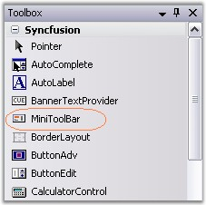
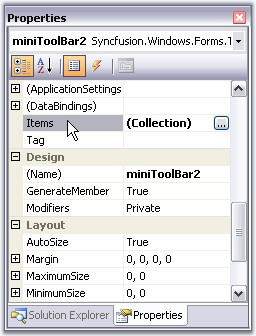
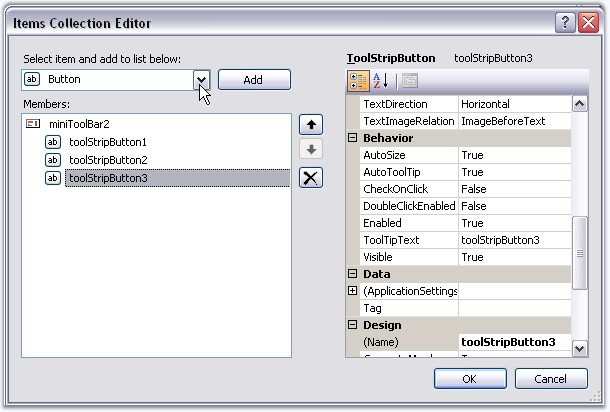
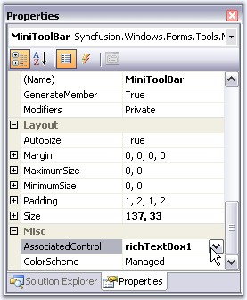
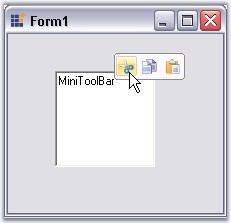
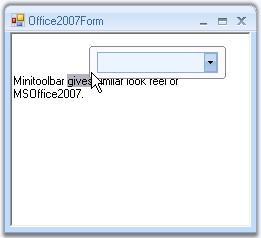

::: {style="DISPLAY: none"}
{#d2h_url_template}{#d2h_package_url style="WIDTH: 0px; DISPLAY: none; HEIGHT: 0px"}
:::

:::: {.d2h_secondary_topic style="PADDING-BOTTOM: 10pt; MARGIN: 0pt; PADDING-LEFT: 0pt; PADDING-RIGHT: 0pt; PADDING-TOP: 0pt"}
##### Creating MiniToolBar {#creating-minitoolbar style="tab-stops: 0pt"}

[]{style="COLOR: #15428b"} 

The sub topics under this section will guide you to create a MiniToolBar control, add controls to it and then associate it with a control. The topics are as follows.

[]{style="COLOR: #15428b"} 

 

 

 

 

###### 3.15.1.3.2.1        Through Designer {#through-designer style="tab-stops: 0pt"}

[]{style="COLOR: #15428b"} 

To add a MiniToolBar to the form, follow the below given steps.

[]{style="COLOR: #15428b"} 

[·      ]{style="FONT-FAMILY: Symbol"}Drag and drop a MiniToolBar from the toolbox.

[]{style="COLOR: #15428b"} 

{border="0"}

[]{style="COLOR: #15428b"} 

Figure 1396: MiniToolBar in Toolbox

[]{style="COLOR: #15428b"} 

[·      ]{style="FONT-FAMILY: Symbol"}Open the Items Collection Editor of the MiniToolBar.

[]{style="COLOR: #15428b"} 

{border="0"}

***[]{style="COLOR: #15428b"}*** 

Figure 1397: Items property in the Properties Grid

[]{style="COLOR: #15428b"} 

[·      ]{style="FONT-FAMILY: Symbol"}Add the required items into the MiniToolBar from the Items collection Editor and click Ok.

[]{style="COLOR: #15428b"} 

{border="0"}

***[]{style="COLOR: #15428b"}*** 

Figure 1398: Items Collection Editor

[]{style="COLOR: #15428b"} 

[·      ]{style="FONT-FAMILY: Symbol"}Now, drag and drop the control with which the MiniToolBar is to be associated, for eg. a RichTextBox.

[·      ]{style="FONT-FAMILY: Symbol"}Set the MiniToolBar\'s AssociatedControl property to the control to which this is to be associated.

[]{style="COLOR: #15428b"} 

{border="0"}

[]{style="COLOR: #15428b"} 

Figure 1399: AssociatedControl property of MiniToolBar

[]{style="COLOR: #15428b"} 

[·      ]{style="FONT-FAMILY: Symbol"}Run the sample and right-click on the RichTextBox to view the MiniToolBar.

[]{style="COLOR: #15428b"} 

{border="0"}

***[]{style="COLOR: #15428b"}*** 

Figure 1400: MiniToolBar created Through Designer

[]{style="COLOR: #15428b"} 

::: {style="BORDER-BOTTOM: windowtext 1pt solid; BORDER-LEFT: medium none; PADDING-BOTTOM: 1pt; MARGIN: 9pt 0pt 9pt 18pt; PADDING-LEFT: 0pt; PADDING-RIGHT: 0pt; BORDER-TOP: windowtext 1pt solid; BORDER-RIGHT: medium none; PADDING-TOP: 1pt"}
 

{border="0"} Note: You can also show a MiniToolBar by just selecting the text, as in MSOffice2007, using MouseUp event of the particular control.
:::

[]{style="COLOR: #15428b"} 

A sample which demonstrates this features is available in the below sample installation location.

 

***..\\My Documents\\Syncfusion\\EssentialStudio\\Version Number\\Windows\\Tools.Windows\\Samples\\2.0\\Office2007 Controls\\MiniToolBarDemo***

[]{style="COLOR: #15428b"} 

See Also

[]{style="COLOR: #15428b"} 

Creating MiniToolBar [[Through Code]{.UGHyperlink}](../../../../../../../../Documents%20and%20Settings/sylviap/Desktop/Tools%20-%20Part%202.docx#_Through_Code_3)[]{style="COLOR: black"}

 

 

###### 3.15.1.3.2.2        Through Code {#through-code style="tab-stops: 0pt"}

[]{style="COLOR: #15428b"} 

This section guides you with the steps to add a MiniToolbar and associating with a RichTextBox control programmatically.

[]{style="COLOR: #15428b"} 

[·      ]{style="FONT-FAMILY: Symbol"}Add the below namespaces.

[]{style="COLOR: #15428b"} 

+--------------------------------------------------------------------------------------------------------------------------------------------------------------------------+
| **[\[]{style="FONT-FAMILY: 'Courier New'; COLOR: black"}[C#\]]{style="FONT-FAMILY: 'Courier New'; COLOR: black"}[]{style="FONT-FAMILY: 'Courier New'; COLOR: black"}**   |
|                                                                                                                                                                          |
| []{style="COLOR: #15428b"}                                                                                                                                               |
|                                                                                                                                                                          |
| [using]{style="FONT-FAMILY: 'Courier New'; COLOR: blue"}[ Syncfusion.Windows.Forms;   ]{style="FONT-FAMILY: 'Courier New'"}                                              |
|                                                                                                                                                                          |
| [using]{style="FONT-FAMILY: 'Courier New'; COLOR: blue"}[ Syncfusion.Windows.Forms.Tools;    ]{style="FONT-FAMILY: 'Courier New'"}[]{style="FONT-FAMILY: 'Courier New'"} |
+--------------------------------------------------------------------------------------------------------------------------------------------------------------------------+

[]{#p1170}[]{style="COLOR: #15428b"} 

+-----------------------------------------------------------------------------------------------------------------------------------------------------------------------+
| **[\[VB\]]{style="FONT-FAMILY: 'Courier New'; COLOR: black"}**                                                                                                        |
|                                                                                                                                                                       |
| []{style="COLOR: #15428b"}                                                                                                                                            |
|                                                                                                                                                                       |
| [Imports]{style="FONT-FAMILY: 'Courier New'; COLOR: blue"}[ Syncfusion.Windows.Forms]{style="FONT-FAMILY: 'Courier New'"}                                             |
|                                                                                                                                                                       |
| [Imports]{style="FONT-FAMILY: 'Courier New'; COLOR: blue"}[ Syncfusion.Windows.Forms.Tools]{style="FONT-FAMILY: 'Courier New'"}[]{style="FONT-FAMILY: 'Courier New'"} |
+-----------------------------------------------------------------------------------------------------------------------------------------------------------------------+

[]{style="COLOR: #15428b"} 

[·      ]{style="FONT-FAMILY: Symbol"}Declare and Initialize the MiniToolBar control. Also declare the controls to be added to the MiniToolBar, and also the control (in this case RichTextBox) to which MiniToolBar is to be associated.

[]{style="COLOR: #15428b"} 

+-------------------------------------------------------------------------------------------------------------------------------------------------------------------------------------------------------------------------------------------------+
| **[\[C#\]]{style="FONT-FAMILY: 'Courier New'; COLOR: black"}**                                                                                                                                                                                  |
|                                                                                                                                                                                                                                                 |
| []{style="COLOR: #15428b"}                                                                                                                                                                                                                      |
|                                                                                                                                                                                                                                                 |
| [private]{style="FONT-FAMILY: 'Courier New'; COLOR: blue"}[ Syncfusion.Windows.Forms.Tools.[MiniToolBar]{style="COLOR: teal"} MiniToolBar;]{style="FONT-FAMILY: 'Courier New'"}                                                                 |
|                                                                                                                                                                                                                                                 |
| [private]{style="FONT-FAMILY: 'Courier New'; COLOR: blue"}[ System.Windows.Forms.[RichTextBox]{style="COLOR: teal"} richTextBox1;]{style="FONT-FAMILY: 'Courier New'"}                                                                          |
|                                                                                                                                                                                                                                                 |
| []{style="FONT-FAMILY: 'Courier New'"}                                                                                                                                                                                                          |
|                                                                                                                                                                                                                                                 |
| [//Control to be added to the MiniToolBar]{style="FONT-FAMILY: 'Courier New'; COLOR: green"}                                                                                                                                                    |
|                                                                                                                                                                                                                                                 |
| [private]{style="FONT-FAMILY: 'Courier New'; COLOR: blue"}[ Syncfusion.Windows.Forms.Tools.[ToolStripPanelItem]{style="COLOR: teal"} MiniToolBarPanelItem;]{style="FONT-FAMILY: 'Courier New'"}                                                 |
|                                                                                                                                                                                                                                                 |
| [private]{style="FONT-FAMILY: 'Courier New'; COLOR: blue"}[ Syncfusion.Windows.Forms.Tools.[ToolStripPanelItem]{style="COLOR: teal"} PanelItem1;]{style="FONT-FAMILY: 'Courier New'"}                                                           |
|                                                                                                                                                                                                                                                 |
| [private]{style="FONT-FAMILY: 'Courier New'; COLOR: blue"}[ System.Windows.Forms.[ToolStripComboBox]{style="COLOR: teal"} FontFaceCombo;]{style="FONT-FAMILY: 'Courier New'"}                                                                   |
|                                                                                                                                                                                                                                                 |
| []{style="FONT-FAMILY: 'Courier New'"}                                                                                                                                                                                                          |
|                                                                                                                                                                                                                                                 |
| [//initializing]{style="FONT-FAMILY: 'Courier New'; COLOR: green"}                                                                                                                                                                              |
|                                                                                                                                                                                                                                                 |
| [this]{style="FONT-FAMILY: 'Courier New'; COLOR: blue"}[.MiniToolBar = [new]{style="COLOR: blue"} Syncfusion.Windows.Forms.Tools.[MiniToolBar]{style="COLOR: teal"}();]{style="FONT-FAMILY: 'Courier New'"}                                     |
|                                                                                                                                                                                                                                                 |
| [this]{style="FONT-FAMILY: 'Courier New'; COLOR: blue"}[.richTextBox1 = [new]{style="COLOR: blue"} System.Windows.Forms.[RichTextBox]{style="COLOR: teal"}();]{style="FONT-FAMILY: 'Courier New'"}                                              |
|                                                                                                                                                                                                                                                 |
| [this]{style="FONT-FAMILY: 'Courier New'; COLOR: blue"}[.MiniToolBarPanelItem = [new]{style="COLOR: blue"} Syncfusion.Windows.Forms.Tools.[ToolStripPanelItem]{style="COLOR: teal"}();]{style="FONT-FAMILY: 'Courier New'"}                     |
|                                                                                                                                                                                                                                                 |
| [this]{style="FONT-FAMILY: 'Courier New'; COLOR: blue"}[.PanelItem1 = [new]{style="COLOR: blue"} Syncfusion.Windows.Forms.Tools.[ToolStripPanelItem]{style="COLOR: teal"}();]{style="FONT-FAMILY: 'Courier New'"}                               |
|                                                                                                                                                                                                                                                 |
| [this]{style="FONT-FAMILY: 'Courier New'; COLOR: blue"}[.FontFaceCombo = [new]{style="COLOR: blue"} System.Windows.Forms.[ToolStripComboBox]{style="COLOR: teal"}();]{style="FONT-FAMILY: 'Courier New'"}[]{style="FONT-FAMILY: 'Courier New'"} |
+-------------------------------------------------------------------------------------------------------------------------------------------------------------------------------------------------------------------------------------------------+

[]{style="COLOR: #15428b"} 

+----------------------------------------------------------------------------------------------------------------------------------------------------------------------------------------------------+
| **[\[]{style="FONT-FAMILY: 'Courier New'; COLOR: black"}[VB\]]{style="FONT-FAMILY: 'Courier New'; COLOR: black"}[]{style="FONT-FAMILY: 'Courier New'; COLOR: black"}**                             |
|                                                                                                                                                                                                    |
| []{style="COLOR: #15428b"}                                                                                                                                                                         |
|                                                                                                                                                                                                    |
| [Private]{style="FONT-FAMILY: 'Courier New'; COLOR: blue"}[ MiniToolBar [As]{style="COLOR: blue"} Syncfusion.Windows.Forms.Tools.MiniToolBar]{style="FONT-FAMILY: 'Courier New'"}                  |
|                                                                                                                                                                                                    |
| [Private]{style="FONT-FAMILY: 'Courier New'; COLOR: blue"}[ richTextBox1 [As]{style="COLOR: blue"} System.Windows.Forms.RichTextBox]{style="FONT-FAMILY: 'Courier New'"}                           |
|                                                                                                                                                                                                    |
| []{style="FONT-FAMILY: 'Courier New'"}                                                                                                                                                             |
|                                                                                                                                                                                                    |
| [\'Control to be added to the MiniToolBar]{style="FONT-FAMILY: 'Courier New'; COLOR: green"}                                                                                                       |
|                                                                                                                                                                                                    |
| [Private]{style="FONT-FAMILY: 'Courier New'; COLOR: blue"}[ MiniToolBarPanelItem [As]{style="COLOR: blue"} Syncfusion.Windows.Forms.Tools.ToolStripPanelItem]{style="FONT-FAMILY: 'Courier New'"}  |
|                                                                                                                                                                                                    |
| [Private]{style="FONT-FAMILY: 'Courier New'; COLOR: blue"}[ PanelItem1 [As]{style="COLOR: blue"} Syncfusion.Windows.Forms.Tools.ToolStripPanelItem]{style="FONT-FAMILY: 'Courier New'"}            |
|                                                                                                                                                                                                    |
| [Private]{style="FONT-FAMILY: 'Courier New'; COLOR: blue"}[ FontFaceCombo [As]{style="COLOR: blue"} System.Windows.Forms.ToolStripComboBox]{style="FONT-FAMILY: 'Courier New'"}                    |
|                                                                                                                                                                                                    |
| []{style="FONT-FAMILY: 'Courier New'"}                                                                                                                                                             |
|                                                                                                                                                                                                    |
| [\'Initializing]{style="FONT-FAMILY: 'Courier New'; COLOR: green"}                                                                                                                                 |
|                                                                                                                                                                                                    |
| [Me]{style="FONT-FAMILY: 'Courier New'; COLOR: blue"}[.MiniToolBar = [New]{style="COLOR: blue"} Syncfusion.Windows.Forms.Tools.MiniToolBar() ]{style="FONT-FAMILY: 'Courier New'"}                 |
|                                                                                                                                                                                                    |
| [Me]{style="FONT-FAMILY: 'Courier New'; COLOR: blue"}[.richTextBox1 = [New]{style="COLOR: blue"} System.Windows.Forms.RichTextBox() ]{style="FONT-FAMILY: 'Courier New'"}                          |
|                                                                                                                                                                                                    |
| [Me]{style="FONT-FAMILY: 'Courier New'; COLOR: blue"}[.MiniToolBarPanelItem = [New]{style="COLOR: blue"} Syncfusion.Windows.Forms.Tools.ToolStripPanelItem() ]{style="FONT-FAMILY: 'Courier New'"} |
|                                                                                                                                                                                                    |
| [Me]{style="FONT-FAMILY: 'Courier New'; COLOR: blue"}[.PanelItem1 = [New]{style="COLOR: blue"} Syncfusion.Windows.Forms.Tools.ToolStripPanelItem() ]{style="FONT-FAMILY: 'Courier New'"}           |
|                                                                                                                                                                                                    |
| [Me]{style="FONT-FAMILY: 'Courier New'; COLOR: blue"}[.FontFaceCombo = [New]{style="COLOR: blue"} System.Windows.Forms.ToolStripComboBox() ]{style="FONT-FAMILY: 'Courier New'"}                   |
+----------------------------------------------------------------------------------------------------------------------------------------------------------------------------------------------------+

[]{style="COLOR: #15428b"} 

[·      ]{style="FONT-FAMILY: Symbol"}Add the required items into the MiniToolBar.

[]{style="COLOR: #15428b"} 

+------------------------------------------------------------------------------------------------------------------------------------------------------------------------------------------------------------------------------------------------------------------------+
| **[\[]{style="FONT-FAMILY: 'Courier New'; COLOR: black"}[C#\]]{style="FONT-FAMILY: 'Courier New'; COLOR: black"}[]{style="FONT-FAMILY: 'Courier New'; COLOR: black"}**                                                                                                 |
|                                                                                                                                                                                                                                                                        |
| []{style="COLOR: #15428b"}                                                                                                                                                                                                                                             |
|                                                                                                                                                                                                                                                                        |
| [//Adding Panel]{style="FONT-FAMILY: 'Courier New'; COLOR: green"}                                                                                                                                                                                                     |
|                                                                                                                                                                                                                                                                        |
| [this]{style="FONT-FAMILY: 'Courier New'; COLOR: blue"}[.MiniToolBar.Items.AddRange([new]{style="COLOR: blue"} System.Windows.Forms.[ToolStripItem]{style="COLOR: teal"}\[\] {[this]{style="COLOR: blue"}.MiniToolBarPanelItem});]{style="FONT-FAMILY: 'Courier New'"} |
|                                                                                                                                                                                                                                                                        |
| []{style="FONT-FAMILY: 'Courier New'; COLOR: green"}                                                                                                                                                                                                                   |
|                                                                                                                                                                                                                                                                        |
| [//Customizing MiniToolBarPanelItem]{style="FONT-FAMILY: 'Courier New'; COLOR: green"}                                                                                                                                                                                 |
|                                                                                                                                                                                                                                                                        |
| [this]{style="FONT-FAMILY: 'Courier New'; COLOR: blue"}[.MiniToolBarPanelItem.ForeColor = System.Drawing.[Color]{style="COLOR: teal"}.MidnightBlue;]{style="FONT-FAMILY: 'Courier New'"}                                                                               |
|                                                                                                                                                                                                                                                                        |
| [this]{style="FONT-FAMILY: 'Courier New'; COLOR: blue"}[.MiniToolBarPanelItem.Items.AddRange([new]{style="COLOR: blue"} System.Windows.Forms.[ToolStripItem]{style="COLOR: teal"}\[\] {[this]{style="COLOR: blue"}.PanelItem1});]{style="FONT-FAMILY: 'Courier New'"}  |
|                                                                                                                                                                                                                                                                        |
| []{style="FONT-FAMILY: 'Courier New'; COLOR: green"}                                                                                                                                                                                                                   |
|                                                                                                                                                                                                                                                                        |
| [//Customizing the Panel]{style="FONT-FAMILY: 'Courier New'; COLOR: green"}                                                                                                                                                                                            |
|                                                                                                                                                                                                                                                                        |
| [this]{style="FONT-FAMILY: 'Courier New'; COLOR: blue"}[.PanelItem1.Items.AddRange([new]{style="COLOR: blue"} System.Windows.Forms.[ToolStripItem]{style="COLOR: teal"}\[\] {[this]{style="COLOR: blue"}.FontFaceCombo});]{style="FONT-FAMILY: 'Courier New'"}         |
|                                                                                                                                                                                                                                                                        |
| []{style="FONT-FAMILY: 'Courier New'; COLOR: green"}                                                                                                                                                                                                                   |
|                                                                                                                                                                                                                                                                        |
| [//Customizing the FontFaceCombo]{style="FONT-FAMILY: 'Courier New'; COLOR: green"}                                                                                                                                                                                    |
|                                                                                                                                                                                                                                                                        |
| [this]{style="FONT-FAMILY: 'Courier New'; COLOR: blue"}[.FontFaceCombo.DropDownStyle = System.Windows.Forms.[ComboBoxStyle]{style="COLOR: teal"}.DropDownList;      ]{style="FONT-FAMILY: 'Courier New'"}                                                              |
+------------------------------------------------------------------------------------------------------------------------------------------------------------------------------------------------------------------------------------------------------------------------+

[]{style="COLOR: #15428b"} 

+------------------------------------------------------------------------------------------------------------------------------------------------------------------------------------------------------------------------------------------+
| **[\[]{style="FONT-FAMILY: 'Courier New'; COLOR: black"}[VB\]]{style="FONT-FAMILY: 'Courier New'; COLOR: black"}[]{style="FONT-FAMILY: 'Courier New'; COLOR: black"}**                                                                   |
|                                                                                                                                                                                                                                          |
| []{style="COLOR: #15428b"}                                                                                                                                                                                                               |
|                                                                                                                                                                                                                                          |
| [\'Adding Panel]{style="FONT-FAMILY: 'Courier New'; COLOR: green"}                                                                                                                                                                       |
|                                                                                                                                                                                                                                          |
| [Me]{style="FONT-FAMILY: 'Courier New'; COLOR: blue"}[.MiniToolBar.Items.AddRange([New]{style="COLOR: blue"} System.Windows.Forms.ToolStripItem() {[Me]{style="COLOR: blue"}.MiniToolBarPanelItem})]{style="FONT-FAMILY: 'Courier New'"} |
|                                                                                                                                                                                                                                          |
| []{style="FONT-FAMILY: 'Courier New'; COLOR: green"}                                                                                                                                                                                     |
|                                                                                                                                                                                                                                          |
| [\'Customizing MiniToolBarPanelItem]{style="FONT-FAMILY: 'Courier New'; COLOR: green"}                                                                                                                                                   |
|                                                                                                                                                                                                                                          |
| [Me]{style="FONT-FAMILY: 'Courier New'; COLOR: blue"}[.MiniToolBarPanelItem.ForeColor = System.Drawing.Color.MidnightBlue ]{style="FONT-FAMILY: 'Courier New'"}                                                                          |
|                                                                                                                                                                                                                                          |
| [Me]{style="FONT-FAMILY: 'Courier New'; COLOR: blue"}[.MiniToolBarPanelItem.Items.AddRange([New]{style="COLOR: blue"} System.Windows.Forms.ToolStripItem() {[Me]{style="COLOR: blue"}.PanelItem1})]{style="FONT-FAMILY: 'Courier New'"}  |
|                                                                                                                                                                                                                                          |
| []{style="FONT-FAMILY: 'Courier New'; COLOR: green"}                                                                                                                                                                                     |
|                                                                                                                                                                                                                                          |
| [\'Customizing the Panel]{style="FONT-FAMILY: 'Courier New'; COLOR: green"}                                                                                                                                                              |
|                                                                                                                                                                                                                                          |
| [Me]{style="FONT-FAMILY: 'Courier New'; COLOR: blue"}[.PanelItem1.Items.AddRange([New]{style="COLOR: blue"} System.Windows.Forms.ToolStripItem() {[Me]{style="COLOR: blue"}.FontFaceCombo})]{style="FONT-FAMILY: 'Courier New'"}         |
|                                                                                                                                                                                                                                          |
| []{style="FONT-FAMILY: 'Courier New'; COLOR: green"}                                                                                                                                                                                     |
|                                                                                                                                                                                                                                          |
| [\'Customizing the FontFaceCombo]{style="FONT-FAMILY: 'Courier New'; COLOR: green"}                                                                                                                                                      |
|                                                                                                                                                                                                                                          |
| [Me]{style="FONT-FAMILY: 'Courier New'; COLOR: blue"}[.FontFaceCombo.DropDownStyle = System.Windows.Forms.ComboBoxStyle.DropDownList]{style="FONT-FAMILY: 'Courier New'"}[]{style="FONT-FAMILY: 'Courier New'"}                          |
+------------------------------------------------------------------------------------------------------------------------------------------------------------------------------------------------------------------------------------------+

[]{style="COLOR: #15428b"} 

[·      ]{style="FONT-FAMILY: Symbol"}Set the MiniToolBar\'s **AssociatedControl** property to the RichTextBox to which this is to be associated.

[]{style="COLOR: #15428b"} 

+-------------------------------------------------------------------------------------------------------------------------------------------------------------------------------------------------------------------------+
| **[\[]{style="FONT-FAMILY: 'Courier New'; COLOR: black"}[C#\]]{style="FONT-FAMILY: 'Courier New'; COLOR: black"}[]{style="FONT-FAMILY: 'Courier New'; COLOR: black"}**                                                  |
|                                                                                                                                                                                                                         |
| []{style="COLOR: #15428b"}                                                                                                                                                                                              |
|                                                                                                                                                                                                                         |
| [//Associates the MiniToolBar with the RichTextBox]{style="FONT-FAMILY: 'Courier New'; COLOR: green"}                                                                                                                   |
|                                                                                                                                                                                                                         |
| [this]{style="FONT-FAMILY: 'Courier New'; COLOR: blue"}[.MiniToolBar.AssociatedControl = [this]{style="COLOR: blue"}.richTextBox1;          ]{style="FONT-FAMILY: 'Courier New'"}[]{style="FONT-FAMILY: 'Courier New'"} |
+-------------------------------------------------------------------------------------------------------------------------------------------------------------------------------------------------------------------------+

[]{#p1171}[]{style="COLOR: #15428b"} 

+----------------------------------------------------------------------------------------------------------------------------------------------------------------------------------------------------------+
| **[\[VB\]]{style="FONT-FAMILY: 'Courier New'; COLOR: black"}**                                                                                                                                           |
|                                                                                                                                                                                                          |
| []{style="COLOR: #15428b"}                                                                                                                                                                               |
|                                                                                                                                                                                                          |
| [\'Associates the MiniToolBar with the RichTextBox]{style="FONT-FAMILY: 'Courier New'; COLOR: green"}                                                                                                    |
|                                                                                                                                                                                                          |
| [Me]{style="FONT-FAMILY: 'Courier New'; COLOR: blue"}[.MiniToolBar.AssociatedControl = [Me]{style="COLOR: blue"}.richTextBox1]{style="FONT-FAMILY: 'Courier New'"}[]{style="FONT-FAMILY: 'Courier New'"} |
+----------------------------------------------------------------------------------------------------------------------------------------------------------------------------------------------------------+

[]{style="COLOR: #15428b"} 

[·      ]{style="FONT-FAMILY: Symbol"}Run the sample and right-click on the RichTextBox to view the MiniToolBar.

[]{style="COLOR: #15428b"} 

{border="0"}

[]{style="COLOR: #15428b"} 

***[]{style="COLOR: #15428b"}*** 

Figure 1401: MiniToolbar with FontFaceCombo on a RichTextBox

**[]{style="COLOR: #15428b"}** 

A sample which demonstrates how to create and add controls to the MiniToolBar is available in the below sample installation location.

**** 

***..\\My Documents\\Syncfusion\\EssentialStudio\\Version Number\\Windows\\Tools.Windows\\Samples\\2.0\\Office2007 Controls\\MiniToolBarDemo***

 

 

[]{#related-topics}
::::
