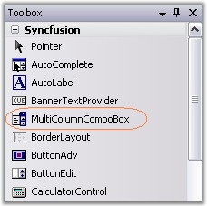

::: {style="DISPLAY: none"}
{#d2h_url_template}{#d2h_package_url style="WIDTH: 0px; DISPLAY: none; HEIGHT: 0px"}
:::

::: {.d2h_secondary_topic style="PADDING-BOTTOM: 10pt; MARGIN: 0pt; PADDING-LEFT: 0pt; PADDING-RIGHT: 0pt; PADDING-TOP: 0pt"}
##### Creating MultiColumnComboBox {#creating-multicolumncombobox style="tab-stops: 0pt"}

[]{#p418}[]{style="COLOR: #15428b"} 

The MultiColumnComboBox control provides full support for the Windows Forms designer. To use a MultiColumnComboBox control in your application, all you need to do is drag-and-drop the MultiColumnComboBox control from the toolbox onto your form. You can then set any of its properties through the property grid.

**[]{style="COLOR: navy"}** 

{border="0"}

[]{style="COLOR: #15428b"} 

Figure 369: MultiColumnComboBox in the Toolbox

[]{style="COLOR: #15428b"} 

The MultiColumnComboBox can be created programmatically through code as detailed below.

[]{style="COLOR: #15428b"} 

1.   Include the required namespace.

[]{style="COLOR: #15428b"} 

+--------------------------------------------------------------------------------------------------------------------------------+
| **[\[C#\]]{style="FONT-FAMILY: 'Courier New'; COLOR: black"}**                                                                 |
|                                                                                                                                |
| []{style="COLOR: #15428b"}                                                                                                     |
|                                                                                                                                |
| [using ]{style="FONT-FAMILY: 'Courier New'; COLOR: blue"}[Syncfusion.Windows.Forms.Tools;]{style="FONT-FAMILY: 'Courier New'"} |
+--------------------------------------------------------------------------------------------------------------------------------+

[]{style="COLOR: #15428b"} 

+---------------------------------------------------------------------------------------------------------------------------------+
| **[\[VB.NET\]]{style="FONT-FAMILY: 'Courier New'; COLOR: black"}**                                                              |
|                                                                                                                                 |
| []{style="COLOR: #15428b"}                                                                                                      |
|                                                                                                                                 |
| [Imports]{style="FONT-FAMILY: 'Courier New'; COLOR: blue"}[ Syncfusion.Windows.Forms.Tools]{style="FONT-FAMILY: 'Courier New'"} |
+---------------------------------------------------------------------------------------------------------------------------------+

[]{style="COLOR: #15428b"} 

2.   Create an instance of MultiColumnComboBox. Add that instance to the Form.

[]{style="COLOR: #15428b"} 

+-----------------------------------------------------------------------------------------------------------------------------------------------------------------------------------------------------+
| **[\[C#\]]{style="FONT-FAMILY: 'Courier New'; COLOR: black"}**                                                                                                                                      |
|                                                                                                                                                                                                     |
| []{style="COLOR: #15428b"}                                                                                                                                                                          |
|                                                                                                                                                                                                     |
| [private]{style="FONT-FAMILY: 'Courier New'; COLOR: blue"}[ Syncfusion.Windows.Forms.Tools.MultiColumnComboBox multiColumnComboBox1;]{style="FONT-FAMILY: 'Courier New'"}                           |
|                                                                                                                                                                                                     |
| [this]{style="FONT-FAMILY: 'Courier New'; COLOR: blue"}[.multiColumnComboBox1=[new]{style="COLOR: blue"} Syncfusion.Windows.Forms.Tools.MultiColumnComboBox();]{style="FONT-FAMILY: 'Courier New'"} |
|                                                                                                                                                                                                     |
| []{style="FONT-FAMILY: 'Courier New'"}                                                                                                                                                              |
|                                                                                                                                                                                                     |
| [this]{style="FONT-FAMILY: 'Courier New'; COLOR: blue"}[.Controls.Add([this]{style="COLOR: blue"}.multiColumnComboBox1);]{style="FONT-FAMILY: 'Courier New'"}                                       |
+-----------------------------------------------------------------------------------------------------------------------------------------------------------------------------------------------------+

[]{style="COLOR: #15428b"} 

+----------------------------------------------------------------------------------------------------------------------------------------------------------------------------------------------------+
| **[\[VB.NET\]]{style="FONT-FAMILY: 'Courier New'; COLOR: black"}**                                                                                                                                 |
|                                                                                                                                                                                                    |
| []{style="COLOR: #15428b"}                                                                                                                                                                         |
|                                                                                                                                                                                                    |
| [Private]{style="FONT-FAMILY: 'Courier New'; COLOR: blue"}[ multiColumnComboBox1 [As]{style="COLOR: blue"} Syncfusion.Windows.Forms.Tools.MultiColumnComboBox]{style="FONT-FAMILY: 'Courier New'"} |
|                                                                                                                                                                                                    |
| [Me]{style="FONT-FAMILY: 'Courier New'; COLOR: blue"}[.multiColumnComboBox1 = [New]{style="COLOR: blue"} Syncfusion.Windows.Forms.Tools.MultiColumnComboBox()]{style="FONT-FAMILY: 'Courier New'"} |
|                                                                                                                                                                                                    |
| []{style="FONT-FAMILY: 'Courier New'"}                                                                                                                                                             |
|                                                                                                                                                                                                    |
| [Me]{style="FONT-FAMILY: 'Courier New'; COLOR: blue"}[.Controls.Add([Me]{style="COLOR: blue"}.multiColumnComboBox1)]{style="FONT-FAMILY: 'Courier New'"}                                           |
+----------------------------------------------------------------------------------------------------------------------------------------------------------------------------------------------------+

[]{style="COLOR: #15428b"} 

After creating MultiColumnComboBox, you can bound them using data source. Refer Databinding.[]{style="COLOR: black"}

[]{style="COLOR: #15428b"} 

See also

[]{style="COLOR: #15428b"} 

[Concepts and Features]{.UGHyperlink}[]{.UGHyperlink}

[]{#related-topics}
:::
