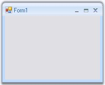

::: {style="DISPLAY: none"}
{#d2h_url_template}{#d2h_package_url style="WIDTH: 0px; DISPLAY: none; HEIGHT: 0px"}
:::

::: {.d2h_secondary_topic style="PADDING-BOTTOM: 10pt; MARGIN: 0pt; PADDING-LEFT: 0pt; PADDING-RIGHT: 0pt; PADDING-TOP: 0pt"}
##### Creating Office2007Form {#creating-office2007form style="tab-stops: 0pt"}

[]{style="COLOR: #15428b"} 

The default forms can be changed into the Office2007 Form by following the below given steps.

[]{style="COLOR: #15428b"} 

1.               Open a Visual Studio project.

2.   Add the assembly Syncfusion.Shared.Base in the reference. (Right click the References in the Solution explorer and click Add Reference to add the assembly.

3.   In the form\'s code Editor, add the namespace.

[]{style="COLOR: #15428b"} 

+----------------------------------------------------------------------------------------------------------------------------------------------------------------+
| **[\[C#\]]{style="FONT-FAMILY: 'Courier New'; COLOR: black"}**                                                                                                 |
|                                                                                                                                                                |
| []{style="COLOR: #15428b"}                                                                                                                                     |
|                                                                                                                                                                |
| [using]{style="FONT-FAMILY: 'Courier New'; COLOR: blue"}[ Syncfusion.Windows.Forms;]{style="FONT-FAMILY: 'Courier New'"}[]{style="FONT-FAMILY: 'Courier New'"} |
+----------------------------------------------------------------------------------------------------------------------------------------------------------------+

[]{style="COLOR: #15428b"} 

+-----------------------------------------------------------------------------------------------------------------------------------------------------------------+
| **[\[VB.NET\]]{style="FONT-FAMILY: 'Courier New'; COLOR: black"}**                                                                                              |
|                                                                                                                                                                 |
| []{style="COLOR: #15428b"}                                                                                                                                      |
|                                                                                                                                                                 |
| [Imports]{style="FONT-FAMILY: 'Courier New'; COLOR: blue"}[ Syncfusion.Windows.Forms]{style="FONT-FAMILY: 'Courier New'"}[]{style="FONT-FAMILY: 'Courier New'"} |
+-----------------------------------------------------------------------------------------------------------------------------------------------------------------+

[]{style="COLOR: #15428b"} 

4.   Now change your class to inherit the Office2007Form instead of the default Form as follows.[]{#p1094}

[]{style="COLOR: #15428b"} 

+--------------------------------------------------------------------------------------------------------------------------------------------------------------------------------------------------------------------------------------------------------------------------------------+
| **[\[C#\]]{style="FONT-FAMILY: 'Courier New'; COLOR: black"}**                                                                                                                                                                                                                       |
|                                                                                                                                                                                                                                                                                      |
| []{style="COLOR: #15428b"}                                                                                                                                                                                                                                                           |
|                                                                                                                                                                                                                                                                                      |
| [public]{style="FONT-FAMILY: 'Courier New'; COLOR: blue"}[ [partial]{style="COLOR: blue"} [class]{style="COLOR: blue"} [Form1]{style="COLOR: teal"} : [Office2007Form ]{style="COLOR: teal"}]{style="FONT-FAMILY: 'Courier New'"}[]{style="FONT-FAMILY: 'Courier New'; COLOR: teal"} |
+--------------------------------------------------------------------------------------------------------------------------------------------------------------------------------------------------------------------------------------------------------------------------------------+

[]{style="COLOR: #15428b"} 

+--------------------------------------------------------------------------------------------------------------------------------------------------------------------------------------------------------------------------------------------------------+
| **[\[VB.NET\]]{style="FONT-FAMILY: 'Courier New'; COLOR: black"}**                                                                                                                                                                                     |
|                                                                                                                                                                                                                                                        |
| []{style="COLOR: #15428b"}                                                                                                                                                                                                                             |
|                                                                                                                                                                                                                                                        |
| [Partial]{style="FONT-FAMILY: 'Courier New'; COLOR: blue"}[ [Public]{style="COLOR: blue"} [Class]{style="COLOR: blue"} Form1 [Inherits]{style="COLOR: blue"} Office2007Form]{style="FONT-FAMILY: 'Courier New'"}[]{style="FONT-FAMILY: 'Courier New'"} |
+--------------------------------------------------------------------------------------------------------------------------------------------------------------------------------------------------------------------------------------------------------+

[]{style="COLOR: #15428b"} 

{border="0"}

[]{style="COLOR: #15428b"} 

Figure 1292: Default Form Changed to OfficeForm

 

[]{#related-topics}
:::
