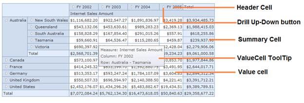

::: {style="DISPLAY: none"}
{#d2h_url_template}{#d2h_package_url style="WIDTH: 0px; DISPLAY: none; HEIGHT: 0px"}
:::

::::: {#nsbanner .d2h_main_nsbanner style="BORDER-BOTTOM: #999999 1px solid; POSITION: relative; PADDING-BOTTOM: 0px; BACKGROUND-COLOR: transparent; PADDING-LEFT: 0px; PADDING-RIGHT: 0px; DISPLAY: none; BORDER-TOP: #999999 1px solid; PADDING-TOP: 0px; LEFT: 0px"}
:::: {#TitleRow .d2h_main_titlerow style="PADDING-BOTTOM: 4px; BACKGROUND-COLOR: transparent; PADDING-LEFT: 22px; WIDTH: 100%; PADDING-RIGHT: 10px; DISPLAY: none; PADDING-TOP: 4px"}
::: {#ienav .d2h_main_ienav style="DISPLAY: none"}
{#D2HPrevious .D2HPreviousEnabled}  {#D2HNext .D2HNextEnabled}
:::
::::
:::::

:::: {#nstext .d2h_main_nstext style="PADDING-BOTTOM: 10px; BACKGROUND-COLOR: transparent; PADDING-LEFT: 22px; PADDING-RIGHT: 10px; HEIGHT: 100%; OVERFLOW: auto; PADDING-TOP: 5px" hasuserbackground="true" valign="bottom"}
::: {#d2h_breadcrumbs .d2h_breadcrumbs}
[Essential Studio User Guide Documentation](ms-xhelp:///?Id=12457748-09e3-4d74-a240-8e049cedf030){.d2h_breadcrumbsNormal}[ \> ]{.d2h_breadcrumbsLinkSeparator}[Business Intelligence Edition](ms-xhelp:///?Id=fdf33dd8-62b2-47b9-ad7b-fc50e590bca5){.d2h_breadcrumbsNormal}[ \> ]{.d2h_breadcrumbsLinkSeparator}[Essential BI ASP.NET MVC](ms-xhelp:///?Id=32b055b8-3bdf-473c-bb73-f99a534ce79c){.d2h_breadcrumbsNormal}[ \> ]{.d2h_breadcrumbsLinkSeparator}[Essential BI Grid]{.d2h_breadcrumbsContentsOnly}[ \> ]{.d2h_breadcrumbsLinkSeparator}[Getting Started](ms-xhelp:///?Id=8ba9d2bc-b57b-4d5f-ba35-37730bccec4e){.d2h_breadcrumbsNormal}[ \> ]{.d2h_breadcrumbsLinkSeparator}[Add StyleManager and ScriptManager](ms-xhelp:///?Id=24538c71-e60b-4198-93f7-03bc4185014a){.d2h_breadcrumbsNormal}
:::

### Creating OlapDataManager in Controller and Passing it to View {#creating-olapdatamanager-in-controller-and-passing-it-to-view style="tab-stops: 0pt"}

 

To create OLAP DataManager in Controller and pass it to View:

1.   Add the following code in the HomeController:

 

+-----------------------------------------------------------------------------------------------------------------------------------------------------------------------------------------------------------------------------------------------------------------------------------------------------------------+
| **[\[CS\]]{style="FONT-FAMILY: 'Courier New'"}**                                                                                                                                                                                                                                                                |
|                                                                                                                                                                                                                                                                                                                 |
| **[]{style="FONT-FAMILY: 'Courier New'"}**                                                                                                                                                                                                                                                                      |
|                                                                                                                                                                                                                                                                                                                 |
| [private]{style="FONT-FAMILY: Consolas; COLOR: blue; FONT-SIZE: 9.5pt"}[ [OlapDataManager]{style="COLOR: #2b91af"} GetOlapDataManger([bool]{style="COLOR: blue"} isGetRequest)]{style="FONT-FAMILY: Consolas; FONT-SIZE: 9.5pt"}                                                                                |
|                                                                                                                                                                                                                                                                                                                 |
| [        {]{style="FONT-FAMILY: Consolas; FONT-SIZE: 9.5pt"}                                                                                                                                                                                                                                                    |
|                                                                                                                                                                                                                                                                                                                 |
| []{style="FONT-FAMILY: Consolas; FONT-SIZE: 9.5pt"}                                                                                                                                                                                                                                                             |
|                                                                                                                                                                                                                                                                                                                 |
| [            [var]{style="COLOR: blue"} manager = [new]{style="COLOR: blue"} [OlapDataManager]{style="COLOR: #2b91af"}([this]{style="COLOR: blue"}.GetConnectionString());]{style="FONT-FAMILY: Consolas; FONT-SIZE: 9.5pt"}                                                                                    |
|                                                                                                                                                                                                                                                                                                                 |
| []{style="FONT-FAMILY: Consolas; FONT-SIZE: 9.5pt"}                                                                                                                                                                                                                                                             |
|                                                                                                                                                                                                                                                                                                                 |
| [            [if]{style="COLOR: blue"} (isGetRequest)]{style="FONT-FAMILY: Consolas; FONT-SIZE: 9.5pt"}                                                                                                                                                                                                         |
|                                                                                                                                                                                                                                                                                                                 |
| [                manager.SetCurrentReport(CreateOlapReport());]{style="FONT-FAMILY: Consolas; FONT-SIZE: 9.5pt"}                                                                                                                                                                                                |
|                                                                                                                                                                                                                                                                                                                 |
| []{style="FONT-FAMILY: Consolas; FONT-SIZE: 9.5pt"}                                                                                                                                                                                                                                                             |
|                                                                                                                                                                                                                                                                                                                 |
| [            [return]{style="COLOR: blue"} manager;]{style="FONT-FAMILY: Consolas; FONT-SIZE: 9.5pt"}                                                                                                                                                                                                           |
|                                                                                                                                                                                                                                                                                                                 |
| [        }]{style="FONT-FAMILY: Consolas; FONT-SIZE: 9.5pt"}                                                                                                                                                                                                                                                    |
|                                                                                                                                                                                                                                                                                                                 |
| []{style="FONT-FAMILY: Consolas; FONT-SIZE: 9.5pt"}                                                                                                                                                                                                                                                             |
|                                                                                                                                                                                                                                                                                                                 |
| [        [private]{style="COLOR: blue"} [OlapReport]{style="COLOR: #2b91af"} CreateOlapReport()]{style="FONT-FAMILY: Consolas; FONT-SIZE: 9.5pt"}                                                                                                                                                               |
|                                                                                                                                                                                                                                                                                                                 |
| [        {]{style="FONT-FAMILY: Consolas; FONT-SIZE: 9.5pt"}                                                                                                                                                                                                                                                    |
|                                                                                                                                                                                                                                                                                                                 |
| [            [OlapReport]{style="COLOR: #2b91af"} olapReport = [new]{style="COLOR: blue"} [OlapReport]{style="COLOR: #2b91af"}();]{style="FONT-FAMILY: Consolas; FONT-SIZE: 9.5pt"}                                                                                                                             |
|                                                                                                                                                                                                                                                                                                                 |
| [            olapReport.CurrentCubeName = [\"Adventure Works\"]{style="COLOR: #a31515"};]{style="FONT-FAMILY: Consolas; FONT-SIZE: 9.5pt"}                                                                                                                                                                      |
|                                                                                                                                                                                                                                                                                                                 |
| []{style="FONT-FAMILY: Consolas; FONT-SIZE: 9.5pt"}                                                                                                                                                                                                                                                             |
|                                                                                                                                                                                                                                                                                                                 |
| [            [DimensionElement]{style="COLOR: #2b91af"} dimensionElement = [new]{style="COLOR: blue"} [DimensionElement]{style="COLOR: #2b91af"}() { Name = [\"Customer\"]{style="COLOR: #a31515"}, HierarchyName = [\"Customer\"]{style="COLOR: #a31515"} };]{style="FONT-FAMILY: Consolas; FONT-SIZE: 9.5pt"} |
|                                                                                                                                                                                                                                                                                                                 |
| [            dimensionElement.AddLevel([\"Customer Geography\"]{style="COLOR: #a31515"}, [\"Country\"]{style="COLOR: #a31515"});]{style="FONT-FAMILY: Consolas; FONT-SIZE: 9.5pt"}                                                                                                                              |
|                                                                                                                                                                                                                                                                                                                 |
| [            olapReport.SeriesElements.Add(dimensionElement);]{style="FONT-FAMILY: Consolas; FONT-SIZE: 9.5pt"}                                                                                                                                                                                                 |
|                                                                                                                                                                                                                                                                                                                 |
| []{style="FONT-FAMILY: Consolas; FONT-SIZE: 9.5pt"}                                                                                                                                                                                                                                                             |
|                                                                                                                                                                                                                                                                                                                 |
| [            dimensionElement = [new]{style="COLOR: blue"} [DimensionElement]{style="COLOR: #2b91af"}() { Name = [\"Date\"]{style="COLOR: #a31515"} };]{style="FONT-FAMILY: Consolas; FONT-SIZE: 9.5pt"}                                                                                                        |
|                                                                                                                                                                                                                                                                                                                 |
| [            dimensionElement.AddLevel([\"Fiscal\"]{style="COLOR: #a31515"}, [\"Fiscal Year\"]{style="COLOR: #a31515"});]{style="FONT-FAMILY: Consolas; FONT-SIZE: 9.5pt"}                                                                                                                                      |
|                                                                                                                                                                                                                                                                                                                 |
| [            olapReport.CategoricalElements.Add(dimensionElement);]{style="FONT-FAMILY: Consolas; FONT-SIZE: 9.5pt"}                                                                                                                                                                                            |
|                                                                                                                                                                                                                                                                                                                 |
| []{style="FONT-FAMILY: Consolas; FONT-SIZE: 9.5pt"}                                                                                                                                                                                                                                                             |
|                                                                                                                                                                                                                                                                                                                 |
| [            [MeasureElements]{style="COLOR: #2b91af"} measureElementColumn = [new]{style="COLOR: blue"} [MeasureElements]{style="COLOR: #2b91af"}();]{style="FONT-FAMILY: Consolas; FONT-SIZE: 9.5pt"}                                                                                                         |
|                                                                                                                                                                                                                                                                                                                 |
| [            measureElementColumn.Elements.Add([new]{style="COLOR: blue"} [MeasureElement]{style="COLOR: #2b91af"} { Name = [\"Internet Sales Amount\"]{style="COLOR: #a31515"} });]{style="FONT-FAMILY: Consolas; FONT-SIZE: 9.5pt"}                                                                           |
|                                                                                                                                                                                                                                                                                                                 |
| [            olapReport.CategoricalElements.Add(measureElementColumn);]{style="FONT-FAMILY: Consolas; FONT-SIZE: 9.5pt"}                                                                                                                                                                                        |
|                                                                                                                                                                                                                                                                                                                 |
| []{style="FONT-FAMILY: Consolas; FONT-SIZE: 9.5pt"}                                                                                                                                                                                                                                                             |
|                                                                                                                                                                                                                                                                                                                 |
| [            [return]{style="COLOR: blue"} olapReport;]{style="FONT-FAMILY: Consolas; FONT-SIZE: 9.5pt"}                                                                                                                                                                                                        |
|                                                                                                                                                                                                                                                                                                                 |
| [        }]{style="FONT-FAMILY: Consolas; FONT-SIZE: 9.5pt"}                                                                                                                                                                                                                                                    |
|                                                                                                                                                                                                                                                                                                                 |
| []{style="FONT-FAMILY: 'Courier New'"}                                                                                                                                                                                                                                                                          |
+-----------------------------------------------------------------------------------------------------------------------------------------------------------------------------------------------------------------------------------------------------------------------------------------------------------------+

 

2.   Run the application.

 

[]{style="COLOR: #c00000"} 

**[4.3 Appearance and]{style="COLOR: #4e84c4; FONT-SIZE: 16pt"}[ [Structure of the Control]{style="COLOR: #4e84c4"}]{style="FONT-SIZE: 16pt"}**

The appearance and structure of the control is displayed in the screenshot below:

{border="0"}

[]{#related-topics}
::::
