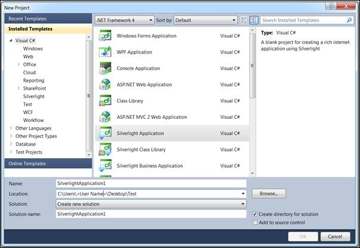
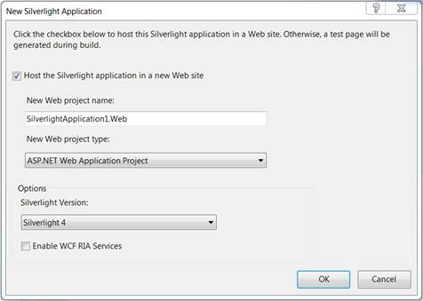
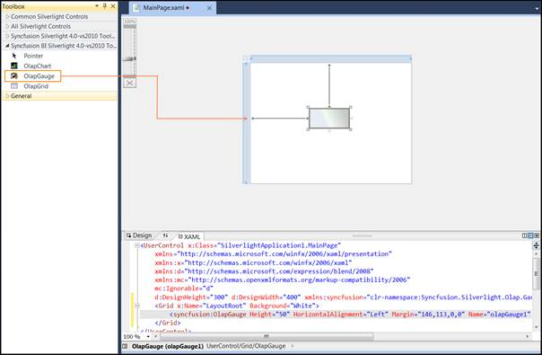
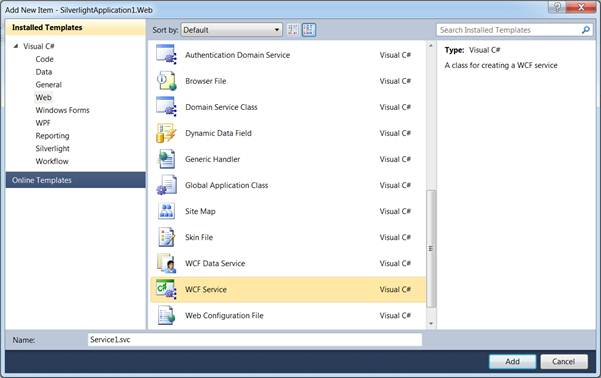

::: {style="DISPLAY: none"}
{#d2h_url_template}{#d2h_package_url style="WIDTH: 0px; DISPLAY: none; HEIGHT: 0px"}
:::

::::: {#nsbanner .d2h_main_nsbanner style="BORDER-BOTTOM: #999999 1px solid; POSITION: relative; PADDING-BOTTOM: 0px; BACKGROUND-COLOR: transparent; PADDING-LEFT: 0px; PADDING-RIGHT: 0px; DISPLAY: none; BORDER-TOP: #999999 1px solid; PADDING-TOP: 0px; LEFT: 0px"}
:::: {#TitleRow .d2h_main_titlerow style="PADDING-BOTTOM: 4px; BACKGROUND-COLOR: transparent; PADDING-LEFT: 22px; WIDTH: 100%; PADDING-RIGHT: 10px; DISPLAY: none; PADDING-TOP: 4px"}
::: {#ienav .d2h_main_ienav style="DISPLAY: none"}
{#D2HPrevious .D2HPreviousEnabled}  {#D2HNext .D2HNextEnabled}
:::
::::
:::::

:::: {#nstext .d2h_main_nstext style="PADDING-BOTTOM: 10px; BACKGROUND-COLOR: transparent; PADDING-LEFT: 22px; PADDING-RIGHT: 10px; HEIGHT: 100%; OVERFLOW: auto; PADDING-TOP: 5px" hasuserbackground="true" valign="bottom"}
::: {#d2h_breadcrumbs .d2h_breadcrumbs}
[Essential Studio User Guide Documentation](ms-xhelp:///?Id=12457748-09e3-4d74-a240-8e049cedf030){.d2h_breadcrumbsNormal}[ \> ]{.d2h_breadcrumbsLinkSeparator}[Business Intelligence Edition](ms-xhelp:///?Id=fdf33dd8-62b2-47b9-ad7b-fc50e590bca5){.d2h_breadcrumbsNormal}[ \> ]{.d2h_breadcrumbsLinkSeparator}[Essential BI Silverlight](ms-xhelp:///?Id=c006b39c-6aa2-4637-b7de-3e7b6cb3f9f9){.d2h_breadcrumbsNormal}[ \> ]{.d2h_breadcrumbsLinkSeparator}[Essential BI Gauge]{.d2h_breadcrumbsContentsOnly}[ \> ]{.d2h_breadcrumbsLinkSeparator}[Getting Started](ms-xhelp:///?Id=21ce653d-8ba2-404a-bc18-75249560b01a){.d2h_breadcrumbsNormal}
:::

## Creating OLAP Gauge for Silverlight {#creating-olap-gauge-for-silverlight style="tab-stops: 0pt"}

To create an OLAP gauge for Silverlight:

1.   Click Start [à]{style="FONT-FAMILY: Wingdings"}All Programs[à]{style="FONT-FAMILY: Wingdings"} Microsoft Visual Studio 2010.

2.   Now go to File [à]{style="FONT-FAMILY: Wingdings"} New [à]{style="FONT-FAMILY: Wingdings"} Project. The New Project dialog box appears as follows.

[]{style="FONT-FAMILY: 'Trebuchet MS','sans-serif'; COLOR: #15428b; FONT-SIZE: 9pt"} 

{border="0"}

 

Figure 6: "New Project" dialog box

3.   Select Silverlight Application and then click OK.

 

4.   Host the Silverlight application in a new Web site.

[]{style="FONT-FAMILY: 'Trebuchet MS','sans-serif'; COLOR: #15428b; FONT-SIZE: 9pt"} 

{border="0"}

 

Figure 7: Hosting Silverlight Application in a new Web site[]{style="FONT-FAMILY: 'Calibri','sans-serif'"}

***[]{style="FONT-FAMILY: 'Cambria','serif'; COLOR: black"}*** 

[]{style="FONT-FAMILY: 'Calibri','sans-serif'; FONT-SIZE: 9pt"} 

5.   Click *OK*, to create a web project as well as a Silverlight project.

6.   The *OLAP Gauge* control is now available under the *Syncfusion BI Silverlight 4.0 -- vs2010 Toolbox \<Essential studio version number\>* tab inside the toolbox panel. Drag and drop the OLAP Gauge control onto the design or XAML region.

[]{style="FONT-FAMILY: 'Calibri','sans-serif'"} 

[]{style="FONT-FAMILY: 'Calibri','sans-serif'"} 

{border="0"}

 

Figure 8: OLAP Gauge in designer

[]{style="FONT-FAMILY: 'Calibri','sans-serif'"} 

7.   Add the following assemblies as reference to the web project:

 

[·      ]{style="FONT-FAMILY: Symbol"}Syncfusion.Olap.Base

[·      ]{style="FONT-FAMILY: Symbol"}Syncfusion.OlapSilverlight.BaseWrapper

[        ]{style="FONT-FAMILY: 'Trebuchet MS','sans-serif'; COLOR: #15428b; FONT-SIZE: 9pt"}

8.   Add a WCF Service to the web project by right clicking *Project and navigating to Add New Item **-\>** WCF Service**.*** Then, name the Service as *OlapManager* and delete the *IOlapManager.cs* file as the service needs to be inherited with IOlapDataProvider.****

**** 

{border="0"}

 

Figure 9: WCF Service[]{style="FONT-FAMILY: 'Calibri','sans-serif'"}

9.   Inherit the newly added WCF service with *IOlapDataProvider* and implement it explicitly. The connection to the database is done with the help of WCF service. The service has to be created and instantiated as described below:

[]{style="FONT-FAMILY: 'Trebuchet MS','sans-serif'; COLOR: #15428b; FONT-SIZE: 9pt"} 

+-------------------------------------------------------------------------------------------------------------------------------------------------------------------------------------------------------------------------------------------------+
| **[\[C#\]]{style="FONT-FAMILY: 'Courier New'"}**                                                                                                                                                                                                |
|                                                                                                                                                                                                                                                 |
| **[]{style="FONT-FAMILY: 'Courier New'"}**                                                                                                                                                                                                      |
|                                                                                                                                                                                                                                                 |
| [public]{style="FONT-FAMILY: 'Courier New'; COLOR: blue"}[ [class]{style="COLOR: blue"} [OlapManager]{style="COLOR: #2b91af"} : [IOlapDataProvider]{style="COLOR: #2b91af"}]{style="FONT-FAMILY: 'Courier New'"}                                |
|                                                                                                                                                                                                                                                 |
| [{]{style="FONT-FAMILY: 'Courier New'"}                                                                                                                                                                                                         |
|                                                                                                                                                                                                                                                 |
| [        Syncfusion.OlapSilverlight.Manager.[OlapDataProvider]{style="COLOR: #2b91af"} dataManager;]{style="FONT-FAMILY: 'Courier New'"}                                                                                                        |
|                                                                                                                                                                                                                                                 |
| []{style="FONT-FAMILY: 'Courier New'"}                                                                                                                                                                                                          |
|                                                                                                                                                                                                                                                 |
| [        [///]{style="COLOR: gray"}[ ]{style="COLOR: green"}[\<summary\>]{style="COLOR: gray"}]{style="FONT-FAMILY: 'Courier New'"}                                                                                                             |
|                                                                                                                                                                                                                                                 |
| [        [///]{style="COLOR: gray"}[ Initializes a new instance of the ]{style="COLOR: green"}[\<see cref=\"OlapManager\"/\>]{style="COLOR: gray"}[ class.]{style="COLOR: green"}]{style="FONT-FAMILY: 'Courier New'"}                          |
|                                                                                                                                                                                                                                                 |
| [        [///]{style="COLOR: gray"}[ ]{style="COLOR: green"}[\</summary\>]{style="COLOR: gray"}]{style="FONT-FAMILY: 'Courier New'"}                                                                                                            |
|                                                                                                                                                                                                                                                 |
| [        [public]{style="COLOR: blue"} OlapManager()]{style="FONT-FAMILY: 'Courier New'"}                                                                                                                                                       |
|                                                                                                                                                                                                                                                 |
| [        {]{style="FONT-FAMILY: 'Courier New'"}                                                                                                                                                                                                 |
|                                                                                                                                                                                                                                                 |
| [            [string]{style="COLOR: blue"} connectionString = [\"DataSource=localhost;Initial Catalog=Adventure Works DW\"]{style="COLOR: #a31515"};]{style="FONT-FAMILY: 'Courier New'"}                                                       |
|                                                                                                                                                                                                                                                 |
| [            [// Instantiating the OlapDataProvider with Connection String]{style="COLOR: green"}]{style="FONT-FAMILY: 'Courier New'"}                                                                                                          |
|                                                                                                                                                                                                                                                 |
| [            dataManager = [new]{style="COLOR: blue"} [OlapDataProvider]{style="COLOR: #2b91af"}(connectionString);]{style="FONT-FAMILY: 'Courier New'"}                                                                                        |
|                                                                                                                                                                                                                                                 |
| [        }]{style="FONT-FAMILY: 'Courier New'"}                                                                                                                                                                                                 |
|                                                                                                                                                                                                                                                 |
| []{style="FONT-FAMILY: 'Courier New'"}                                                                                                                                                                                                          |
|                                                                                                                                                                                                                                                 |
| [        #region]{style="FONT-FAMILY: 'Courier New'; COLOR: blue"}[ IOlapDataProvider Members]{style="FONT-FAMILY: 'Courier New'"}                                                                                                              |
|                                                                                                                                                                                                                                                 |
| []{style="FONT-FAMILY: 'Courier New'"}                                                                                                                                                                                                          |
|                                                                                                                                                                                                                                                 |
| [        [///]{style="COLOR: gray"}[ ]{style="COLOR: green"}[\<summary\>]{style="COLOR: gray"}]{style="FONT-FAMILY: 'Courier New'"}                                                                                                             |
|                                                                                                                                                                                                                                                 |
| [        [///]{style="COLOR: gray"}[ Executing the CellSet by passing OlapReport]{style="COLOR: green"}]{style="FONT-FAMILY: 'Courier New'"}                                                                                                    |
|                                                                                                                                                                                                                                                 |
| [        [///]{style="COLOR: gray"}[ ]{style="COLOR: green"}[\</summary\>]{style="COLOR: gray"}]{style="FONT-FAMILY: 'Courier New'"}                                                                                                            |
|                                                                                                                                                                                                                                                 |
| [        [///]{style="COLOR: gray"}[ ]{style="COLOR: green"}[\<param name=\"report\"\>]{style="COLOR: gray"}[The report.]{style="COLOR: green"}[\</param\>]{style="COLOR: gray"}]{style="FONT-FAMILY: 'Courier New'"}                           |
|                                                                                                                                                                                                                                                 |
| [        [///]{style="COLOR: gray"}[ ]{style="COLOR: green"}[\<returns\>\</returns\>]{style="COLOR: gray"}]{style="FONT-FAMILY: 'Courier New'"}                                                                                                 |
|                                                                                                                                                                                                                                                 |
| [        [public]{style="COLOR: blue"} Syncfusion.OlapSilverlight.Data.[CellSet]{style="COLOR: #2b91af"} ExecuteOlapReport(Syncfusion.OlapSilverlight.Reports.[OlapReport]{style="COLOR: #2b91af"} report)]{style="FONT-FAMILY: 'Courier New'"} |
|                                                                                                                                                                                                                                                 |
| [        {]{style="FONT-FAMILY: 'Courier New'"}                                                                                                                                                                                                 |
|                                                                                                                                                                                                                                                 |
| [            Syncfusion.OlapSilverlight.Data.[CellSet]{style="COLOR: #2b91af"} cellSet = [this]{style="COLOR: blue"}.dataManager.ExecuteOlapReport(report);]{style="FONT-FAMILY: 'Courier New'"}                                                |
|                                                                                                                                                                                                                                                 |
| [            [// Closing the Provider Connection]{style="COLOR: green"}]{style="FONT-FAMILY: 'Courier New'"}                                                                                                                                    |
|                                                                                                                                                                                                                                                 |
| [            [this]{style="COLOR: blue"}.dataManager.DataProvider.CloseConnection();]{style="FONT-FAMILY: 'Courier New'"}                                                                                                                       |
|                                                                                                                                                                                                                                                 |
| [            [return]{style="COLOR: blue"} cellSet;]{style="FONT-FAMILY: 'Courier New'"}                                                                                                                                                        |
|                                                                                                                                                                                                                                                 |
| [        }]{style="FONT-FAMILY: 'Courier New'"}                                                                                                                                                                                                 |
|                                                                                                                                                                                                                                                 |
| []{style="FONT-FAMILY: 'Courier New'"}                                                                                                                                                                                                          |
|                                                                                                                                                                                                                                                 |
| [        [///]{style="COLOR: gray"}[ ]{style="COLOR: green"}[\<summary\>]{style="COLOR: gray"}]{style="FONT-FAMILY: 'Courier New'"}                                                                                                             |
|                                                                                                                                                                                                                                                 |
| [        [///]{style="COLOR: gray"}[ Executing the CellSet by passing MDX Query]{style="COLOR: green"}]{style="FONT-FAMILY: 'Courier New'"}                                                                                                     |
|                                                                                                                                                                                                                                                 |
| [        [///]{style="COLOR: gray"}[ ]{style="COLOR: green"}[\</summary\>]{style="COLOR: gray"}]{style="FONT-FAMILY: 'Courier New'"}                                                                                                            |
|                                                                                                                                                                                                                                                 |
| [        [///]{style="COLOR: gray"}[ ]{style="COLOR: green"}[\<param name=\"mdxQuery\"\>]{style="COLOR: gray"}[The MDX query.]{style="COLOR: green"}[\</param\>]{style="COLOR: gray"}]{style="FONT-FAMILY: 'Courier New'"}                      |
|                                                                                                                                                                                                                                                 |
| [        [///]{style="COLOR: gray"}[ ]{style="COLOR: green"}[\<returns\>\</returns\>]{style="COLOR: gray"}]{style="FONT-FAMILY: 'Courier New'"}                                                                                                 |
|                                                                                                                                                                                                                                                 |
| [        [public]{style="COLOR: blue"} Syncfusion.OlapSilverlight.Data.[CellSet]{style="COLOR: #2b91af"} ExecuteMdxQuery([string]{style="COLOR: blue"} mdxQuery)]{style="FONT-FAMILY: 'Courier New'"}                                           |
|                                                                                                                                                                                                                                                 |
| [        {]{style="FONT-FAMILY: 'Courier New'"}                                                                                                                                                                                                 |
|                                                                                                                                                                                                                                                 |
| [            Syncfusion.OlapSilverlight.Data.[CellSet]{style="COLOR: #2b91af"} cellSet = [this]{style="COLOR: blue"}.dataManager.ExecuteMdxQuery(mdxQuery);]{style="FONT-FAMILY: 'Courier New'"}                                                |
|                                                                                                                                                                                                                                                 |
| [            [// Closing the Provider Connection]{style="COLOR: green"}]{style="FONT-FAMILY: 'Courier New'"}                                                                                                                                    |
|                                                                                                                                                                                                                                                 |
| [            [this]{style="COLOR: blue"}.dataManager.DataProvider.CloseConnection();]{style="FONT-FAMILY: 'Courier New'"}                                                                                                                       |
|                                                                                                                                                                                                                                                 |
| [            [return]{style="COLOR: blue"} cellSet;]{style="FONT-FAMILY: 'Courier New'"}                                                                                                                                                        |
|                                                                                                                                                                                                                                                 |
| [        }]{style="FONT-FAMILY: 'Courier New'"}                                                                                                                                                                                                 |
|                                                                                                                                                                                                                                                 |
| []{style="FONT-FAMILY: 'Courier New'"}                                                                                                                                                                                                          |
|                                                                                                                                                                                                                                                 |
| [        [public]{style="COLOR: blue"} [MemberCollection]{style="COLOR: #2b91af"} GetChildMembers([string]{style="COLOR: blue"} memberUniqueName, [string]{style="COLOR: blue"} cubeName)]{style="FONT-FAMILY: 'Courier New'"}                  |
|                                                                                                                                                                                                                                                 |
| [        {]{style="FONT-FAMILY: 'Courier New'"}                                                                                                                                                                                                 |
|                                                                                                                                                                                                                                                 |
| [            [throw]{style="COLOR: blue"} [new]{style="COLOR: blue"} [NotImplementedException]{style="COLOR: #2b91af"}();]{style="FONT-FAMILY: 'Courier New'"}                                                                                  |
|                                                                                                                                                                                                                                                 |
| [        }]{style="FONT-FAMILY: 'Courier New'"}                                                                                                                                                                                                 |
|                                                                                                                                                                                                                                                 |
| []{style="FONT-FAMILY: 'Courier New'"}                                                                                                                                                                                                          |
|                                                                                                                                                                                                                                                 |
| [        [public]{style="COLOR: blue"} [CubeSchema]{style="COLOR: #2b91af"} GetCubeSchema([string]{style="COLOR: blue"} cubeName)]{style="FONT-FAMILY: 'Courier New'"}                                                                          |
|                                                                                                                                                                                                                                                 |
| [        {]{style="FONT-FAMILY: 'Courier New'"}                                                                                                                                                                                                 |
|                                                                                                                                                                                                                                                 |
| [            [throw]{style="COLOR: blue"} [new]{style="COLOR: blue"} [NotImplementedException]{style="COLOR: #2b91af"}();]{style="FONT-FAMILY: 'Courier New'"}                                                                                  |
|                                                                                                                                                                                                                                                 |
| [        }]{style="FONT-FAMILY: 'Courier New'"}                                                                                                                                                                                                 |
|                                                                                                                                                                                                                                                 |
| []{style="FONT-FAMILY: 'Courier New'"}                                                                                                                                                                                                          |
|                                                                                                                                                                                                                                                 |
| [        [public]{style="COLOR: blue"} [CubeInfoCollection]{style="COLOR: #2b91af"} GetCubes()]{style="FONT-FAMILY: 'Courier New'"}                                                                                                             |
|                                                                                                                                                                                                                                                 |
| [        {]{style="FONT-FAMILY: 'Courier New'"}                                                                                                                                                                                                 |
|                                                                                                                                                                                                                                                 |
| [            [throw]{style="COLOR: blue"} [new]{style="COLOR: blue"} [NotImplementedException]{style="COLOR: #2b91af"}();]{style="FONT-FAMILY: 'Courier New'"}                                                                                  |
|                                                                                                                                                                                                                                                 |
| [        }]{style="FONT-FAMILY: 'Courier New'"}                                                                                                                                                                                                 |
|                                                                                                                                                                                                                                                 |
| []{style="FONT-FAMILY: 'Courier New'"}                                                                                                                                                                                                          |
|                                                                                                                                                                                                                                                 |
| [        [public]{style="COLOR: blue"} [MemberCollection]{style="COLOR: #2b91af"} GetLevelMembers([string]{style="COLOR: blue"} levelUniqueName, [string]{style="COLOR: blue"} cubeName)]{style="FONT-FAMILY: 'Courier New'"}                   |
|                                                                                                                                                                                                                                                 |
| [        {]{style="FONT-FAMILY: 'Courier New'"}                                                                                                                                                                                                 |
|                                                                                                                                                                                                                                                 |
| [            [throw]{style="COLOR: blue"} [new]{style="COLOR: blue"} [NotImplementedException]{style="COLOR: #2b91af"}();]{style="FONT-FAMILY: 'Courier New'"}                                                                                  |
|                                                                                                                                                                                                                                                 |
| [        }]{style="FONT-FAMILY: 'Courier New'"}                                                                                                                                                                                                 |
|                                                                                                                                                                                                                                                 |
| []{style="FONT-FAMILY: 'Courier New'"}                                                                                                                                                                                                          |
|                                                                                                                                                                                                                                                 |
| [        #endregion]{style="FONT-FAMILY: 'Courier New'; COLOR: blue"}[]{style="FONT-FAMILY: 'Courier New'"}                                                                                                                                     |
|                                                                                                                                                                                                                                                 |
| [}]{style="FONT-FAMILY: 'Courier New'"}**[]{style="FONT-FAMILY: 'Courier New'"}**                                                                                                                                                               |
|                                                                                                                                                                                                                                                 |
| []{style="FONT-FAMILY: 'Courier New'; COLOR: #15428b"}                                                                                                                                                                                          |
+-------------------------------------------------------------------------------------------------------------------------------------------------------------------------------------------------------------------------------------------------+

[]{style="FONT-FAMILY: 'Trebuchet MS','sans-serif'; COLOR: #15428b; FONT-SIZE: 9pt"} 

+----------------------------------------------------------------------------------------------------------------------------------------------------------------------------------------------------------------------------------------------------------------------------------------------------------------------------------------------------------------------------------+
| **[\[VB\]]{style="FONT-FAMILY: 'Courier New'"}**                                                                                                                                                                                                                                                                                                                                 |
|                                                                                                                                                                                                                                                                                                                                                                                  |
| **[]{style="FONT-FAMILY: 'Courier New'"}**                                                                                                                                                                                                                                                                                                                                       |
|                                                                                                                                                                                                                                                                                                                                                                                  |
| [Public]{style="FONT-FAMILY: 'Courier New'; COLOR: blue"}[ [Class]{style="COLOR: blue"} OlapManager]{style="FONT-FAMILY: 'Courier New'"}                                                                                                                                                                                                                                         |
|                                                                                                                                                                                                                                                                                                                                                                                  |
| [       [Implements]{style="COLOR: blue"} IOlapDataProvider]{style="FONT-FAMILY: 'Courier New'"}                                                                                                                                                                                                                                                                                 |
|                                                                                                                                                                                                                                                                                                                                                                                  |
| [            [Private]{style="COLOR: blue"} dataManager [As]{style="COLOR: blue"} Syncfusion.OlapSilverlight.Manager.OlapDataProvider]{style="FONT-FAMILY: 'Courier New'"}                                                                                                                                                                                                       |
|                                                                                                                                                                                                                                                                                                                                                                                  |
| []{style="FONT-FAMILY: 'Courier New'"}                                                                                                                                                                                                                                                                                                                                           |
|                                                                                                                                                                                                                                                                                                                                                                                  |
| [            [\'\'\' \<summary\>]{style="COLOR: green"}]{style="FONT-FAMILY: 'Courier New'"}                                                                                                                                                                                                                                                                                     |
|                                                                                                                                                                                                                                                                                                                                                                                  |
| [            [\'\'\' Initializes a new instance of the \<see cref=\"OlapManager\"/\> class.]{style="COLOR: green"}]{style="FONT-FAMILY: 'Courier New'"}                                                                                                                                                                                                                          |
|                                                                                                                                                                                                                                                                                                                                                                                  |
| [            [\'\'\' \</summary\>]{style="COLOR: green"}]{style="FONT-FAMILY: 'Courier New'"}                                                                                                                                                                                                                                                                                    |
|                                                                                                                                                                                                                                                                                                                                                                                  |
| [            [Public]{style="COLOR: blue"} [Sub]{style="COLOR: blue"} [New]{style="COLOR: blue"}()]{style="FONT-FAMILY: 'Courier New'"}                                                                                                                                                                                                                                          |
|                                                                                                                                                                                                                                                                                                                                                                                  |
| [                  [Dim]{style="COLOR: blue"} connectionString [As]{style="COLOR: blue"} [String]{style="COLOR: blue"} = \"DataSource=localhost;Initial Catalog=Adventure Works DW\"]{style="FONT-FAMILY: 'Courier New'"}                                                                                                                                                        |
|                                                                                                                                                                                                                                                                                                                                                                                  |
| [                  [\' Instantiating the OlapDataProvider with Connection String]{style="COLOR: green"}]{style="FONT-FAMILY: 'Courier New'"}                                                                                                                                                                                                                                     |
|                                                                                                                                                                                                                                                                                                                                                                                  |
| [                  dataManager = [New]{style="COLOR: blue"} OlapDataProvider(connectionString)]{style="FONT-FAMILY: 'Courier New'"}                                                                                                                                                                                                                                              |
|                                                                                                                                                                                                                                                                                                                                                                                  |
| [            [End]{style="COLOR: blue"} [Sub]{style="COLOR: blue"}]{style="FONT-FAMILY: 'Courier New'"}                                                                                                                                                                                                                                                                          |
|                                                                                                                                                                                                                                                                                                                                                                                  |
| []{style="FONT-FAMILY: 'Courier New'"}                                                                                                                                                                                                                                                                                                                                           |
|                                                                                                                                                                                                                                                                                                                                                                                  |
| [            [#Region]{style="COLOR: blue"} \"IOlapDataProvider Members\"]{style="FONT-FAMILY: 'Courier New'"}                                                                                                                                                                                                                                                                   |
|                                                                                                                                                                                                                                                                                                                                                                                  |
| []{style="FONT-FAMILY: 'Courier New'"}                                                                                                                                                                                                                                                                                                                                           |
|                                                                                                                                                                                                                                                                                                                                                                                  |
| [            [\'\'\' \<summary\>]{style="COLOR: green"}]{style="FONT-FAMILY: 'Courier New'"}                                                                                                                                                                                                                                                                                     |
|                                                                                                                                                                                                                                                                                                                                                                                  |
| [            [\'\'\' Executing the CellSet by passing OlapReport]{style="COLOR: green"}]{style="FONT-FAMILY: 'Courier New'"}                                                                                                                                                                                                                                                     |
|                                                                                                                                                                                                                                                                                                                                                                                  |
| [            [\'\'\' \</summary\>]{style="COLOR: green"}]{style="FONT-FAMILY: 'Courier New'"}                                                                                                                                                                                                                                                                                    |
|                                                                                                                                                                                                                                                                                                                                                                                  |
| [            [\'\'\' \<param name=\"report\"\>The report.\</param\>]{style="COLOR: green"}]{style="FONT-FAMILY: 'Courier New'"}                                                                                                                                                                                                                                                  |
|                                                                                                                                                                                                                                                                                                                                                                                  |
| [            [\'\'\' \<returns\>\</returns\>]{style="COLOR: green"}]{style="FONT-FAMILY: 'Courier New'"}                                                                                                                                                                                                                                                                         |
|                                                                                                                                                                                                                                                                                                                                                                                  |
| [            [Public]{style="COLOR: blue"} [Function]{style="COLOR: blue"} ExecuteOlapReport([ByVal]{style="COLOR: blue"} report [As]{style="COLOR: blue"} Syncfusion.OlapSilverlight.Reports.OlapReport) [As]{style="COLOR: blue"} Syncfusion.OlapSilverlight.Data.CellSet]{style="FONT-FAMILY: 'Courier New'"}                                                                 |
|                                                                                                                                                                                                                                                                                                                                                                                  |
| [                  [Dim]{style="COLOR: blue"} cellSet [As]{style="COLOR: blue"} Syncfusion.OlapSilverlight.Data.CellSet = [Me]{style="COLOR: blue"}.dataManager.ExecuteOlapReport(report)]{style="FONT-FAMILY: 'Courier New'"}                                                                                                                                                   |
|                                                                                                                                                                                                                                                                                                                                                                                  |
| [                  [\' Closing the Provider Connection]{style="COLOR: green"}]{style="FONT-FAMILY: 'Courier New'"}                                                                                                                                                                                                                                                               |
|                                                                                                                                                                                                                                                                                                                                                                                  |
| [                  [Me]{style="COLOR: blue"}.dataManager.DataProvider.CloseConnection()]{style="FONT-FAMILY: 'Courier New'"}                                                                                                                                                                                                                                                     |
|                                                                                                                                                                                                                                                                                                                                                                                  |
| [                  [Return]{style="COLOR: blue"} cellSet]{style="FONT-FAMILY: 'Courier New'"}                                                                                                                                                                                                                                                                                    |
|                                                                                                                                                                                                                                                                                                                                                                                  |
| [            [End]{style="COLOR: blue"} [Function]{style="COLOR: blue"}]{style="FONT-FAMILY: 'Courier New'"}                                                                                                                                                                                                                                                                     |
|                                                                                                                                                                                                                                                                                                                                                                                  |
| []{style="FONT-FAMILY: 'Courier New'"}                                                                                                                                                                                                                                                                                                                                           |
|                                                                                                                                                                                                                                                                                                                                                                                  |
| [            [\'\'\' \<summary\>]{style="COLOR: green"}]{style="FONT-FAMILY: 'Courier New'"}                                                                                                                                                                                                                                                                                     |
|                                                                                                                                                                                                                                                                                                                                                                                  |
| [            [\'\'\' Executing the CellSet by passing MDX Query]{style="COLOR: green"}]{style="FONT-FAMILY: 'Courier New'"}                                                                                                                                                                                                                                                      |
|                                                                                                                                                                                                                                                                                                                                                                                  |
| [            [\'\'\' \</summary\>]{style="COLOR: green"}]{style="FONT-FAMILY: 'Courier New'"}                                                                                                                                                                                                                                                                                    |
|                                                                                                                                                                                                                                                                                                                                                                                  |
| [            [\'\'\' \<param name=\"mdxQuery\"\>The MDX query.\</param\>]{style="COLOR: green"}]{style="FONT-FAMILY: 'Courier New'"}                                                                                                                                                                                                                                             |
|                                                                                                                                                                                                                                                                                                                                                                                  |
| [            [\'\'\' \<returns\>\</returns\>]{style="COLOR: green"}]{style="FONT-FAMILY: 'Courier New'"}                                                                                                                                                                                                                                                                         |
|                                                                                                                                                                                                                                                                                                                                                                                  |
| [            [Public]{style="COLOR: blue"} [Function]{style="COLOR: blue"} ExecuteMdxQuery([ByVal]{style="COLOR: blue"} mdxQuery [As]{style="COLOR: blue"} [String]{style="COLOR: blue"}) [As]{style="COLOR: blue"} Syncfusion.OlapSilverlight.Data.CellSet]{style="FONT-FAMILY: 'Courier New'"}                                                                                 |
|                                                                                                                                                                                                                                                                                                                                                                                  |
| [                  [Dim]{style="COLOR: blue"} cellSet [As]{style="COLOR: blue"} Syncfusion.OlapSilverlight.Data.CellSet = [Me]{style="COLOR: blue"}.dataManager.ExecuteMdxQuery(mdxQuery)]{style="FONT-FAMILY: 'Courier New'"}                                                                                                                                                   |
|                                                                                                                                                                                                                                                                                                                                                                                  |
| [                  [\' Closing the Provider Connection]{style="COLOR: green"}]{style="FONT-FAMILY: 'Courier New'"}                                                                                                                                                                                                                                                               |
|                                                                                                                                                                                                                                                                                                                                                                                  |
| [                  [Me]{style="COLOR: blue"}.dataManager.DataProvider.CloseConnection()]{style="FONT-FAMILY: 'Courier New'"}                                                                                                                                                                                                                                                     |
|                                                                                                                                                                                                                                                                                                                                                                                  |
| [                  [Return]{style="COLOR: blue"} cellSet]{style="FONT-FAMILY: 'Courier New'"}                                                                                                                                                                                                                                                                                    |
|                                                                                                                                                                                                                                                                                                                                                                                  |
| [            [End]{style="COLOR: blue"} [Function]{style="COLOR: blue"}]{style="FONT-FAMILY: 'Courier New'"}                                                                                                                                                                                                                                                                     |
|                                                                                                                                                                                                                                                                                                                                                                                  |
| []{style="FONT-FAMILY: 'Courier New'"}                                                                                                                                                                                                                                                                                                                                           |
|                                                                                                                                                                                                                                                                                                                                                                                  |
| [            [Public]{style="COLOR: blue"} [Function]{style="COLOR: blue"} GetChildMembers([ByVal]{style="COLOR: blue"} memberUniqueName [As]{style="COLOR: blue"} [String]{style="COLOR: blue"}, [ByVal]{style="COLOR: blue"} cubeName [As]{style="COLOR: blue"} [String]{style="COLOR: blue"}) [As]{style="COLOR: blue"} MemberCollection]{style="FONT-FAMILY: 'Courier New'"} |
|                                                                                                                                                                                                                                                                                                                                                                                  |
| [                  [Throw]{style="COLOR: blue"} [New]{style="COLOR: blue"} NotImplementedException()]{style="FONT-FAMILY: 'Courier New'"}                                                                                                                                                                                                                                        |
|                                                                                                                                                                                                                                                                                                                                                                                  |
| [            [End]{style="COLOR: blue"} [Function]{style="COLOR: blue"}]{style="FONT-FAMILY: 'Courier New'"}                                                                                                                                                                                                                                                                     |
|                                                                                                                                                                                                                                                                                                                                                                                  |
| []{style="FONT-FAMILY: 'Courier New'"}                                                                                                                                                                                                                                                                                                                                           |
|                                                                                                                                                                                                                                                                                                                                                                                  |
| [            [Public]{style="COLOR: blue"} [Function]{style="COLOR: blue"} GetCubeSchema([ByVal]{style="COLOR: blue"} cubeName [As]{style="COLOR: blue"} [String]{style="COLOR: blue"}) [As]{style="COLOR: blue"} CubeSchema]{style="FONT-FAMILY: 'Courier New'"}                                                                                                                |
|                                                                                                                                                                                                                                                                                                                                                                                  |
| [                  [Throw]{style="COLOR: blue"} [New]{style="COLOR: blue"} NotImplementedException()]{style="FONT-FAMILY: 'Courier New'"}                                                                                                                                                                                                                                        |
|                                                                                                                                                                                                                                                                                                                                                                                  |
| [            [End]{style="COLOR: blue"} [Function]{style="COLOR: blue"}]{style="FONT-FAMILY: 'Courier New'"}                                                                                                                                                                                                                                                                     |
|                                                                                                                                                                                                                                                                                                                                                                                  |
| []{style="FONT-FAMILY: 'Courier New'"}                                                                                                                                                                                                                                                                                                                                           |
|                                                                                                                                                                                                                                                                                                                                                                                  |
| [            [Public]{style="COLOR: blue"} [Function]{style="COLOR: blue"} GetCubes() [As]{style="COLOR: blue"} CubeInfoCollection]{style="FONT-FAMILY: 'Courier New'"}                                                                                                                                                                                                          |
|                                                                                                                                                                                                                                                                                                                                                                                  |
| [                  [Throw]{style="COLOR: blue"} [New]{style="COLOR: blue"} NotImplementedException()]{style="FONT-FAMILY: 'Courier New'"}                                                                                                                                                                                                                                        |
|                                                                                                                                                                                                                                                                                                                                                                                  |
| [            [End]{style="COLOR: blue"} [Function]{style="COLOR: blue"}]{style="FONT-FAMILY: 'Courier New'"}                                                                                                                                                                                                                                                                     |
|                                                                                                                                                                                                                                                                                                                                                                                  |
| []{style="FONT-FAMILY: 'Courier New'"}                                                                                                                                                                                                                                                                                                                                           |
|                                                                                                                                                                                                                                                                                                                                                                                  |
| [            [Public]{style="COLOR: blue"} [Function]{style="COLOR: blue"} GetLevelMembers([ByVal]{style="COLOR: blue"} levelUniqueName [As]{style="COLOR: blue"} [String]{style="COLOR: blue"}, [ByVal]{style="COLOR: blue"} cubeName [As]{style="COLOR: blue"} [String]{style="COLOR: blue"}) [As]{style="COLOR: blue"} MemberCollection]{style="FONT-FAMILY: 'Courier New'"}  |
|                                                                                                                                                                                                                                                                                                                                                                                  |
| [                  [Throw]{style="COLOR: blue"} [New]{style="COLOR: blue"} NotImplementedException()]{style="FONT-FAMILY: 'Courier New'"}                                                                                                                                                                                                                                        |
|                                                                                                                                                                                                                                                                                                                                                                                  |
| [            [End]{style="COLOR: blue"} [Function]{style="COLOR: blue"}]{style="FONT-FAMILY: 'Courier New'"}                                                                                                                                                                                                                                                                     |
|                                                                                                                                                                                                                                                                                                                                                                                  |
| []{style="FONT-FAMILY: 'Courier New'"}                                                                                                                                                                                                                                                                                                                                           |
|                                                                                                                                                                                                                                                                                                                                                                                  |
| [            [#End Region]{style="COLOR: blue"}]{style="FONT-FAMILY: 'Courier New'"}                                                                                                                                                                                                                                                                                             |
|                                                                                                                                                                                                                                                                                                                                                                                  |
| [ [End]{style="COLOR: blue"} [Class]{style="COLOR: blue"}]{style="FONT-FAMILY: 'Courier New'"}                                                                                                                                                                                                                                                                                   |
|                                                                                                                                                                                                                                                                                                                                                                                  |
| []{style="FONT-FAMILY: 'Courier New'"}                                                                                                                                                                                                                                                                                                                                           |
+----------------------------------------------------------------------------------------------------------------------------------------------------------------------------------------------------------------------------------------------------------------------------------------------------------------------------------------------------------------------------------+

[]{style="FONT-FAMILY: 'Calibri','sans-serif'"} 

[]{style="FONT-FAMILY: 'Calibri','sans-serif'; COLOR: blue"} 

10.  Include the Custom Binding and the Service endpoint address in the Web.Config file under the *ServiceModel* section.

[]{style="FONT-FAMILY: 'Trebuchet MS','sans-serif'; COLOR: #15428b; FONT-SIZE: 9pt"} 

+-------------------------------------------------------------------------------------------------------------------------------------------------------------------------------------------------------------------------------------------------------------------------------------------------------------------------------------------------------------------------------------------------------------------------------------------------------------------------------------------------------+
| [\<!\--]{style="FONT-FAMILY: 'Courier New'; COLOR: blue"}[Binding]{style="FONT-FAMILY: 'Courier New'; COLOR: green"}[\--\>]{style="FONT-FAMILY: 'Courier New'; COLOR: blue"}[\                                                                                                                                                                                                                                                                                                                        |
| [\<]{style="COLOR: blue"}[bindings]{style="COLOR: #a31515"}[\>]{style="COLOR: blue"}\                                                                                                                                                                                                                                                                                                                                                                                                                 |
| [  \<]{style="COLOR: blue"}[customBinding]{style="COLOR: #a31515"}[\>]{style="COLOR: blue"}\                                                                                                                                                                                                                                                                                                                                                                                                          |
| [    \<]{style="COLOR: blue"}[binding]{style="COLOR: #a31515"}[ ]{style="COLOR: blue"}[name]{style="COLOR: red"}[=]{style="COLOR: blue"}\"[binaryHttpBinding]{style="COLOR: blue"}\"[\>]{style="COLOR: blue"}\                                                                                                                                                                                                                                                                                        |
| [      \<]{style="COLOR: blue"}[binaryMessageEncoding]{style="COLOR: #a31515"}[/\>]{style="COLOR: blue"}\                                                                                                                                                                                                                                                                                                                                                                                             |
| [      \<]{style="COLOR: blue"}[httpTransport]{style="COLOR: #a31515"}[ ]{style="COLOR: blue"}[maxReceivedMessageSize]{style="COLOR: red"}[=]{style="COLOR: blue"}\"[2147483647]{style="COLOR: blue"}\"[/\>]{style="COLOR: blue"}\                                                                                                                                                                                                                                                                    |
| [    \</]{style="COLOR: blue"}[binding]{style="COLOR: #a31515"}[\>]{style="COLOR: blue"}\                                                                                                                                                                                                                                                                                                                                                                                                             |
| [  \</]{style="COLOR: blue"}[customBinding]{style="COLOR: #a31515"}[\>]{style="COLOR: blue"}\                                                                                                                                                                                                                                                                                                                                                                                                         |
| [\</]{style="COLOR: blue"}[bindings]{style="COLOR: #a31515"}[\>]{style="COLOR: blue"}\                                                                                                                                                                                                                                                                                                                                                                                                                |
|  ]{style="FONT-FAMILY: 'Courier New'"}                                                                                                                                                                                                                                                                                                                                                                                                                                                                |
|                                                                                                                                                                                                                                                                                                                                                                                                                                                                                                       |
| [ \<!---]{style="FONT-FAMILY: 'Courier New'; COLOR: blue"}[Endpoint Address]{style="FONT-FAMILY: 'Courier New'; COLOR: green"}[\--\>]{style="FONT-FAMILY: 'Courier New'; COLOR: blue"}[\                                                                                                                                                                                                                                                                                                              |
| [\<]{style="COLOR: blue"}[services]{style="COLOR: #a31515"}[\>]{style="COLOR: blue"}\                                                                                                                                                                                                                                                                                                                                                                                                                 |
| [  \<]{style="COLOR: blue"}[service]{style="COLOR: #a31515"}[ ]{style="COLOR: blue"}[name]{style="COLOR: red"}[=]{style="COLOR: blue"}\"[SilverlightApplication1.Web.OlapManager]{style="COLOR: blue"}\"[ \>]{style="COLOR: blue"}\                                                                                                                                                                                                                                                                   |
| [    \<]{style="COLOR: blue"}[endpoint]{style="COLOR: #a31515"}[ ]{style="COLOR: blue"}[address]{style="COLOR: red"}[=]{style="COLOR: blue"}\"[binary]{style="COLOR: blue"}\"[ ]{style="COLOR: blue"}[binding]{style="COLOR: red"}[=]{style="COLOR: blue"}\"[customBinding]{style="COLOR: blue"}\"[ ]{style="COLOR: blue"}[bindingConfiguration]{style="COLOR: red"}[=]{style="COLOR: blue"}\"[binaryHttpBinding]{style="COLOR: blue"}\"[ ]{style="COLOR: blue"}]{style="FONT-FAMILY: 'Courier New'"} |
|                                                                                                                                                                                                                                                                                                                                                                                                                                                                                                       |
| [                             contract]{style="FONT-FAMILY: 'Courier New'; COLOR: red"}[=]{style="FONT-FAMILY: 'Courier New'; COLOR: blue"}[\"[Syncfusion.OlapSilverlight.Manager.IOlapDataProvider]{style="COLOR: blue"}\"[\>]{style="COLOR: blue"}\                                                                                                                                                                                                                                                 |
| [    \</]{style="COLOR: blue"}[endpoint]{style="COLOR: #a31515"}[\>]{style="COLOR: blue"}\                                                                                                                                                                                                                                                                                                                                                                                                            |
| [  \</]{style="COLOR: blue"}[service]{style="COLOR: #a31515"}[\>]{style="COLOR: blue"}\                                                                                                                                                                                                                                                                                                                                                                                                               |
| [\</]{style="COLOR: blue"}[services]{style="COLOR: #a31515"}[\>]{style="COLOR: blue"}]{style="FONT-FAMILY: 'Courier New'"}                                                                                                                                                                                                                                                                                                                                                                            |
+-------------------------------------------------------------------------------------------------------------------------------------------------------------------------------------------------------------------------------------------------------------------------------------------------------------------------------------------------------------------------------------------------------------------------------------------------------------------------------------------------------+

[]{style="FONT-FAMILY: 'Calibri','sans-serif'"} 

11.  Add the *System.ServiceModel* assembly as reference for the *Silverlight* project.

12.  Add the following Namespaces in *MainPage.xaml.cs:*

[]{style="FONT-FAMILY: 'Trebuchet MS','sans-serif'; COLOR: #15428b; FONT-SIZE: 9pt"} 

[·      ]{style="FONT-FAMILY: Symbol"}System.ServiceModel

[·      ]{style="FONT-FAMILY: Symbol"}System.ServiceModel.Channels

[·      ]{style="FONT-FAMILY: Symbol"}Syncfusion.OlapSilverlight.Reports

[·      ]{style="FONT-FAMILY: Symbol"}Syncfusion.Silverlight.Grid

[·      ]{style="FONT-FAMILY: Symbol"}Syncfusion.OlapSilverlight.Manager

[·      ]{style="FONT-FAMILY: Symbol"}Syncfusion.OlapSilverlight.Engine

[]{style="FONT-FAMILY: 'Trebuchet MS','sans-serif'; COLOR: #15428b; FONT-SIZE: 9pt"} 

13.  Service instantiation in Silverlight project ***(MainPage.xaml.cs)***

[            ]{style="FONT-FAMILY: 'Trebuchet MS','sans-serif'; COLOR: #15428b; FONT-SIZE: 9pt"}

a.   Declare IOlapDataProvider for Service instantiation.

[]{style="FONT-FAMILY: 'Calibri','sans-serif'"} 

+--------------------------------------------------------------------------------------------------------------------------------------------------------------------+
| **[\[C#\]]{style="FONT-FAMILY: 'Courier New'"}**                                                                                                                   |
|                                                                                                                                                                    |
| **[]{style="FONT-FAMILY: 'Courier New'"}**                                                                                                                         |
|                                                                                                                                                                    |
| [// Declaring the IOlapDataProvider for service instantiation]{style="FONT-FAMILY: 'Courier New'; COLOR: green"}[\                                                 |
| [IOlapDataProvider]{style="COLOR: #2b91af"} DataProvider = [null]{style="COLOR: blue"};]{style="FONT-FAMILY: 'Courier New'"}[]{style="FONT-FAMILY: 'Courier New'"} |
+--------------------------------------------------------------------------------------------------------------------------------------------------------------------+

[]{style="FONT-FAMILY: 'Calibri','sans-serif'"} 

+----------------------------------------------------------------------------------------------------------------------------------------------------------------------------------------+
| **[\[VB\]]{style="FONT-FAMILY: 'Courier New'"}**                                                                                                                                       |
|                                                                                                                                                                                        |
| []{style="FONT-FAMILY: 'Courier New'"}                                                                                                                                                 |
|                                                                                                                                                                                        |
| [\' Declaring the IOlapDataProvider for service instantiation]{style="FONT-FAMILY: 'Courier New'; COLOR: green"}[]{style="FONT-FAMILY: 'Courier New'"}                                 |
|                                                                                                                                                                                        |
| [Dim]{style="FONT-FAMILY: 'Courier New'; COLOR: blue"}[ DataProvider [As]{style="COLOR: blue"} IOlapDataProvider = [Nothing]{style="COLOR: blue"}]{style="FONT-FAMILY: 'Courier New'"} |
+----------------------------------------------------------------------------------------------------------------------------------------------------------------------------------------+

[]{style="FONT-FAMILY: 'Calibri','sans-serif'"} 

b.   Specifying the custom binding and instantiating the *DataProvider* from the *ChannelFactory*.

[]{style="FONT-FAMILY: 'Trebuchet MS','sans-serif'; COLOR: #15428b; FONT-SIZE: 9pt"} 

+---------------------------------------------------------------------------------------------------------------------------------------------------------------------------------------------------------------------------------------------------------------------------------------------------------------------------------------------------------------------------------------+
| **[\[C#\]]{style="FONT-FAMILY: 'Courier New'"}**                                                                                                                                                                                                                                                                                                                                      |
|                                                                                                                                                                                                                                                                                                                                                                                       |
| **[]{style="FONT-FAMILY: 'Courier New'"}**                                                                                                                                                                                                                                                                                                                                            |
|                                                                                                                                                                                                                                                                                                                                                                                       |
| [private]{style="FONT-FAMILY: 'Courier New'; COLOR: blue"}[ [void]{style="COLOR: blue"} InitializeConnection()\                                                                                                                                                                                                                                                                       |
|          {\                                                                                                                                                                                                                                                                                                                                                                           |
|             System.ServiceModel.Channels.[Binding]{style="COLOR: #2b91af"} customBinding = [new]{style="COLOR: blue"} [CustomBinding]{style="COLOR: #2b91af"}([new]{style="COLOR: blue"} [BinaryMessageEncodingBindingElement]{style="COLOR: #2b91af"}(), [new]{style="COLOR: blue"} [HttpTransportBindingElement]{style="COLOR: #2b91af"} { MaxReceivedMessageSize = 2147483647 });\ |
|             [EndpointAddress]{style="COLOR: #2b91af"} address = [new]{style="COLOR: blue"} [EndpointAddress]{style="COLOR: #2b91af"}([new]{style="COLOR: blue"} [Uri]{style="COLOR: #2b91af"}([App]{style="COLOR: #2b91af"}.Current.Host.Source + [\"../../../../OlapManager.svc/binary\"]{style="COLOR: #a31515"}));\                                                                |
|             [ChannelFactory]{style="COLOR: #2b91af"}\<[IOlapDataProvider]{style="COLOR: #2b91af"}\> clientChannel = [new]{style="COLOR: blue"} [ChannelFactory]{style="COLOR: #2b91af"}\<[IOlapDataProvider]{style="COLOR: #2b91af"}\>(customBinding, address);\                                                                                                                      |
|             DataProvider = clientChannel.CreateChannel();\                                                                                                                                                                                                                                                                                                                            |
|          }]{style="FONT-FAMILY: 'Courier New'"}                                                                                                                                                                                                                                                                                                                                       |
+---------------------------------------------------------------------------------------------------------------------------------------------------------------------------------------------------------------------------------------------------------------------------------------------------------------------------------------------------------------------------------------+

[]{style="FONT-FAMILY: 'Calibri','sans-serif'"} 

+--------------------------------------------------------------------------------------------------------------------------------------------------------------------------------------------------------------------------------------------------------------------------------------------------------------------------------------------------------------------------------------------------+
| **[\[VB\]]{style="FONT-FAMILY: 'Courier New'"}**                                                                                                                                                                                                                                                                                                                                                 |
|                                                                                                                                                                                                                                                                                                                                                                                                  |
| []{style="FONT-FAMILY: 'Courier New'"}                                                                                                                                                                                                                                                                                                                                                           |
|                                                                                                                                                                                                                                                                                                                                                                                                  |
| [Private]{style="FONT-FAMILY: 'Courier New'; COLOR: blue"}[ [Sub]{style="COLOR: blue"} InitializeConnection()]{style="FONT-FAMILY: 'Courier New'"}                                                                                                                                                                                                                                               |
|                                                                                                                                                                                                                                                                                                                                                                                                  |
| [           [Dim]{style="COLOR: blue"} customBinding [As]{style="COLOR: blue"} System.ServiceModel.Channels.Binding = [New]{style="COLOR: blue"} CustomBinding([New]{style="COLOR: blue"} BinaryMessageEncodingBindingElement(), [New]{style="COLOR: blue"} HttpTransportBindingElement [With]{style="COLOR: blue"} {.MaxReceivedMessageSize = 2147483647})]{style="FONT-FAMILY: 'Courier New'"} |
|                                                                                                                                                                                                                                                                                                                                                                                                  |
| [           [Dim]{style="COLOR: blue"} address [As]{style="COLOR: blue"} EndpointAddress = [New]{style="COLOR: blue"} EndpointAddress([New]{style="COLOR: blue"} Uri(App.Current.Host.Source & [\"../../../../OlapManager.svc/binary\"]{style="COLOR: #a31515"}))]{style="FONT-FAMILY: 'Courier New'"}                                                                                           |
|                                                                                                                                                                                                                                                                                                                                                                                                  |
| [           [Dim]{style="COLOR: blue"} clientChannel [As]{style="COLOR: blue"} ChannelFactory([Of]{style="COLOR: blue"} IOlapDataProvider) = [New]{style="COLOR: blue"} ChannelFactory([Of]{style="COLOR: blue"} IOlapDataProvider)(customBinding, address)]{style="FONT-FAMILY: 'Courier New'"}                                                                                                 |
|                                                                                                                                                                                                                                                                                                                                                                                                  |
| [           DataProvider = clientChannel.CreateChannel()]{style="FONT-FAMILY: 'Courier New'"}                                                                                                                                                                                                                                                                                                    |
|                                                                                                                                                                                                                                                                                                                                                                                                  |
| [End]{style="FONT-FAMILY: 'Courier New'; COLOR: blue"}[ [Sub]{style="COLOR: blue"}]{style="FONT-FAMILY: 'Courier New'"}                                                                                                                                                                                                                                                                          |
+--------------------------------------------------------------------------------------------------------------------------------------------------------------------------------------------------------------------------------------------------------------------------------------------------------------------------------------------------------------------------------------------------+

[]{style="FONT-FAMILY: 'Calibri','sans-serif'"} 

14.  Next*,* in the *MainPage_LoadEvent*, a report is created by the user as per requirements, which comprises dimension, measure and named set elements along the categorical, series and slicer axes and added to the *OlapDataManager* through the *SetCurrentReport(OlapReport)* method or by *CurrentReport* property. Now, the *OlapDataManager* is assigned to *gauge controls OlapDataManager* and the *DataBind()* method is called to render the OLAP gauge with the current report information.

 

The report can be defined in code, as follows:

[]{style="FONT-FAMILY: 'Trebuchet MS','sans-serif'; COLOR: #15428b; FONT-SIZE: 9pt"} 

+---------------------------------------------------------------------------------------------------------------------------------------------------------------------------------------------------------------------------------------------------------------------------------------------------------------------------------------------------------------------------+
| **[\[C#\]]{style="FONT-FAMILY: 'Courier New'"}**                                                                                                                                                                                                                                                                                                                          |
|                                                                                                                                                                                                                                                                                                                                                                           |
| []{style="FONT-FAMILY: 'Courier New'; COLOR: green"}                                                                                                                                                                                                                                                                                                                      |
|                                                                                                                                                                                                                                                                                                                                                                           |
| [private]{style="FONT-FAMILY: 'Courier New'; COLOR: blue"}[ [void]{style="COLOR: blue"} MainPage_Loaded([object]{style="COLOR: blue"} sender, [RoutedEventArgs]{style="COLOR: #2b91af"} e)\                                                                                                                                                                               |
| {\                                                                                                                                                                                                                                                                                                                                                                        |
|     [// Initialize the service connection]{style="COLOR: green"}\                                                                                                                                                                                                                                                                                                         |
|     [this]{style="COLOR: blue"}.InitializeConnection();\                                                                                                                                                                                                                                                                                                                  |
|     [// Instantiating the OlapDataManager]{style="COLOR: green"}\                                                                                                                                                                                                                                                                                                         |
|     [OlapDataManager]{style="COLOR: #2b91af"} m_OlapDataManager =[new]{style="COLOR: blue"} [OlapDataManager]{style="COLOR: #2b91af"}();\                                                                                                                                                                                                                                 |
|     [// Specifying the DataProvider for OlapDataManager]{style="COLOR: green"}\                                                                                                                                                                                                                                                                                           |
|     m_OlapDataManager.DataProvider = [this]{style="COLOR: blue"}.DataProvider;\                                                                                                                                                                                                                                                                                           |
|     [// Set Current report for OlapDataManager]{style="COLOR: green"}\                                                                                                                                                                                                                                                                                                    |
|     m_OlapDataManager.SetCurrentReport(CreateReport());\                                                                                                                                                                                                                                                                                                                  |
|     [// Specifying the OlapDataManager for OlapGauge]{style="COLOR: green"}\                                                                                                                                                                                                                                                                                              |
|     [this]{style="COLOR: blue"}.olap[Gauge]{style="COLOR: black"}1.OlapDataManager = m_OlapDataManager;\                                                                                                                                                                                                                                                                  |
|     [// Data Binding]{style="COLOR: green"}\                                                                                                                                                                                                                                                                                                                              |
|     [this]{style="COLOR: blue"}.olapGauge1.DataBind();\                                                                                                                                                                                                                                                                                                                   |
| }\                                                                                                                                                                                                                                                                                                                                                                        |
| \                                                                                                                                                                                                                                                                                                                                                                         |
| ]{style="FONT-FAMILY: 'Courier New'"}                                                                                                                                                                                                                                                                                                                                     |
|                                                                                                                                                                                                                                                                                                                                                                           |
| [private]{style="FONT-FAMILY: 'Courier New'; COLOR: blue"}[ [OlapReport]{style="COLOR: #2b91af"} CreateReport()]{style="FONT-FAMILY: 'Courier New'"}                                                                                                                                                                                                                      |
|                                                                                                                                                                                                                                                                                                                                                                           |
| [{]{style="FONT-FAMILY: 'Courier New'"}                                                                                                                                                                                                                                                                                                                                   |
|                                                                                                                                                                                                                                                                                                                                                                           |
| [OlapReport]{style="FONT-FAMILY: 'Courier New'; COLOR: #2b91af"}[ report = [new]{style="COLOR: blue"} [OlapReport]{style="COLOR: #2b91af"}();]{style="FONT-FAMILY: 'Courier New'"}                                                                                                                                                                                        |
|                                                                                                                                                                                                                                                                                                                                                                           |
| [report.CurrentCubeName = [\"Adventure Works\"]{style="COLOR: #a31515"};]{style="FONT-FAMILY: 'Courier New'"}                                                                                                                                                                                                                                                             |
|                                                                                                                                                                                                                                                                                                                                                                           |
| []{style="FONT-FAMILY: 'Courier New'"}                                                                                                                                                                                                                                                                                                                                    |
|                                                                                                                                                                                                                                                                                                                                                                           |
| [//Specifying the KPI name]{style="FONT-FAMILY: 'Courier New'; COLOR: green"}                                                                                                                                                                                                                                                                                             |
|                                                                                                                                                                                                                                                                                                                                                                           |
| [KpiElements]{style="FONT-FAMILY: 'Courier New'; COLOR: #2b91af"}[ kpiElement = [new]{style="COLOR: blue"} [KpiElements]{style="COLOR: #2b91af"}();]{style="FONT-FAMILY: 'Courier New'"}                                                                                                                                                                                  |
|                                                                                                                                                                                                                                                                                                                                                                           |
| [kpiElement.Elements.Add([new]{style="COLOR: blue"} [KpiElement]{style="COLOR: #2b91af"} { Name = [\"Internet Revenue\"]{style="COLOR: #a31515"}, ShowKPIGoal = [true]{style="COLOR: blue"}, ShowKPIStatus = [true]{style="COLOR: blue"}, ShowKPIValue = [true]{style="COLOR: blue"}, ShowKPITrend = [true]{style="COLOR: blue"} });]{style="FONT-FAMILY: 'Courier New'"} |
|                                                                                                                                                                                                                                                                                                                                                                           |
| []{style="FONT-FAMILY: 'Courier New'"}                                                                                                                                                                                                                                                                                                                                    |
|                                                                                                                                                                                                                                                                                                                                                                           |
| [DimensionElement]{style="FONT-FAMILY: 'Courier New'; COLOR: #2b91af"}[ dimensionElementColumn = [new]{style="COLOR: blue"} [DimensionElement]{style="COLOR: #2b91af"}();]{style="FONT-FAMILY: 'Courier New'"}                                                                                                                                                            |
|                                                                                                                                                                                                                                                                                                                                                                           |
| [//Specifying the dimension name]{style="FONT-FAMILY: 'Courier New'; COLOR: green"}                                                                                                                                                                                                                                                                                       |
|                                                                                                                                                                                                                                                                                                                                                                           |
| [dimensionElementColumn.Name = [\"Customer\"]{style="COLOR: #a31515"};]{style="FONT-FAMILY: 'Courier New'"}                                                                                                                                                                                                                                                               |
|                                                                                                                                                                                                                                                                                                                                                                           |
| [//Adding the level with the hierarchy Name]{style="FONT-FAMILY: 'Courier New'; COLOR: green"}                                                                                                                                                                                                                                                                            |
|                                                                                                                                                                                                                                                                                                                                                                           |
| [dimensionElementColumn.AddLevel([\"Customer Geography\"]{style="COLOR: #a31515"}, [\"Country\"]{style="COLOR: #a31515"});]{style="FONT-FAMILY: 'Courier New'"}                                                                                                                                                                                                           |
|                                                                                                                                                                                                                                                                                                                                                                           |
| []{style="FONT-FAMILY: 'Courier New'"}                                                                                                                                                                                                                                                                                                                                    |
|                                                                                                                                                                                                                                                                                                                                                                           |
| [//Specifying the measure name]{style="FONT-FAMILY: 'Courier New'; COLOR: green"}                                                                                                                                                                                                                                                                                         |
|                                                                                                                                                                                                                                                                                                                                                                           |
| [MeasureElements]{style="FONT-FAMILY: 'Courier New'; COLOR: #2b91af"}[ measureElementColumn = [new]{style="COLOR: blue"} [MeasureElements]{style="COLOR: #2b91af"}();]{style="FONT-FAMILY: 'Courier New'"}                                                                                                                                                                |
|                                                                                                                                                                                                                                                                                                                                                                           |
| [measureElementColumn.Elements.Add([new]{style="COLOR: blue"} [MeasureElement]{style="COLOR: #2b91af"} { Name = [\"Internet Sales Amount\"]{style="COLOR: #a31515"} });]{style="FONT-FAMILY: 'Courier New'"}                                                                                                                                                              |
|                                                                                                                                                                                                                                                                                                                                                                           |
| []{style="FONT-FAMILY: 'Courier New'"}                                                                                                                                                                                                                                                                                                                                    |
|                                                                                                                                                                                                                                                                                                                                                                           |
| [DimensionElement]{style="FONT-FAMILY: 'Courier New'; COLOR: #2b91af"}[ dimensionElementRow = [new]{style="COLOR: blue"} [DimensionElement]{style="COLOR: #2b91af"}();]{style="FONT-FAMILY: 'Courier New'"}                                                                                                                                                               |
|                                                                                                                                                                                                                                                                                                                                                                           |
| [//Specifying the dimension name]{style="FONT-FAMILY: 'Courier New'; COLOR: green"}                                                                                                                                                                                                                                                                                       |
|                                                                                                                                                                                                                                                                                                                                                                           |
| [dimensionElementRow.Name = [\"Date\"]{style="COLOR: #a31515"};[]{style="COLOR: #c00000"}]{style="FONT-FAMILY: 'Courier New'"}                                                                                                                                                                                                                                            |
|                                                                                                                                                                                                                                                                                                                                                                           |
| [//Adding the level with the hierarchy Name]{style="FONT-FAMILY: 'Courier New'; COLOR: green"}                                                                                                                                                                                                                                                                            |
|                                                                                                                                                                                                                                                                                                                                                                           |
| [dimensionElementRow.AddLevel([\"Fiscal\"]{style="COLOR: #a31515"}, [\"Fiscal Year\"]{style="COLOR: #a31515"});]{style="FONT-FAMILY: 'Courier New'"}                                                                                                                                                                                                                      |
|                                                                                                                                                                                                                                                                                                                                                                           |
| []{style="FONT-FAMILY: 'Courier New'"}                                                                                                                                                                                                                                                                                                                                    |
|                                                                                                                                                                                                                                                                                                                                                                           |
| [report.CategoricalElements.Add(dimensionElementColumn);]{style="FONT-FAMILY: 'Courier New'"}                                                                                                                                                                                                                                                                             |
|                                                                                                                                                                                                                                                                                                                                                                           |
| [report.CategoricalElements.Add(kpiElement);]{style="FONT-FAMILY: 'Courier New'"}                                                                                                                                                                                                                                                                                         |
|                                                                                                                                                                                                                                                                                                                                                                           |
| [report.CategoricalElements.Add(measureElementColumn);]{style="FONT-FAMILY: 'Courier New'"}                                                                                                                                                                                                                                                                               |
|                                                                                                                                                                                                                                                                                                                                                                           |
| [report.SeriesElements.Add(dimensionElementRow);]{style="FONT-FAMILY: 'Courier New'"}                                                                                                                                                                                                                                                                                     |
|                                                                                                                                                                                                                                                                                                                                                                           |
| [return]{style="FONT-FAMILY: 'Courier New'; COLOR: blue"}[ report;]{style="FONT-FAMILY: 'Courier New'"}                                                                                                                                                                                                                                                                   |
|                                                                                                                                                                                                                                                                                                                                                                           |
| [}]{style="FONT-FAMILY: 'Courier New'"}[]{style="FONT-FAMILY: 'Courier New'; COLOR: #15428b"}                                                                                                                                                                                                                                                                             |
+---------------------------------------------------------------------------------------------------------------------------------------------------------------------------------------------------------------------------------------------------------------------------------------------------------------------------------------------------------------------------+

[]{#OLE_LINK2}[[]{style="FONT-FAMILY: 'Calibri','sans-serif'"}]{#OLE_LINK1} 

[]{style="FONT-FAMILY: 'Calibri','sans-serif'"} 

+-----------------------------------------------------------------------------------------------------------------------------------------------------------------------------------------------------------------------------------------------------------------------------------------------------------------------------------------------------+
| **[\[VB\]]{style="FONT-FAMILY: 'Courier New'"}**                                                                                                                                                                                                                                                                                                    |
|                                                                                                                                                                                                                                                                                                                                                     |
| []{style="FONT-FAMILY: 'Courier New'"}                                                                                                                                                                                                                                                                                                              |
|                                                                                                                                                                                                                                                                                                                                                     |
| [Private]{style="FONT-FAMILY: 'Courier New'; COLOR: blue"}[ [Sub]{style="COLOR: blue"} MainPage_Loaded([ByVal]{style="COLOR: blue"} sender [As]{style="COLOR: blue"} [Object]{style="COLOR: blue"}, [ByVal]{style="COLOR: blue"} e [As]{style="COLOR: blue"} RoutedEventArgs)]{style="FONT-FAMILY: 'Courier New'"}                                  |
|                                                                                                                                                                                                                                                                                                                                                     |
| [   [\' Initialize the service connection]{style="COLOR: green"}]{style="FONT-FAMILY: 'Courier New'"}                                                                                                                                                                                                                                               |
|                                                                                                                                                                                                                                                                                                                                                     |
| [   Me]{style="FONT-FAMILY: 'Courier New'; COLOR: blue"}[.InitializeConnection()]{style="FONT-FAMILY: 'Courier New'"}                                                                                                                                                                                                                               |
|                                                                                                                                                                                                                                                                                                                                                     |
| [   \' Instantiating the OlapDataManager]{style="FONT-FAMILY: 'Courier New'; COLOR: green"}[]{style="FONT-FAMILY: 'Courier New'"}                                                                                                                                                                                                                   |
|                                                                                                                                                                                                                                                                                                                                                     |
| [   Dim]{style="FONT-FAMILY: 'Courier New'; COLOR: blue"}[ m_OlapDataManager [As]{style="COLOR: blue"} OlapDataManager = [New]{style="COLOR: blue"} OlapDataManager()]{style="FONT-FAMILY: 'Courier New'"}                                                                                                                                          |
|                                                                                                                                                                                                                                                                                                                                                     |
| [   \' Specifying the DataProvider for OlapDataManager]{style="FONT-FAMILY: 'Courier New'; COLOR: green"}[]{style="FONT-FAMILY: 'Courier New'"}                                                                                                                                                                                                     |
|                                                                                                                                                                                                                                                                                                                                                     |
| [    m_OlapDataManager.DataProvider = [Me]{style="COLOR: blue"}.DataProvider]{style="FONT-FAMILY: 'Courier New'"}                                                                                                                                                                                                                                   |
|                                                                                                                                                                                                                                                                                                                                                     |
| [   \' Set Current report for OlapDataManager]{style="FONT-FAMILY: 'Courier New'; COLOR: green"}[]{style="FONT-FAMILY: 'Courier New'"}                                                                                                                                                                                                              |
|                                                                                                                                                                                                                                                                                                                                                     |
| [   m_OlapDataManager.SetCurrentReport(CreateReport())]{style="FONT-FAMILY: 'Courier New'"}                                                                                                                                                                                                                                                         |
|                                                                                                                                                                                                                                                                                                                                                     |
| [   [\' Specifying the OlapDataManager for OlapGauge]{style="COLOR: green"}]{style="FONT-FAMILY: 'Courier New'"}                                                                                                                                                                                                                                    |
|                                                                                                                                                                                                                                                                                                                                                     |
| [   [Me]{style="COLOR: blue"}.olapGauge1.OlapDataManager = m_OlapDataManager]{style="FONT-FAMILY: 'Courier New'"}                                                                                                                                                                                                                                   |
|                                                                                                                                                                                                                                                                                                                                                     |
| [   \' Data Binding]{style="FONT-FAMILY: 'Courier New'; COLOR: green"}[]{style="FONT-FAMILY: 'Courier New'"}                                                                                                                                                                                                                                        |
|                                                                                                                                                                                                                                                                                                                                                     |
| [   Me]{style="FONT-FAMILY: 'Courier New'; COLOR: blue"}[.olapGauge1.DataBind()]{style="FONT-FAMILY: 'Courier New'"}                                                                                                                                                                                                                                |
|                                                                                                                                                                                                                                                                                                                                                     |
| [End]{style="FONT-FAMILY: 'Courier New'; COLOR: blue"}[ [Sub]{style="COLOR: blue"}]{style="FONT-FAMILY: 'Courier New'"}                                                                                                                                                                                                                             |
|                                                                                                                                                                                                                                                                                                                                                     |
| []{style="FONT-FAMILY: 'Courier New'"}                                                                                                                                                                                                                                                                                                              |
|                                                                                                                                                                                                                                                                                                                                                     |
| [Private]{style="FONT-FAMILY: 'Courier New'; COLOR: blue"}[ [Function]{style="COLOR: blue"} CreateReport() [As]{style="COLOR: blue"} OlapReport]{style="FONT-FAMILY: 'Courier New'"}                                                                                                                                                                |
|                                                                                                                                                                                                                                                                                                                                                     |
| []{style="FONT-FAMILY: 'Courier New'"}                                                                                                                                                                                                                                                                                                              |
|                                                                                                                                                                                                                                                                                                                                                     |
| [Dim]{style="FONT-FAMILY: 'Courier New'; COLOR: blue"}[ report [As]{style="COLOR: blue"} OlapReport = [New]{style="COLOR: blue"} OlapReport()]{style="FONT-FAMILY: 'Courier New'"}                                                                                                                                                                  |
|                                                                                                                                                                                                                                                                                                                                                     |
| [report.CurrentCubeName = \"Adventure Works\"]{style="FONT-FAMILY: 'Courier New'"}                                                                                                                                                                                                                                                                  |
|                                                                                                                                                                                                                                                                                                                                                     |
| []{style="FONT-FAMILY: 'Courier New'"}                                                                                                                                                                                                                                                                                                              |
|                                                                                                                                                                                                                                                                                                                                                     |
| [\'Specifying the KPI name]{style="FONT-FAMILY: 'Courier New'; COLOR: green"}[]{style="FONT-FAMILY: 'Courier New'"}                                                                                                                                                                                                                                 |
|                                                                                                                                                                                                                                                                                                                                                     |
| [Dim]{style="FONT-FAMILY: 'Courier New'; COLOR: blue"}[ kpiElement [As]{style="COLOR: blue"} KpiElements = [New]{style="COLOR: blue"} KpiElements()]{style="FONT-FAMILY: 'Courier New'"}                                                                                                                                                            |
|                                                                                                                                                                                                                                                                                                                                                     |
| [kpiElement.Elements.Add([New]{style="COLOR: blue"} KpiElement [With]{style="COLOR: blue"} {.Name = \"Internet Revenue\", .ShowKPIGoal = [True]{style="COLOR: blue"}, .ShowKPIStatus = [True]{style="COLOR: blue"}, .ShowKPIValue = [True]{style="COLOR: blue"}, .ShowKPITrend = [True]{style="COLOR: blue"}})]{style="FONT-FAMILY: 'Courier New'"} |
|                                                                                                                                                                                                                                                                                                                                                     |
| []{style="FONT-FAMILY: 'Courier New'"}                                                                                                                                                                                                                                                                                                              |
|                                                                                                                                                                                                                                                                                                                                                     |
| [Dim]{style="FONT-FAMILY: 'Courier New'; COLOR: blue"}[ dimensionElementColumn [As]{style="COLOR: blue"} DimensionElement = [New]{style="COLOR: blue"} DimensionElement()]{style="FONT-FAMILY: 'Courier New'"}                                                                                                                                      |
|                                                                                                                                                                                                                                                                                                                                                     |
| [\'Specifying the dimension name]{style="FONT-FAMILY: 'Courier New'; COLOR: green"}[]{style="FONT-FAMILY: 'Courier New'"}                                                                                                                                                                                                                           |
|                                                                                                                                                                                                                                                                                                                                                     |
| [dimensionElementColumn.Name = \"Customer\"]{style="FONT-FAMILY: 'Courier New'"}                                                                                                                                                                                                                                                                    |
|                                                                                                                                                                                                                                                                                                                                                     |
| [\'Adding the level with the hierarchy Name]{style="FONT-FAMILY: 'Courier New'; COLOR: green"}[]{style="FONT-FAMILY: 'Courier New'"}                                                                                                                                                                                                                |
|                                                                                                                                                                                                                                                                                                                                                     |
| [dimensionElementColumn.AddLevel(\"Customer Geography\", \"Country\")]{style="FONT-FAMILY: 'Courier New'"}                                                                                                                                                                                                                                          |
|                                                                                                                                                                                                                                                                                                                                                     |
| []{style="FONT-FAMILY: 'Courier New'"}                                                                                                                                                                                                                                                                                                              |
|                                                                                                                                                                                                                                                                                                                                                     |
| [\'Specifying the measure name]{style="FONT-FAMILY: 'Courier New'; COLOR: green"}[]{style="FONT-FAMILY: 'Courier New'"}                                                                                                                                                                                                                             |
|                                                                                                                                                                                                                                                                                                                                                     |
| [Dim]{style="FONT-FAMILY: 'Courier New'; COLOR: blue"}[ measureElementColumn [As]{style="COLOR: blue"} MeasureElements = [New]{style="COLOR: blue"} MeasureElements()]{style="FONT-FAMILY: 'Courier New'"}                                                                                                                                          |
|                                                                                                                                                                                                                                                                                                                                                     |
| [measureElementColumn.Elements.Add([New]{style="COLOR: blue"} MeasureElement [With]{style="COLOR: blue"} {.Name = \"Internet Sales Amount\"})]{style="FONT-FAMILY: 'Courier New'"}                                                                                                                                                                  |
|                                                                                                                                                                                                                                                                                                                                                     |
| []{style="FONT-FAMILY: 'Courier New'"}                                                                                                                                                                                                                                                                                                              |
|                                                                                                                                                                                                                                                                                                                                                     |
| [Dim]{style="FONT-FAMILY: 'Courier New'; COLOR: blue"}[ dimensionElementRow [As]{style="COLOR: blue"} DimensionElement = [New]{style="COLOR: blue"} DimensionElement()]{style="FONT-FAMILY: 'Courier New'"}                                                                                                                                         |
|                                                                                                                                                                                                                                                                                                                                                     |
| [\'Specifying the dimension name]{style="FONT-FAMILY: 'Courier New'; COLOR: green"}[]{style="FONT-FAMILY: 'Courier New'"}                                                                                                                                                                                                                           |
|                                                                                                                                                                                                                                                                                                                                                     |
| [dimensionElementRow.Name = \"Date\"]{style="FONT-FAMILY: 'Courier New'"}                                                                                                                                                                                                                                                                           |
|                                                                                                                                                                                                                                                                                                                                                     |
| [\'Adding the level with the hierarchy Name]{style="FONT-FAMILY: 'Courier New'; COLOR: green"}[]{style="FONT-FAMILY: 'Courier New'"}                                                                                                                                                                                                                |
|                                                                                                                                                                                                                                                                                                                                                     |
| [dimensionElementRow.AddLevel(\"Fiscal\", \"Fiscal Year\")]{style="FONT-FAMILY: 'Courier New'"}                                                                                                                                                                                                                                                     |
|                                                                                                                                                                                                                                                                                                                                                     |
| []{style="FONT-FAMILY: 'Courier New'"}                                                                                                                                                                                                                                                                                                              |
|                                                                                                                                                                                                                                                                                                                                                     |
| [report.CategoricalElements.Add(dimensionElementColumn)]{style="FONT-FAMILY: 'Courier New'"}                                                                                                                                                                                                                                                        |
|                                                                                                                                                                                                                                                                                                                                                     |
| [report.CategoricalElements.Add(kpiElement)]{style="FONT-FAMILY: 'Courier New'"}                                                                                                                                                                                                                                                                    |
|                                                                                                                                                                                                                                                                                                                                                     |
| [report.CategoricalElements.Add(measureElementColumn)]{style="FONT-FAMILY: 'Courier New'"}                                                                                                                                                                                                                                                          |
|                                                                                                                                                                                                                                                                                                                                                     |
| [report.SeriesElements.Add(dimensionElementRow)]{style="FONT-FAMILY: 'Courier New'"}                                                                                                                                                                                                                                                                |
|                                                                                                                                                                                                                                                                                                                                                     |
| [Return]{style="FONT-FAMILY: 'Courier New'; COLOR: blue"}[ report]{style="FONT-FAMILY: 'Courier New'"}                                                                                                                                                                                                                                              |
|                                                                                                                                                                                                                                                                                                                                                     |
| []{style="FONT-FAMILY: 'Courier New'"}                                                                                                                                                                                                                                                                                                              |
|                                                                                                                                                                                                                                                                                                                                                     |
| [End]{style="FONT-FAMILY: 'Courier New'; COLOR: blue"}[ [Function]{style="COLOR: blue"}]{style="FONT-FAMILY: 'Courier New'"}                                                                                                                                                                                                                        |
+-----------------------------------------------------------------------------------------------------------------------------------------------------------------------------------------------------------------------------------------------------------------------------------------------------------------------------------------------------+

[]{style="FONT-FAMILY: 'Calibri','sans-serif'"} 

15.  Run the application. The following output is generated.

[]{style="FONT-FAMILY: 'Trebuchet MS','sans-serif'; COLOR: #15428b; FONT-SIZE: 9pt"} 

{border="0"}

 

Figure 10: OLAP Gauge[]{style="FONT-FAMILY: 'Calibri','sans-serif'"}

***[]{style="FONT-FAMILY: 'Cambria','serif'; COLOR: black"}*** 

[]{#related-topics}
::::
