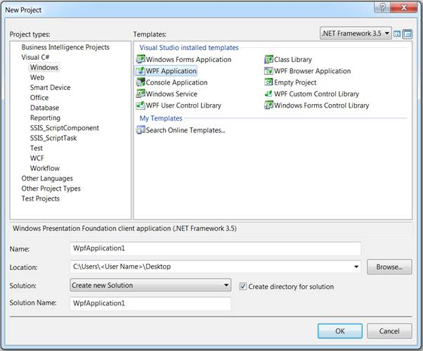
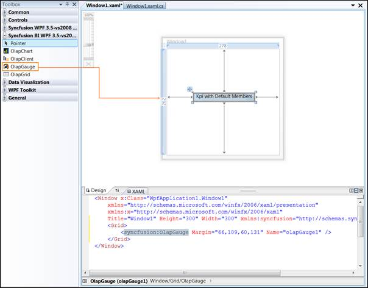
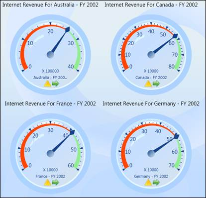

::: {style="DISPLAY: none"}
{#d2h_url_template} {#d2h_package_url style="WIDTH: 0px; DISPLAY: none; HEIGHT: 0px"}
:::

::::: {#nsbanner .d2h_main_nsbanner style="BORDER-BOTTOM: #999999 1px solid; POSITION: relative; PADDING-BOTTOM: 0px; BACKGROUND-COLOR: transparent; PADDING-LEFT: 0px; PADDING-RIGHT: 0px; DISPLAY: none; BORDER-TOP: #999999 1px solid; PADDING-TOP: 0px; LEFT: 0px"}
:::: {#TitleRow .d2h_main_titlerow style="PADDING-BOTTOM: 4px; BACKGROUND-COLOR: transparent; PADDING-LEFT: 22px; WIDTH: 100%; PADDING-RIGHT: 10px; DISPLAY: none; PADDING-TOP: 4px"}
::: {#ienav .d2h_main_ienav style="DISPLAY: none"}
{#D2HPrevious .D2HPreviousEnabled}  {#D2HNext .D2HNextEnabled}
:::
::::
:::::

:::: {#nstext .d2h_main_nstext style="PADDING-BOTTOM: 10px; BACKGROUND-COLOR: transparent; PADDING-LEFT: 22px; PADDING-RIGHT: 10px; HEIGHT: 100%; OVERFLOW: auto; PADDING-TOP: 5px" hasuserbackground="true" valign="bottom"}
::: {#d2h_breadcrumbs .d2h_breadcrumbs}
[Essential Studio User Guide Documentation](ms-xhelp:///?Id=12457748-09e3-4d74-a240-8e049cedf030){.d2h_breadcrumbsNormal} [ \> ]{.d2h_breadcrumbsLinkSeparator} [Business Intelligence Edition](ms-xhelp:///?Id=fdf33dd8-62b2-47b9-ad7b-fc50e590bca5){.d2h_breadcrumbsNormal} [ \> ]{.d2h_breadcrumbsLinkSeparator} [Essential BI WPF](ms-xhelp:///?Id=41e3d586-d922-4a01-8272-679fe4ae7343){.d2h_breadcrumbsNormal} [ \> ]{.d2h_breadcrumbsLinkSeparator} [Essential BI Gauge]{.d2h_breadcrumbsContentsOnly} [ \> ]{.d2h_breadcrumbsLinkSeparator} [Getting Started](ms-xhelp:///?Id=e89b3116-b65b-4ccc-ace1-faedc47160c3){.d2h_breadcrumbsNormal}
:::

## Creating OLAP Gauge for WPF {#creating-olap-gauge-for-wpf style="tab-stops: 0pt"}

To create an *OLAP Gauge* for WPF:

1.   Click **Start** **[à]{style="FONT-FAMILY: Wingdings"}** **All Programs** **[à]{style="FONT-FAMILY: Wingdings"}** **Microsoft Visual Studio 2008**.

2.   Now go to **File** **[à]{style="FONT-FAMILY: Wingdings"}** **New Project**. The **New Project** dialog box appears.

{border="0"}

Figure 7: "New Project" dialog box

 

3.   Select **WPF Application** in the **New Project** dialog box and click **OK**. A new WPF application gets created.

4.   The OLAP Gauge control is now available in the toolbox under the tab named "**Syncfusion BI WPF 3.5--vs2008 Toolbox** \<**Essential studio version number\>**". Drag and drop the OLAP Gauge control onto the application.

{border="0"}

 

Figure 8: OLAP Gauge in designer

 

5.   The height, width and other properties of OLAP Gauge control are set either through the property window or manually in the XAML code as well as in the code behind region.

For example, the height and width property set in the XAML code region is shown below:

 

+----------------------------------------------------------------------------------------------+
| \[XAML\]                                                                                     |
|                                                                                              |
|                                                                                              |
|                                                                                              |
| \<Syncfusion:OlapGauge ID=\"olapGauge1\" Width=\"400px\" Height=\"200px\" runat=\"server\"\> |
|                                                                                              |
| \</Syncfusion:OlapGauge\>                                                                    |
+----------------------------------------------------------------------------------------------+

[]{style="FONT-FAMILY: 'Trebuchet MS','sans-serif'; COLOR: #15428b; FONT-SIZE: 9pt"} 

6.   Once the OLAP Gauge control is defined, navigate to the code-behind file.

7.   To bind the OLAP Gauge control with cube data, the **OlapDataManager**is instantiated first through anyone of the below methods in the window load event.

[]{style="FONT-FAMILY: 'Trebuchet MS','sans-serif'; COLOR: #15428b; FONT-SIZE: 9pt"} 

Binding OLAP Gauge to the Server:

 

+-----------------------------------------------------------------------+
| \[C#\]                                                                |
|                                                                       |
|                                                                       |
|                                                                       |
| OlapDataManager DataManager = new OlapDataManager(connectionString);  |
+-----------------------------------------------------------------------+

 

+-----------------------------------------------------------------------------+
| \[VB\]                                                                      |
|                                                                             |
|                                                                             |
|                                                                             |
| Dim DataManager As OlapDataManager = New OlapDataManager(connectionString); |
+-----------------------------------------------------------------------------+

 

Binding OLAP Gauge to the Server using Data Provider:

 

+---------------------------------------------------------------------------+
| \[C#\]                                                                    |
|                                                                           |
|                                                                           |
|                                                                           |
| AdomdDataProvider dataProvider = new AdomdDataProvider(connectionString); |
|                                                                           |
| OlapDataManager DataManager = new OlapDataManager(dataProvider);          |
+---------------------------------------------------------------------------+

 

+------------------------------------------------------------------------------------------------------------------------+
| \[VB\]                                                                                                                 |
|                                                                                                                        |
|                                                                                                                        |
|                                                                                                                        |
| [Dim dataProvider As AdomdDataProvider = New AdomdDataProvider(connectionString)]{style="COLOR: black"}                |
|                                                                                                                        |
| [Dim ]{style="COLOR: black"}DataManager[ As OlapDataManager = New OlapDataManager(dataProvider)]{style="COLOR: black"} |
+------------------------------------------------------------------------------------------------------------------------+

 

8.   i) After instantiating the **OlapDataManager***,* a report is created by the user as per their requirements, which comprises of dimension, measure and named set elements along the categorical, series and slicer axes and added to the **OlapDataManager** eitherthrough the "SetCurrentReport(OlapReport)" method or by the "CurrentReport" property.

ii\) Now, itis assigned to **gauge controls OlapDataManager**and the DataBind() method is called to render the OLAP gauge with the current report information.

[]{style="FONT-FAMILY: 'Trebuchet MS','sans-serif'; COLOR: #15428b; FONT-SIZE: 9pt"} 

[]{style="FONT-FAMILY: 'Trebuchet MS','sans-serif'; COLOR: #15428b; FONT-SIZE: 9pt"} 

The report can be defined in code, as follows:

 

+------------------------------------------------------------------------------------------------------------------------------------------------------------------------------------------------------------------------------------------------------------------------------------------------------------------------------------+
| []{#OLE_LINK2} [\[C#\]]{#OLE_LINK1}                                                                                                                                                                                                                                                                                                |
|                                                                                                                                                                                                                                                                                                                                    |
| DataManager.SetCurrentReport([this]{style="COLOR: blue"}.CreateReport());                                                                                                                                                                                                                                                          |
|                                                                                                                                                                                                                                                                                                                                    |
| [this]{style="COLOR: blue"}.olapGauge1.OlapDataManager = DataManager;                                                                                                                                                                                                                                                              |
|                                                                                                                                                                                                                                                                                                                                    |
| [this]{style="COLOR: blue"}.olapGauge1.DataBind();                                                                                                                                                                                                                                                                                 |
|                                                                                                                                                                                                                                                                                                                                    |
|                                                                                                                                                                                                                                                                                                                                    |
|                                                                                                                                                                                                                                                                                                                                    |
| [private]{style="COLOR: blue"} [OlapReport]{style="COLOR: #2b91af"} CreateReport()                                                                                                                                                                                                                                                 |
|                                                                                                                                                                                                                                                                                                                                    |
| {                                                                                                                                                                                                                                                                                                                                  |
|                                                                                                                                                                                                                                                                                                                                    |
| [OlapReport]{style="COLOR: #2b91af"} report = [new]{style="COLOR: blue"}[OlapReport]{style="COLOR: #2b91af"}();                                                                                                                                                                                                                    |
|                                                                                                                                                                                                                                                                                                                                    |
| report.CurrentCubeName = [\"Adventure Works\"]{style="COLOR: #a31515"};                                                                                                                                                                                                                                                            |
|                                                                                                                                                                                                                                                                                                                                    |
|                                                                                                                                                                                                                                                                                                                                    |
|                                                                                                                                                                                                                                                                                                                                    |
| [//Specifying the KPI name]{style="COLOR: green"}                                                                                                                                                                                                                                                                                  |
|                                                                                                                                                                                                                                                                                                                                    |
| [KpiElements]{style="COLOR: #2b91af"} kpiElement = [new]{style="COLOR: blue"}[KpiElements]{style="COLOR: #2b91af"}();                                                                                                                                                                                                              |
|                                                                                                                                                                                                                                                                                                                                    |
| kpiElement.Elements.Add([new]{style="COLOR: blue"}[KpiElement]{style="COLOR: #2b91af"} { Name = [\"Internet Revenue\"]{style="COLOR: #a31515"}, ShowKPIGoal = [true]{style="COLOR: blue"}, ShowKPIStatus = [true]{style="COLOR: blue"}, ShowKPIValue = [true]{style="COLOR: blue"}, ShowKPITrend = [true]{style="COLOR: blue"} }); |
|                                                                                                                                                                                                                                                                                                                                    |
|                                                                                                                                                                                                                                                                                                                                    |
|                                                                                                                                                                                                                                                                                                                                    |
| [DimensionElement]{style="COLOR: #2b91af"} dimensionElementColumn = [new]{style="COLOR: blue"}[DimensionElement]{style="COLOR: #2b91af"}();                                                                                                                                                                                        |
|                                                                                                                                                                                                                                                                                                                                    |
| [//Specifying the dimension name]{style="COLOR: green"}                                                                                                                                                                                                                                                                            |
|                                                                                                                                                                                                                                                                                                                                    |
| dimensionElementColumn.Name = [\"Customer\"]{style="COLOR: #a31515"};                                                                                                                                                                                                                                                              |
|                                                                                                                                                                                                                                                                                                                                    |
| [//Adding the level with the hierarchy Name]{style="COLOR: green"}                                                                                                                                                                                                                                                                 |
|                                                                                                                                                                                                                                                                                                                                    |
| dimensionElementColumn.AddLevel([\"Customer Geography\"]{style="COLOR: #a31515"}, [\"Country\"]{style="COLOR: #a31515"});                                                                                                                                                                                                          |
|                                                                                                                                                                                                                                                                                                                                    |
|                                                                                                                                                                                                                                                                                                                                    |
|                                                                                                                                                                                                                                                                                                                                    |
| [//Specifying the measure name]{style="COLOR: green"}                                                                                                                                                                                                                                                                              |
|                                                                                                                                                                                                                                                                                                                                    |
| [MeasureElements]{style="COLOR: #2b91af"} measureElementColumn = [new]{style="COLOR: blue"}[MeasureElements]{style="COLOR: #2b91af"}();                                                                                                                                                                                            |
|                                                                                                                                                                                                                                                                                                                                    |
| measureElementColumn.Elements.Add([new]{style="COLOR: blue"}[MeasureElement]{style="COLOR: #2b91af"} { Name = [\"Internet Sales Amount\"]{style="COLOR: #a31515"} });                                                                                                                                                              |
|                                                                                                                                                                                                                                                                                                                                    |
|                                                                                                                                                                                                                                                                                                                                    |
|                                                                                                                                                                                                                                                                                                                                    |
| [DimensionElement]{style="COLOR: #2b91af"} dimensionElementRow = [new]{style="COLOR: blue"}[DimensionElement]{style="COLOR: #2b91af"}();                                                                                                                                                                                           |
|                                                                                                                                                                                                                                                                                                                                    |
| [//Specifying the dimension name]{style="COLOR: green"}                                                                                                                                                                                                                                                                            |
|                                                                                                                                                                                                                                                                                                                                    |
| dimensionElementRow.Name = [\"Date\"]{style="COLOR: #a31515"};[]{style="COLOR: #c00000"}                                                                                                                                                                                                                                           |
|                                                                                                                                                                                                                                                                                                                                    |
| [//Adding the level with the hierarchy Name]{style="COLOR: green"}                                                                                                                                                                                                                                                                 |
|                                                                                                                                                                                                                                                                                                                                    |
| dimensionElementRow.AddLevel([\"Fiscal\"]{style="COLOR: #a31515"}, [\"Fiscal Year\"]{style="COLOR: #a31515"});                                                                                                                                                                                                                     |
|                                                                                                                                                                                                                                                                                                                                    |
|                                                                                                                                                                                                                                                                                                                                    |
|                                                                                                                                                                                                                                                                                                                                    |
| report.CategoricalElements.Add(dimensionElementColumn);                                                                                                                                                                                                                                                                            |
|                                                                                                                                                                                                                                                                                                                                    |
| report.CategoricalElements.Add(kpiElement);                                                                                                                                                                                                                                                                                        |
|                                                                                                                                                                                                                                                                                                                                    |
| report.CategoricalElements.Add(measureElementColumn);                                                                                                                                                                                                                                                                              |
|                                                                                                                                                                                                                                                                                                                                    |
| report.SeriesElements.Add(dimensionElementRow);                                                                                                                                                                                                                                                                                    |
|                                                                                                                                                                                                                                                                                                                                    |
| [return]{style="COLOR: blue"} report;[]{style="FONT-FAMILY: 'Courier New'"}                                                                                                                                                                                                                                                        |
|                                                                                                                                                                                                                                                                                                                                    |
| }[]{style="FONT-FAMILY: 'Courier New'"}                                                                                                                                                                                                                                                                                            |
+------------------------------------------------------------------------------------------------------------------------------------------------------------------------------------------------------------------------------------------------------------------------------------------------------------------------------------+

 

+---------------------------------------------------------------------------------------------------------------------------------------------------------------------------------------------------------------------------------------------------------------------------------------------------------------+
| \[VB\]                                                                                                                                                                                                                                                                                                        |
|                                                                                                                                                                                                                                                                                                               |
|                                                                                                                                                                                                                                                                                                               |
|                                                                                                                                                                                                                                                                                                               |
| DataManager.SetCurrentReport([Me]{style="COLOR: blue"}.CreateReport())                                                                                                                                                                                                                                        |
|                                                                                                                                                                                                                                                                                                               |
| [Me]{style="COLOR: blue"}.olapGauge1.OlapDataManager = DataManager                                                                                                                                                                                                                                            |
|                                                                                                                                                                                                                                                                                                               |
| [Me]{style="COLOR: blue"}.olapGauge1.DataBind()                                                                                                                                                                                                                                                               |
|                                                                                                                                                                                                                                                                                                               |
|                                                                                                                                                                                                                                                                                                               |
|                                                                                                                                                                                                                                                                                                               |
| [Private]{style="COLOR: blue"} [Function]{style="COLOR: blue"} CreateReport() [As]{style="COLOR: blue"} OlapReport                                                                                                                                                                                            |
|                                                                                                                                                                                                                                                                                                               |
|                                                                                                                                                                                                                                                                                                               |
|                                                                                                                                                                                                                                                                                                               |
| [Dim]{style="COLOR: blue"} report [As]{style="COLOR: blue"} OlapReport = [New]{style="COLOR: blue"} OlapReport()                                                                                                                                                                                              |
|                                                                                                                                                                                                                                                                                                               |
| report.CurrentCubeName = \"Adventure Works\"                                                                                                                                                                                                                                                                  |
|                                                                                                                                                                                                                                                                                                               |
|                                                                                                                                                                                                                                                                                                               |
|                                                                                                                                                                                                                                                                                                               |
| [\'Specifying the KPI name]{style="COLOR: green"}                                                                                                                                                                                                                                                             |
|                                                                                                                                                                                                                                                                                                               |
| [Dim]{style="COLOR: blue"} kpiElement [As]{style="COLOR: blue"} KpiElements = [New]{style="COLOR: blue"} KpiElements()                                                                                                                                                                                        |
|                                                                                                                                                                                                                                                                                                               |
| kpiElement.Elements.Add([New]{style="COLOR: blue"} KpiElement [With]{style="COLOR: blue"} {.Name = \"Internet Revenue\", .ShowKPIGoal = [True]{style="COLOR: blue"}, .ShowKPIStatus = [True]{style="COLOR: blue"}, .ShowKPIValue = [True]{style="COLOR: blue"}, .ShowKPITrend = [True]{style="COLOR: blue"}}) |
|                                                                                                                                                                                                                                                                                                               |
|                                                                                                                                                                                                                                                                                                               |
|                                                                                                                                                                                                                                                                                                               |
| [Dim]{style="COLOR: blue"} dimensionElementColumn [As]{style="COLOR: blue"} DimensionElement = [New]{style="COLOR: blue"} DimensionElement()                                                                                                                                                                  |
|                                                                                                                                                                                                                                                                                                               |
| [\'Specifying the dimension name]{style="COLOR: green"}                                                                                                                                                                                                                                                       |
|                                                                                                                                                                                                                                                                                                               |
| dimensionElementColumn.Name = \"Customer\"                                                                                                                                                                                                                                                                    |
|                                                                                                                                                                                                                                                                                                               |
| [\'Adding the level with the hierarchy Name]{style="COLOR: green"}                                                                                                                                                                                                                                            |
|                                                                                                                                                                                                                                                                                                               |
| dimensionElementColumn.AddLevel(\"Customer Geography\", \"Country\")                                                                                                                                                                                                                                          |
|                                                                                                                                                                                                                                                                                                               |
|                                                                                                                                                                                                                                                                                                               |
|                                                                                                                                                                                                                                                                                                               |
| [\'Specifying the measure name]{style="COLOR: green"}                                                                                                                                                                                                                                                         |
|                                                                                                                                                                                                                                                                                                               |
| [Dim]{style="COLOR: blue"} measureElementColumn [As]{style="COLOR: blue"} MeasureElements = [New]{style="COLOR: blue"} MeasureElements()                                                                                                                                                                      |
|                                                                                                                                                                                                                                                                                                               |
| measureElementColumn.Elements.Add([New]{style="COLOR: blue"} MeasureElement [With]{style="COLOR: blue"} {.Name = \"Internet Sales Amount\"})                                                                                                                                                                  |
|                                                                                                                                                                                                                                                                                                               |
|                                                                                                                                                                                                                                                                                                               |
|                                                                                                                                                                                                                                                                                                               |
| [Dim]{style="COLOR: blue"} dimensionElementRow [As]{style="COLOR: blue"} DimensionElement = [New]{style="COLOR: blue"} DimensionElement()                                                                                                                                                                     |
|                                                                                                                                                                                                                                                                                                               |
| [\'Specifying the dimension name]{style="COLOR: green"}                                                                                                                                                                                                                                                       |
|                                                                                                                                                                                                                                                                                                               |
| dimensionElementRow.Name = \"Date\"                                                                                                                                                                                                                                                                           |
|                                                                                                                                                                                                                                                                                                               |
| [\'Adding the level with the hierarchy Name]{style="COLOR: green"}                                                                                                                                                                                                                                            |
|                                                                                                                                                                                                                                                                                                               |
| dimensionElementRow.AddLevel(\"Fiscal\", \"Fiscal Year\")                                                                                                                                                                                                                                                     |
|                                                                                                                                                                                                                                                                                                               |
|                                                                                                                                                                                                                                                                                                               |
|                                                                                                                                                                                                                                                                                                               |
| report.CategoricalElements.Add(dimensionElementColumn)                                                                                                                                                                                                                                                        |
|                                                                                                                                                                                                                                                                                                               |
| report.CategoricalElements.Add(kpiElement)                                                                                                                                                                                                                                                                    |
|                                                                                                                                                                                                                                                                                                               |
| report.CategoricalElements.Add(measureElementColumn)                                                                                                                                                                                                                                                          |
|                                                                                                                                                                                                                                                                                                               |
| report.SeriesElements.Add(dimensionElementRow)                                                                                                                                                                                                                                                                |
|                                                                                                                                                                                                                                                                                                               |
| [Return]{style="COLOR: blue"} report                                                                                                                                                                                                                                                                          |
|                                                                                                                                                                                                                                                                                                               |
|                                                                                                                                                                                                                                                                                                               |
|                                                                                                                                                                                                                                                                                                               |
| [End]{style="COLOR: blue"} [Function]{style="COLOR: blue"}                                                                                                                                                                                                                                                    |
+---------------------------------------------------------------------------------------------------------------------------------------------------------------------------------------------------------------------------------------------------------------------------------------------------------------+

 

9.   Run the application. The following output is generated.

 

{border="0"}

Figure 9: OLAP Gauge

***[]{style="FONT-FAMILY: 'Cambria','serif'; COLOR: black"}***  

[]{#related-topics}
::::
