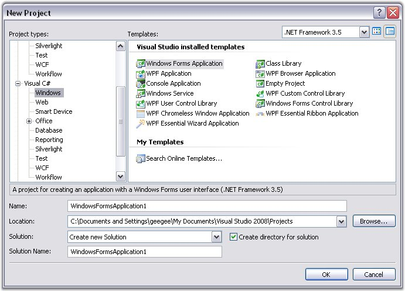
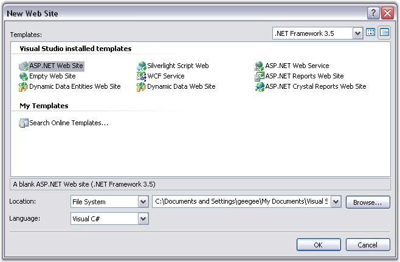

::: {style="DISPLAY: none"}
{#d2h_url_template}{#d2h_package_url style="WIDTH: 0px; DISPLAY: none; HEIGHT: 0px"}
:::

::::: {#nsbanner .d2h_main_nsbanner style="BORDER-BOTTOM: #999999 1px solid; POSITION: relative; PADDING-BOTTOM: 0px; BACKGROUND-COLOR: transparent; PADDING-LEFT: 0px; PADDING-RIGHT: 0px; DISPLAY: none; BORDER-TOP: #999999 1px solid; PADDING-TOP: 0px; LEFT: 0px"}
:::: {#TitleRow .d2h_main_titlerow style="PADDING-BOTTOM: 4px; BACKGROUND-COLOR: transparent; PADDING-LEFT: 22px; WIDTH: 100%; PADDING-RIGHT: 10px; DISPLAY: none; PADDING-TOP: 4px"}
::: {#ienav .d2h_main_ienav style="DISPLAY: none"}
{#D2HPrevious .D2HPreviousEnabled}  {#D2HNext .D2HNextEnabled}
:::
::::
:::::

:::: {#nstext .d2h_main_nstext style="PADDING-BOTTOM: 10px; BACKGROUND-COLOR: transparent; PADDING-LEFT: 22px; PADDING-RIGHT: 10px; HEIGHT: 100%; OVERFLOW: auto; PADDING-TOP: 5px" hasuserbackground="true" valign="bottom"}
::: {#d2h_breadcrumbs .d2h_breadcrumbs}
[Essential Studio User Guide Documentation](ms-xhelp:///?Id=12457748-09e3-4d74-a240-8e049cedf030){.d2h_breadcrumbsNormal}[ \> ]{.d2h_breadcrumbsLinkSeparator}[Reporting Edition](ms-xhelp:///?Id=027aa5b6-6676-4f93-ad23-c20e8c45792e){.d2h_breadcrumbsNormal}[ \> ]{.d2h_breadcrumbsLinkSeparator}[Essential DocIO](ms-xhelp:///?Id=b88d77b3-4c51-460f-a761-d2ef6d5b0ca6){.d2h_breadcrumbsNormal}[ \> ]{.d2h_breadcrumbsLinkSeparator}[Getting Started](ms-xhelp:///?Id=b13bdbaa-4c11-4a19-ba3a-3401037013af){.d2h_breadcrumbsNormal}
:::

## Creating Platform Application {#creating-platform-application style="tab-stops: 0pt"}

 

This section illustrates the step-by-step procedure to create the following platform applications.

 

[·      ]{style="FONT-FAMILY: Symbol"}Windows

[·      ]{style="FONT-FAMILY: Symbol"}ASP.NET

[·      ]{style="FONT-FAMILY: Symbol"}WPF

[·      ]{style="FONT-FAMILY: Symbol"}Silverlight

[·      ]{style="FONT-FAMILY: Symbol"}ASP.NET MVC

 

Windows Application

 

1.   Open Microsoft Visual Studio. Go to **File** menu and click **New Project**. In the New Project dialog box, select **Windows Forms Application** template, name the project and click **OK**.

 

{border="0"}

Figure 11: Windows Forms Application template selected in the New Project Dialog Box

 

 

A Windows application is created.

 

2.   Now you need to deploy Essential DocIO into this Windows application. Refer [Windows](ms-xhelp:///?Id=92233413-9080-49b2-9286-0bb65d8ddb63) topic for detailed info.

**[             ]{style="FONT-FAMILY: 'Times New Roman','serif'; COLOR: #15428b; FONT-SIZE: 9pt"}**

ASP.NET Application

 

1.   Open Microsoft Visual Studio. Go to **File** menu and click **New Web Site**. In the New Website dialog box, select **ASP.NET** **Web Site** template, name the website and click **OK**.

 

{border="0"}

Figure 12: ASP.NET Web Site template selected in the New Web Site Dialog Box

 

An ASP.NET application is created. 

 

2.   Now you need to deploy Essential DocIO into this ASP.NET application. Refer [ASP.NET](ms-xhelp:///?Id=5fff6d7c-bc30-4c3d-ad89-85b2b23e4cf8) topic for detailed info.

 

WPF Application

 

1.   Open Microsoft Visual Studio. Go to **File** menu and click **New Project**. In the New Project dialog box, select **WPF Application** template, name the project and click **OK**.

 

{border="0"}

Figure 13: WPF Application template selected in the New Project Dialog Box

 

 

A new WPF application is created.

 

2.   Open the main form of the application in the designer.

 

3.   Now you need to deploy Essential DocIO into this WPF application. Refer [WPF](ms-xhelp:///?Id=71d34dad-83b2-4e9d-9c59-8f1c3a976df4) topic for detailed info.

 

 

Silverlight Application

 

1.   Open Microsoft Visual Studio. Go to **File** menu and click **New Project**. In the New Project dialog box, select **Silverlight Application** template, name the project and click **OK**.

 

{border="0"}

Figure 14: Silverlight Application template selected in the New Project Dialog Box

 

A **New Silverlight Application** dialog box appears as follows.

 

{border="0"}

Figure 15: New Silverlight Dialog Box

 

 

2.   Click **OK** to host the Silverlight application in a new website.

 

     A new Silverlight application is created.

 

3.   Open the main form of the application in the designer.

 

4.   Refer [[Silverligh]{.UGHyperlink}](ms-xhelp:///?Id=985c525e-c4c8-40ea-8222-130fe9b88fd7)[t]{.UGHyperlink} topic to know how to deploy Essential DocIO to the application.

 

ASP.NET MVC Application

 

Refer **ASP.NET MVC -\> Grid -\> Getting Started -\> Creating an MVC** application topic to know how to create an MVC application.

 

To know how to deploy Essential DocIO to this application, refer [[ASP.NET MVC]{.UGHyperlink}](ms-xhelp:///?Id=f7eb84a8-511e-4814-8b89-d8a2fe7731f3) topic.

 

See Also

 

[[Deploying Essential DocIO]{.UGHyperlink}](ms-xhelp:///?Id=292813fa-54b4-42a4-8f0d-0291dc5221fb)[]{.UGHyperlink}

 

[]{#related-topics}
::::
