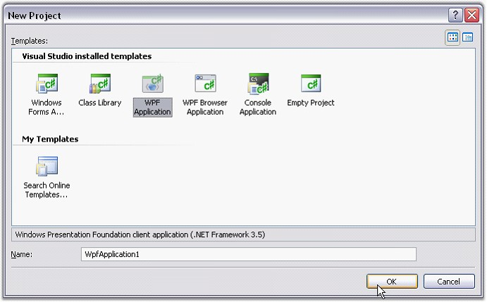

::: {style="DISPLAY: none"}
{#d2h_url_template}{#d2h_package_url style="WIDTH: 0px; DISPLAY: none; HEIGHT: 0px"}
:::

::::: {#nsbanner .d2h_main_nsbanner style="BORDER-BOTTOM: #999999 1px solid; POSITION: relative; PADDING-BOTTOM: 0px; BACKGROUND-COLOR: transparent; PADDING-LEFT: 0px; PADDING-RIGHT: 0px; DISPLAY: none; BORDER-TOP: #999999 1px solid; PADDING-TOP: 0px; LEFT: 0px"}
:::: {#TitleRow .d2h_main_titlerow style="PADDING-BOTTOM: 4px; BACKGROUND-COLOR: transparent; PADDING-LEFT: 22px; WIDTH: 100%; PADDING-RIGHT: 10px; DISPLAY: none; PADDING-TOP: 4px"}
::: {#ienav .d2h_main_ienav style="DISPLAY: none"}
{#D2HPrevious .D2HPreviousEnabled}  {#D2HNext .D2HNextEnabled}
:::
::::
:::::

:::: {#nstext .d2h_main_nstext style="PADDING-BOTTOM: 10px; BACKGROUND-COLOR: transparent; PADDING-LEFT: 22px; PADDING-RIGHT: 10px; HEIGHT: 100%; OVERFLOW: auto; PADDING-TOP: 5px" hasuserbackground="true" valign="bottom"}
::: {#d2h_breadcrumbs .d2h_breadcrumbs}
[Essential Studio User Guide Documentation](ms-xhelp:///?Id=12457748-09e3-4d74-a240-8e049cedf030){.d2h_breadcrumbsNormal}[ \> ]{.d2h_breadcrumbsLinkSeparator}[Reporting Edition](ms-xhelp:///?Id=027aa5b6-6676-4f93-ad23-c20e8c45792e){.d2h_breadcrumbsNormal}[ \> ]{.d2h_breadcrumbsLinkSeparator}[Essential Pdf](ms-xhelp:///?Id=22756092-3da5-4797-9514-dab0617c6902){.d2h_breadcrumbsNormal}[ \> ]{.d2h_breadcrumbsLinkSeparator}[Getting Started](ms-xhelp:///?Id=c0a3e418-fc0c-4115-9643-310912a817be){.d2h_breadcrumbsNormal}
:::

## Creating Platform Application {#creating-platform-application style="tab-stops: 0pt"}

 

This section illustrates the step-by-step procedure to create the following platform applications.

 

Creating a Windows Application

[]{style="FONT-FAMILY: 'Times New Roman','serif'; FONT-SIZE: 12pt"} 

1.   Open Microsoft Visual Studio. Go to **File** menu and click **New Project**. In the **New Project** dialog, select **Windows Forms Application** template, name the project and click **OK**.

[]{style="FONT-FAMILY: 'Trebuchet MS','sans-serif'; COLOR: #15428b; FONT-SIZE: 9pt"} 

{border="0"}

Figure 15: New Project dialog-Windows Forms Application

 

A windows application is created.

 

2.   Now you need to deploy Essential PDF into this Windows application. Refer [[Windows]{style="FONT-FAMILY: 'Trebuchet MS','sans-serif'; FONT-SIZE: 9pt"}](ms-xhelp:///?Id=e631d77f-bdf7-44a9-92b6-f9cefb2d8c18) topic for detailed info.

 

Creating an ASP.NET Application

 

To know how to deploy a web application, refer the ASP.NET Behind the scenes section in the Getting Started guide in the documentation.

[]{style="FONT-FAMILY: 'Trebuchet MS','sans-serif'; COLOR: #15428b; FONT-SIZE: 9pt"} 

1.   Open Microsoft Visual Studio. Go to **File** menu and click **New Website**. In the **New Website** dialog, select **ASP.NET Web Site** template, name the website and click **OK**.

[]{style="FONT-FAMILY: 'Trebuchet MS','sans-serif'; COLOR: #15428b; FONT-SIZE: 9pt"} 

{border="0"}

Figure 16: New Web Site dialog-ASP.NET Website

 

A web application is created.

[]{style="FONT-FAMILY: 'Times New Roman','serif'; FONT-SIZE: 12pt"} 

2.   Now you need to deploy Essential PDF into this ASP.NET application. Refer [[ASP.NET]{style="FONT-FAMILY: 'Trebuchet MS','sans-serif'; FONT-SIZE: 9pt"}](ms-xhelp:///?Id=5e3ad81e-ebb3-424b-a70c-558e03d4cdbd) topic for detailed info.

[]{style="FONT-FAMILY: 'Trebuchet MS','sans-serif'; COLOR: #15428b; FONT-SIZE: 9pt"} 

Creating a WPF Application

[]{style="FONT-FAMILY: 'Trebuchet MS','sans-serif'; COLOR: #15428b; FONT-SIZE: 9pt"} 

1.   Open Microsoft Visual Studio. Go to **File** menu and click **New Project**. In the **New Project** dialog, select **WPF Application** template, name the project and click **OK**.

[]{style="FONT-FAMILY: 'Trebuchet MS','sans-serif'; COLOR: #15428b; FONT-SIZE: 9pt"} 

{border="0"}

Figure 17: New Project dialog-WPF Application

[]{style="FONT-FAMILY: 'Times New Roman','serif'"} 

A WPF application is created.

[]{style="FONT-FAMILY: 'Trebuchet MS','sans-serif'; COLOR: #15428b; FONT-SIZE: 9pt"} 

2.   Now you need to deploy Essential PDF into this WPF application. Refer [[WPF]{style="FONT-FAMILY: 'Trebuchet MS','sans-serif'; FONT-SIZE: 9pt"}](ms-xhelp:///?Id=5e3ad81e-ebb3-424b-a70c-558e03d4cdbd) topic for detailed info.

[]{style="FONT-FAMILY: 'Trebuchet MS','sans-serif'; COLOR: #15428b; FONT-SIZE: 9pt"} 

Creating a Silverlight Application

[]{style="FONT-FAMILY: 'Trebuchet MS','sans-serif'; COLOR: #15428b; FONT-SIZE: 9pt"} 

1.   Open Microsoft Visual Studio. Go to **File** menu and click **New Project**. In the **New Project** dialog, select **Silverlight Application** template, name the project and click **OK**.

[]{style="FONT-FAMILY: 'Trebuchet MS','sans-serif'; COLOR: #15428b; FONT-SIZE: 9pt"} 

{border="0"}

Figure 18: New Project dialog-Silverlight Application

 

A new Silverlight application is created.

[]{style="FONT-FAMILY: 'Times New Roman','serif'; FONT-SIZE: 12pt"} 

2.   Refer [[Silverlight]{.UGHyperlink}](ms-xhelp:///?Id=d46a99e1-f755-4dee-929e-b4cd8ef322fa) topic to know how to deploy Essential PDF document with pages to the application.

[]{style="FONT-FAMILY: 'Trebuchet MS','sans-serif'; COLOR: #15428b; FONT-SIZE: 9pt"} 

Creating an ASP.NET MVC Application

[]{style="FONT-FAMILY: 'Trebuchet MS','sans-serif'; COLOR: #15428b; FONT-SIZE: 9pt"} 

Refer Grid MVC -\> Getting Started -\> Creating an MVC application topic to know how to create an MVC application.

 

To know how to add a PDF to this application, refer [[ASP.NET MVC]{style="FONT-FAMILY: 'Trebuchet MS','sans-serif'; FONT-SIZE: 9pt"}](ms-xhelp:///?Id=b02ba14a-74a6-4b87-b438-91f000b23c89) topic.

 

**For More Information refer:**

 

[[Deploying Essential PDF]{.UGHyperlink}](ms-xhelp:///?Id=e00e115b-6c6b-4eb8-977a-aca39abdb560)[]{.UGHyperlink}

 

[]{#related-topics}
::::
