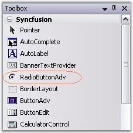
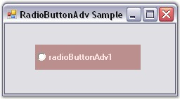

::: {style="DISPLAY: none"}
{#d2h_url_template}{#d2h_package_url style="WIDTH: 0px; DISPLAY: none; HEIGHT: 0px"}
:::

::: {.d2h_secondary_topic style="PADDING-BOTTOM: 10pt; MARGIN: 0pt; PADDING-LEFT: 0pt; PADDING-RIGHT: 0pt; PADDING-TOP: 0pt"}
##### Creating RadioButtonAdv {#creating-radiobuttonadv style="tab-stops: 0pt"}

[]{style="COLOR: #15428b"} 

The RadioButtonAdv control can be created in the following ways.

[]{style="COLOR: #15428b"} 

###### []{#p789}3.3.11.2.2.1        Through Designer {#through-designer style="tab-stops: 0pt"}

[]{style="COLOR: #15428b"} 

The following steps illustrate how to create a RadioButtonAdv control through designer.

[]{style="COLOR: #15428b"} 

[·      ]{style="FONT-FAMILY: Symbol"}Create or open a Windows Forms project.

[·      ]{style="FONT-FAMILY: Symbol"}Add an RadioButtonAdv Control from the toolbox onto the form by dragging and dropping it on the form or double clicking the control.

[]{style="COLOR: #15428b"} 

{border="0"}

[]{style="COLOR: #15428b"} 

Figure 628: RadioButtonAdv in Toolbox

[]{style="COLOR: #15428b"} 

[·      ]{style="FONT-FAMILY: Symbol"}Set the desired properties for the control through the Property grid.

[·      ]{style="FONT-FAMILY: Symbol"}Run the application.

[]{style="COLOR: #15428b"} 

{border="0"}

[]{style="COLOR: black; FONT-SIZE: 8pt"} 

Figure 629: RadioButtonAdv created Through Designer

[]{style="COLOR: #15428b"} 

See Also

[[]{style="COLOR: blue"}]{.UGHyperlink}

[[Through Code]{style="COLOR: blue"}]{.UGHyperlink}

###### []{#_Through_Code_6}3.3.11.2.2.2        Through Code {#through-code style="tab-stops: 0pt"}

[]{#p790} 

The RadioButtonAdv control can be created programmatically as detailed below:

[]{style="COLOR: #15428b"} 

[·      ]{style="FONT-FAMILY: Symbol"}Create a C# or VB.NET application though Visual Studio.

[·      ]{style="FONT-FAMILY: Symbol"}Add the required assembly references.

[·      ]{style="FONT-FAMILY: Symbol"}Include the required namespace.

[]{style="COLOR: #15428b"} 

+--------------------------------------------------------------------------------------------------------------------------------+
| **[\[C#\]]{style="FONT-FAMILY: 'Courier New'; COLOR: black"}**                                                                 |
|                                                                                                                                |
| []{style="FONT-FAMILY: 'Courier New'; COLOR: black"}                                                                           |
|                                                                                                                                |
| [using ]{style="FONT-FAMILY: 'Courier New'; COLOR: blue"}[Syncfusion.Windows.Forms.Tools;]{style="FONT-FAMILY: 'Courier New'"} |
+--------------------------------------------------------------------------------------------------------------------------------+

[]{style="COLOR: #15428b"} 

+---------------------------------------------------------------------------------------------------------------------------------+
| **[\[VB.NET\]]{style="FONT-FAMILY: 'Courier New'; COLOR: black"}**                                                              |
|                                                                                                                                 |
| []{style="FONT-FAMILY: 'Courier New'; COLOR: black"}                                                                            |
|                                                                                                                                 |
| [Imports]{style="FONT-FAMILY: 'Courier New'; COLOR: blue"}[ Syncfusion.Windows.Forms.Tools]{style="FONT-FAMILY: 'Courier New'"} |
+---------------------------------------------------------------------------------------------------------------------------------+

[]{style="COLOR: #15428b"} 

[·      ]{style="FONT-FAMILY: Symbol"}Create an instance of the RadioButtonAdv control class.

[]{style="COLOR: #15428b"} 

+--------------------------------------------------------------------------------------------------------------------------------------------------------------------------------------------------------------------+
| **[\[C#\]]{style="FONT-FAMILY: 'Courier New'; COLOR: black"}**                                                                                                                                                     |
|                                                                                                                                                                                                                    |
| []{style="FONT-FAMILY: 'Courier New'; COLOR: black"}                                                                                                                                                               |
|                                                                                                                                                                                                                    |
| [private]{style="FONT-FAMILY: 'Courier New'; COLOR: blue"}[ Syncfusion.Windows.Forms.Tools.[RadioButtonAdv]{style="COLOR: teal"} radioButtonAdv1;]{style="FONT-FAMILY: 'Courier New'"}                             |
|                                                                                                                                                                                                                    |
| [this]{style="FONT-FAMILY: 'Courier New'; COLOR: blue"}[.radioButtonAdv1 = [new]{style="COLOR: blue"} Syncfusion.Windows.Forms.Tools.[RadioButtonAdv]{style="COLOR: teal"}();]{style="FONT-FAMILY: 'Courier New'"} |
+--------------------------------------------------------------------------------------------------------------------------------------------------------------------------------------------------------------------+

[]{style="COLOR: #15428b"} 

+-----------------------------------------------------------------------------------------------------------------------------------------------------------------------------------------------------------------+
| **[\[VB.NET\]]{style="FONT-FAMILY: 'Courier New'; COLOR: black"}**                                                                                                                                              |
|                                                                                                                                                                                                                 |
| []{style="FONT-FAMILY: 'Courier New'; COLOR: black"}                                                                                                                                                            |
|                                                                                                                                                                                                                 |
| [Private]{style="FONT-FAMILY: 'Courier New'; COLOR: blue"}[ radioButtonAdv1 [As]{style="COLOR: blue"} Syncfusion.Windows.Forms.Tools.[RadioButtonAdv]{style="COLOR: teal"}]{style="FONT-FAMILY: 'Courier New'"} |
|                                                                                                                                                                                                                 |
| [Me]{style="FONT-FAMILY: 'Courier New'; COLOR: blue"}[.radioButtonAdv1 = [New]{style="COLOR: blue"} Syncfusion.Windows.Forms.Tools.[RadioButtonAdv]{style="COLOR: teal"}()]{style="FONT-FAMILY: 'Courier New'"} |
+-----------------------------------------------------------------------------------------------------------------------------------------------------------------------------------------------------------------+

[]{style="COLOR: #15428b"} 

[·      ]{style="FONT-FAMILY: Symbol"}Set the properties and add the RadioButtonAdv control to the form.

[]{style="COLOR: #15428b"} 

+---------------------------------------------------------------------------------------------------------------------------------------------------------------------------------------------------------------------------------------------------------------------------------------------------------------------------------------------------------------------------------------------------------------------+
| **[\[C#\]]{style="FONT-FAMILY: 'Courier New'; COLOR: black"}**                                                                                                                                                                                                                                                                                                                                                      |
|                                                                                                                                                                                                                                                                                                                                                                                                                     |
| []{style="FONT-FAMILY: 'Courier New'; COLOR: black"}                                                                                                                                                                                                                                                                                                                                                                |
|                                                                                                                                                                                                                                                                                                                                                                                                                     |
| [this]{style="FONT-FAMILY: 'Courier New'; COLOR: blue"}[.radioButtonAdv1.Text = [\"radioButtonAdv1\"]{style="COLOR: #a31515"};]{style="FONT-FAMILY: 'Courier New'"}                                                                                                                                                                                                                                                 |
|                                                                                                                                                                                                                                                                                                                                                                                                                     |
| [this]{style="FONT-FAMILY: 'Courier New'; COLOR: blue"}[.radioButtonAdv1.Font = [new]{style="COLOR: blue"} System.Drawing.[Font]{style="COLOR: #2b91af"}([\"Microsoft Sans Serif\"]{style="COLOR: #a31515"}, 8.25F, System.Drawing.[FontStyle]{style="COLOR: #2b91af"}.Bold, System.Drawing.[GraphicsUnit]{style="COLOR: #2b91af"}.Point, (([byte]{style="COLOR: blue"})(0)));]{style="FONT-FAMILY: 'Courier New'"} |
|                                                                                                                                                                                                                                                                                                                                                                                                                     |
| [this]{style="FONT-FAMILY: 'Courier New'; COLOR: blue"}[.radioButtonAdv1.ForeColor = System.Drawing.[Color]{style="COLOR: #2b91af"}.MistyRose;]{style="FONT-FAMILY: 'Courier New'"}                                                                                                                                                                                                                                 |
|                                                                                                                                                                                                                                                                                                                                                                                                                     |
| [this]{style="FONT-FAMILY: 'Courier New'; COLOR: blue"}[.radioButtonAdv1.BackColor = System.Drawing.[Color]{style="COLOR: #2b91af"}.RosyBrown;]{style="FONT-FAMILY: 'Courier New'"}                                                                                                                                                                                                                                 |
|                                                                                                                                                                                                                                                                                                                                                                                                                     |
| []{style="FONT-FAMILY: 'Courier New'"}                                                                                                                                                                                                                                                                                                                                                                              |
|                                                                                                                                                                                                                                                                                                                                                                                                                     |
| [// Add the RadioButtonAdv control to the Form.]{style="FONT-FAMILY: 'Courier New'; COLOR: green"}                                                                                                                                                                                                                                                                                                                  |
|                                                                                                                                                                                                                                                                                                                                                                                                                     |
| [this]{style="FONT-FAMILY: 'Courier New'; COLOR: blue"}[.Controls.Add([this]{style="COLOR: blue"}.radioButtonAdv1);]{style="FONT-FAMILY: 'Courier New'"}                                                                                                                                                                                                                                                            |
+---------------------------------------------------------------------------------------------------------------------------------------------------------------------------------------------------------------------------------------------------------------------------------------------------------------------------------------------------------------------------------------------------------------------+

[]{style="COLOR: #15428b"} 

+-----------------------------------------------------------------------------------------------------------------------------------------------------------------------------------------------------------------------------------------------------------------------------------------------------------------------------------+
| **[\[VB.NET\]]{style="FONT-FAMILY: 'Courier New'; COLOR: black"}**                                                                                                                                                                                                                                                                |
|                                                                                                                                                                                                                                                                                                                                   |
| []{style="FONT-FAMILY: 'Courier New'; COLOR: black"}                                                                                                                                                                                                                                                                              |
|                                                                                                                                                                                                                                                                                                                                   |
| [Me]{style="FONT-FAMILY: 'Courier New'; COLOR: blue"}[.radioButtonAdv1.Text = [\"radioButtonAdv1\"]{style="COLOR: #a31515"}]{style="FONT-FAMILY: 'Courier New'"}                                                                                                                                                                  |
|                                                                                                                                                                                                                                                                                                                                   |
| [Me]{style="FONT-FAMILY: 'Courier New'; COLOR: blue"}[.radioButtonAdv1.Font = [New]{style="COLOR: blue"} System.Drawing.Font([\"Microsoft Sans Serif\"]{style="COLOR: #a31515"}, 8.25F, System.Drawing.FontStyle.Bold, System.Drawing.GraphicsUnit.Point, [CByte]{style="COLOR: blue"}((0)))]{style="FONT-FAMILY: 'Courier New'"} |
|                                                                                                                                                                                                                                                                                                                                   |
| [Me]{style="FONT-FAMILY: 'Courier New'; COLOR: blue"}[.radioButtonAdv1.ForeColor = System.Drawing.Color.MistyRose]{style="FONT-FAMILY: 'Courier New'"}                                                                                                                                                                            |
|                                                                                                                                                                                                                                                                                                                                   |
| [Me]{style="FONT-FAMILY: 'Courier New'; COLOR: blue"}[.radioButtonAdv1.BackColor = System.Drawing.Color.RosyBrown]{style="FONT-FAMILY: 'Courier New'"}                                                                                                                                                                            |
|                                                                                                                                                                                                                                                                                                                                   |
| []{style="FONT-FAMILY: 'Courier New'"}                                                                                                                                                                                                                                                                                            |
|                                                                                                                                                                                                                                                                                                                                   |
| [// Add the RadioButtonAdv control to the Form.]{style="FONT-FAMILY: 'Courier New'; COLOR: green"}                                                                                                                                                                                                                                |
|                                                                                                                                                                                                                                                                                                                                   |
| [Me]{style="FONT-FAMILY: 'Courier New'; COLOR: blue"}[.Controls.Add([Me]{style="COLOR: blue"}.radioButtonAdv1)]{style="FONT-FAMILY: 'Courier New'"}                                                                                                                                                                               |
+-----------------------------------------------------------------------------------------------------------------------------------------------------------------------------------------------------------------------------------------------------------------------------------------------------------------------------------+

[]{style="COLOR: #15428b"} 

{border="0"}

[]{style="COLOR: #15428b"} 

Figure 630: RadioButtonAdv created Through Code

[]{style="COLOR: #15428b"} 

See Also

[]{style="COLOR: #4a5c8c"} 

[Through Designer]{.UGHyperlink}[]{.UGHyperlink}

[]{#related-topics}
:::
