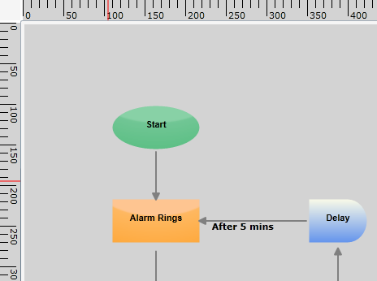
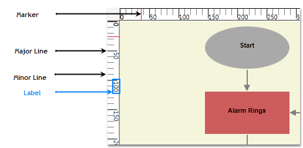
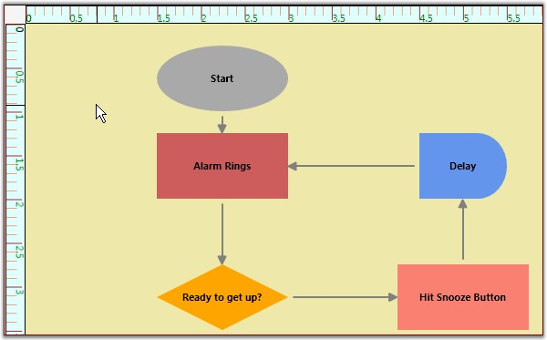

::: {style="DISPLAY: none"}
{#d2h_url_template}{#d2h_package_url style="WIDTH: 0px; DISPLAY: none; HEIGHT: 0px"}
:::

::::: {#nsbanner .d2h_main_nsbanner style="BORDER-BOTTOM: #999999 1px solid; POSITION: relative; PADDING-BOTTOM: 0px; BACKGROUND-COLOR: transparent; PADDING-LEFT: 0px; PADDING-RIGHT: 0px; DISPLAY: none; BORDER-TOP: #999999 1px solid; PADDING-TOP: 0px; LEFT: 0px"}
:::: {#TitleRow .d2h_main_titlerow style="PADDING-BOTTOM: 4px; BACKGROUND-COLOR: transparent; PADDING-LEFT: 22px; WIDTH: 100%; PADDING-RIGHT: 10px; DISPLAY: none; PADDING-TOP: 4px"}
::: {#ienav .d2h_main_ienav style="DISPLAY: none"}
{#D2HPrevious .D2HPreviousEnabled}  {#D2HNext .D2HNextEnabled}
:::
::::
:::::

:::: {#nstext .d2h_main_nstext style="PADDING-BOTTOM: 10px; BACKGROUND-COLOR: transparent; PADDING-LEFT: 22px; PADDING-RIGHT: 10px; HEIGHT: 100%; OVERFLOW: auto; PADDING-TOP: 5px" hasuserbackground="true" valign="bottom"}
::: {#d2h_breadcrumbs .d2h_breadcrumbs}
[Essential Studio User Guide Documentation](ms-xhelp:///?Id=12457748-09e3-4d74-a240-8e049cedf030){.d2h_breadcrumbsNormal}[ \> ]{.d2h_breadcrumbsLinkSeparator}[User Interface Edition](ms-xhelp:///?Id=c29296b7-531c-413b-a0ec-488ca1f7f669){.d2h_breadcrumbsNormal}[ \> ]{.d2h_breadcrumbsLinkSeparator}[Essential Silverlight](ms-xhelp:///?Id=66221bd1-ba2e-43c2-94a7-618f50e01d24){.d2h_breadcrumbsNormal}[ \> ]{.d2h_breadcrumbsLinkSeparator}[Essential Diagram]{.d2h_breadcrumbsContentsOnly}[ \> ]{.d2h_breadcrumbsLinkSeparator}[Concepts and Features](ms-xhelp:///?Id=d592a058-dcc0-44a4-994e-e7901da8db52){.d2h_breadcrumbsNormal}[ \> ]{.d2h_breadcrumbsLinkSeparator}[Diagram View](ms-xhelp:///?Id=4568432e-bb61-4069-b712-775b3032bf95){.d2h_breadcrumbsNormal}
:::

### Creating Rulers {#creating-rulers style="tab-stops: 0pt"}

[]{style="FONT-FAMILY: 'Trebuchet MS','sans-serif'; COLOR: #15428b; FONT-SIZE: 9pt"} 

Rulers display the coordinates of elements on the diagram page. At any point, the ruler value always indicates the exact coordinates of the page and its elements. By default, labels of the major lines in rulers will represent the pixel values using a label.

 

 

The Horizontal and Vertical ruler can be initialized for DiagramView in two ways namely:

[]{style="FONT-FAMILY: 'Trebuchet MS','sans-serif'; COLOR: #15428b; FONT-SIZE: 9pt"} 

[·      ]{style="FONT-FAMILY: Symbol"}Through XAML

[·      ]{style="FONT-FAMILY: Symbol"}Through Code Behind

[]{style="FONT-FAMILY: 'Trebuchet MS','sans-serif'; COLOR: #15428b; FONT-SIZE: 9pt"} 

+------------------------------------------------------------------------------------------------------------------------------------------------------------------------------------------------------------------------------------------------------------------------------------------------------------------------------------------------------------------------------------------------------------------------+
| **[\[XAML\]]{style="FONT-FAMILY: 'Courier New'; COLOR: black"}**                                                                                                                                                                                                                                                                                                                                                       |
|                                                                                                                                                                                                                                                                                                                                                                                                                        |
| **[]{style="FONT-FAMILY: 'Courier New'; COLOR: black"}**                                                                                                                                                                                                                                                                                                                                                               |
|                                                                                                                                                                                                                                                                                                                                                                                                                        |
| [\<]{style="FONT-FAMILY: 'Courier New'; COLOR: blue"}[syncfusion]{style="FONT-FAMILY: 'Courier New'; COLOR: maroon"}[:]{style="FONT-FAMILY: 'Courier New'; COLOR: blue"}[DiagramView]{style="FONT-FAMILY: 'Courier New'; COLOR: maroon"}[ [IsPageEditable]{style="COLOR: red"}[=\"True\"]{style="COLOR: blue"} [Bounds]{style="COLOR: red"}[=\"0,0,12,12\"]{style="COLOR: blue"} ]{style="FONT-FAMILY: 'Courier New'"} |
|                                                                                                                                                                                                                                                                                                                                                                                                                        |
| [Name]{style="FONT-FAMILY: 'Courier New'; COLOR: red"}[=\"diagramView\"\>]{style="FONT-FAMILY: 'Courier New'; COLOR: blue"}                                                                                                                                                                                                                                                                                            |
|                                                                                                                                                                                                                                                                                                                                                                                                                        |
| [\<]{style="FONT-FAMILY: 'Courier New'; COLOR: blue"}[syncfusion]{style="FONT-FAMILY: 'Courier New'; COLOR: maroon"}[:]{style="FONT-FAMILY: 'Courier New'; COLOR: blue"}[DiagramView.HorizontalRuler]{style="FONT-FAMILY: 'Courier New'; COLOR: maroon"}[\>]{style="FONT-FAMILY: 'Courier New'; COLOR: blue"}                                                                                                          |
|                                                                                                                                                                                                                                                                                                                                                                                                                        |
| [    [\<]{style="COLOR: blue"}[syncfusion]{style="COLOR: maroon"}[:]{style="COLOR: blue"}[HorizontalRuler]{style="COLOR: maroon"} [Name]{style="COLOR: red"}[=\"horizontalRuler\"]{style="COLOR: blue"} [Background]{style="COLOR: red"}[=\"#FFC6C6C6\"]{style="COLOR: blue"} [LabelFontColor]{style="COLOR: red"}[=\"Green\"/\>]{style="COLOR: blue"}]{style="FONT-FAMILY: 'Courier New'"}                            |
|                                                                                                                                                                                                                                                                                                                                                                                                                        |
| [\</]{style="FONT-FAMILY: 'Courier New'; COLOR: blue"}[syncfusion]{style="FONT-FAMILY: 'Courier New'; COLOR: maroon"}[:]{style="FONT-FAMILY: 'Courier New'; COLOR: blue"}[DiagramView.HorizontalRuler]{style="FONT-FAMILY: 'Courier New'; COLOR: maroon"}[\>]{style="FONT-FAMILY: 'Courier New'; COLOR: blue"}                                                                                                         |
|                                                                                                                                                                                                                                                                                                                                                                                                                        |
| [\<]{style="FONT-FAMILY: 'Courier New'; COLOR: blue"}[syncfusion]{style="FONT-FAMILY: 'Courier New'; COLOR: maroon"}[:]{style="FONT-FAMILY: 'Courier New'; COLOR: blue"}[DiagramView.VerticalRuler]{style="FONT-FAMILY: 'Courier New'; COLOR: maroon"}[\>]{style="FONT-FAMILY: 'Courier New'; COLOR: blue"}                                                                                                            |
|                                                                                                                                                                                                                                                                                                                                                                                                                        |
| [    [\<]{style="COLOR: blue"}[syncfusion]{style="COLOR: maroon"}[:]{style="COLOR: blue"}[VerticalRuler]{style="COLOR: maroon"} [Name]{style="COLOR: red"}[=\"verticalRuler\"]{style="COLOR: blue"} [Background]{style="COLOR: red"}[=\"#FFC6C6C6\"]{style="COLOR: blue"} [LabelFontColor]{style="COLOR: red"}[=\"Green\"/\>]{style="COLOR: blue"}]{style="FONT-FAMILY: 'Courier New'"}                                |
|                                                                                                                                                                                                                                                                                                                                                                                                                        |
| [\</]{style="FONT-FAMILY: 'Courier New'; COLOR: blue"}[syncfusion]{style="FONT-FAMILY: 'Courier New'; COLOR: maroon"}[:]{style="FONT-FAMILY: 'Courier New'; COLOR: blue"}[DiagramView.VerticalRuler]{style="FONT-FAMILY: 'Courier New'; COLOR: maroon"}[ [\>]{style="COLOR: blue"}]{style="FONT-FAMILY: 'Courier New'"}                                                                                                |
|                                                                                                                                                                                                                                                                                                                                                                                                                        |
| [\</]{style="FONT-FAMILY: 'Courier New'; COLOR: blue"}[syncfusion]{style="FONT-FAMILY: 'Courier New'; COLOR: maroon"}[:]{style="FONT-FAMILY: 'Courier New'; COLOR: blue"}[DiagramView]{style="FONT-FAMILY: 'Courier New'; COLOR: maroon"}[\>]{style="FONT-FAMILY: 'Courier New'; COLOR: blue"}                                                                                                                         |
+------------------------------------------------------------------------------------------------------------------------------------------------------------------------------------------------------------------------------------------------------------------------------------------------------------------------------------------------------------------------------------------------------------------------+

[]{style="FONT-FAMILY: 'Trebuchet MS','sans-serif'; COLOR: #15428b; FONT-SIZE: 9pt"} 

+---------------------------------------------------------------------------------------------------------------------------------------------------------------------------------------------------+
| **[\[C#\]]{style="FONT-FAMILY: 'Courier New'; COLOR: black"}**                                                                                                                                    |
|                                                                                                                                                                                                   |
| []{style="FONT-FAMILY: 'Courier New'"}                                                                                                                                                            |
|                                                                                                                                                                                                   |
| [DiagramView]{style="FONT-FAMILY: 'Courier New'; COLOR: #2b91af"}[ diagramView = [new]{style="COLOR: blue"} [DiagramView]{style="COLOR: #2b91af"}();]{style="FONT-FAMILY: 'Courier New'"}         |
|                                                                                                                                                                                                   |
| [(diagramView.HorizontalRuler [as]{style="COLOR: blue"} [HorizontalRuler]{style="COLOR: #2b91af"}).LabelFontColor = [Brushes]{style="COLOR: #2b91af"}.Green;]{style="FONT-FAMILY: 'Courier New'"} |
|                                                                                                                                                                                                   |
| [(diagramView.VerticalRuler [as]{style="COLOR: blue"} [VerticalRuler]{style="COLOR: #2b91af"}).LabelFontColor = [Brushes]{style="COLOR: #2b91af"}.Green;]{style="FONT-FAMILY: 'Courier New'"}     |
+---------------------------------------------------------------------------------------------------------------------------------------------------------------------------------------------------+

[]{style="FONT-FAMILY: 'Trebuchet MS','sans-serif'; COLOR: #15428b; FONT-SIZE: 9pt"} 

+-----------------------------------------------------------------------------------------------------------------------------------------------------------------------------------------------------------------+
| **[\[VB\]]{style="FONT-FAMILY: 'Courier New'; COLOR: black"}**                                                                                                                                                  |
|                                                                                                                                                                                                                 |
| []{style="FONT-FAMILY: 'Courier New'"}                                                                                                                                                                          |
|                                                                                                                                                                                                                 |
| [Dim]{style="FONT-FAMILY: 'Courier New'; COLOR: blue"}[ diagramView [As]{style="COLOR: blue"} [New]{style="COLOR: blue"} [DiagramView]{style="COLOR: #2b91af"}()]{style="FONT-FAMILY: 'Courier New'"}           |
|                                                                                                                                                                                                                 |
| [TryCast]{style="FONT-FAMILY: 'Courier New'; COLOR: blue"}[(diagramView.HorizontalRuler, HorizontalRuler).LabelFontColor = Brushes.Green]{style="FONT-FAMILY: 'Courier New'"}                                   |
|                                                                                                                                                                                                                 |
| [TryCast]{style="FONT-FAMILY: 'Courier New'; COLOR: blue"}[(diagramView.VerticalRuler, VerticalRuler).LabelFontColor = Brushes.Green]{style="FONT-FAMILY: 'Courier New'"}[]{style="FONT-FAMILY: 'Courier New'"} |
+-----------------------------------------------------------------------------------------------------------------------------------------------------------------------------------------------------------------+

[]{style="FONT-FAMILY: 'Trebuchet MS','sans-serif'; COLOR: #15428b; FONT-SIZE: 9pt"} 

[]{style="FONT-FAMILY: 'Trebuchet MS','sans-serif'; COLOR: #15428b; FONT-SIZE: 9pt"} 

[]{style="FONT-FAMILY: 'Trebuchet MS','sans-serif'; COLOR: #15428b; FONT-SIZE: 9pt"} 

{border="0"}

Figure 105: Rulers**[]{style="FONT-FAMILY: 'Trebuchet MS','sans-serif'; COLOR: #15428b"}**

**[]{style="FONT-FAMILY: 'Trebuchet MS','sans-serif'; COLOR: #15428b; FONT-SIZE: 9pt"}** 

Several customizable options have been provided for the horizontal and vertical rulers. These are common for both the rulers.\
\

Properties

[]{style="FONT-FAMILY: 'Trebuchet MS','sans-serif'; COLOR: #15428b; FONT-SIZE: 9pt"} 

  Property              Description                                  Type of the property   Value it accepts   Any other dependencies/ sub properties associated
  --------------------- -------------------------------------------- ---------------------- ------------------ ---------------------------------------------------
  Background            Get or sets the ruler\'s background color.   Dependency property    Brush              No
  MarkerBrush           Gets or sets the MarkerBrush.                Dependency property    Brush              No
  LabelFontColor        Gets or sets the LabelFontColor.             Dependency property    Brush              No
  MinorLinesStroke      Gets or sets the MinorLinesStroke.           Dependency property    Brush              No
  MajorLinesStroke      Gets or sets the MajorLinesStroke.           Dependency property    Brush              No
  MajorLinesThickness   Gets or sets the MajorLinesThickness.        Dependency property    Double             No
  MinorLinesThickness   Gets or sets the MinorLinesThickness.        Dependency property    Double             No
  MarkerThickness       Gets or sets the MarkerThickness.            Dependency property    Double             No

[]{style="FONT-FAMILY: 'Trebuchet MS','sans-serif'; COLOR: #15428b; FONT-SIZE: 9pt"} 

[]{style="FONT-FAMILY: 'Trebuchet MS','sans-serif'; COLOR: #15428b; FONT-SIZE: 9pt"} 

[]{style="FONT-FAMILY: 'Trebuchet MS','sans-serif'; COLOR: #15428b; FONT-SIZE: 9pt"} 

{border="0"}

Figure 106: Ruler Terminology**[]{style="FONT-STYLE: normal; FONT-FAMILY: 'Trebuchet MS','sans-serif'; COLOR: #15428b"}**

[[[]{style="TEXT-DECORATION: none"}]{style="FONT-FAMILY: 'Trebuchet MS','sans-serif'; COLOR: #15428b; FONT-SIZE: 9pt"}]{.underline} 

[[[]{style="TEXT-DECORATION: none"}]{style="FONT-FAMILY: 'Trebuchet MS','sans-serif'; COLOR: #15428b; FONT-SIZE: 9pt"}]{.underline} 

The following code shows how the properties that can be set.

[]{style="FONT-FAMILY: 'Trebuchet MS','sans-serif'; COLOR: #15428b; FONT-SIZE: 9pt"} 

+-------------------------------------------------------------------------------------------------------------------------------------------------------------------------------------------------------------------------------------------------------------------------------------------------------------------------------------------------------------------------------------------------------------------------------------------------------------------------------------------+
| **[\[XAML\]]{style="FONT-FAMILY: 'Courier New'; COLOR: black"}**                                                                                                                                                                                                                                                                                                                                                                                                                          |
|                                                                                                                                                                                                                                                                                                                                                                                                                                                                                           |
| []{style="FONT-FAMILY: 'Courier New'"}                                                                                                                                                                                                                                                                                                                                                                                                                                                    |
|                                                                                                                                                                                                                                                                                                                                                                                                                                                                                           |
| [\<]{style="FONT-FAMILY: 'Courier New'; COLOR: blue"}[syncfusion]{style="FONT-FAMILY: 'Courier New'; COLOR: maroon"}[:]{style="FONT-FAMILY: 'Courier New'; COLOR: blue"}[DiagramView]{style="FONT-FAMILY: 'Courier New'; COLOR: maroon"}[ [IsPageEditable]{style="COLOR: red"}[=\"True\"]{style="COLOR: blue"} [Bounds]{style="COLOR: red"}[=\"0,0,12,12\"]{style="COLOR: blue"} [Name]{style="COLOR: red"}[=\"diagramView\"\>]{style="COLOR: blue"}]{style="FONT-FAMILY: 'Courier New'"} |
|                                                                                                                                                                                                                                                                                                                                                                                                                                                                                           |
| [\<]{style="FONT-FAMILY: 'Courier New'; COLOR: blue"}[syncfusion]{style="FONT-FAMILY: 'Courier New'; COLOR: maroon"}[:]{style="FONT-FAMILY: 'Courier New'; COLOR: blue"}[DiagramView.HorizontalRuler]{style="FONT-FAMILY: 'Courier New'; COLOR: maroon"}[\>]{style="FONT-FAMILY: 'Courier New'; COLOR: blue"}                                                                                                                                                                             |
|                                                                                                                                                                                                                                                                                                                                                                                                                                                                                           |
| [    [\<]{style="COLOR: blue"}[syncfusion]{style="COLOR: maroon"}[:]{style="COLOR: blue"}[HorizontalRuler]{style="COLOR: maroon"} [Name]{style="COLOR: red"}[=\"horizontalRuler\"]{style="COLOR: blue"} [Background]{style="COLOR: red"}[=\"#FFC6C6C6\"]{style="COLOR: blue"} [LabelFontColor]{style="COLOR: red"}[=\"Green\"/\>]{style="COLOR: blue"}]{style="FONT-FAMILY: 'Courier New'"}                                                                                               |
|                                                                                                                                                                                                                                                                                                                                                                                                                                                                                           |
| [\</]{style="FONT-FAMILY: 'Courier New'; COLOR: blue"}[syncfusion]{style="FONT-FAMILY: 'Courier New'; COLOR: maroon"}[:]{style="FONT-FAMILY: 'Courier New'; COLOR: blue"}[DiagramView.HorizontalRuler]{style="FONT-FAMILY: 'Courier New'; COLOR: maroon"}[\>]{style="FONT-FAMILY: 'Courier New'; COLOR: blue"}                                                                                                                                                                            |
|                                                                                                                                                                                                                                                                                                                                                                                                                                                                                           |
| [\<]{style="FONT-FAMILY: 'Courier New'; COLOR: blue"}[syncfusion]{style="FONT-FAMILY: 'Courier New'; COLOR: maroon"}[:]{style="FONT-FAMILY: 'Courier New'; COLOR: blue"}[DiagramView.VerticalRuler]{style="FONT-FAMILY: 'Courier New'; COLOR: maroon"}[\>]{style="FONT-FAMILY: 'Courier New'; COLOR: blue"}                                                                                                                                                                               |
|                                                                                                                                                                                                                                                                                                                                                                                                                                                                                           |
| [    [\<]{style="COLOR: blue"}[syncfusion]{style="COLOR: maroon"}[:]{style="COLOR: blue"}[VerticalRuler]{style="COLOR: maroon"} [Name]{style="COLOR: red"}[=\"verticalRuler\"]{style="COLOR: blue"} [Background]{style="COLOR: red"}[=\"#FFC6C6C6\"]{style="COLOR: blue"} [LabelFontColor]{style="COLOR: red"}[=\"Green\"/\>]{style="COLOR: blue"}]{style="FONT-FAMILY: 'Courier New'"}                                                                                                   |
|                                                                                                                                                                                                                                                                                                                                                                                                                                                                                           |
| [\</]{style="FONT-FAMILY: 'Courier New'; COLOR: blue"}[syncfusion]{style="FONT-FAMILY: 'Courier New'; COLOR: maroon"}[:]{style="FONT-FAMILY: 'Courier New'; COLOR: blue"}[DiagramView.VerticalRuler]{style="FONT-FAMILY: 'Courier New'; COLOR: maroon"}[ [\>]{style="COLOR: blue"}]{style="FONT-FAMILY: 'Courier New'"}                                                                                                                                                                   |
|                                                                                                                                                                                                                                                                                                                                                                                                                                                                                           |
| [\</]{style="FONT-FAMILY: 'Courier New'; COLOR: blue"}[syncfusion]{style="FONT-FAMILY: 'Courier New'; COLOR: maroon"}[:]{style="FONT-FAMILY: 'Courier New'; COLOR: blue"}[DiagramView]{style="FONT-FAMILY: 'Courier New'; COLOR: maroon"}[\>]{style="FONT-FAMILY: 'Courier New'; COLOR: blue"}                                                                                                                                                                                            |
+-------------------------------------------------------------------------------------------------------------------------------------------------------------------------------------------------------------------------------------------------------------------------------------------------------------------------------------------------------------------------------------------------------------------------------------------------------------------------------------------+

[]{style="FONT-FAMILY: 'Trebuchet MS','sans-serif'; COLOR: #15428b; FONT-SIZE: 9pt"} 

+---------------------------------------------------------------------------------------------------------------------------------------------------------------------------------------------------+
| **[\[C#\]]{style="FONT-FAMILY: 'Courier New'; COLOR: black"}**                                                                                                                                    |
|                                                                                                                                                                                                   |
| []{style="FONT-FAMILY: 'Courier New'"}                                                                                                                                                            |
|                                                                                                                                                                                                   |
| [DiagramView]{style="FONT-FAMILY: 'Courier New'; COLOR: #2b91af"}[ diagramView = [new]{style="COLOR: blue"} [DiagramView]{style="COLOR: #2b91af"}();]{style="FONT-FAMILY: 'Courier New'"}         |
|                                                                                                                                                                                                   |
| [(diagramView.HorizontalRuler [as]{style="COLOR: blue"} [HorizontalRuler]{style="COLOR: #2b91af"}).LabelFontColor = [Brushes]{style="COLOR: #2b91af"}.Green;]{style="FONT-FAMILY: 'Courier New'"} |
|                                                                                                                                                                                                   |
| [(diagramView.VerticalRuler [as]{style="COLOR: blue"} [VerticalRuler]{style="COLOR: #2b91af"}).LabelFontColor = [Brushes]{style="COLOR: #2b91af"}.Green;]{style="FONT-FAMILY: 'Courier New'"}     |
+---------------------------------------------------------------------------------------------------------------------------------------------------------------------------------------------------+

[]{style="FONT-FAMILY: 'Trebuchet MS','sans-serif'; COLOR: #15428b; FONT-SIZE: 9pt"} 

+-----------------------------------------------------------------------------------------------------------------------------------------------------------------------------------------------------------------+
| **[\[VB\]]{style="FONT-FAMILY: 'Courier New'; COLOR: black"}**                                                                                                                                                  |
|                                                                                                                                                                                                                 |
| []{style="FONT-FAMILY: 'Courier New'"}                                                                                                                                                                          |
|                                                                                                                                                                                                                 |
| [Dim]{style="FONT-FAMILY: 'Courier New'; COLOR: blue"}[ diagramView [As]{style="COLOR: blue"} [New]{style="COLOR: blue"} [DiagramView]{style="COLOR: #2b91af"}()]{style="FONT-FAMILY: 'Courier New'"}           |
|                                                                                                                                                                                                                 |
| [TryCast]{style="FONT-FAMILY: 'Courier New'; COLOR: blue"}[(diagramView.HorizontalRuler, HorizontalRuler).LabelFontColor = Brushes.Green]{style="FONT-FAMILY: 'Courier New'"}                                   |
|                                                                                                                                                                                                                 |
| [TryCast]{style="FONT-FAMILY: 'Courier New'; COLOR: blue"}[(diagramView.VerticalRuler, VerticalRuler).LabelFontColor = Brushes.Green]{style="FONT-FAMILY: 'Courier New'"}[]{style="FONT-FAMILY: 'Courier New'"} |
+-----------------------------------------------------------------------------------------------------------------------------------------------------------------------------------------------------------------+

[]{style="FONT-FAMILY: 'Trebuchet MS','sans-serif'; COLOR: #15428b; FONT-SIZE: 9pt"} 

{border="0"}

Figure 107: Custom Ruler[]{#p76}

[]{#related-topics}
::::
