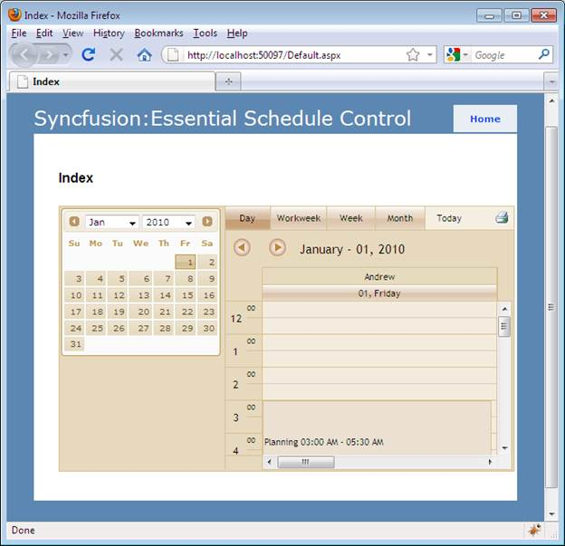

::: {style="DISPLAY: none"}
{#d2h_url_template}{#d2h_package_url style="WIDTH: 0px; DISPLAY: none; HEIGHT: 0px"}
:::

::::: {#nsbanner .d2h_main_nsbanner style="BORDER-BOTTOM: #999999 1px solid; POSITION: relative; PADDING-BOTTOM: 0px; BACKGROUND-COLOR: transparent; PADDING-LEFT: 0px; PADDING-RIGHT: 0px; DISPLAY: none; BORDER-TOP: #999999 1px solid; PADDING-TOP: 0px; LEFT: 0px"}
:::: {#TitleRow .d2h_main_titlerow style="PADDING-BOTTOM: 4px; BACKGROUND-COLOR: transparent; PADDING-LEFT: 22px; WIDTH: 100%; PADDING-RIGHT: 10px; DISPLAY: none; PADDING-TOP: 4px"}
::: {#ienav .d2h_main_ienav style="DISPLAY: none"}
{#D2HPrevious .D2HPreviousEnabled}  {#D2HNext .D2HNextEnabled}
:::
::::
:::::

:::::: {#nstext .d2h_main_nstext style="PADDING-BOTTOM: 10px; BACKGROUND-COLOR: transparent; PADDING-LEFT: 22px; PADDING-RIGHT: 10px; HEIGHT: 100%; OVERFLOW: auto; PADDING-TOP: 5px" hasuserbackground="true" valign="bottom"}
::: {#d2h_breadcrumbs .d2h_breadcrumbs}
[Essential Studio User Guide Documentation](ms-xhelp:///?Id=12457748-09e3-4d74-a240-8e049cedf030){.d2h_breadcrumbsNormal}[ \> ]{.d2h_breadcrumbsLinkSeparator}[User Interface Edition](ms-xhelp:///?Id=c29296b7-531c-413b-a0ec-488ca1f7f669){.d2h_breadcrumbsNormal}[ \> ]{.d2h_breadcrumbsLinkSeparator}[Essential ASP.NET MVC](ms-xhelp:///?Id=4b14e7d1-65c4-4f67-b1aa-2c37709905a5){.d2h_breadcrumbsNormal}[ \> ]{.d2h_breadcrumbsLinkSeparator}[Essential Schedule]{.d2h_breadcrumbsContentsOnly}[ \> ]{.d2h_breadcrumbsLinkSeparator}[Getting Started](ms-xhelp:///?Id=b686dbe4-808e-405b-8e03-33b17be71f0d){.d2h_breadcrumbsNormal}[ \> ]{.d2h_breadcrumbsLinkSeparator}[Adding Essential Schedule to the Application](ms-xhelp:///?Id=e4f32654-cbef-4829-8c06-f1b2f5ecfb45){.d2h_breadcrumbsNormal}
:::

### Creating Schedule using Schedule Property Model {#creating-schedule-using-schedule-property-model style="tab-stops: 0pt"}

To create a schedule using Schedule Property Model:

 

1.   Select the Index.aspx from **View**-\>**Home** folder.

2.   Add the following code in the FlatSchedule.aspx file, to create the **Schedule** control in **View**:

[]{style="FONT-FAMILY: 'Calibri','sans-serif'"} 

+--------------------------------------------------------------------------------------------------------------------------------------------------------+
| [\[View\]]{style="FONT-FAMILY: 'Calibri','sans-serif'"}                                                                                                |
|                                                                                                                                                        |
| []{style="FONT-FAMILY: 'Calibri','sans-serif'"}                                                                                                        |
|                                                                                                                                                        |
| [    [\<%]{style="BACKGROUND: yellow"}=Html.Syncfusion().Schedule()(\"FlatSchedule\", \"ScheduleModel\")]{style="FONT-FAMILY: 'Calibri','sans-serif'"} |
|                                                                                                                                                        |
| [       .BindList(columns =\>]{style="FONT-FAMILY: 'Calibri','sans-serif'"}                                                                            |
|                                                                                                                                                        |
| [       {]{style="FONT-FAMILY: 'Calibri','sans-serif'"}                                                                                                |
|                                                                                                                                                        |
| [           columns.IdField(\"AppId\");]{style="FONT-FAMILY: 'Calibri','sans-serif'"}                                                                  |
|                                                                                                                                                        |
| [           columns.SubjectField(\"Subject\");]{style="FONT-FAMILY: 'Calibri','sans-serif'"}                                                           |
|                                                                                                                                                        |
| [           columns.LocationField(\"Location\");]{style="FONT-FAMILY: 'Calibri','sans-serif'"}                                                         |
|                                                                                                                                                        |
| [           columns.StartTimeField(\"StartTime\");]{style="FONT-FAMILY: 'Calibri','sans-serif'"}                                                       |
|                                                                                                                                                        |
| [           columns.EndTimeField(\"EndTime\");]{style="FONT-FAMILY: 'Calibri','sans-serif'"}                                                           |
|                                                                                                                                                        |
| [           columns.DescriptionField(\"Descrip\");]{style="FONT-FAMILY: 'Calibri','sans-serif'"}                                                       |
|                                                                                                                                                        |
| [           columns.OwnerField(\"Resource\");]{style="FONT-FAMILY: 'Calibri','sans-serif'"}                                                            |
|                                                                                                                                                        |
| [       })]{style="FONT-FAMILY: 'Calibri','sans-serif'"}                                                                                               |
|                                                                                                                                                        |
| [    [%\>]{style="BACKGROUND: yellow"}]{style="FONT-FAMILY: 'Calibri','sans-serif'"}                                                                   |
|                                                                                                                                                        |
| []{style="FONT-FAMILY: 'Calibri','sans-serif'"}                                                                                                        |
+--------------------------------------------------------------------------------------------------------------------------------------------------------+

[]{style="FONT-FAMILY: 'Calibri','sans-serif'"} 

3.   Double-click the **HomeController.cs** from **Controller/Home** folder.

The HomeController.cs page is displayed on the main window.

[]{style="FONT-FAMILY: 'Calibri','sans-serif'"} 

{border="0"}

[]{style="FONT-FAMILY: 'Calibri','sans-serif'"} 

Figure 50: HomeController.cs Page[]{style="FONT-FAMILY: 'Calibri','sans-serif'"}

***[]{style="FONT-FAMILY: 'Calibri','sans-serif'"}*** 

4.   Include the **Syncfusion.Mvc.Shared, Syncfusion.Mvc.Schedule** namespaces to **HomeController** by using the following code:

[]{style="FONT-FAMILY: 'Calibri','sans-serif'"} 

\[Controller\]

[using]{style="COLOR: blue"} Syncfusion.Mvc.Schedule;

[using]{style="COLOR: blue"} Syncfusion.Mvc.Shared;

[]{style="FONT-FAMILY: 'Calibri','sans-serif'"} 

5.   Edit the **Index** method as given below:

[]{style="FONT-FAMILY: 'Calibri','sans-serif'"} 

+----------------------------------------------------------------------------------------------------------------------------------------------------------------------------------------------------------------------------------------------------+
| [\[Controller\]]{style="FONT-FAMILY: 'Calibri','sans-serif'"}                                                                                                                                                                                      |
|                                                                                                                                                                                                                                                    |
| []{style="FONT-FAMILY: 'Calibri','sans-serif'"}                                                                                                                                                                                                    |
|                                                                                                                                                                                                                                                    |
| [                [///]{style="COLOR: gray"}[ ]{style="COLOR: green"}[\<summary\>]{style="COLOR: gray"}]{style="FONT-FAMILY: 'Calibri','sans-serif'"}                                                                                               |
|                                                                                                                                                                                                                                                    |
| [                 [///]{style="COLOR: gray"}[ It is used to bind the Schedule]{style="COLOR: green"}]{style="FONT-FAMILY: 'Calibri','sans-serif'"}                                                                                                 |
|                                                                                                                                                                                                                                                    |
| [                [///]{style="COLOR: gray"}[ ]{style="COLOR: green"}[\</summary\>]{style="COLOR: gray"}]{style="FONT-FAMILY: 'Calibri','sans-serif'"}                                                                                              |
|                                                                                                                                                                                                                                                    |
| [                [///]{style="COLOR: gray"}[ ]{style="COLOR: green"}[\<returns\>]{style="COLOR: gray"}[View page, it displays the Schedule]{style="COLOR: green"}[\</returns\>]{style="COLOR: gray"}]{style="FONT-FAMILY: 'Calibri','sans-serif'"} |
|                                                                                                                                                                                                                                                    |
| [                [public]{style="COLOR: blue"} [ActionResult]{style="COLOR: #2b91af"} FlatSchedule()]{style="FONT-FAMILY: 'Calibri','sans-serif'"}                                                                                                 |
|                                                                                                                                                                                                                                                    |
| [                {]{style="FONT-FAMILY: 'Calibri','sans-serif'"}                                                                                                                                                                                   |
|                                                                                                                                                                                                                                                    |
| [                 [var]{style="COLOR: blue"} data = [new]{style="COLOR: blue"} [NorthwindDataClassesDataContext]{style="COLOR: #2b91af"}().AppointmentTables.Take(200);]{style="FONT-FAMILY: 'Calibri','sans-serif'"}                              |
|                                                                                                                                                                                                                                                    |
| [                [SchedulePropertiesModel]{style="COLOR: #2b91af"} model = [new]{style="COLOR: blue"} [SchedulePropertiesModel]{style="COLOR: #2b91af"}()]{style="FONT-FAMILY: 'Calibri','sans-serif'"}                                            |
|                                                                                                                                                                                                                                                    |
| [                {]{style="FONT-FAMILY: 'Calibri','sans-serif'"}                                                                                                                                                                                   |
|                                                                                                                                                                                                                                                    |
| [                                DataSource=data,]{style="FONT-FAMILY: 'Calibri','sans-serif'"}                                                                                                                                                    |
|                                                                                                                                                                                                                                                    |
| [                                Skins=[ScheduleSkins]{style="COLOR: #2b91af"}.Sandune]{style="FONT-FAMILY: 'Calibri','sans-serif'"}                                                                                                               |
|                                                                                                                                                                                                                                                    |
| [                };]{style="FONT-FAMILY: 'Calibri','sans-serif'"}                                                                                                                                                                                  |
|                                                                                                                                                                                                                                                    |
| [                                ViewData\[[\"ScheduleModel\"]{style="COLOR: #a31515"}\] = model;]{style="FONT-FAMILY: 'Calibri','sans-serif'"}                                                                                                    |
|                                                                                                                                                                                                                                                    |
| [                                [return]{style="COLOR: blue"} View();]{style="FONT-FAMILY: 'Calibri','sans-serif'"}                                                                                                                               |
|                                                                                                                                                                                                                                                    |
| [                }]{style="FONT-FAMILY: 'Calibri','sans-serif'"}                                                                                                                                                                                   |
|                                                                                                                                                                                                                                                    |
| []{style="FONT-FAMILY: 'Calibri','sans-serif'"}                                                                                                                                                                                                    |
+----------------------------------------------------------------------------------------------------------------------------------------------------------------------------------------------------------------------------------------------------+

[]{style="FONT-FAMILY: 'Calibri','sans-serif'"} 

Code details:

a.  Object created for SchedulePropertiesModel and the following Schedule properties are assigned to the model:

DataSource                   - Gets or sets DataSource for the Schedule[ ]{style="COLOR: gray"}control

Skins                            - Gets or sets Schedule Skin

a.  Pass the model to View using ViewData. This will pass the Schedule properties from Controller to View.

Syntax :

ViewData\[\"model_id\"\] = object_name;

b.  Create a post method for Index action and bind the data source to Schedule, as shown in the code displayed below.

[]{style="FONT-FAMILY: 'Calibri','sans-serif'"} 

+------------------------------------------------------------------------------------------------------------------------------------------------------------------------------------------------------------------------------------------------------------------------------------------------------------+
| [\[Controller\]]{style="FONT-FAMILY: 'Calibri','sans-serif'"}                                                                                                                                                                                                                                              |
|                                                                                                                                                                                                                                                                                                            |
| []{style="FONT-FAMILY: 'Calibri','sans-serif'"}                                                                                                                                                                                                                                                            |
|                                                                                                                                                                                                                                                                                                            |
| [        ]{style="FONT-FAMILY: 'Calibri','sans-serif'"}[///]{style="FONT-FAMILY: 'Calibri','sans-serif'; COLOR: gray"}[ ]{style="FONT-FAMILY: 'Calibri','sans-serif'; COLOR: green"}[\<summary\>]{style="FONT-FAMILY: 'Calibri','sans-serif'; COLOR: gray"}[]{style="FONT-FAMILY: 'Calibri','sans-serif'"} |
|                                                                                                                                                                                                                                                                                                            |
| [        [///]{style="COLOR: gray"}[ Post Requests are mapped to this method. This method invokes the HtmlActionResult]{style="COLOR: green"}]{style="FONT-FAMILY: 'Calibri','sans-serif'"}                                                                                                                |
|                                                                                                                                                                                                                                                                                                            |
| [        [///]{style="COLOR: gray"}[ from the Schedule. Required response is generated.]{style="COLOR: green"}]{style="FONT-FAMILY: 'Calibri','sans-serif'"}                                                                                                                                               |
|                                                                                                                                                                                                                                                                                                            |
| [        [///]{style="COLOR: gray"}[ ]{style="COLOR: green"}[\</summary\>]{style="COLOR: gray"}]{style="FONT-FAMILY: 'Calibri','sans-serif'"}                                                                                                                                                              |
|                                                                                                                                                                                                                                                                                                            |
| [        [///]{style="COLOR: gray"}[ ]{style="COLOR: green"}[\<param name=\"args\"\>]{style="COLOR: gray"}[Contains post action properties ]{style="COLOR: green"}[\</param\>]{style="COLOR: gray"}]{style="FONT-FAMILY: 'Calibri','sans-serif'"}                                                          |
|                                                                                                                                                                                                                                                                                                            |
| [        [///]{style="COLOR: gray"}[ ]{style="COLOR: green"}[\<returns\>]{style="COLOR: gray"}]{style="FONT-FAMILY: 'Calibri','sans-serif'"}                                                                                                                                                               |
|                                                                                                                                                                                                                                                                                                            |
| [        [///]{style="COLOR: gray"}[ HtmlActionResult which returns data displayed on the Schedule]{style="COLOR: green"}]{style="FONT-FAMILY: 'Calibri','sans-serif'"}                                                                                                                                    |
|                                                                                                                                                                                                                                                                                                            |
| [        [///]{style="COLOR: gray"}[ ]{style="COLOR: green"}[\</returns\>]{style="COLOR: gray"}]{style="FONT-FAMILY: 'Calibri','sans-serif'"}                                                                                                                                                              |
|                                                                                                                                                                                                                                                                                                            |
| [        \[[AcceptVerbs]{style="COLOR: #2b91af"}([HttpVerbs]{style="COLOR: #2b91af"}.Post)\]]{style="FONT-FAMILY: 'Calibri','sans-serif'"}                                                                                                                                                                 |
|                                                                                                                                                                                                                                                                                                            |
| [        [public]{style="COLOR: blue"} [ActionResult]{style="COLOR: #2b91af"} FlatSchedule([Params]{style="COLOR: #2b91af"} args)]{style="FONT-FAMILY: 'Calibri','sans-serif'"}                                                                                                                            |
|                                                                                                                                                                                                                                                                                                            |
| [        {]{style="FONT-FAMILY: 'Calibri','sans-serif'"}                                                                                                                                                                                                                                                   |
|                                                                                                                                                                                                                                                                                                            |
| [IEnumerable]{style="FONT-FAMILY: 'Calibri','sans-serif'; COLOR: #2b91af"}[ data = [new]{style="COLOR: blue"} [NorthwindDataClassesDataContext]{style="COLOR: #2b91af"}().AppointmentTables.Take(200);]{style="FONT-FAMILY: 'Calibri','sans-serif'"}                                                       |
|                                                                                                                                                                                                                                                                                                            |
| [                [return]{style="COLOR: blue"} data.ScheduleActions\<[ScheduleHtmlActionResult]{style="COLOR: #2b91af"}\>();]{style="FONT-FAMILY: 'Calibri','sans-serif'"}                                                                                                                                 |
|                                                                                                                                                                                                                                                                                                            |
| [        }]{style="FONT-FAMILY: 'Calibri','sans-serif'"}                                                                                                                                                                                                                                                   |
|                                                                                                                                                                                                                                                                                                            |
| []{style="FONT-FAMILY: 'Calibri','sans-serif'"}                                                                                                                                                                                                                                                            |
+------------------------------------------------------------------------------------------------------------------------------------------------------------------------------------------------------------------------------------------------------------------------------------------------------------+

::: {style="BORDER-BOTTOM: windowtext 1pt solid; BORDER-LEFT: medium none; PADDING-BOTTOM: 1pt; MARGIN-TOP: 9pt; PADDING-LEFT: 0pt; PADDING-RIGHT: 0pt; MARGIN-BOTTOM: 9pt; BORDER-TOP: windowtext 1pt solid; BORDER-RIGHT: medium none; PADDING-TOP: 1pt"}
{border="0"}Note: Essential Schedule is fully Ajax enabled. For tab navigation/date navigation/crud actions, the entire page will not be refreshed. The Schedule contents alone will be refreshed using Ajax calls. So the above method is necessary to achieve the Schedule actions.
:::

Code details:

a.  Get the data source and store it in an IEnumeable collection.

b.  Call the ScheduleAction helper with the Type of Model, which invokes the custom action result. This will process the data source returns and the required response while calling tab navigation/date navigation actions.

c.  Run the application.

[]{style="FONT-FAMILY: 'Calibri','sans-serif'"} 

{border="0"}

[]{style="FONT-FAMILY: 'Calibri','sans-serif'"} 

Figure 51: Schedule Control Added to the Application[]{style="FONT-FAMILY: 'Calibri','sans-serif'"}

[]{style="FONT-FAMILY: 'Calibri','sans-serif'"} 

A sample which demonstrates a basic Schedule control that can be downloaded from the following link:

[[http://help.syncfusion.com/Support/Schedule_Mvc/v8.3.0.20/MVCScheduleSample.zip]{.UGHyperlink}](http://help.syncfusion.com/Support/Schedule_Mvc/v8.3.0.20/MVCScheduleSample.zip)[]{.UGHyperlink}

::: {style="BORDER-BOTTOM: windowtext 1pt solid; BORDER-LEFT: medium none; PADDING-BOTTOM: 1pt; MARGIN-TOP: 9pt; PADDING-LEFT: 0pt; PADDING-RIGHT: 0pt; MARGIN-BOTTOM: 9pt; BORDER-TOP: windowtext 1pt solid; BORDER-RIGHT: medium none; PADDING-TOP: 1pt"}
{border="0"}Note: The version number for the assemblies has been set to 8.3.0.20 in the Web.config file of the attached sample. Change the version number to the appropriate version in the Web-2008.config or Web-2010.config files (available in root directory) and those will automatically be updated in the Web.config file.
:::

[]{style="FONT-FAMILY: 'Calibri','sans-serif'"} 

[]{#related-topics}
::::::
