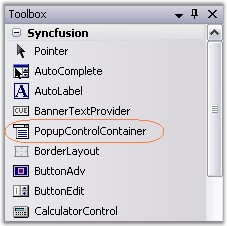

::: {style="DISPLAY: none"}
{#d2h_url_template}{#d2h_package_url style="WIDTH: 0px; DISPLAY: none; HEIGHT: 0px"}
:::

::: {.d2h_secondary_topic style="PADDING-BOTTOM: 10pt; MARGIN: 0pt; PADDING-LEFT: 0pt; PADDING-RIGHT: 0pt; PADDING-TOP: 0pt"}
##### Creating Simple Popup {#creating-simple-popup style="tab-stops: 0pt"}

[]{style="COLOR: #15428b"} 

This section deals with creating a simple popup with the help of PopupControlContainer control.

[]{style="COLOR: #15428b"} 

Creating PopupControlContainer

[]{style="COLOR: #15428b"} 

The PopupControlContainer control provides full support for the Windows Forms designer. To use a PopupControlContainer control in your application, all you need to do is drag and drop the PopupControlContainer control from the controls toolbox onto your form.

[]{style="COLOR: #15428b"} 

{border="0"}

[]{style="COLOR: #15428b"} 

Figure 381: PopupControlContainer in the Toolbox

[]{style="COLOR: #15428b"} 

The PopupControlContainer can be created programmatically as follows.

[]{style="COLOR: #15428b"} 

3.   Include the Shared.Base assembly reference to Reference folder.

4\.

5.   Create an instance of PopupControlContainer and add to the Form.

[]{style="COLOR: #15428b"} 

+--------------------------------------------------------------------------------------------------------------------------------------------------------------------------------------------------------------------------+
| **[\[C#\]]{style="FONT-FAMILY: 'Courier New'; COLOR: black"}**                                                                                                                                                           |
|                                                                                                                                                                                                                          |
| []{style="COLOR: #15428b"}                                                                                                                                                                                               |
|                                                                                                                                                                                                                          |
| [private]{style="FONT-FAMILY: 'Courier New'; COLOR: blue"}[ Syncfusion.Windows.Forms.PopupControlContainer popupControlContainer1;]{style="FONT-FAMILY: 'Courier New'"}                                                  |
|                                                                                                                                                                                                                          |
| [this]{style="FONT-FAMILY: 'Courier New'; COLOR: blue"}[.popupControlContainer1=[new]{style="COLOR: blue"} Syncfusion.Windows.Forms.PopupControlContainer();]{style="FONT-FAMILY: 'Courier New'"}                        |
|                                                                                                                                                                                                                          |
| [this]{style="FONT-FAMILY: 'Courier New'; COLOR: blue"}[.Controls.Add([this]{style="COLOR: blue"}.popupControlContainer1);             ]{style="FONT-FAMILY: 'Courier New'"}[      ]{style="FONT-FAMILY: 'Courier New'"} |
+--------------------------------------------------------------------------------------------------------------------------------------------------------------------------------------------------------------------------+

[]{style="COLOR: #15428b"} 

+--------------------------------------------------------------------------------------------------------------------------------------------------------------------------------------------------+
| **[\[VB.NET\]]{style="FONT-FAMILY: 'Courier New'; COLOR: black"}**                                                                                                                               |
|                                                                                                                                                                                                  |
| []{style="COLOR: #15428b"}                                                                                                                                                                       |
|                                                                                                                                                                                                  |
| [Private]{style="FONT-FAMILY: 'Courier New'; COLOR: blue"}[ popupControlContainer1 [As]{style="COLOR: blue"} Syncfusion.Windows.Forms.PopupControlContainer]{style="FONT-FAMILY: 'Courier New'"} |
|                                                                                                                                                                                                  |
| [Me]{style="FONT-FAMILY: 'Courier New'; COLOR: blue"}[.popupControlContainer1 = [New]{style="COLOR: blue"} Syncfusion.Windows.Forms.PopupControlContainer()]{style="FONT-FAMILY: 'Courier New'"} |
|                                                                                                                                                                                                  |
| [Me]{style="FONT-FAMILY: 'Courier New'; COLOR: blue"}[.Controls.Add([Me]{style="COLOR: blue"}.popupControlContainer1)]{style="FONT-FAMILY: 'Courier New'"}                                       |
+--------------------------------------------------------------------------------------------------------------------------------------------------------------------------------------------------+

**[]{style="COLOR: #15428b"}** 

6.   We can add child controls to the PopupControlContainer and associate it as a popup for other controls like RichTextBox. Refer How to show PopupControlContainer as the popup for a RichTextBox control[?]{style="COLOR: black"} topic.

[]{style="COLOR: #15428b"} 

A sample which illustrates how to create a custom PopupControlContainer and assign it to a control is available in the below sample installation location.

 

..\\My Documents\\Syncfusion\\EssentialStudio***\\Version Number***\\Windows\\Tools.Windows\\Samples\\2.0\\Editors Package\\Container controls\\PopupContainer\\PopupContainerDemo

 

See also

[]{style="COLOR: black"}

[[Concepts and Features]{style="COLOR: blue"}]{.UGHyperlink}

[]{#related-topics}
:::
