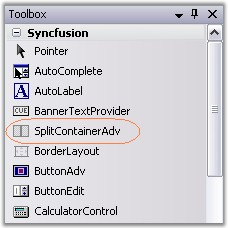
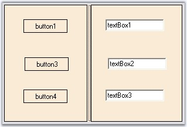
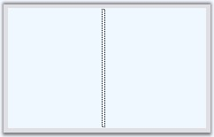

::: {style="DISPLAY: none"}
{#d2h_url_template}{#d2h_package_url style="WIDTH: 0px; DISPLAY: none; HEIGHT: 0px"}
:::

::: {.d2h_secondary_topic style="PADDING-BOTTOM: 10pt; MARGIN: 0pt; PADDING-LEFT: 0pt; PADDING-RIGHT: 0pt; PADDING-TOP: 0pt"}
##### Creating SplitContainerAdv {#creating-splitcontaineradv style="tab-stops: 0pt"}

[]{#p478} 

This section will give a step-by-step procedure to design a SplitContainerAdv control through designer and also through programmatical approach.

[]{style="COLOR: #15428b"} 

###### []{#_Through_Designer_5}3.3.6.4.2.1 Through Designer {#through-designer style="tab-stops: 0pt"}

[]{#p479}[]{style="COLOR: #15428b"} 

To create and customize the SplitContainerAdv through designer,

[]{style="COLOR: #15428b"} 

[·      ]{style="FONT-FAMILY: Symbol"}Open a new Visual C# or VB.NET application in Visual studio.

[·      ]{style="FONT-FAMILY: Symbol"}Drag-and-drop a SplitContainerAdv control object from the toolbox onto the form and resize it to the desired dimension.

[]{style="COLOR: #15428b"} 

{border="0"}

Figure 416: SplitContainerAdv in Toolbox

**[]{style="COLOR: black; FONT-SIZE: 8pt"}** 

[·      ]{style="FONT-FAMILY: Symbol"}Drag and drop the desired controls on to the panels.

[·      ]{style="FONT-FAMILY: Symbol"}Run the application.

[]{style="COLOR: #15428b"} 

{border="0"}

Figure 417: SplitContainerAdv with Child Controls

**[]{style="COLOR: #15428b"}** 

See Also

[]{style="COLOR: #15428b"} 

[Concepts and Features]{.UGHyperlink}[]{.UGHyperlink}

###### []{#p480}3.3.6.4.2.2 Through Code {#through-code style="tab-stops: 0pt"}

[]{style="FONT-SIZE: 8pt"} 

To create a SplitContainerAdv control programmatically,

[]{style="COLOR: #15428b"} 

[·      ]{style="FONT-FAMILY: Symbol"}Open a new Visual C# or VB.NET application in Visual Studio.

[·      ]{style="FONT-FAMILY: Symbol"}Add the Syncfusion assemblies Shared.Base and Tool.Windows.

[·      ]{style="FONT-FAMILY: Symbol"}Declare the SplitContainerAdv control.

[]{style="COLOR: #15428b"} 

+-----------------------------------------------------------------------------------------------------------------------------------------------------------------------+
| **[\[C#\]]{style="FONT-FAMILY: 'Courier New'; COLOR: black"}**                                                                                                        |
|                                                                                                                                                                       |
| **[]{style="FONT-FAMILY: 'Courier New'; COLOR: black"}**                                                                                                              |
|                                                                                                                                                                       |
| [private]{style="FONT-FAMILY: 'Courier New'; COLOR: blue"}[ Syncfusion.Windows.Forms.Tools.SplitContainerAdv splitContainerAdv1;]{style="FONT-FAMILY: 'Courier New'"} |
+-----------------------------------------------------------------------------------------------------------------------------------------------------------------------+

[]{style="COLOR: #15428b"} 

+------------------------------------------------------------------------------------------------------------------------------------------------------------------------------------------------+
| **[\[VB.NET\]]{style="FONT-FAMILY: 'Courier New'; COLOR: black"}**                                                                                                                             |
|                                                                                                                                                                                                |
| **[]{style="FONT-FAMILY: 'Courier New'; COLOR: black"}**                                                                                                                                       |
|                                                                                                                                                                                                |
| [Private]{style="FONT-FAMILY: 'Courier New'; COLOR: blue"}[ splitContainerAdv1 [As]{style="COLOR: blue"} Syncfusion.Windows.Forms.Tools.SplitContainerAdv]{style="FONT-FAMILY: 'Courier New'"} |
+------------------------------------------------------------------------------------------------------------------------------------------------------------------------------------------------+

[]{style="COLOR: #15428b"} 

[·      ]{style="FONT-FAMILY: Symbol"}Initialize the control and add it in your form.

[]{style="COLOR: #15428b"} 

+---------------------------------------------------------------------------------------------------------------------------------------------------------------------------------------------------+
| **[\[C#\]]{style="FONT-FAMILY: 'Courier New'; COLOR: black"}**                                                                                                                                    |
|                                                                                                                                                                                                   |
| **[]{style="FONT-FAMILY: 'Courier New'; COLOR: black"}**                                                                                                                                          |
|                                                                                                                                                                                                   |
| [this]{style="FONT-FAMILY: 'Courier New'; COLOR: blue"}[.splitContainerAdv1 = [new]{style="COLOR: blue"} Syncfusion.Windows.Forms.Tools.SplitContainerAdv();]{style="FONT-FAMILY: 'Courier New'"} |
|                                                                                                                                                                                                   |
| [this]{style="FONT-FAMILY: 'Courier New'; COLOR: blue"}[.Controls.Add([this]{style="COLOR: blue"}.splitContainerAdv1);]{style="FONT-FAMILY: 'Courier New'"}                                       |
+---------------------------------------------------------------------------------------------------------------------------------------------------------------------------------------------------+

[]{style="COLOR: #15428b"} 

+------------------------------------------------------------------------------------------------------------------------------------------------------------------------------------------------+
| **[\[VB.NET\]]{style="FONT-FAMILY: 'Courier New'; COLOR: black"}**                                                                                                                             |
|                                                                                                                                                                                                |
| **[]{style="FONT-FAMILY: 'Courier New'; COLOR: black"}**                                                                                                                                       |
|                                                                                                                                                                                                |
| [Me]{style="FONT-FAMILY: 'Courier New'; COLOR: blue"}[.splitContainerAdv1 = [New]{style="COLOR: blue"} Syncfusion.Windows.Forms.Tools.SplitContainerAdv()]{style="FONT-FAMILY: 'Courier New'"} |
|                                                                                                                                                                                                |
| [Me]{style="FONT-FAMILY: 'Courier New'; COLOR: blue"}[.Controls.Add([Me]{style="COLOR: blue"}.splitContainerAdv1)]{style="FONT-FAMILY: 'Courier New'"}                                         |
+------------------------------------------------------------------------------------------------------------------------------------------------------------------------------------------------+

[]{style="COLOR: #15428b"} 

[·      ]{style="FONT-FAMILY: Symbol"}If required customize the control\'s look and feel.

[]{style="COLOR: #15428b"} 

+--------------------------------------------------------------------------------------------------------------------------------------------------------------------------------------+
| **[\[C#\]]{style="FONT-FAMILY: 'Courier New'; COLOR: black"}**                                                                                                                       |
|                                                                                                                                                                                      |
| **[]{style="FONT-FAMILY: 'Courier New'; COLOR: black"}**                                                                                                                             |
|                                                                                                                                                                                      |
| [this]{style="FONT-FAMILY: 'Courier New'; COLOR: blue"}[.splitContainerAdv1.BackColor = System.Drawing.Color.AliceBlue;]{style="FONT-FAMILY: 'Courier New'"}                         |
|                                                                                                                                                                                      |
| [this]{style="FONT-FAMILY: 'Courier New'; COLOR: blue"}[.splitContainerAdv1.Location = [new]{style="COLOR: blue"} System.Drawing.Point(64, 48);]{style="FONT-FAMILY: 'Courier New'"} |
|                                                                                                                                                                                      |
| [this]{style="FONT-FAMILY: 'Courier New'; COLOR: blue"}[.splitContainerAdv1.Size = [new]{style="COLOR: blue"} System.Drawing.Size(224, 136);]{style="FONT-FAMILY: 'Courier New'"}    |
|                                                                                                                                                                                      |
| [this]{style="FONT-FAMILY: 'Courier New'; COLOR: blue"}[.splitContainerAdv1.SplitterDistance = 47;]{style="FONT-FAMILY: 'Courier New'"}                                              |
+--------------------------------------------------------------------------------------------------------------------------------------------------------------------------------------+

[]{style="COLOR: #15428b"} 

+-----------------------------------------------------------------------------------------------------------------------------------------------------------------------------------+
| **[\[VB.NET\]]{style="FONT-FAMILY: 'Courier New'; COLOR: black"}**                                                                                                                |
|                                                                                                                                                                                   |
| **[]{style="FONT-FAMILY: 'Courier New'; COLOR: black"}**                                                                                                                          |
|                                                                                                                                                                                   |
| [Me]{style="FONT-FAMILY: 'Courier New'; COLOR: blue"}[.splitContainerAdv1.BackColor = System.Drawing.Color.AliceBlue]{style="FONT-FAMILY: 'Courier New'"}                         |
|                                                                                                                                                                                   |
| [Me]{style="FONT-FAMILY: 'Courier New'; COLOR: blue"}[.splitContainerAdv1.Location = [New]{style="COLOR: blue"} System.Drawing.Point(64, 48)]{style="FONT-FAMILY: 'Courier New'"} |
|                                                                                                                                                                                   |
| [Me]{style="FONT-FAMILY: 'Courier New'; COLOR: blue"}[.splitContainerAdv1.Size = [New]{style="COLOR: blue"} System.Drawing.Size(224, 136)]{style="FONT-FAMILY: 'Courier New'"}    |
|                                                                                                                                                                                   |
| [Me]{style="FONT-FAMILY: 'Courier New'; COLOR: blue"}[.splitContainerAdv1.SplitterDistance = 47]{style="FONT-FAMILY: 'Courier New'"}                                              |
+-----------------------------------------------------------------------------------------------------------------------------------------------------------------------------------+

[]{style="COLOR: #15428b"} 

[·      ]{style="FONT-FAMILY: Symbol"}Run the application. You will see the SplitContainerAdv with two panels in it as shown below.

[]{style="COLOR: #15428b"} 

{border="0"}

Figure 418: SplitContainerAdv Created Programmatically

[]{#related-topics}
:::
