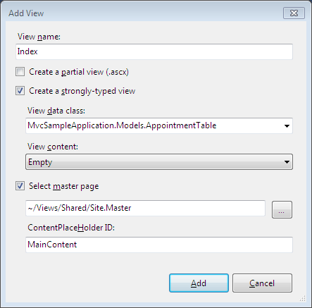
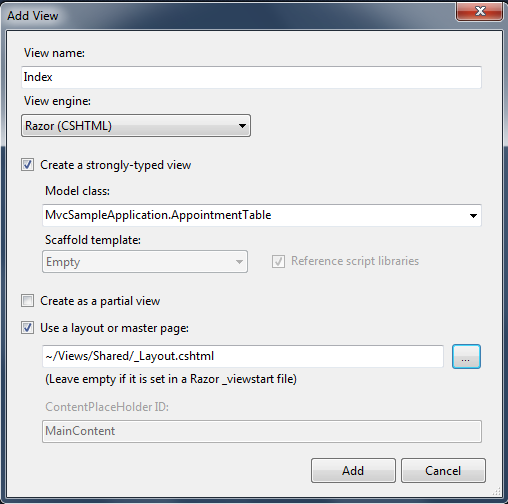
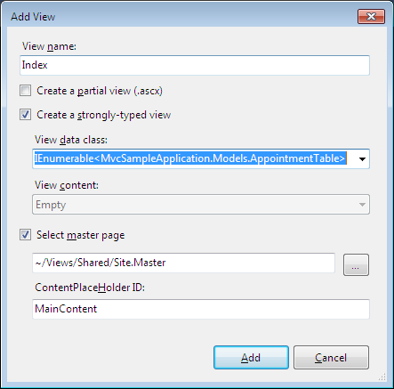
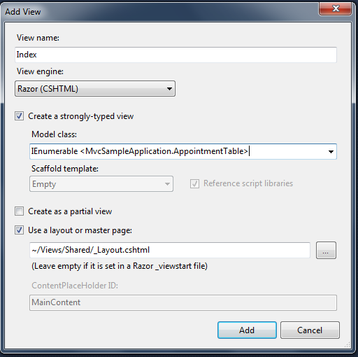

::: {style="DISPLAY: none"}
{#d2h_url_template}{#d2h_package_url style="WIDTH: 0px; DISPLAY: none; HEIGHT: 0px"}
:::

::::: {#nsbanner .d2h_main_nsbanner style="BORDER-BOTTOM: #999999 1px solid; POSITION: relative; PADDING-BOTTOM: 0px; BACKGROUND-COLOR: transparent; PADDING-LEFT: 0px; PADDING-RIGHT: 0px; DISPLAY: none; BORDER-TOP: #999999 1px solid; PADDING-TOP: 0px; LEFT: 0px"}
:::: {#TitleRow .d2h_main_titlerow style="PADDING-BOTTOM: 4px; BACKGROUND-COLOR: transparent; PADDING-LEFT: 22px; WIDTH: 100%; PADDING-RIGHT: 10px; DISPLAY: none; PADDING-TOP: 4px"}
::: {#ienav .d2h_main_ienav style="DISPLAY: none"}
{#D2HPrevious .D2HPreviousEnabled}  {#D2HNext .D2HNextEnabled}
:::
::::
:::::

::::: {#nstext .d2h_main_nstext style="PADDING-BOTTOM: 10px; BACKGROUND-COLOR: transparent; PADDING-LEFT: 22px; PADDING-RIGHT: 10px; HEIGHT: 100%; OVERFLOW: auto; PADDING-TOP: 5px" hasuserbackground="true" valign="bottom"}
::: {#d2h_breadcrumbs .d2h_breadcrumbs}
[Essential Studio User Guide Documentation](ms-xhelp:///?Id=12457748-09e3-4d74-a240-8e049cedf030){.d2h_breadcrumbsNormal}[ \> ]{.d2h_breadcrumbsLinkSeparator}[User Interface Edition](ms-xhelp:///?Id=c29296b7-531c-413b-a0ec-488ca1f7f669){.d2h_breadcrumbsNormal}[ \> ]{.d2h_breadcrumbsLinkSeparator}[Essential ASP.NET MVC](ms-xhelp:///?Id=4b14e7d1-65c4-4f67-b1aa-2c37709905a5){.d2h_breadcrumbsNormal}[ \> ]{.d2h_breadcrumbsLinkSeparator}[Essential Schedule]{.d2h_breadcrumbsContentsOnly}[ \> ]{.d2h_breadcrumbsLinkSeparator}[How To](ms-xhelp:///?Id=84ce0346-a231-4679-a834-37b06c85ce69){.d2h_breadcrumbsNormal}[ \> ]{.d2h_breadcrumbsLinkSeparator}[Strongly Typed View](ms-xhelp:///?Id=41e0aac3-3b96-4c7d-a2ee-fa1f7903642d){.d2h_breadcrumbsNormal}
:::

### [Creating Strongly Typed View]{style="FONT-FAMILY: 'Calibri','sans-serif'"} {#creating-strongly-typed-view style="MARGIN-TOP: 0pt; tab-stops: 0pt"}

To create strongly typed View:

1.   Right-click the **View***-\>***Home**  folder.

2.   Delete the existing Index.aspx  (To make it remain as a default action).

3.   Click **Add**, and then select **View**.

4.   Name the view **Index**.

5.   Select  the box that says create a strongly-typed view, and on the drop down menu, select your model. In this case it is "MvcSampleApplication.Models.AppointmentTable".

[]{style="FONT-FAMILY: 'Calibri','sans-serif'"} 

{border="0"}

Figure 149[: Strongly typed -- Index.aspx]{style="FONT-STYLE: normal"}

[{border="0"}]{style="FONT-STYLE: normal"}

Figure 150[: Strongly typed -- Index.cshtml]{style="FONT-STYLE: normal"}

::: {style="BORDER-BOTTOM: windowtext 1pt solid; BORDER-LEFT: medium none; PADDING-BOTTOM: 1pt; MARGIN-TOP: 9pt; PADDING-LEFT: 0pt; PADDING-RIGHT: 0pt; MARGIN-BOTTOM: 9pt; BORDER-TOP: windowtext 1pt solid; BORDER-RIGHT: medium none; PADDING-TOP: 1pt"}
{border="0"}Note[: ]{style="FONT-FAMILY: 'Calibri','sans-serif'"}The View Data class drop-down list will be empty until you successfully build your application. It is a good idea to select the menu option build, build solution before opening the Add New dialog.[]{style="FONT-FAMILY: 'Calibri','sans-serif'"}
:::

[]{style="FONT-FAMILY: 'Calibri','sans-serif'"} 

6.   In a **View Data** Class, make the model IEnumerable collections as shown below:[]{style="FONT-FAMILY: 'Calibri','sans-serif'"}

{border="0"}

Figure 151[: View Data classes as IEumerable collection(Index.aspx)]{style="FONT-STYLE: normal"}

[{border="0"}]{style="FONT-STYLE: normal"}

Figure 152[: View Data classes as IEumerable collection(Index.cshtml)]{style="FONT-STYLE: normal"}

[]{style="FONT-FAMILY: 'Calibri','sans-serif'"} 

[]{#related-topics}
:::::
