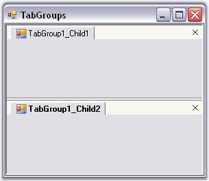

::: {style="DISPLAY: none"}
{#d2h_url_template}{#d2h_package_url style="WIDTH: 0px; DISPLAY: none; HEIGHT: 0px"}
:::

:::: {.d2h_secondary_topic style="PADDING-BOTTOM: 10pt; MARGIN: 0pt; PADDING-LEFT: 0pt; PADDING-RIGHT: 0pt; PADDING-TOP: 0pt"}
##### Creating Tab Groups {#creating-tab-groups style="MARGIN-LEFT: 18pt; tab-stops: 18.0pt"}

[]{style="COLOR: #15428b"} 

The below given steps will guide you to create and control tab groups.

[]{style="COLOR: #15428b"} 

[·      ]{style="FONT-FAMILY: Symbol"}To the application add Tools.Windows and Shared.Base Syncfusion assemblies.

[·      ]{style="FONT-FAMILY: Symbol"}Add 2 more forms and rename them as TabGroup1_Form and TabGroup2_Form. (The application now contains three forms (i.e.) Form1, TabGroup1_Form and TabGroup2_Form).

[·      ]{style="FONT-FAMILY: Symbol"}In Form1, add the namespace Syncfusion.Windows.Forms.Tools.

[]{style="COLOR: #15428b"} 

+--------------------------------------------------------------------------------------------------------------------------------+
| **[\[C#\]]{style="FONT-FAMILY: 'Courier New'; COLOR: black"}**                                                                 |
|                                                                                                                                |
| []{style="FONT-FAMILY: 'Courier New'; COLOR: black"}                                                                           |
|                                                                                                                                |
| [Using]{style="FONT-FAMILY: 'Courier New'; COLOR: blue"}[ Syncfusion.Windows.Forms.Tools;]{style="FONT-FAMILY: 'Courier New'"} |
+--------------------------------------------------------------------------------------------------------------------------------+

[]{style="COLOR: #15428b"} 

+----------------------------------------------------------------------------------------------------------------------------------+
| **[\[VB.NET\]]{style="FONT-FAMILY: 'Courier New'; COLOR: black"}**                                                               |
|                                                                                                                                  |
| []{style="FONT-FAMILY: 'Courier New'; COLOR: black"}                                                                             |
|                                                                                                                                  |
| [Imports]{style="FONT-FAMILY: 'Courier New'; COLOR: blue"}[ Syncfusion.Windows.Forms.Tools ]{style="FONT-FAMILY: 'Courier New'"} |
+----------------------------------------------------------------------------------------------------------------------------------+

[]{style="COLOR: #15428b"} 

[·      ]{style="FONT-FAMILY: Symbol"}Declare the TabbedMDIManager in your form.

[]{style="COLOR: #15428b"} 

+--------------------------------------------------------------------------------------------------------------------------------------------+
| **[\[C#\]]{style="FONT-FAMILY: 'Courier New'; COLOR: black"}**                                                                             |
|                                                                                                                                            |
| []{style="FONT-FAMILY: 'Courier New'; COLOR: black"}                                                                                       |
|                                                                                                                                            |
| [Private]{style="FONT-FAMILY: 'Courier New'; COLOR: blue"}[ TabbedGroupedMDIManager tabbedMDIManager;]{style="FONT-FAMILY: 'Courier New'"} |
+--------------------------------------------------------------------------------------------------------------------------------------------+

[]{style="COLOR: #15428b"} 

+----------------------------------------------------------------------------------------------------------------------------------------------------------------------+
| **[\[VB.NET\]]{style="FONT-FAMILY: 'Courier New'; COLOR: black"}**                                                                                                   |
|                                                                                                                                                                      |
| []{style="FONT-FAMILY: 'Courier New'; COLOR: black"}                                                                                                                 |
|                                                                                                                                                                      |
| [Private]{style="FONT-FAMILY: 'Courier New'; COLOR: blue"}[ TabbedGroupedMDIManager [As]{style="COLOR: blue"} TabbedMDIManager ]{style="FONT-FAMILY: 'Courier New'"} |
+----------------------------------------------------------------------------------------------------------------------------------------------------------------------+

[]{style="COLOR: #15428b"} 

[·      ]{style="FONT-FAMILY: Symbol"}Set the form\'s **IsMdiContainer** property to True.

[·      ]{style="FONT-FAMILY: Symbol"}Initialize the TabbedMDIManager and set the required properties.

[]{style="COLOR: #15428b"} 

+-------------------------------------------------------------------------------------------------------------------------------------------------------------------------+
| **[\[C#\]]{style="FONT-FAMILY: 'Courier New'; COLOR: black"}**                                                                                                          |
|                                                                                                                                                                         |
| []{style="FONT-FAMILY: 'Courier New'; COLOR: black"}                                                                                                                    |
|                                                                                                                                                                         |
| [public]{style="FONT-FAMILY: 'Courier New'; COLOR: blue"}[ Form1()]{style="FONT-FAMILY: 'Courier New'"}                                                                 |
|                                                                                                                                                                         |
| [{]{style="FONT-FAMILY: 'Courier New'"}                                                                                                                                 |
|                                                                                                                                                                         |
| [InitializeComponent();]{style="FONT-FAMILY: 'Courier New'"}                                                                                                            |
|                                                                                                                                                                         |
| [// Initialize a TabbedGroupedMDIManager. ]{style="FONT-FAMILY: 'Courier New'; COLOR: green"}                                                                           |
|                                                                                                                                                                         |
| [this]{style="FONT-FAMILY: 'Courier New'; COLOR: blue"}[.tabbedMDIManager = [new]{style="COLOR: blue"} TabbedGroupedMDIManager();]{style="FONT-FAMILY: 'Courier New'"}  |
|                                                                                                                                                                         |
| [// Indicates whether the user can drag and drop tabs(child forms) from one tab group to another. ]{style="FONT-FAMILY: 'Courier New'; COLOR: green"}                   |
|                                                                                                                                                                         |
| [this]{style="FONT-FAMILY: 'Courier New'; COLOR: blue"}[.tabbedMDIManager.AllowTabGroupCustomizing = [false]{style="COLOR: blue"};]{style="FONT-FAMILY: 'Courier New'"} |
|                                                                                                                                                                         |
| [// Align TabGroup horizontally.]{style="FONT-FAMILY: 'Courier New'; COLOR: green"}                                                                                     |
|                                                                                                                                                                         |
| [this]{style="FONT-FAMILY: 'Courier New'; COLOR: blue"}[.tabbedMDIManager.Horizontal = [true]{style="COLOR: blue"};]{style="FONT-FAMILY: 'Courier New'"}                |
|                                                                                                                                                                         |
| [}]{style="FONT-FAMILY: 'Courier New'"}                                                                                                                                 |
+-------------------------------------------------------------------------------------------------------------------------------------------------------------------------+

[]{style="COLOR: #15428b"} 

+----------------------------------------------------------------------------------------------------------------------------------------------------------------------+
| **[\[VB.NET\]]{style="FONT-FAMILY: 'Courier New'; COLOR: black"}**                                                                                                   |
|                                                                                                                                                                      |
| []{style="FONT-FAMILY: 'Courier New'; COLOR: black"}                                                                                                                 |
|                                                                                                                                                                      |
| [Public]{style="FONT-FAMILY: 'Courier New'; COLOR: blue"}[ [Sub]{style="COLOR: blue"} [New]{style="COLOR: blue"}()]{style="FONT-FAMILY: 'Courier New'"}              |
|                                                                                                                                                                      |
| [InitializeComponent()]{style="FONT-FAMILY: 'Courier New'"}                                                                                                          |
|                                                                                                                                                                      |
| [\' Initialize a TabbedGroupedMDIManager. ]{style="FONT-FAMILY: 'Courier New'; COLOR: green"}                                                                        |
|                                                                                                                                                                      |
| [Me]{style="FONT-FAMILY: 'Courier New'; COLOR: blue"}[.tabbedMDIManager = [New]{style="COLOR: blue"} TabbedGroupedMDIManager()]{style="FONT-FAMILY: 'Courier New'"}  |
|                                                                                                                                                                      |
| [\' Indicates whether the user can drag and drop tabs(child forms) from one tab group to another. ]{style="FONT-FAMILY: 'Courier New'; COLOR: green"}                |
|                                                                                                                                                                      |
| [Me]{style="FONT-FAMILY: 'Courier New'; COLOR: blue"}[.tabbedMDIManager.AllowTabGroupCustomizing = [False]{style="COLOR: blue"}]{style="FONT-FAMILY: 'Courier New'"} |
|                                                                                                                                                                      |
| [\' Align TabGroup horizontally.]{style="FONT-FAMILY: 'Courier New'; COLOR: green"}                                                                                  |
|                                                                                                                                                                      |
| [Me]{style="FONT-FAMILY: 'Courier New'; COLOR: blue"}[.tabbedMDIManager.Horizontal = [True]{style="COLOR: blue"}]{style="FONT-FAMILY: 'Courier New'"}                |
|                                                                                                                                                                      |
| [End]{style="FONT-FAMILY: 'Courier New'; COLOR: blue"}[ [Sub]{style="COLOR: blue"}]{style="FONT-FAMILY: 'Courier New'"}                                              |
+----------------------------------------------------------------------------------------------------------------------------------------------------------------------+

[]{style="COLOR: #15428b"} 

[·      ]{style="FONT-FAMILY: Symbol"}Attach the TabbedMDIManager to your form and specify the Tab Groups.

[]{style="COLOR: #15428b"} 

+--------------------------------------------------------------------------------------------------------------------------------------------------------------------------------------------------------------------------+
| **[\[C#\]]{style="FONT-FAMILY: 'Courier New'; COLOR: black"}**                                                                                                                                                           |
|                                                                                                                                                                                                                          |
| []{style="FONT-FAMILY: 'Courier New'; COLOR: blue"}                                                                                                                                                                      |
|                                                                                                                                                                                                                          |
| [private]{style="FONT-FAMILY: 'Courier New'; COLOR: blue"}[ [void]{style="COLOR: blue"} Form1_Load([object]{style="COLOR: blue"} sender, System.[EventArgs]{style="COLOR: teal"} e)]{style="FONT-FAMILY: 'Courier New'"} |
|                                                                                                                                                                                                                          |
| [{]{style="FONT-FAMILY: 'Courier New'"}                                                                                                                                                                                  |
|                                                                                                                                                                                                                          |
| [this]{style="FONT-FAMILY: 'Courier New'; COLOR: blue"}[.tabbedMDIManager.AttachToMdiContainer([this]{style="COLOR: blue"});]{style="FONT-FAMILY: 'Courier New'"}                                                        |
|                                                                                                                                                                                                                          |
| [// Specify the tab groups.]{style="FONT-FAMILY: 'Courier New'; COLOR: green"}                                                                                                                                           |
|                                                                                                                                                                                                                          |
| [this]{style="FONT-FAMILY: 'Courier New'; COLOR: blue"}[.tabbedMDIManager.TabbedGroups.Add([new]{style="COLOR: blue"} TabbedGroup([\"TabGroup1\"]{style="COLOR: maroon"}));]{style="FONT-FAMILY: 'Courier New'"}         |
|                                                                                                                                                                                                                          |
| [this]{style="FONT-FAMILY: 'Courier New'; COLOR: blue"}[.tabbedMDIManager.TabbedGroups.Add([new]{style="COLOR: blue"} TabbedGroup([\"TabGroup2\"]{style="COLOR: maroon"}));]{style="FONT-FAMILY: 'Courier New'"}         |
|                                                                                                                                                                                                                          |
| [}]{style="FONT-FAMILY: 'Courier New'"}                                                                                                                                                                                  |
+--------------------------------------------------------------------------------------------------------------------------------------------------------------------------------------------------------------------------+

[]{style="COLOR: #15428b"} 

+----------------------------------------------------------------------------------------------------------------------------------------------------------------------------------------------------------------------------------------------------------------------------------------------------------------------------------------------------------------------------------+
| **[\[VB.NET\]]{style="FONT-FAMILY: 'Courier New'; COLOR: black"}**                                                                                                                                                                                                                                                                                                               |
|                                                                                                                                                                                                                                                                                                                                                                                  |
| []{style="FONT-FAMILY: 'Courier New'; COLOR: blue"}                                                                                                                                                                                                                                                                                                                              |
|                                                                                                                                                                                                                                                                                                                                                                                  |
| [Private]{style="FONT-FAMILY: 'Courier New'; COLOR: blue"}[ [Sub]{style="COLOR: blue"} Form1_Load([ByVal]{style="COLOR: blue"} sender [As]{style="COLOR: blue"} [Object]{style="COLOR: blue"}, [ByVal]{style="COLOR: blue"} e [As]{style="COLOR: blue"} System.EventArgs) [Handles]{style="COLOR: blue"} [MyBase]{style="COLOR: blue"}.Load]{style="FONT-FAMILY: 'Courier New'"} |
|                                                                                                                                                                                                                                                                                                                                                                                  |
| [Me]{style="FONT-FAMILY: 'Courier New'; COLOR: blue"}[.tabbedMDIManager.AttachToMdiContainer([Me]{style="COLOR: blue"})]{style="FONT-FAMILY: 'Courier New'"}                                                                                                                                                                                                                     |
|                                                                                                                                                                                                                                                                                                                                                                                  |
| [\' Specify the tab groups.]{style="FONT-FAMILY: 'Courier New'; COLOR: green"}                                                                                                                                                                                                                                                                                                   |
|                                                                                                                                                                                                                                                                                                                                                                                  |
| [Me]{style="FONT-FAMILY: 'Courier New'; COLOR: blue"}[.tabbedMDIManager.TabbedGroups.Add([New]{style="COLOR: blue"} TabbedGroup([\"TabGroup1\"]{style="COLOR: maroon"}))]{style="FONT-FAMILY: 'Courier New'"}                                                                                                                                                                    |
|                                                                                                                                                                                                                                                                                                                                                                                  |
| [Me]{style="FONT-FAMILY: 'Courier New'; COLOR: blue"}[.tabbedMDIManager.TabbedGroups.Add([New]{style="COLOR: blue"} TabbedGroup([\"TabGroup2\"]{style="COLOR: maroon"}))]{style="FONT-FAMILY: 'Courier New'"}                                                                                                                                                                    |
|                                                                                                                                                                                                                                                                                                                                                                                  |
| [End]{style="FONT-FAMILY: 'Courier New'; COLOR: blue"}[ [Sub]{style="COLOR: blue"}]{style="FONT-FAMILY: 'Courier New'"}                                                                                                                                                                                                                                                          |
+----------------------------------------------------------------------------------------------------------------------------------------------------------------------------------------------------------------------------------------------------------------------------------------------------------------------------------------------------------------------------------+

[]{style="COLOR: #15428b"} 

[·      ]{style="FONT-FAMILY: Symbol"}Add 2 bar items (or buttons can also be used) to add the tab groups. In the **barItem_click** event, add the below given code.

[]{style="COLOR: #15428b"} 

+------------------------------------------------------------------------------------------------------------------------------------------------------------------------------------------------------------------------------+
| **[\[C#\]]{style="FONT-FAMILY: 'Courier New'; COLOR: black"}**                                                                                                                                                               |
|                                                                                                                                                                                                                              |
| []{style="FONT-FAMILY: 'Courier New'; COLOR: black"}                                                                                                                                                                         |
|                                                                                                                                                                                                                              |
| [// Adding tab group 1 forms by clicking on a barItem.]{style="FONT-FAMILY: 'Courier New'; COLOR: green"}                                                                                                                    |
|                                                                                                                                                                                                                              |
| [private]{style="FONT-FAMILY: 'Courier New'; COLOR: blue"}[ [void]{style="COLOR: blue"} barItem1_Click([object]{style="COLOR: blue"} sender, System.[EventArgs]{style="COLOR: teal"} e)]{style="FONT-FAMILY: 'Courier New'"} |
|                                                                                                                                                                                                                              |
| [{]{style="FONT-FAMILY: 'Courier New'"}                                                                                                                                                                                      |
|                                                                                                                                                                                                                              |
| [TabGroup1_Form  form = [new]{style="COLOR: blue"} TabGroup1_Form ();]{style="FONT-FAMILY: 'Courier New'"}                                                                                                                   |
|                                                                                                                                                                                                                              |
| [form.Text = [\"TabGroup1_Child1\"]{style="COLOR: maroon"};]{style="FONT-FAMILY: 'Courier New'"}                                                                                                                             |
|                                                                                                                                                                                                                              |
| [// Add the TabGroup1_Form to a specific group.]{style="FONT-FAMILY: 'Courier New'; COLOR: green"}                                                                                                                           |
|                                                                                                                                                                                                                              |
| [this]{style="FONT-FAMILY: 'Courier New'; COLOR: blue"}[.tabbedMDIManager.TabbedGroups\[[\"TabGroup1\"]{style="COLOR: maroon"}\].AddForm(form);]{style="FONT-FAMILY: 'Courier New'"}                                         |
|                                                                                                                                                                                                                              |
| [}]{style="FONT-FAMILY: 'Courier New'"}                                                                                                                                                                                      |
|                                                                                                                                                                                                                              |
| [// Adding tab group 2 forms by clicking on another barItem.]{style="FONT-FAMILY: 'Courier New'; COLOR: green"}                                                                                                              |
|                                                                                                                                                                                                                              |
| [private]{style="FONT-FAMILY: 'Courier New'; COLOR: blue"}[ [void]{style="COLOR: blue"} barItem2_Click([object]{style="COLOR: blue"} sender, System.[EventArgs]{style="COLOR: teal"} e)]{style="FONT-FAMILY: 'Courier New'"} |
|                                                                                                                                                                                                                              |
| [{]{style="FONT-FAMILY: 'Courier New'"}                                                                                                                                                                                      |
|                                                                                                                                                                                                                              |
| [TabGroup2_Form  form = [new]{style="COLOR: blue"} TabGroup2_Form ();]{style="FONT-FAMILY: 'Courier New'"}                                                                                                                   |
|                                                                                                                                                                                                                              |
| [form.Text = [\"TabGroup2_Child2\"]{style="COLOR: maroon"};]{style="FONT-FAMILY: 'Courier New'"}                                                                                                                             |
|                                                                                                                                                                                                                              |
| [// Add the TabGroup2_Form to a specific group.]{style="FONT-FAMILY: 'Courier New'; COLOR: green"}                                                                                                                           |
|                                                                                                                                                                                                                              |
| [this]{style="FONT-FAMILY: 'Courier New'; COLOR: blue"}[.tabbedMDIManager.TabbedGroups\[[\"TabGroup2\"]{style="COLOR: maroon"}\].AddForm(form);                        ]{style="FONT-FAMILY: 'Courier New'"}                 |
|                                                                                                                                                                                                                              |
| [}]{style="FONT-FAMILY: 'Courier New'"}                                                                                                                                                                                      |
+------------------------------------------------------------------------------------------------------------------------------------------------------------------------------------------------------------------------------+

[]{style="COLOR: #15428b"} 

+------------------------------------------------------------------------------------------------------------------------------------------------------------------------------------------------------------------------------------------------------------------------------------------------------------------------------------------------------------------+
| **[\[VB.NET\]]{style="FONT-FAMILY: 'Courier New'; COLOR: black"}**                                                                                                                                                                                                                                                                                               |
|                                                                                                                                                                                                                                                                                                                                                                  |
| []{style="FONT-FAMILY: 'Courier New'; COLOR: black"}                                                                                                                                                                                                                                                                                                             |
|                                                                                                                                                                                                                                                                                                                                                                  |
| [\' Adding tab group 1 forms by clicking on a barItem.]{style="FONT-FAMILY: 'Courier New'; COLOR: green"}                                                                                                                                                                                                                                                        |
|                                                                                                                                                                                                                                                                                                                                                                  |
| [Private]{style="FONT-FAMILY: 'Courier New'; COLOR: blue"}[ [Sub]{style="COLOR: blue"} barItem1_Click([ByVal]{style="COLOR: blue"} sender [As]{style="COLOR: blue"} [Object]{style="COLOR: blue"}, [ByVal]{style="COLOR: blue"} e [As]{style="COLOR: blue"} System.EventArgs) [Handles]{style="COLOR: blue"} barItem1.Click]{style="FONT-FAMILY: 'Courier New'"} |
|                                                                                                                                                                                                                                                                                                                                                                  |
| [Dim]{style="FONT-FAMILY: 'Courier New'; COLOR: blue"}[ form [As]{style="COLOR: blue"} TabGroup1_Form = [New]{style="COLOR: blue"} TabGroup1_Form]{style="FONT-FAMILY: 'Courier New'"}                                                                                                                                                                           |
|                                                                                                                                                                                                                                                                                                                                                                  |
| [Form.Text = [\"TabGroup1_Child1\"]{style="COLOR: maroon"}]{style="FONT-FAMILY: 'Courier New'"}                                                                                                                                                                                                                                                                  |
|                                                                                                                                                                                                                                                                                                                                                                  |
| [\' Add the TabGroup1_Form to a specific group.]{style="FONT-FAMILY: 'Courier New'; COLOR: green"}                                                                                                                                                                                                                                                               |
|                                                                                                                                                                                                                                                                                                                                                                  |
| [Me]{style="FONT-FAMILY: 'Courier New'; COLOR: blue"}[.tabbedMDIManager.TabbedGroups([\"TabGroup1\"]{style="COLOR: maroon"}).AddForm(Form)]{style="FONT-FAMILY: 'Courier New'"}                                                                                                                                                                                  |
|                                                                                                                                                                                                                                                                                                                                                                  |
| [End]{style="FONT-FAMILY: 'Courier New'; COLOR: blue"}[ [Sub]{style="COLOR: blue"}]{style="FONT-FAMILY: 'Courier New'"}                                                                                                                                                                                                                                          |
|                                                                                                                                                                                                                                                                                                                                                                  |
| [\' Adding tab group 2 forms by clicking on another barItem.]{style="FONT-FAMILY: 'Courier New'; COLOR: green"}                                                                                                                                                                                                                                                  |
|                                                                                                                                                                                                                                                                                                                                                                  |
| [Private]{style="FONT-FAMILY: 'Courier New'; COLOR: blue"}[ [Sub]{style="COLOR: blue"} barItem2_Click([ByVal]{style="COLOR: blue"} sender [As]{style="COLOR: blue"} [Object]{style="COLOR: blue"}, [ByVal]{style="COLOR: blue"} e [As]{style="COLOR: blue"} System.EventArgs) [Handles]{style="COLOR: blue"} barItem2.Click]{style="FONT-FAMILY: 'Courier New'"} |
|                                                                                                                                                                                                                                                                                                                                                                  |
| [Dim]{style="FONT-FAMILY: 'Courier New'; COLOR: blue"}[ form [As]{style="COLOR: blue"} TabGroup2_Form = [New]{style="COLOR: blue"} TabGroup2_Form]{style="FONT-FAMILY: 'Courier New'"}                                                                                                                                                                           |
|                                                                                                                                                                                                                                                                                                                                                                  |
| [Form.Text = [\"TabGroup2_Child2\"]{style="COLOR: maroon"}]{style="FONT-FAMILY: 'Courier New'"}                                                                                                                                                                                                                                                                  |
|                                                                                                                                                                                                                                                                                                                                                                  |
| [\' Add the TabGroup2_Form to a specific group.]{style="FONT-FAMILY: 'Courier New'; COLOR: green"}                                                                                                                                                                                                                                                               |
|                                                                                                                                                                                                                                                                                                                                                                  |
| [Me]{style="FONT-FAMILY: 'Courier New'; COLOR: blue"}[.tabbedMDIManager.TabbedGroups([\"TabGroup2\"]{style="COLOR: maroon"}).AddForm(Form)]{style="FONT-FAMILY: 'Courier New'"}                                                                                                                                                                                  |
|                                                                                                                                                                                                                                                                                                                                                                  |
| [End]{style="FONT-FAMILY: 'Courier New'; COLOR: blue"}[ [Sub]{style="COLOR: blue"}]{style="FONT-FAMILY: 'Courier New'"}                                                                                                                                                                                                                                          |
+------------------------------------------------------------------------------------------------------------------------------------------------------------------------------------------------------------------------------------------------------------------------------------------------------------------------------------------------------------------+

[]{style="COLOR: #15428b"} 

{border="0"}

[]{style="COLOR: #15428b"} 

Figure 1092: Form with TabGroups

[]{style="COLOR: #15428b"} 

The **AllowTabGroupCustomizing** property indicates whether the user can drag and drop tabs (child forms) from one tab group to another.

 

The below methods can be used for specific functionalities in TabGroups.

[]{style="COLOR: #15428b"} 

::: {align="center"}
  -------------------------- ------------------------------------------------------------------------------------------------------------------------------------
  Methods                    Description
  MakeSingleTabGroup         Consolidates the child forms in different tab groups into a single tab group.
  MaximizeTabGroup           This method is called to make the tab group host specified in the Syncfusion.Windows.Forms.Tools.TabHost occupy the maximum space.
  MoveActiveDocTo            Moves the active form to the specified tab group.
  MoveDocTo                  Moves the child form to the specified tab group.
  CreateNewHorizontalGroup   Creates a new horizontal tab group, moving the active child form to that group.
  CreateNewVerticalGroup     Creates a new vertical tab group, moving the active child form to that group.
  -------------------------- ------------------------------------------------------------------------------------------------------------------------------------
:::

 

 

 

[]{#p913} 

[]{#related-topics}
::::
