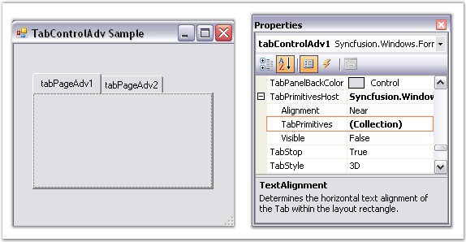
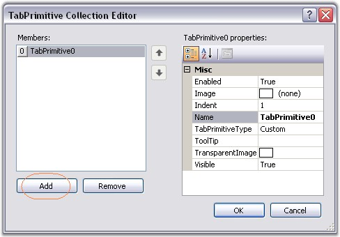
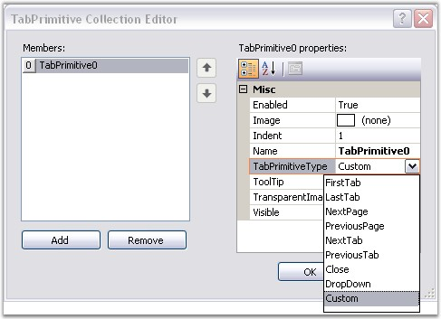

::: {style="DISPLAY: none"}
{#d2h_url_template}{#d2h_package_url style="WIDTH: 0px; DISPLAY: none; HEIGHT: 0px"}
:::

:::: {.d2h_secondary_topic style="PADDING-BOTTOM: 10pt; MARGIN: 0pt; PADDING-LEFT: 0pt; PADDING-RIGHT: 0pt; PADDING-TOP: 0pt"}
#### Creating TabPrimitives {#creating-tabprimitives style="MARGIN-LEFT: 18pt; tab-stops: 18.0pt"}

[]{style="COLOR: #4a5c8c; FONT-SIZE: 8pt"} 

Creating TabPrimitives Through Designer

 

To create Tab Primitives through designer, follow the steps given below.

[]{style="COLOR: #15428b"} 

1.   After adding a TabControlAdv with a set of TabPages in it, select the **TabPrimitivesHost.TabPrimitives** property in the Properties window.

[]{style="COLOR: #15428b"} 

{border="0"}

[]{style="COLOR: #15428b"} 

Figure 1048: TabPrimitives property in the Properties Grid

[]{style="COLOR: #15428b"} 

2.   A TabPrimitives Collection Editor will be opened. Click the Add option in the Editor to add a TabPrimitive.

[]{style="COLOR: #15428b"} 

{border="0"}

***[]{style="COLOR: #15428b"}*** 

Figure 1049: TabPrimitive Collection Editor

[]{style="COLOR: #15428b"} 

3.   Set the TabPrimitiveType as required and click Ok.

[]{style="COLOR: #15428b"} 

{border="0"}

***[]{style="COLOR: #15428b"}*** 

Figure 1050: Setting the TabPrimitive Type

[]{style="COLOR: #15428b"} 

Code snippets to add TabPrimitives programmatically

**[]{style="COLOR: #15428b"}** 

+-----------------------------------------------------------------------------------------------------------------------------------------------------------------------------------------------------------------------------------------------------------------------------------------------------------------------------------------------------------------------------------------------------------------------------------------------------------------------------------------------+
| **[\[C#\]]{style="FONT-FAMILY: 'Courier New'; COLOR: black"}**                                                                                                                                                                                                                                                                                                                                                                                                                                |
|                                                                                                                                                                                                                                                                                                                                                                                                                                                                                               |
| []{style="FONT-FAMILY: 'Courier New'; COLOR: green"}                                                                                                                                                                                                                                                                                                                                                                                                                                          |
|                                                                                                                                                                                                                                                                                                                                                                                                                                                                                               |
| [//Adds a TabPrimitive of type DropDown.]{style="FONT-FAMILY: 'Courier New'; COLOR: green"}                                                                                                                                                                                                                                                                                                                                                                                                   |
|                                                                                                                                                                                                                                                                                                                                                                                                                                                                                               |
| [this]{style="FONT-FAMILY: 'Courier New'; COLOR: blue"}[.tabControlAdv4.TabPrimitivesHost.TabPrimitives.Add([new]{style="COLOR: blue"} Syncfusion.Windows.Forms.Tools.[TabPrimitive]{style="COLOR: teal"}(Syncfusion.Windows.Forms.Tools.[TabPrimitiveType]{style="COLOR: teal"}.DropDown, [null]{style="COLOR: blue"}, System.Drawing.[Color]{style="COLOR: teal"}.Empty, [true]{style="COLOR: blue"}, 1, [\"TabPrimitive0\"]{style="COLOR: maroon"}));]{style="FONT-FAMILY: 'Courier New'"} |
|                                                                                                                                                                                                                                                                                                                                                                                                                                                                                               |
| []{style="FONT-FAMILY: 'Courier New'"}                                                                                                                                                                                                                                                                                                                                                                                                                                                        |
|                                                                                                                                                                                                                                                                                                                                                                                                                                                                                               |
| [//Adds a TabPrimitive of type Close.]{style="FONT-FAMILY: 'Courier New'; COLOR: green"}                                                                                                                                                                                                                                                                                                                                                                                                      |
|                                                                                                                                                                                                                                                                                                                                                                                                                                                                                               |
| [this]{style="FONT-FAMILY: 'Courier New'; COLOR: blue"}[.tabControlAdv1.TabPrimitivesHost.TabPrimitives.Add([new]{style="COLOR: blue"} Syncfusion.Windows.Forms.Tools.[TabPrimitive]{style="COLOR: teal"}(Syncfusion.Windows.Forms.Tools.[TabPrimitiveType]{style="COLOR: teal"}.Close, [null]{style="COLOR: blue"}, System.Drawing.[Color]{style="COLOR: teal"}.Empty, [true]{style="COLOR: blue"}, 1, [\"TabPrimitive1\"]{style="COLOR: maroon"}));]{style="FONT-FAMILY: 'Courier New'"}    |
|                                                                                                                                                                                                                                                                                                                                                                                                                                                                                               |
| []{style="FONT-FAMILY: 'Courier New'"}                                                                                                                                                                                                                                                                                                                                                                                                                                                        |
|                                                                                                                                                                                                                                                                                                                                                                                                                                                                                               |
| [//Similarly other TabPrimitive types are added.]{style="FONT-FAMILY: 'Courier New'; COLOR: green"}                                                                                                                                                                                                                                                                                                                                                                                           |
|                                                                                                                                                                                                                                                                                                                                                                                                                                                                                               |
| []{style="FONT-FAMILY: 'Courier New'"}                                                                                                                                                                                                                                                                                                                                                                                                                                                        |
|                                                                                                                                                                                                                                                                                                                                                                                                                                                                                               |
| [//Makes the TabPrimitive visible in the control.]{style="FONT-FAMILY: 'Courier New'; COLOR: green"}                                                                                                                                                                                                                                                                                                                                                                                          |
|                                                                                                                                                                                                                                                                                                                                                                                                                                                                                               |
| [this]{style="FONT-FAMILY: 'Courier New'; COLOR: blue"}[.tabControlAdv1.TabPrimitivesHost.Visible = [true]{style="COLOR: blue"};]{style="FONT-FAMILY: 'Courier New'"}                                                                                                                                                                                                                                                                                                                         |
+-----------------------------------------------------------------------------------------------------------------------------------------------------------------------------------------------------------------------------------------------------------------------------------------------------------------------------------------------------------------------------------------------------------------------------------------------------------------------------------------------+

[]{style="COLOR: #15428b"} 

+--------------------------------------------------------------------------------------------------------------------------------------------------------------------------------------------------------------------------------------------------------------------------------------------------------------------------------------------------------------------------------------------------------------------------+
| **[\[VB.NET\]]{style="FONT-FAMILY: 'Courier New'; COLOR: black"}**                                                                                                                                                                                                                                                                                                                                                       |
|                                                                                                                                                                                                                                                                                                                                                                                                                          |
| **[]{style="FONT-FAMILY: 'Courier New'; COLOR: black"}**                                                                                                                                                                                                                                                                                                                                                                 |
|                                                                                                                                                                                                                                                                                                                                                                                                                          |
| [\'Adds a TabPrimitive of type DropDown.]{style="FONT-FAMILY: 'Courier New'; COLOR: green"}                                                                                                                                                                                                                                                                                                                              |
|                                                                                                                                                                                                                                                                                                                                                                                                                          |
| [Me]{style="FONT-FAMILY: 'Courier New'; COLOR: blue"}[.tabControlAdv4.TabPrimitivesHost.TabPrimitives.Add([New]{style="COLOR: blue"} Syncfusion.Windows.Forms.Tools.TabPrimitive(Syncfusion.Windows.Forms.Tools.TabPrimitiveType.DropDown, [Nothing]{style="COLOR: blue"}, System.Drawing.Color.Empty, [True]{style="COLOR: blue"}, 1, [\"TabPrimitive0\"]{style="COLOR: maroon"}))]{style="FONT-FAMILY: 'Courier New'"} |
|                                                                                                                                                                                                                                                                                                                                                                                                                          |
| []{style="FONT-FAMILY: 'Courier New'"}                                                                                                                                                                                                                                                                                                                                                                                   |
|                                                                                                                                                                                                                                                                                                                                                                                                                          |
| [\'Adds a TabPrimitive of type Close.]{style="FONT-FAMILY: 'Courier New'; COLOR: green"}                                                                                                                                                                                                                                                                                                                                 |
|                                                                                                                                                                                                                                                                                                                                                                                                                          |
| [Me]{style="FONT-FAMILY: 'Courier New'; COLOR: blue"}[.tabControlAdv1.TabPrimitivesHost.TabPrimitives.Add([New]{style="COLOR: blue"} Syncfusion.Windows.Forms.Tools.TabPrimitive(Syncfusion.Windows.Forms.Tools.TabPrimitiveType.Close, [Nothing]{style="COLOR: blue"}, System.Drawing.Color.Empty, [True]{style="COLOR: blue"}, 1, [\"TabPrimitive1\"]{style="COLOR: maroon"}))]{style="FONT-FAMILY: 'Courier New'"}    |
|                                                                                                                                                                                                                                                                                                                                                                                                                          |
| []{style="FONT-FAMILY: 'Courier New'"}                                                                                                                                                                                                                                                                                                                                                                                   |
|                                                                                                                                                                                                                                                                                                                                                                                                                          |
| [\'Similarly other TabPrimitive types are added.]{style="FONT-FAMILY: 'Courier New'; COLOR: green"}                                                                                                                                                                                                                                                                                                                      |
|                                                                                                                                                                                                                                                                                                                                                                                                                          |
| []{style="FONT-FAMILY: 'Courier New'; COLOR: green"}                                                                                                                                                                                                                                                                                                                                                                     |
|                                                                                                                                                                                                                                                                                                                                                                                                                          |
| [\'Makes the TabPrimitive visible in the control.]{style="FONT-FAMILY: 'Courier New'; COLOR: green"}                                                                                                                                                                                                                                                                                                                     |
|                                                                                                                                                                                                                                                                                                                                                                                                                          |
| [Private]{style="FONT-FAMILY: 'Courier New'; COLOR: blue"}[ [Me]{style="COLOR: blue"}.tabControlAdv1.TabPrimitivesHost.Visible = [True]{style="COLOR: blue"}]{style="FONT-FAMILY: 'Courier New'"}                                                                                                                                                                                                                        |
+--------------------------------------------------------------------------------------------------------------------------------------------------------------------------------------------------------------------------------------------------------------------------------------------------------------------------------------------------------------------------------------------------------------------------+

[]{style="COLOR: #15428b"} 

::: {style="BORDER-BOTTOM: windowtext 1pt solid; BORDER-LEFT: medium none; PADDING-BOTTOM: 1pt; MARGIN: 9pt 0pt 9pt 18pt; PADDING-LEFT: 0pt; PADDING-RIGHT: 0pt; BORDER-TOP: windowtext 1pt solid; BORDER-RIGHT: medium none; PADDING-TOP: 1pt"}
{border="0"} Note:[ ]{style="COLOR: black; FONT-SIZE: 8pt"}After adding TabPrimitives, set the TabPrimitiveHost.Visible property to True. Now the TabPrimitives added will be visible in the TabControlAdv.
:::

 

 

 

 

[]{#related-topics}
::::
