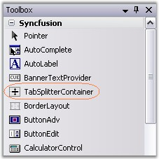
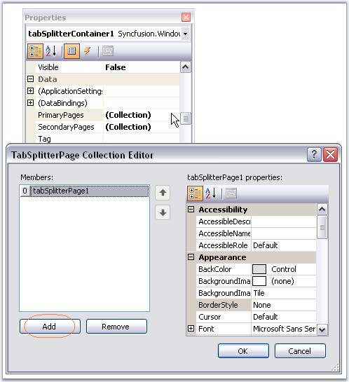
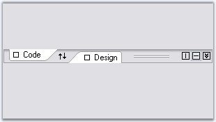

::: {style="DISPLAY: none"}
{#d2h_url_template}{#d2h_package_url style="WIDTH: 0px; DISPLAY: none; HEIGHT: 0px"}
:::

::::: {#nsbanner .d2h_main_nsbanner style="BORDER-BOTTOM: #999999 1px solid; POSITION: relative; PADDING-BOTTOM: 0px; BACKGROUND-COLOR: transparent; PADDING-LEFT: 0px; PADDING-RIGHT: 0px; DISPLAY: none; BORDER-TOP: #999999 1px solid; PADDING-TOP: 0px; LEFT: 0px"}
:::: {#TitleRow .d2h_main_titlerow style="PADDING-BOTTOM: 4px; BACKGROUND-COLOR: transparent; PADDING-LEFT: 22px; WIDTH: 100%; PADDING-RIGHT: 10px; DISPLAY: none; PADDING-TOP: 4px"}
::: {#ienav .d2h_main_ienav style="DISPLAY: none"}
{#D2HPrevious .D2HPreviousEnabled}  {#D2HNext .D2HNextEnabled}
:::
::::
:::::

:::: {#nstext .d2h_main_nstext style="PADDING-BOTTOM: 10px; BACKGROUND-COLOR: transparent; PADDING-LEFT: 22px; PADDING-RIGHT: 10px; HEIGHT: 100%; OVERFLOW: auto; PADDING-TOP: 5px" hasuserbackground="true" valign="bottom"}
::: {#d2h_breadcrumbs .d2h_breadcrumbs}
[Essential Studio User Guide Documentation](ms-xhelp:///?Id=12457748-09e3-4d74-a240-8e049cedf030){.d2h_breadcrumbsNormal}[ \> ]{.d2h_breadcrumbsLinkSeparator}[User Interface Edition](ms-xhelp:///?Id=c29296b7-531c-413b-a0ec-488ca1f7f669){.d2h_breadcrumbsNormal}[ \> ]{.d2h_breadcrumbsLinkSeparator}[Essential Windows](ms-xhelp:///?Id=e60759d8-47a4-4570-9d7a-16a68d63f2ea){.d2h_breadcrumbsNormal}[ \> ]{.d2h_breadcrumbsLinkSeparator}[Essential Tools]{.d2h_breadcrumbsContentsOnly}[ \> ]{.d2h_breadcrumbsLinkSeparator}[Tools Controls](ms-xhelp:///?Id=13c3c4f4-9d16-4b69-93f2-7e98eec67452){.d2h_breadcrumbsNormal}[ \> ]{.d2h_breadcrumbsLinkSeparator}[TabSplitterContainer](ms-xhelp:///?Id=92c4b2a2-157f-4bea-bca4-945b61b33633){.d2h_breadcrumbsNormal}
:::

### Creating TabSplitterContainer Control {#creating-tabsplittercontainer-control style="MARGIN-LEFT: 18pt; tab-stops: 18.0pt"}

[]{style="COLOR: #15428b"} 

TabSplitterContainer control can be easily created through designer by just dragging and dropping onto the form.

[]{style="COLOR: #15428b"} 

{border="0"}

[]{style="COLOR: #15428b"} 

Figure 1107: TabSplitterContainer in Toolbox

 

We can add primary or secondary pages using the below properties.

[]{style="COLOR: #15428b"} 

{border="0"}

[]{style="COLOR: #15428b"} 

Figure 1108: Adding Primary Pages to the Control

 

It can be created programmatically using the below steps.

[]{style="COLOR: #15428b"} 

1.              Create or open a Windows Forms project.

[]{style="COLOR: #15428b"} 

2.   Add Syncfusion\'s Tools.Windows and Shared.Base assemblies to the application.

[]{style="COLOR: #15428b"} 

3.   Add the Syncfusion.Windows.Forms.Tools namespace.

[]{style="COLOR: #15428b"} 

+--------------------------------------------------------------------------------------------------------------------------------+
| **[\[C#\]]{style="FONT-FAMILY: 'Courier New'; COLOR: black"}**                                                                 |
|                                                                                                                                |
| **[]{style="FONT-FAMILY: 'Courier New'; COLOR: black"}**                                                                       |
|                                                                                                                                |
| [using]{style="FONT-FAMILY: 'Courier New'; COLOR: blue"}[ Syncfusion.Windows.Forms.Tools;]{style="FONT-FAMILY: 'Courier New'"} |
+--------------------------------------------------------------------------------------------------------------------------------+

[]{style="COLOR: #15428b"} 

+----------------------------------------------------------------------------------------------------------------------------------+
| **[\[VB.NET\]]{style="FONT-FAMILY: 'Courier New'; COLOR: black"}**                                                               |
|                                                                                                                                  |
| []{style="FONT-FAMILY: 'Courier New'; COLOR: black"}                                                                             |
|                                                                                                                                  |
| [Imports]{style="FONT-FAMILY: 'Courier New'; COLOR: blue"}[ Syncfusion.Windows.Forms.Tools ]{style="FONT-FAMILY: 'Courier New'"} |
+----------------------------------------------------------------------------------------------------------------------------------+

[]{style="COLOR: #15428b"} 

4.   Create and initialize the TabSplitterContainer control and TabSplitterPages.

[]{style="COLOR: #15428b"} 

+--------------------------------------------------------------------------------------------------------------------------------------------------------------------------------------------------------------------------------+
| **[\[C#\]]{style="FONT-FAMILY: 'Courier New'; COLOR: black"}**                                                                                                                                                                 |
|                                                                                                                                                                                                                                |
| **[]{style="FONT-FAMILY: 'Courier New'; COLOR: black"}**                                                                                                                                                                       |
|                                                                                                                                                                                                                                |
| [private]{style="FONT-FAMILY: 'Courier New'; COLOR: blue"}[ Syncfusion.Windows.Forms.Tools.[TabSplitterPage]{style="COLOR: teal"} tabSplitterPage1;]{style="FONT-FAMILY: 'Courier New'"}                                       |
|                                                                                                                                                                                                                                |
| [private]{style="FONT-FAMILY: 'Courier New'; COLOR: blue"}[ Syncfusion.Windows.Forms.Tools.[TabSplitterPage]{style="COLOR: teal"} tabSplitterPage2;]{style="FONT-FAMILY: 'Courier New'"}                                       |
|                                                                                                                                                                                                                                |
| [private]{style="FONT-FAMILY: 'Courier New'; COLOR: blue"}[ Syncfusion.Windows.Forms.Tools.[TabSplitterContainer]{style="COLOR: teal"} tabSplitterContainer1;]{style="FONT-FAMILY: 'Courier New'"}                             |
|                                                                                                                                                                                                                                |
| []{style="FONT-FAMILY: 'Courier New'"}                                                                                                                                                                                         |
|                                                                                                                                                                                                                                |
| [this]{style="FONT-FAMILY: 'Courier New'; COLOR: blue"}[.tabSplitterPage1 = [new]{style="COLOR: blue"} Syncfusion.Windows.Forms.Tools.[TabSplitterPage]{style="COLOR: teal"}();]{style="FONT-FAMILY: 'Courier New'"}           |
|                                                                                                                                                                                                                                |
| [this]{style="FONT-FAMILY: 'Courier New'; COLOR: blue"}[.tabSplitterPage2 = [new]{style="COLOR: blue"} Syncfusion.Windows.Forms.Tools.[TabSplitterPage]{style="COLOR: teal"}();]{style="FONT-FAMILY: 'Courier New'"}           |
|                                                                                                                                                                                                                                |
| [this]{style="FONT-FAMILY: 'Courier New'; COLOR: blue"}[.tabSplitterContainer1 = [new]{style="COLOR: blue"} Syncfusion.Windows.Forms.Tools.[TabSplitterContainer]{style="COLOR: teal"}();]{style="FONT-FAMILY: 'Courier New'"} |
+--------------------------------------------------------------------------------------------------------------------------------------------------------------------------------------------------------------------------------+

[]{style="COLOR: #15428b"} 

+------------------------------------------------------------------------------------------------------------------------------------------------------------------------------------------------------+
| **[\[VB.NET\]]{style="FONT-FAMILY: 'Courier New'; COLOR: black"}**                                                                                                                                   |
|                                                                                                                                                                                                      |
| []{style="FONT-FAMILY: 'Courier New'; COLOR: black"}                                                                                                                                                 |
|                                                                                                                                                                                                      |
| [Private]{style="FONT-FAMILY: 'Courier New'; COLOR: blue"}[ tabSplitterPage1 [As]{style="COLOR: blue"} Syncfusion.Windows.Forms.Tools.TabSplitterPage]{style="FONT-FAMILY: 'Courier New'"}           |
|                                                                                                                                                                                                      |
| [Private]{style="FONT-FAMILY: 'Courier New'; COLOR: blue"}[ tabSplitterPage2 [As]{style="COLOR: blue"} Syncfusion.Windows.Forms.Tools.TabSplitterPage]{style="FONT-FAMILY: 'Courier New'"}           |
|                                                                                                                                                                                                      |
| [Private]{style="FONT-FAMILY: 'Courier New'; COLOR: blue"}[ tabSplitterContainer1 [As]{style="COLOR: blue"} Syncfusion.Windows.Forms.Tools.TabSplitterContainer]{style="FONT-FAMILY: 'Courier New'"} |
|                                                                                                                                                                                                      |
| []{style="FONT-FAMILY: 'Courier New'"}                                                                                                                                                               |
|                                                                                                                                                                                                      |
| [Me]{style="FONT-FAMILY: 'Courier New'; COLOR: blue"}[.tabSplitterPage1 = [New]{style="COLOR: blue"} Syncfusion.Windows.Forms.Tools.TabSplitterPage() ]{style="FONT-FAMILY: 'Courier New'"}          |
|                                                                                                                                                                                                      |
| [Me]{style="FONT-FAMILY: 'Courier New'; COLOR: blue"}[.tabSplitterPage2 = [New]{style="COLOR: blue"} Syncfusion.Windows.Forms.Tools.TabSplitterPage() ]{style="FONT-FAMILY: 'Courier New'"}          |
|                                                                                                                                                                                                      |
| [Me]{style="FONT-FAMILY: 'Courier New'; COLOR: blue"}[.tabSplitterContainer1 = [New]{style="COLOR: blue"} Syncfusion.Windows.Forms.Tools.TabSplitterContainer()]{style="FONT-FAMILY: 'Courier New'"} |
+------------------------------------------------------------------------------------------------------------------------------------------------------------------------------------------------------+

[]{style="COLOR: #15428b"} 

5.   Add Splitter pages to the TabSplitterContainer.

[]{style="COLOR: #15428b"} 

+---------------------------------------------------------------------------------------------------------------------------------------------------------------------------------------------------------------------------------------------------------------------------------------------------+
| **[\[C#\]]{style="FONT-FAMILY: 'Courier New'; COLOR: black"}**                                                                                                                                                                                                                                    |
|                                                                                                                                                                                                                                                                                                   |
| **[]{style="FONT-FAMILY: 'Courier New'; COLOR: black"}**                                                                                                                                                                                                                                          |
|                                                                                                                                                                                                                                                                                                   |
| [this]{style="FONT-FAMILY: 'Courier New'; COLOR: blue"}[.tabSplitterContainer1.PrimaryPages.AddRange([new]{style="COLOR: blue"} Syncfusion.Windows.Forms.Tools.[TabSplitterPage]{style="COLOR: teal"}\[\] {[this]{style="COLOR: blue"}.tabSplitterPage1});]{style="FONT-FAMILY: 'Courier New'"}   |
|                                                                                                                                                                                                                                                                                                   |
| [this]{style="FONT-FAMILY: 'Courier New'; COLOR: blue"}[.tabSplitterContainer1.SecondaryPages.AddRange([new]{style="COLOR: blue"} Syncfusion.Windows.Forms.Tools.[TabSplitterPage]{style="COLOR: teal"}\[\] {[this]{style="COLOR: blue"}.tabSplitterPage2});]{style="FONT-FAMILY: 'Courier New'"} |
+---------------------------------------------------------------------------------------------------------------------------------------------------------------------------------------------------------------------------------------------------------------------------------------------------+

[]{style="COLOR: #15428b"} 

+----------------------------------------------------------------------------------------------------------------------------------------------------------------------------------------------------------------------------------------------------------------------+
| **[\[VB.NET\]]{style="FONT-FAMILY: 'Courier New'; COLOR: black"}**                                                                                                                                                                                                   |
|                                                                                                                                                                                                                                                                      |
| []{style="FONT-FAMILY: 'Courier New'; COLOR: black"}                                                                                                                                                                                                                 |
|                                                                                                                                                                                                                                                                      |
| [Me]{style="FONT-FAMILY: 'Courier New'; COLOR: blue"}[.tabSplitterContainer1.PrimaryPages.AddRange([New]{style="COLOR: blue"} Syncfusion.Windows.Forms.Tools.TabSplitterPage() {[Me]{style="COLOR: blue"}.tabSplitterPage1}) ]{style="FONT-FAMILY: 'Courier New'"}   |
|                                                                                                                                                                                                                                                                      |
| [Me]{style="FONT-FAMILY: 'Courier New'; COLOR: blue"}[.tabSplitterContainer1.SecondaryPages.AddRange([New]{style="COLOR: blue"} Syncfusion.Windows.Forms.Tools.TabSplitterPage() {[Me]{style="COLOR: blue"}.tabSplitterPage2}) ]{style="FONT-FAMILY: 'Courier New'"} |
+----------------------------------------------------------------------------------------------------------------------------------------------------------------------------------------------------------------------------------------------------------------------+

[]{style="COLOR: #15428b"} 

6.   Set the size and location of the control.

[]{style="COLOR: #15428b"} 

+-----------------------------------------------------------------------------------------------------------------------------------------------------------------------------------------------------------------+
| **[\[C#\]]{style="FONT-FAMILY: 'Courier New'; COLOR: black"}**                                                                                                                                                  |
|                                                                                                                                                                                                                 |
| **[]{style="FONT-FAMILY: 'Courier New'; COLOR: black"}**                                                                                                                                                        |
|                                                                                                                                                                                                                 |
| [this]{style="FONT-FAMILY: 'Courier New'; COLOR: blue"}[.tabSplitterContainer2.Location = [new]{style="COLOR: blue"} System.Drawing.[Point]{style="COLOR: teal"}(195, 29);]{style="FONT-FAMILY: 'Courier New'"} |
|                                                                                                                                                                                                                 |
| [this]{style="FONT-FAMILY: 'Courier New'; COLOR: blue"}[.tabSplitterContainer2.Name = [\"tabSplitterContainer1\"]{style="COLOR: maroon"};]{style="FONT-FAMILY: 'Courier New'"}                                  |
|                                                                                                                                                                                                                 |
| [this]{style="FONT-FAMILY: 'Courier New'; COLOR: blue"}[.tabSplitterContainer2.Size = [new]{style="COLOR: blue"} System.Drawing.[Size]{style="COLOR: teal"}(300, 250);]{style="FONT-FAMILY: 'Courier New'"}     |
|                                                                                                                                                                                                                 |
| [this]{style="FONT-FAMILY: 'Courier New'; COLOR: blue"}[.tabSplitterContainer2.SplitterPosition = 50;]{style="FONT-FAMILY: 'Courier New'"}                                                                      |
|                                                                                                                                                                                                                 |
| [this]{style="FONT-FAMILY: 'Courier New'; COLOR: blue"}[.tabSplitterPage3.Text = [\"Code\"]{style="COLOR: maroon"};]{style="FONT-FAMILY: 'Courier New'"}                                                        |
|                                                                                                                                                                                                                 |
| [this]{style="FONT-FAMILY: 'Courier New'; COLOR: blue"}[.tabSplitterPage4.Text = [\"Design\"]{style="COLOR: maroon"};]{style="FONT-FAMILY: 'Courier New'"}                                                      |
+-----------------------------------------------------------------------------------------------------------------------------------------------------------------------------------------------------------------+

[]{style="COLOR: #15428b"} 

+----------------------------------------------------------------------------------------------------------------------------------------------------------------------------------------+
| **[\[VB.NET\]]{style="FONT-FAMILY: 'Courier New'; COLOR: black"}**                                                                                                                     |
|                                                                                                                                                                                        |
| []{style="FONT-FAMILY: 'Courier New'; COLOR: black"}                                                                                                                                   |
|                                                                                                                                                                                        |
| [Me]{style="FONT-FAMILY: 'Courier New'; COLOR: blue"}[.tabSplitterContainer2.Location = [New]{style="COLOR: blue"} System.Drawing.Point(195, 29) ]{style="FONT-FAMILY: 'Courier New'"} |
|                                                                                                                                                                                        |
| [Me]{style="FONT-FAMILY: 'Courier New'; COLOR: blue"}[.tabSplitterContainer2.Name = [\"tabSplitterContainer1\"]{style="COLOR: maroon"} ]{style="FONT-FAMILY: 'Courier New'"}           |
|                                                                                                                                                                                        |
| [Me]{style="FONT-FAMILY: 'Courier New'; COLOR: blue"}[.tabSplitterContainer2.Size = [New]{style="COLOR: blue"} System.Drawing.Size(300, 250) ]{style="FONT-FAMILY: 'Courier New'"}     |
|                                                                                                                                                                                        |
| [Me]{style="FONT-FAMILY: 'Courier New'; COLOR: blue"}[.tabSplitterContainer2.SplitterPosition = 50 ]{style="FONT-FAMILY: 'Courier New'"}                                               |
|                                                                                                                                                                                        |
| [Me]{style="FONT-FAMILY: 'Courier New'; COLOR: blue"}[.tabSplitterPage3.Text = [\"Code\"]{style="COLOR: maroon"} ]{style="FONT-FAMILY: 'Courier New'"}                                 |
|                                                                                                                                                                                        |
| [Me]{style="FONT-FAMILY: 'Courier New'; COLOR: blue"}[.tabSplitterPage4.Text = [\"Design\"]{style="COLOR: maroon"}]{style="FONT-FAMILY: 'Courier New'"}                                |
+----------------------------------------------------------------------------------------------------------------------------------------------------------------------------------------+

[]{style="COLOR: #15428b"} 

7.   Add the control to the form.

[]{style="COLOR: #15428b"} 

+----------------------------------------------------------------------------------------------------------------------------------------------------------------+
| **[\[C#\]]{style="FONT-FAMILY: 'Courier New'; COLOR: black"}**                                                                                                 |
|                                                                                                                                                                |
| **[]{style="FONT-FAMILY: 'Courier New'; COLOR: black"}**                                                                                                       |
|                                                                                                                                                                |
| [this]{style="FONT-FAMILY: 'Courier New'; COLOR: blue"}[.Controls.Add([this]{style="COLOR: blue"}.tabSplitterContainer2);]{style="FONT-FAMILY: 'Courier New'"} |
+----------------------------------------------------------------------------------------------------------------------------------------------------------------+

[]{style="COLOR: #15428b"} 

+-----------------------------------------------------------------------------------------------------------------------------------------------------------+
| **[\[VB.NET\]]{style="FONT-FAMILY: 'Courier New'; COLOR: black"}**                                                                                        |
|                                                                                                                                                           |
| []{style="FONT-FAMILY: 'Courier New'; COLOR: black"}                                                                                                      |
|                                                                                                                                                           |
| [Me]{style="FONT-FAMILY: 'Courier New'; COLOR: blue"}[.Controls.Add([Me]{style="COLOR: blue"}.tabSplitterContainer2)]{style="FONT-FAMILY: 'Courier New'"} |
+-----------------------------------------------------------------------------------------------------------------------------------------------------------+

[]{style="COLOR: #15428b"} 

{border="0"}

[]{style="COLOR: #15428b"} 

Figure 1109: TabSplitterContainer Control

**[]{style="COLOR: #15428b"}** 

See Also

[]{style="COLOR: #15428b"} 

[[Concepts and Features]{.UGHyperlink}](../../../../../../../../Documents%20and%20Settings/sylviap/Desktop/Tools%20-%20Part%202.docx#_Concepts_and_Features_8)[]{.UGHyperlink}

 

 

 

[]{#p947} 

[]{#related-topics}
::::
