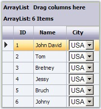

::: {style="DISPLAY: none"}
{#d2h_url_template}{#d2h_package_url style="WIDTH: 0px; DISPLAY: none; HEIGHT: 0px"}
:::

::::: {#nsbanner .d2h_main_nsbanner style="BORDER-BOTTOM: #999999 1px solid; POSITION: relative; PADDING-BOTTOM: 0px; BACKGROUND-COLOR: transparent; PADDING-LEFT: 0px; PADDING-RIGHT: 0px; DISPLAY: none; BORDER-TOP: #999999 1px solid; PADDING-TOP: 0px; LEFT: 0px"}
:::: {#TitleRow .d2h_main_titlerow style="PADDING-BOTTOM: 4px; BACKGROUND-COLOR: transparent; PADDING-LEFT: 22px; WIDTH: 100%; PADDING-RIGHT: 10px; DISPLAY: none; PADDING-TOP: 4px"}
::: {#ienav .d2h_main_ienav style="DISPLAY: none"}
{#D2HPrevious .D2HPreviousEnabled}  {#D2HNext .D2HNextEnabled}
:::
::::
:::::

:::: {#nstext .d2h_main_nstext style="PADDING-BOTTOM: 10px; BACKGROUND-COLOR: transparent; PADDING-LEFT: 22px; PADDING-RIGHT: 10px; HEIGHT: 100%; OVERFLOW: auto; PADDING-TOP: 5px" hasuserbackground="true" valign="bottom"}
::: {#d2h_breadcrumbs .d2h_breadcrumbs}
[Essential Studio User Guide Documentation](ms-xhelp:///?Id=12457748-09e3-4d74-a240-8e049cedf030){.d2h_breadcrumbsNormal}[ \> ]{.d2h_breadcrumbsLinkSeparator}[User Interface Edition](ms-xhelp:///?Id=c29296b7-531c-413b-a0ec-488ca1f7f669){.d2h_breadcrumbsNormal}[ \> ]{.d2h_breadcrumbsLinkSeparator}[Essential ASP.NET](ms-xhelp:///?Id=25c35330-c127-4dad-9a92-ed79dc7261a6){.d2h_breadcrumbsNormal}[ \> ]{.d2h_breadcrumbsLinkSeparator}[Essential Grid]{.d2h_breadcrumbsContentsOnly}[ \> ]{.d2h_breadcrumbsLinkSeparator}[Concepts and Features](ms-xhelp:///?Id=9e489974-524d-457c-9881-e458b1321685){.d2h_breadcrumbsNormal}[ \> ]{.d2h_breadcrumbsLinkSeparator}[Templates](ms-xhelp:///?Id=d885b471-bade-4d73-a9f1-b2f6a3c00206){.d2h_breadcrumbsNormal}
:::

### Creating Templates {#creating-templates style="tab-stops: 0pt"}

[]{style="FONT-FAMILY: 'Trebuchet MS','sans-serif'; COLOR: #15428b; FONT-SIZE: 9pt"} 

Creating Templates through Code Behind

[]{style="FONT-FAMILY: 'Trebuchet MS','sans-serif'; COLOR: #15428b; FONT-SIZE: 9pt"} 

Using the class called ITemplates, you can create templates through code behind. Using **QueryCellStyleInfo** event, you can access the particular column and apply the templates for it. Refer the below code snippet, which illustrates this.

[]{style="FONT-FAMILY: 'Trebuchet MS','sans-serif'; COLOR: #15428b; FONT-SIZE: 9pt"} 

+-------------------------------------------------------------------------------------------------------------------------------------------------------------------------------------------------------------------------------------------------+
| **[\[C#\]]{style="FONT-FAMILY: 'Courier New'; COLOR: black"}**                                                                                                                                                                                  |
|                                                                                                                                                                                                                                                 |
| []{style="FONT-FAMILY: 'Courier New'; COLOR: black"}                                                                                                                                                                                            |
|                                                                                                                                                                                                                                                 |
| [protected]{style="FONT-FAMILY: 'Courier New'; COLOR: blue"}[ [void]{style="COLOR: blue"} GridGroupingControl1_QueryCellStyleInfo([object]{style="COLOR: blue"} sender, GridTableCellStyleInfoEventArgs e)]{style="FONT-FAMILY: 'Courier New'"} |
|                                                                                                                                                                                                                                                 |
| [{]{style="FONT-FAMILY: 'Courier New'"}                                                                                                                                                                                                         |
|                                                                                                                                                                                                                                                 |
| [    [//Look for the RecordField and AlternateField Cell.]{style="COLOR: green"}]{style="FONT-FAMILY: 'Courier New'"}                                                                                                                           |
|                                                                                                                                                                                                                                                 |
| [    [if]{style="COLOR: blue"} (e.TableCellIdentity.TableCellType == GridTableCellType.RecordFieldCell \|\| e.TableCellIdentity.TableCellType == GridTableCellType.AlternateRecordFieldCell)]{style="FONT-FAMILY: 'Courier New'"}               |
|                                                                                                                                                                                                                                                 |
| [    {]{style="FONT-FAMILY: 'Courier New'"}                                                                                                                                                                                                     |
|                                                                                                                                                                                                                                                 |
| [        [//Look for the Column Name \"Name of the Column specified\" in the GridGroupingControl when it get rendered]{style="COLOR: green"}]{style="FONT-FAMILY: 'Courier New'"}                                                               |
|                                                                                                                                                                                                                                                 |
| [        [if]{style="COLOR: blue"} (e.TableCellIdentity.Column.MappingName == [\"City\"]{style="COLOR: maroon"})]{style="FONT-FAMILY: 'Courier New'"}                                                                                           |
|                                                                                                                                                                                                                                                 |
| [        {]{style="FONT-FAMILY: 'Courier New'"}                                                                                                                                                                                                 |
|                                                                                                                                                                                                                                                 |
| [            [//Changes the EditItem template of the column specified as DropDownListBox ]{style="COLOR: green"}]{style="FONT-FAMILY: 'Courier New'"}                                                                                           |
|                                                                                                                                                                                                                                                 |
| [            DropDownList dropdown = [new]{style="COLOR: blue"} DropDownList();]{style="FONT-FAMILY: 'Courier New'"}                                                                                                                            |
|                                                                                                                                                                                                                                                 |
| [            dropdown.Items.Add([\"USA\"]{style="COLOR: maroon"});]{style="FONT-FAMILY: 'Courier New'"}                                                                                                                                         |
|                                                                                                                                                                                                                                                 |
| [            dropdown.Items.Add([\"UK\"]{style="COLOR: maroon"});]{style="FONT-FAMILY: 'Courier New'"}                                                                                                                                          |
|                                                                                                                                                                                                                                                 |
| []{style="FONT-FAMILY: 'Courier New'"}                                                                                                                                                                                                          |
|                                                                                                                                                                                                                                                 |
| [            [//Here add the DropDownListBox programmatically using ITemplate Interface]{style="COLOR: green"}]{style="FONT-FAMILY: 'Courier New'"}                                                                                             |
|                                                                                                                                                                                                                                                 |
| []{style="FONT-FAMILY: 'Courier New'; COLOR: green"}                                                                                                                                                                                            |
|                                                                                                                                                                                                                                                 |
| [            [TemplateClass]{style="COLOR: teal"} mytemp = [new]{style="COLOR: blue"} [TemplateClass]{style="COLOR: teal"}(dropdown);]{style="FONT-FAMILY: 'Courier New'"}                                                                      |
|                                                                                                                                                                                                                                                 |
| [            e.TableCellIdentity.Column.ItemTemplate = mytemp;]{style="FONT-FAMILY: 'Courier New'"}                                                                                                                                             |
|                                                                                                                                                                                                                                                 |
| [        }]{style="FONT-FAMILY: 'Courier New'"}                                                                                                                                                                                                 |
|                                                                                                                                                                                                                                                 |
| []{style="FONT-FAMILY: 'Courier New'"}                                                                                                                                                                                                          |
|                                                                                                                                                                                                                                                 |
| [    }]{style="FONT-FAMILY: 'Courier New'"}                                                                                                                                                                                                     |
|                                                                                                                                                                                                                                                 |
| [}]{style="FONT-FAMILY: 'Courier New'"}                                                                                                                                                                                                         |
|                                                                                                                                                                                                                                                 |
| [public]{style="FONT-FAMILY: 'Courier New'; COLOR: blue"}[ [class]{style="COLOR: blue"} [TemplateClass]{style="COLOR: teal"} : [ITemplate]{style="COLOR: teal"}]{style="FONT-FAMILY: 'Courier New'"}                                            |
|                                                                                                                                                                                                                                                 |
| [{]{style="FONT-FAMILY: 'Courier New'"}                                                                                                                                                                                                         |
|                                                                                                                                                                                                                                                 |
| [    [private]{style="COLOR: blue"} [Control]{style="COLOR: teal"} m_ctrlChildControl = [null]{style="COLOR: blue"};]{style="FONT-FAMILY: 'Courier New'"}                                                                                       |
|                                                                                                                                                                                                                                                 |
| [    [public]{style="COLOR: blue"} TemplateClass([Control]{style="COLOR: teal"} ctrlChildControl)]{style="FONT-FAMILY: 'Courier New'"}                                                                                                          |
|                                                                                                                                                                                                                                                 |
| [    {]{style="FONT-FAMILY: 'Courier New'"}                                                                                                                                                                                                     |
|                                                                                                                                                                                                                                                 |
| [        m_ctrlChildControl = ctrlChildControl;]{style="FONT-FAMILY: 'Courier New'"}                                                                                                                                                            |
|                                                                                                                                                                                                                                                 |
| [    }]{style="FONT-FAMILY: 'Courier New'"}                                                                                                                                                                                                     |
|                                                                                                                                                                                                                                                 |
| []{style="FONT-FAMILY: 'Courier New'"}                                                                                                                                                                                                          |
|                                                                                                                                                                                                                                                 |
| [    [public]{style="COLOR: blue"} [void]{style="COLOR: blue"} InstantiateIn([Control]{style="COLOR: teal"} container)]{style="FONT-FAMILY: 'Courier New'"}                                                                                     |
|                                                                                                                                                                                                                                                 |
| [    {]{style="FONT-FAMILY: 'Courier New'"}                                                                                                                                                                                                     |
|                                                                                                                                                                                                                                                 |
| [        container.Controls.Add(m_ctrlChildControl);]{style="FONT-FAMILY: 'Courier New'"}                                                                                                                                                       |
|                                                                                                                                                                                                                                                 |
| [    }]{style="FONT-FAMILY: 'Courier New'"}                                                                                                                                                                                                     |
|                                                                                                                                                                                                                                                 |
| [}]{style="FONT-FAMILY: 'Courier New'"}                                                                                                                                                                                                         |
+-------------------------------------------------------------------------------------------------------------------------------------------------------------------------------------------------------------------------------------------------+

[]{style="FONT-FAMILY: 'Trebuchet MS','sans-serif'; COLOR: #15428b; FONT-SIZE: 9pt"} 

+--------------------------------------------------------------------------------------------------------------------------------------------------------------------------------------------------------------------------------------------------------------------------------------------------------------------------------------------------------------+
| **[\[VB.NET\]]{style="FONT-FAMILY: 'Courier New'; COLOR: black"}**                                                                                                                                                                                                                                                                                           |
|                                                                                                                                                                                                                                                                                                                                                              |
| []{style="FONT-FAMILY: 'Courier New'; COLOR: black"}                                                                                                                                                                                                                                                                                                         |
|                                                                                                                                                                                                                                                                                                                                                              |
| [Protected]{style="FONT-FAMILY: 'Courier New'; COLOR: blue"}[ [Sub]{style="COLOR: blue"} GridGroupingControl1_QueryCellStyleInfo([ByVal]{style="COLOR: blue"} sender [As]{style="COLOR: blue"} [Object]{style="COLOR: blue"}, [ByVal]{style="COLOR: blue"} e [As]{style="COLOR: blue"} GridTableCellStyleInfoEventArgs)]{style="FONT-FAMILY: 'Courier New'"} |
|                                                                                                                                                                                                                                                                                                                                                              |
| [    [\'Look for the RecordField and AlternateField Cell.]{style="COLOR: green"}]{style="FONT-FAMILY: 'Courier New'"}                                                                                                                                                                                                                                        |
|                                                                                                                                                                                                                                                                                                                                                              |
| [    [If]{style="COLOR: blue"} e.TableCellIdentity.TableCellType = GridTableCellType.RecordFieldCell [OrElse]{style="COLOR: blue"} e.TableCellIdentity.TableCellType = GridTableCellType.AlternateRecordFieldCell [Then]{style="COLOR: blue"}]{style="FONT-FAMILY: 'Courier New'"}                                                                           |
|                                                                                                                                                                                                                                                                                                                                                              |
| [        [\'Look for the Column Name \"Name of the Column specified\" in the GridGroupingControl when it get rendered]{style="COLOR: green"}]{style="FONT-FAMILY: 'Courier New'"}                                                                                                                                                                            |
|                                                                                                                                                                                                                                                                                                                                                              |
| [        [If]{style="COLOR: blue"} e.TableCellIdentity.Column.MappingName = [\"City\"]{style="COLOR: maroon"} [Then]{style="COLOR: blue"}]{style="FONT-FAMILY: 'Courier New'"}                                                                                                                                                                               |
|                                                                                                                                                                                                                                                                                                                                                              |
| [            [\'Changes the EditItem template of the column specified as DropDownListBox ]{style="COLOR: green"}]{style="FONT-FAMILY: 'Courier New'"}                                                                                                                                                                                                        |
|                                                                                                                                                                                                                                                                                                                                                              |
| [            [Dim]{style="COLOR: blue"} dropdown [As]{style="COLOR: blue"} DropDownList = [New]{style="COLOR: blue"} DropDownList()]{style="FONT-FAMILY: 'Courier New'"}                                                                                                                                                                                     |
|                                                                                                                                                                                                                                                                                                                                                              |
| [            dropdown.Items.Add([\"USA\"]{style="COLOR: maroon"})]{style="FONT-FAMILY: 'Courier New'"}                                                                                                                                                                                                                                                       |
|                                                                                                                                                                                                                                                                                                                                                              |
| [            dropdown.Items.Add([\"UK\"]{style="COLOR: maroon"})]{style="FONT-FAMILY: 'Courier New'"}                                                                                                                                                                                                                                                        |
|                                                                                                                                                                                                                                                                                                                                                              |
| []{style="FONT-FAMILY: 'Courier New'"}                                                                                                                                                                                                                                                                                                                       |
|                                                                                                                                                                                                                                                                                                                                                              |
| [            [\'Here add the DropDownListBox programmatically using ITemplate Interface]{style="COLOR: green"}]{style="FONT-FAMILY: 'Courier New'"}                                                                                                                                                                                                          |
|                                                                                                                                                                                                                                                                                                                                                              |
| []{style="FONT-FAMILY: 'Courier New'; COLOR: green"}                                                                                                                                                                                                                                                                                                         |
|                                                                                                                                                                                                                                                                                                                                                              |
| [            [Dim]{style="COLOR: blue"} mytemp [As]{style="COLOR: blue"} TemplateClass = [New]{style="COLOR: blue"} TemplateClass(dropdown)]{style="FONT-FAMILY: 'Courier New'"}                                                                                                                                                                             |
|                                                                                                                                                                                                                                                                                                                                                              |
| [            e.TableCellIdentity.Column.ItemTemplate = mytemp]{style="FONT-FAMILY: 'Courier New'"}                                                                                                                                                                                                                                                           |
|                                                                                                                                                                                                                                                                                                                                                              |
| [        [End]{style="COLOR: blue"} [If]{style="COLOR: blue"}]{style="FONT-FAMILY: 'Courier New'"}                                                                                                                                                                                                                                                           |
|                                                                                                                                                                                                                                                                                                                                                              |
| []{style="FONT-FAMILY: 'Courier New'; COLOR: blue"}                                                                                                                                                                                                                                                                                                          |
|                                                                                                                                                                                                                                                                                                                                                              |
| [    [End]{style="COLOR: blue"} [If]{style="COLOR: blue"}]{style="FONT-FAMILY: 'Courier New'"}                                                                                                                                                                                                                                                               |
|                                                                                                                                                                                                                                                                                                                                                              |
| [End]{style="FONT-FAMILY: 'Courier New'; COLOR: blue"}[ [Sub]{style="COLOR: blue"}]{style="FONT-FAMILY: 'Courier New'"}                                                                                                                                                                                                                                      |
|                                                                                                                                                                                                                                                                                                                                                              |
| [Public]{style="FONT-FAMILY: 'Courier New'; COLOR: blue"}[ [Class]{style="COLOR: blue"} TemplateClass]{style="FONT-FAMILY: 'Courier New'"}                                                                                                                                                                                                                   |
|                                                                                                                                                                                                                                                                                                                                                              |
| [    [Implements]{style="COLOR: blue"} ITemplate]{style="FONT-FAMILY: 'Courier New'"}                                                                                                                                                                                                                                                                        |
|                                                                                                                                                                                                                                                                                                                                                              |
| [    [Private]{style="COLOR: blue"} m_ctrlChildControl [As]{style="COLOR: blue"} Control = [Nothing]{style="COLOR: blue"}]{style="FONT-FAMILY: 'Courier New'"}                                                                                                                                                                                               |
|                                                                                                                                                                                                                                                                                                                                                              |
| [    [Public]{style="COLOR: blue"} [Sub]{style="COLOR: blue"} [New]{style="COLOR: blue"}([ByVal]{style="COLOR: blue"} ctrlChildControl [As]{style="COLOR: blue"} Control)]{style="FONT-FAMILY: 'Courier New'"}                                                                                                                                               |
|                                                                                                                                                                                                                                                                                                                                                              |
| [        m_ctrlChildControl = ctrlChildControl]{style="FONT-FAMILY: 'Courier New'"}                                                                                                                                                                                                                                                                          |
|                                                                                                                                                                                                                                                                                                                                                              |
| [    [End]{style="COLOR: blue"} [Sub]{style="COLOR: blue"}]{style="FONT-FAMILY: 'Courier New'"}                                                                                                                                                                                                                                                              |
|                                                                                                                                                                                                                                                                                                                                                              |
| []{style="FONT-FAMILY: 'Courier New'; COLOR: blue"}                                                                                                                                                                                                                                                                                                          |
|                                                                                                                                                                                                                                                                                                                                                              |
| [    [Public]{style="COLOR: blue"} [Sub]{style="COLOR: blue"} InstantiateIn([ByVal]{style="COLOR: blue"} container [As]{style="COLOR: blue"} Control)]{style="FONT-FAMILY: 'Courier New'"}                                                                                                                                                                   |
|                                                                                                                                                                                                                                                                                                                                                              |
| [        container.Controls.Add(m_ctrlChildControl)]{style="FONT-FAMILY: 'Courier New'"}                                                                                                                                                                                                                                                                     |
|                                                                                                                                                                                                                                                                                                                                                              |
| [    [End]{style="COLOR: blue"} [Sub]{style="COLOR: blue"}]{style="FONT-FAMILY: 'Courier New'"}                                                                                                                                                                                                                                                              |
|                                                                                                                                                                                                                                                                                                                                                              |
| [End]{style="FONT-FAMILY: 'Courier New'; COLOR: blue"}[ [Class]{style="COLOR: blue"}]{style="FONT-FAMILY: 'Courier New'"}                                                                                                                                                                                                                                    |
+--------------------------------------------------------------------------------------------------------------------------------------------------------------------------------------------------------------------------------------------------------------------------------------------------------------------------------------------------------------+

[]{style="FONT-FAMILY: 'Trebuchet MS','sans-serif'; COLOR: #15428b; FONT-SIZE: 9pt"} 

{border="0"}

Figure 109

[]{#p93} 

[]{#related-topics}
::::
